# 提取 碧蓝档案（Blue Archive） 中的各种游戏文件

[toc]

## 事先准备

1. 一部装有BA的安卓手机，APK不重要的，要的是第一次进完游戏下的那三个G的东西；

2. 能把手机上数据传输到电脑上的手段；

3. 电脑要装有Unity解包软件AssetStudio；

4. Unity软件：这个可有可无，因为BA是Unity开发的，导入Unity是挺方便的；

## Step 1 找到存放资源的源文件位置

这里有两种情况，一个是国际服一个是日服，不过这两者都在"内部存储设备\Android\data"下

1.国际服："com.nexon.bluearchive\files\PUB\Resource\GameData\Android"
2.日服："com.YostarJP.BlueArchive\files\AssetBundls"

## Step 2 拷贝游戏文件到电脑上

日服的.dat文件不用管，就拷.bundle文件

## Step 3 找出想要导出的角色的文件

每个角色所对应的文件的文件名中包含了该角色日文的罗马音

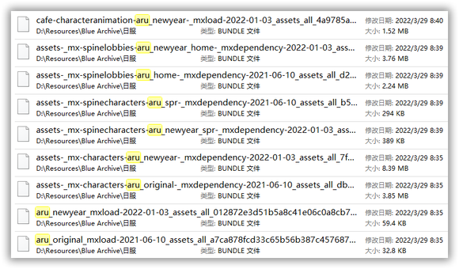

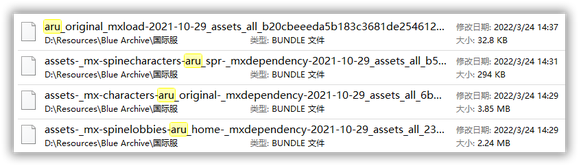

接着复制出这些文件到一个新的文件夹：

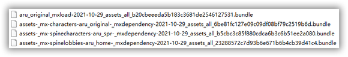

一般这四个文件分别是：
角色建模（characters）、立绘（spinecharacters）、大厅、L2D（spinelobbies）

## Step 4 解包

1. 打开AssetStudio：

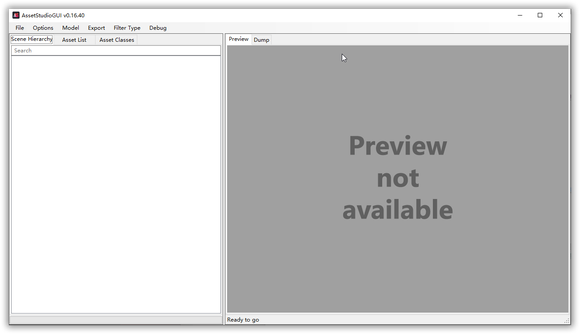

2. 导入我们刚刚复制出来文件的文件夹，注意是导入文件夹（Load Folder）：

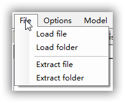

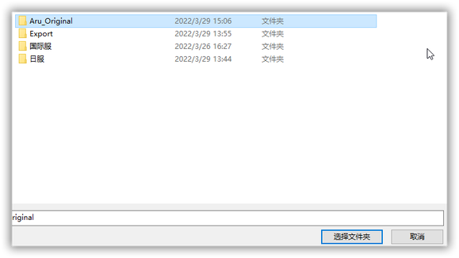

3. 这里看到上面有文件了、下方的进度条条绿了Finished了就解好了：

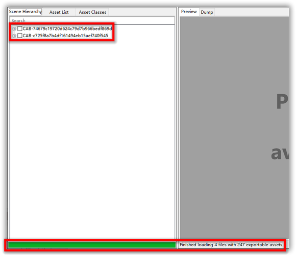

4. 转到资源列表（Assset Lsit）里看看成果：

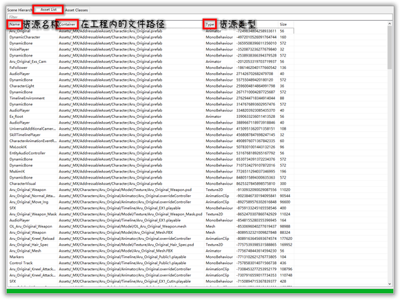

可以看到有这么几类文件：
1.AnimationClip：这个是Unity中的功能了，把它理解成一个动作基本动作就可以了，我还没试过绑定骨骼动画，等会了再说；
2.Animator：这个也是Unity中的功能，动画状态机，不需要理解；
3.AudioClip：声效文件，注意是枪声不是角色语音，角色语音在别的包（语音文件在游戏包文件（com）里的files/MediaPatch）；
4.Mesh：网格体！这个就是我们要的了，点击一下可以在右边预览，当然还没着色；
5.MonoBehaviour：Unity的脚本基类，不作理解；
6.Shader：Unity的着色规则这样？我目前没用明白就是了；
7.TextAsset：角色的台词，我也没整会咋提取；
8.Texture2D：很重要的贴图！用来给网格体着色的！

5. 导出文件

那么这么多文件，我的建议是全导出（All Assetd）再慢慢删也不迟，因为游戏资源关联性很强，不要随便删为好，熟练工当然自取

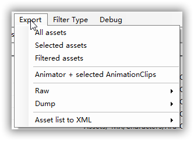

6. 导出成功

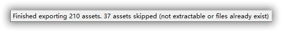

解出来的文件结构

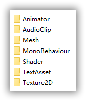

这里有两种用法：一个是在"Animator"里已经着色完的FBX文件这个是可以直接拿去玩的了；还有一个是在"Mesh"里的OBJ白模，要记得在Texture2D里找对应的贴图，关于贴图的使用我也不是玩得很透，大概就是绿色的Mask贴图大概是金属贴图调反光的，那种炫彩的Spec贴图是另一种金属贴图，这里不展开了

# 提取其中的 Lvie 2D

## 事前准备

1. 电脑要装有软件"Spine v3.8.X"，版本一定要对，v4.0会版本过高打不开；

 2. 装有软件"LiveViewerEX"及其 DLC"EX Studio"；

## Step 1 整合素材

1. 得到如图所示文件结构，我们要的是TextAsset和Texture2D里面的文件：

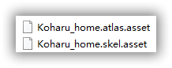

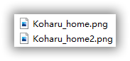

2. 整合素材，把TextAsset中"角色名_home.atlas.asset"、"角色名_home.skel.asset"和Texture2D中有"角色名_homeX（一般都有好几个）.png"的文件都复制到一个新的文件夹：

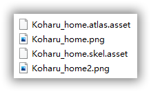

3. 把两个带有asset后缀的文件的asset后缀直接删掉：

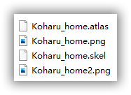

## Step 2 在 Spine 中处理贴图与骨骼

1.打开软件Spine，新建项目：

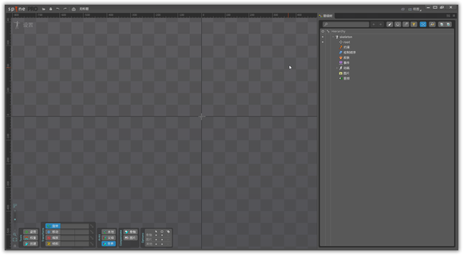

2. 导入骨骼数据：

文件位置选择刚刚新建的文件夹，选中skel文件导入；

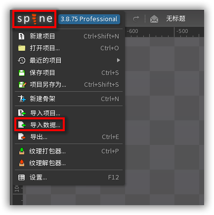

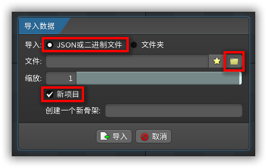

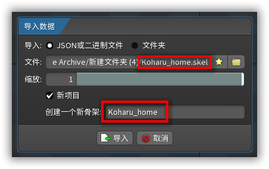

提醒保存不用管，因为刚刚勾的是新项目，如果是插入就没提醒；

3.骨骼数据导入成功：

4. 导入贴图定位数据：

选择纹理解包器；

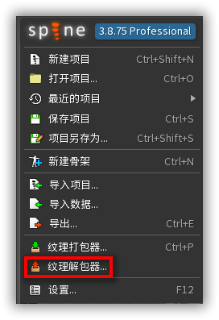

图集文件选atlas文件、输出文件随便选一个地方；

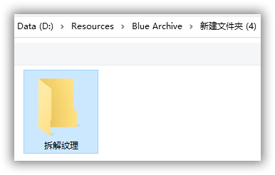

解开：

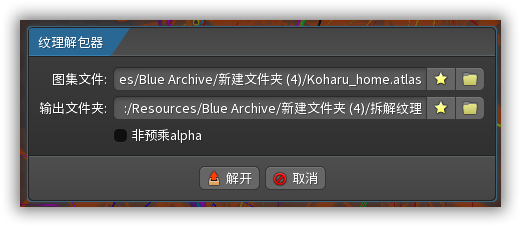

解开成功：

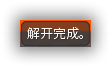

5. 导入拆解贴图：

在右边“层级树”面板点击图片：

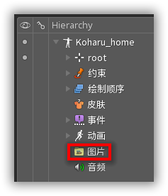

下方会弹出一个窗口，导入刚刚拆解纹理的位置；

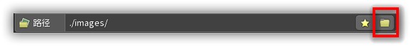

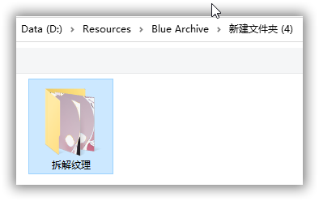

不要调整，会错位；

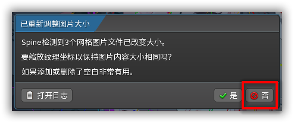

导入成功；

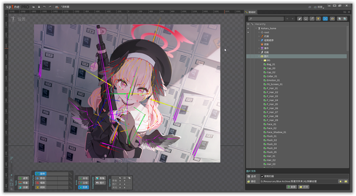

## Step 3 预览L2D动画

1. 点击左上角的设置，转为动画模式；

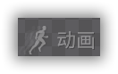

2. 摄影表中"Talk_05_M"是当前正在处理的动作，点击右三角正向预览；

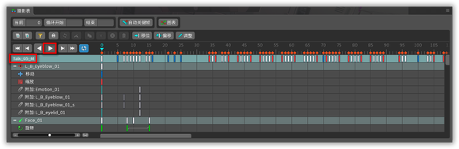

3. 如何切换预览动作：

"层级树"菜单中打开"动画"，这里就是全部的动画，可以选着玩；

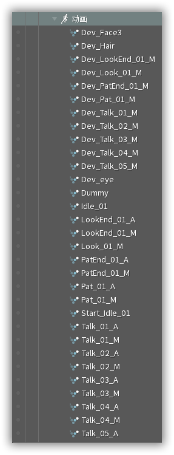

把要预览的动画左边的小点点点亮，此时摄影表中的预览动作名就变了，预览即可；

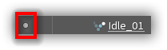

## Step 4 导出L2D动画为视频格式

1. 打开导出面板；

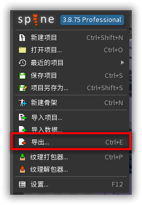

2. 选择视频MOV格式或AVI格式，参数可以自己斟酌，有需要我可以再讲解下；像是裁剪、缩放完想要预览结果可以点预览按钮，右边就会有一个预览窗口啦；

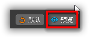

# Live2DViewerEX软件中的使用

## Step 1 整合素材

同Spine，不作展开

## Step 2 导入贴图、骨骼文件

1.打开"EX Studio"中的"Spine 编辑器"，导入选择模型文件夹导入之前创建的文件夹：

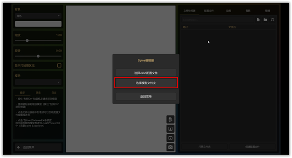

2. 看到"文件检视器"中出现文件结构就成功了：

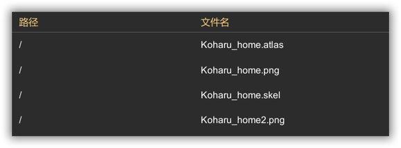

## Step 3 创建、配制L2D配制文件：

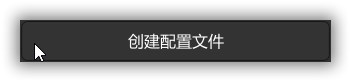

1. 创建配置文件：

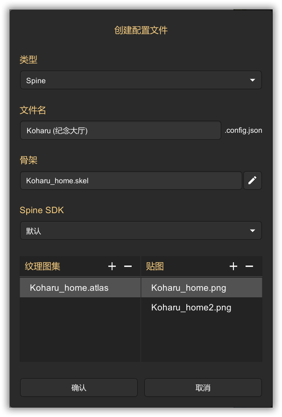

2. 编辑配置文件：

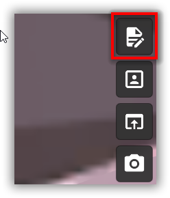

3. 修改选项中的缩放因子和着色器

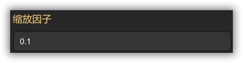

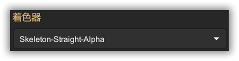

4. 基本设置就完成啦：

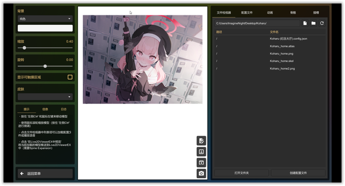

5. 预览一些效果

在“动画”菜单中有这个骨骼所有的动画，点一下就能预览；

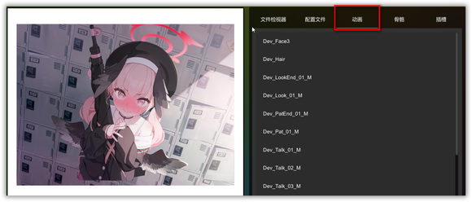

在“插槽”菜单中有这个L2D所有的层透明度配置，注意，在这个菜单中修改不会保存！只是一种预览作用，帮你确认名称和图片的关系

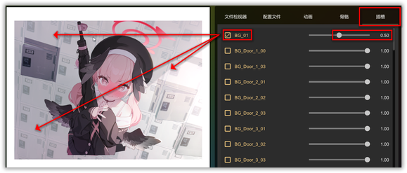

6. 动作组与透明度的设置：

回到"编辑Json"->"动作"中，添加一个动作组，在动作组里再添加动作，选Idle动画：
PS.动作组不要命名,直接点预定义中的idel即可！否则会导致闲置的时候也不播放动画！

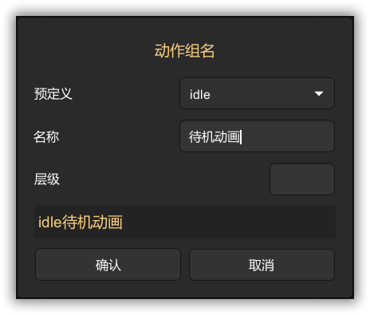

来到Live2DViewerEX的控制面板导入我们给刚创建的Json文件：

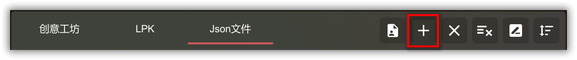

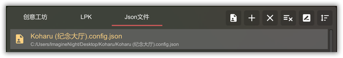

双击加载后应该在桌面能看到播放待机动画的小春啦！

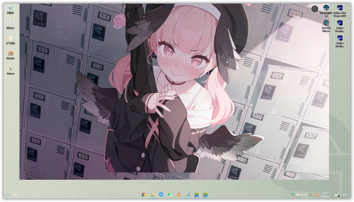

如果要做交互的话，在"点击区域"自行配置，这个稍稍有点麻烦，不作展开；
②透明度：
回到"编辑Json"->"控制器"中传建一个插槽透明度控制器，这里做一个去除背景的示范

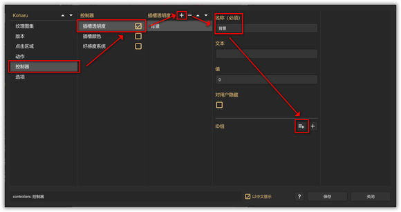

选中背景相关的层，保存

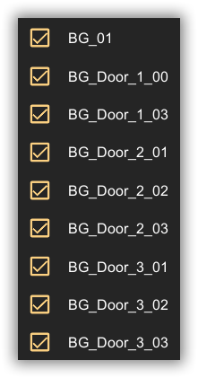

这时候就把要去掉的都去掉啦

## 补充

如果碧蓝档案是刚刚好好就是3.8.75版本的sp工作导出的二进制文件倒是还好，因为对应的二进制只能用对应的特定一个版本的sp打开，但问题就在于盗版的sp是不可像正版的sp那样灵活的变换“所有”版本，因此假如拆出来任何一个版本不对的源文件就会出现如下图所示的情况。

然后导入步骤也少了几个容错步骤

解包纹理的时候如果出现了边缘黑边不清晰的情况，就要勾选非预乘选项，但是这个选项在低于某一个版本的spine是没有的，所以假设遇到了低版本的二进制文件+黑边的情况，还需要先切换到高版本/使用其他解包工具进行解包纹理以后，再回到低版本的sp进行后续操作

导入的时候有个缩放选项，这个选项并不是一个整体缩放的选项，而是一个重要的选项当发生了没有提示的情况下纹理却错位了的情况

往往是因为纹理在打包的时候进行了加大处理以保证清晰度，这个问题尤其在全屏看板尤为明显，为什么有的正常有的不正常是因为正常的附加了网格，对象以网格的形式依存而导致在导入以后就自动进行了一次变形拉伸匹配
如果发生这种情况需要在导入的时候尝试输入一些特定的缩放来试图缩放回原来的大小（例如假定纹理两倍输出就输入1/2也就是0.5，以此类推）

输出的时候想考虑质量不要选择MOV亦或是AVI，因为编码方式的关系这两个不管是哪个最终呈现的效果都不如PNG序列清晰，同时也不如png序列容量占有小