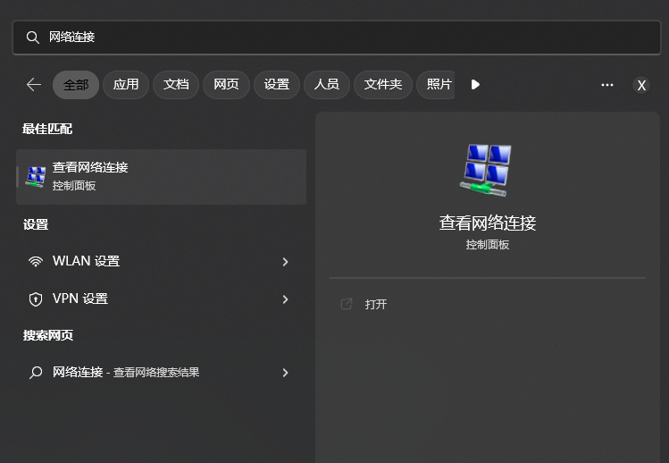
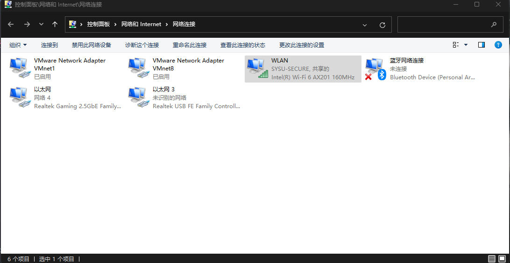
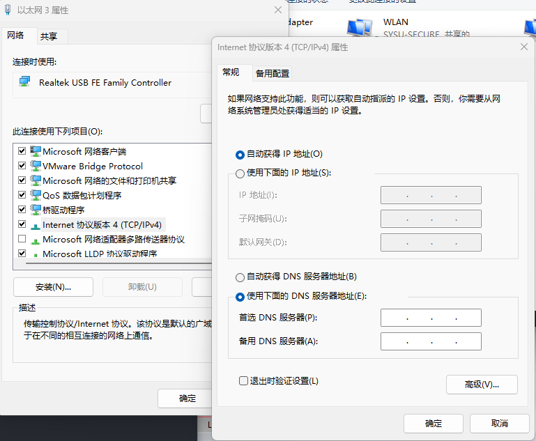
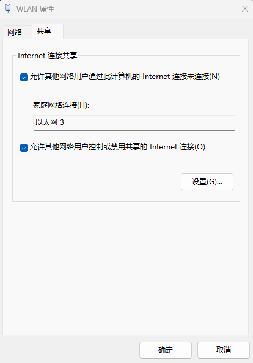
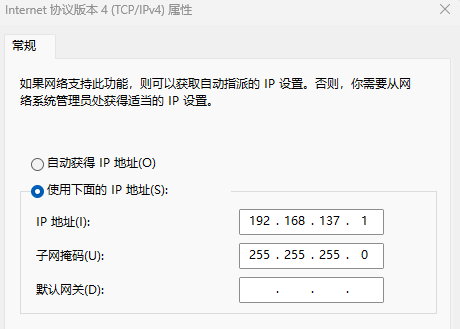
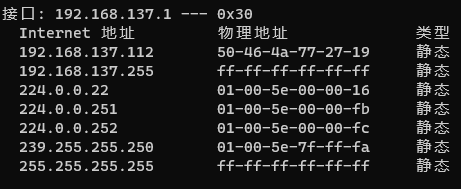
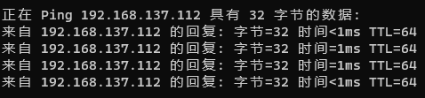
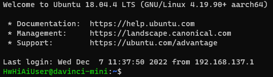
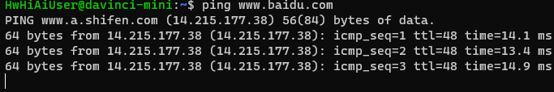

# Atlas200DK 连接 Windows PC

**1**. 将200DK上电，并通过网线将200DK与Windows PC机相连

**2**. 在【搜索】中键入【网络连接】，打开【查看网络连接】（或者打开【控制面板】，按照【控制面板】->【网络和Internet】->【查看网络状态和任务】-> 【更改适配器设置】的顺序进入）

  

  

**3**. 右键点击连接了 Atlas200DK 的 NIC网卡（此处为【以太网3】），在【属性】->【网络】中找到【Internet协议版本4（TCP/IPv4）】，双击在【常规】中选择【自动获得 IP 地址】，点击【确定】（可以通过插拔网口的方式查看连接Atlas200DK的是哪一张网卡）

  


**4**. 右键点击【WLAN（无线局域网）】依次选择【属性】-> 【共享】，勾选【允许其他网络用户通过此计算机的 Internet 连接来连接到其 Internet 连接】，在【家庭网络连接】中选择 Atlas200DK 的 NIC网卡，点击【确定】

  

**5**. 重新进入步骤3中的面板，查看此时自动分配给该网卡的IP地址（一般默认为`192.168.137.1`）

  

**6**. 打开Windows终端，键入

```powershell
PS > arp -a
```

找到步骤5中的IP地址

或者可以通过键入

```powershell
PS > arp -a -N 192.168.137.1
```
快速进行查找


  

一般Internet下第一条便为Atlas200DK所对应的IP地址，此处为`192.168.137.112`（需要注意：每次计算机所随机分配的IP地址都有可能不相同）

在终端中使用`ping`指令测试与200DK之间的连通性

```powershell
PS > ping 192.168.137.112
```

  


**7**. 在终端中使用`ssh`连接200DK终端

```powershell
PS > ssh HwHiAiUser@192.168.137.112
```

  

  

输入默认密码`Mind@123`，回车就能够进入200DK终端啦！

  

**8**. 使用`ping`指令测试200DK与外网的连通性

```bash
HwHiAiUser@Atlas200DK:~$ ping www.baidu.com
```

  

正常ping通，说明200DK连接成功