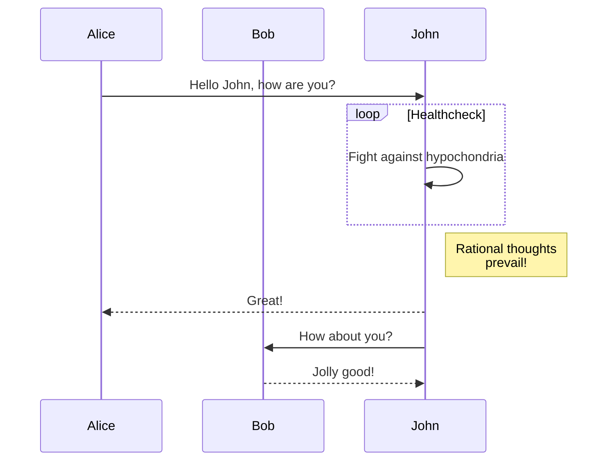
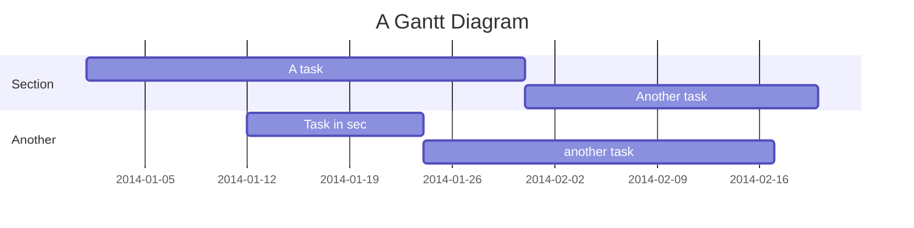
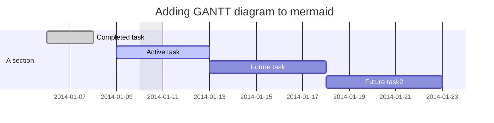
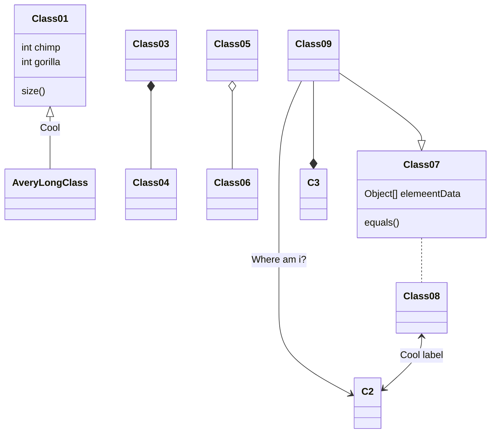
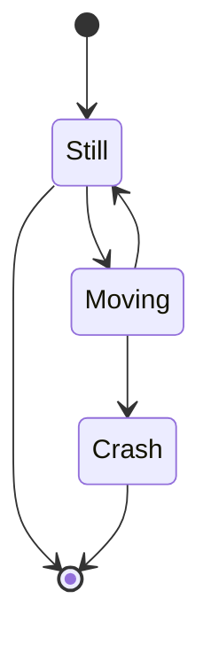
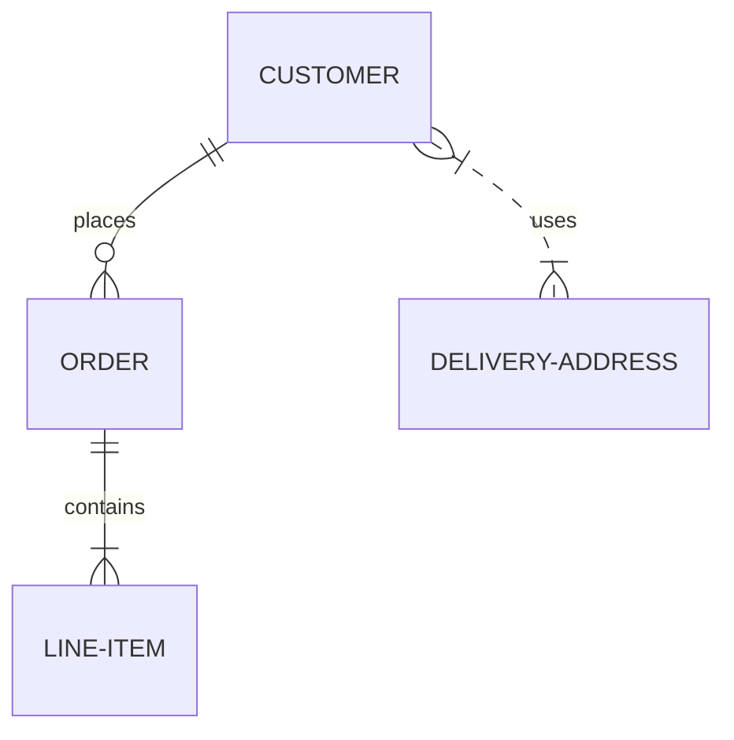
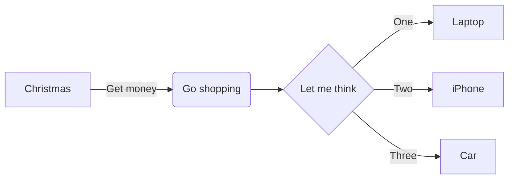

# mermaid 语法示例

[官网](https://mermaid.js.org/)

[在线编辑器](https://mermaid-js.github.io/mermaid-live-editor/)

**流程图**

  

**顺序图**

  

**甘特图**

 

  

**类图**

  

**状态图**

  

**实体关系图**

  

**鱼骨图**

  

**GIT图**

