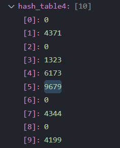

# CH5 课后习题

## 5.1

**a & b & c code**

```cpp
#include <iostream>

using namespace std;

int main() {

    // input {4371, 1323, 6173, 4199, 4344, 9679, 1989} 
    // h(x) = x % 10

    int input_data[] = {4371, 1323, 6173, 4199, 4344, 9679, 1989};


    // (a) separate chaining
    int hash_table[10][10] = {0};
    for (int i = 0; i < 7; i++) {
        int index = input_data[i] % 10;
        for (int j = 0; j < 10; j++) {
            if (hash_table[index][j] == 0) {
                hash_table[index][j] = input_data[i];
                break;
            }
        }
    }
    // print
    cout << "separate chaining:" << endl;
    for (int i = 0; i < 10; i++) {
        cout << i << ": ";
        for (int j = 0; j < 10; j++) {
            if (hash_table[i][j] != 0) {
                cout << hash_table[i][j] << " ";
            }
        }
        cout << endl;
    }

    cout << endl;


    // (b) linear probing
    int hash_table2[10] = {0};
    for (int i = 0; i < 7; i++) {
        int index = input_data[i] % 10;
        if (hash_table2[index] == 0) {
            hash_table2[index] = input_data[i];
        } else {
            int j = 1;
            while (hash_table2[(index + j) % 10] != 0) {
                j++;
            }
            hash_table2[(index + j) % 10] = input_data[i];
        }
    }
    // print
    cout << "linear probing:" << endl;
    for (int i = 0; i < 10; i++) {
        cout << i << ": ";
        if (hash_table2[i] != 0) {
            cout << hash_table2[i] << " ";
        }
        cout << endl;
    }

    cout << endl;


    // (c) quadratic probing
    int hash_table3[10] = {0};
    for (int i = 0; i < 7; i++) {
        int index = input_data[i] % 10;
        if (hash_table3[index] == 0) {
            hash_table3[index] = input_data[i];
        } else {
            int j = 1;
            while (hash_table3[(index + j * j) % 10] != 0) {
                j++;
            }
            hash_table3[(index + j * j) % 10] = input_data[i];
        }
    }
    // print
    cout << "quadratic probing:" << endl;
    for (int i = 0; i < 10; i++) {
        cout << i << ": ";
        if (hash_table3[i] != 0) {
            cout << hash_table3[i] << " ";
        }
        cout << endl;
    }


    return 0;
}
```


**Ouput**
```powershell
separate chaining: # a Answer
0: 
1: 4371 
2: 
3: 1323 6173 
4: 4344 
5: 
6: 
7: 
8: 
9: 4199 9679 1989 

linear probing: # b Answer
0: 9679 
1: 4371 
2: 1989 
3: 1323 
4: 6173 
5: 4344 
6: 
7: 
8: 
9: 4199 

quadratic probing: # c Answer
0: 9679
1: 4371
2:
3: 1323
4: 6173
5: 4344
6:
7:
8: 1989
9: 4199
```


**d code**
```cpp
    // (d) double hashing, h2(x) = 7 - x % 7
    int hash_table4[10] = {0};
    for (int i = 0; i < 7; ++i) {
        int index = input_data[i] % 10;
        if (hash_table4[index] == 0) {
            hash_table4[index] = input_data[i];
        } else {
            int j = 1;
            while (hash_table4[(index + j * (7 - input_data[i] % 7)) % 10] != 0) {
                j++;
            }
            hash_table4[(index + j * (7 - input_data[i] % 7)) % 10] = input_data[i];
        }
    }
```

**d Answer**

当需要插入最后一个数据1989时，根据双散列的公式，$h(x) = x \% 10$，$h_2(x) = 7 - x \% 7$，则：

$$h(1989) = 9$$
$$h_2(1989) = 7 - 1989 \% 7 = 7 - 1 = 6$$

但此时表中第9、5、1、7、3号位置均已被占用，如图：

因此1989将无法插入