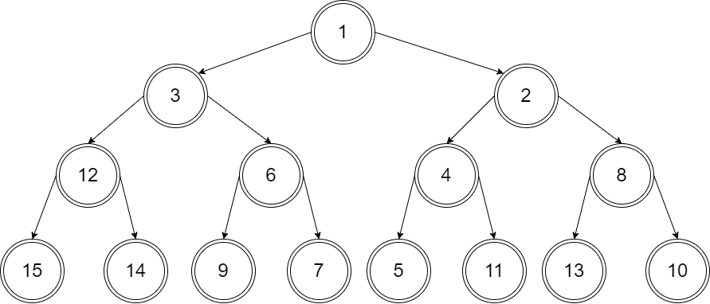
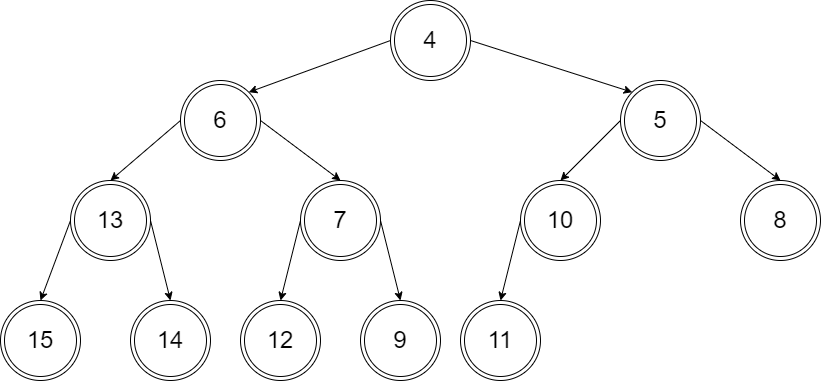

# CH6 课后习题

[TOC]

<!-- font -->
<style>
    body {
        font-family: "Times New Roman", Georgia, Serif;
    }
</style>

<!-- change page -->
<div style="page-break-after: always;"></div>

## 6.2

**a answer**


**b answer**



<!-- change page -->
<div style="page-break-after: always;"></div>

## 6.3

**a answer**



**b answer**


<!-- change page -->
<div style="page-break-after: always;"></div>

## 6.2 and 6.3 code

<!-- change page -->
<div style="page-break-after: always;"></div>

**binaryHeap.hpp**
```cpp
// binaryHeap.hpp
#ifndef BINARY_HEAP_H
#define BINARY_HEAP_H
#include <vector>
#include <iostream>

using namespace std;

template <typename Comparable> 
class BinaryHeap {
public: 
    explicit BinaryHeap(int capacity = 100);
    explicit BinaryHeap(const vector<Comparable> & items); 

    bool isEmpty() const;
    const Comparable & findMin() const;

    void insert(const Comparable & x);
    void insert(Comparable && x);
    void deleteMin();
    void deleteMin(Comparable & minItem);
    void makeEmpty();

    void showHeap() const {
        int j = 1;
        for (int i = 1; i <= currentSize; ++i) {
            cout << array[i];
            if (i == j) {
                cout << endl;
                j = j * 2 + 1;
            }
            else
                cout << " ";
        }
        cout << endl;
    }

private:
    int currentSize; // Number of elements in heap 
    vector<Comparable> array; // The heap array

    void buildHeap();
    void percolateDown(int hole);
};

template <typename Comparable>
BinaryHeap<Comparable>::BinaryHeap(int capacity) : currentSize(capacity), array(capacity + 1) {}


template <typename Comparable>
BinaryHeap<Comparable>::BinaryHeap(const vector<Comparable> & items) 
    : currentSize{items.size()}, array(items.size() + 10) 
{
    for (int i = 0; i < items.size(); ++i) 
        array[i + 1] = items[i];
    buildHeap();    
}


template <typename Comparable>
void BinaryHeap<Comparable>::buildHeap() {
    for (int i = currentSize / 2; i > 0; --i)
        percolateDown(i);
}


template <typename Comparable>
bool BinaryHeap<Comparable>::isEmpty() const {
    return currentSize == 0;
}


template <typename Comparable>
const Comparable & BinaryHeap<Comparable>::findMin() const {
    if (isEmpty())
        // throw UnderflowException{};
        return array[0];
    return array[1];
}


template <typename Comparable>
void BinaryHeap<Comparable>::insert(const Comparable & x) {
    if (currentSize == array.size() - 1)
        array.resize(array.size() * 2);

    // Percolate up
    int hole = ++currentSize;
    Comparable copy = x;

    array[0] = std::move(copy);
    for (; x < array[hole / 2]; hole /= 2)
        array[hole] = std::move(array[hole / 2]);
    array[hole] = std::move(array[0]);
}


template <typename Comparable>
void BinaryHeap<Comparable>::insert(Comparable && x) {
    if (currentSize == array.size() - 1)
        array.resize(array.size() * 2);

    // Percolate up
    int hole = ++currentSize;
    for (; hole > 1 && x < array[hole / 2]; hole /= 2)
        array[hole] = std::move(array[hole / 2]);
    array[hole] = std::move(x);
}


template <typename Comparable>
void BinaryHeap<Comparable>::deleteMin() {
    if (isEmpty())
        // throw UnderflowException{};
        return;
    array[1] = std::move(array[currentSize--]);
    percolateDown(1);
}


template <typename Comparable>
void BinaryHeap<Comparable>::deleteMin(Comparable & minItem) {
    if (isEmpty())
        // throw UnderflowException{};
        return;
    minItem = std::move(array[1]);
    array[1] = std::move(array[currentSize--]);
    percolateDown(1);
}


template <typename Comparable>
void BinaryHeap<Comparable>::percolateDown(int hole) {
    int child;
    Comparable tmp = std::move(array[hole]);
    for (; hole*2 <= currentSize; hole = child) {
        child = hole * 2;
        if (child != currentSize && array[child + 1] < array[child])
            ++child;
        if (array[child] < tmp)
            array[hole] = std::move(array[child]);
        else
            break;
    }
    array[hole] = std::move(tmp);
}

 
template <typename Comparable>
void BinaryHeap<Comparable>::makeEmpty() {
    currentSize = 0;
}

#endif
```

<!-- change page -->
<div style="page-break-after: always;"></div>

**main.cpp**

```cpp
// main.cpp
#include "binaryHeap.h"
#include <iostream>

using namespace std;

int main() {

    vector<int> v = { 10, 12, 1, 14, 6, 5, 8, 15, 3, 9, 7, 4, 11, 13, 2 };

    // question 6.2 a
    BinaryHeap<int> bh1; bh1.makeEmpty();
    for (int i = 0; i < v.size(); ++i)
        bh1.insert(v[i]);
    cout << "question 6.2 a" << endl;
    bh1.showHeap();


    cout << endl;
    

    // question 6.2 b
    BinaryHeap<int> bh2(v);
    cout << "question 6.2 b" << endl;
    bh2.showHeap();


    cout << endl;


    // question 6.3 a
    for (int i = 0; i < 3; ++i)
        bh1.deleteMin();
    cout << "question 6.3 a" << endl;
    bh1.showHeap();


    cout << endl;


    // question 6.3 b
    for (int i = 0; i < 3; ++i)
        bh2.deleteMin();
    cout << "question 6.3 b" << endl;
    bh2.showHeap();


    return 0;
}
```

<!-- change page -->
<div style="page-break-after: always;"></div>

**output**
```powershell
# output
question 6.2 a
1
3 2
6 7 5 4
15 14 12 9 10 11 13 8


question 6.2 b
1
3 2
12 6 4 8
15 14 9 7 5 11 13 10


question 6.3 a
4
6 5
13 7 10 8
15 14 12 9 11 

question 6.3 b
4
6 5
12 7 10 8
15 14 9 13 11
```

<!-- change page -->
<div style="page-break-after: always;"></div>

## 6.19

**answer**


## 6.19 code

<!-- change page -->
<div style="page-break-after: always;"></div>

**leftistHeap.hpp**
```cpp
// leftistHeap.hpp
#ifndef LISTISTHEAP_H
#define LISTISTHEAP_H

#include <iostream>
#include <queue>
#include <vector>
#include <cmath>
#include "dsexceptions.h"

using namespace std;

template <typename Comparable>
class LeftistHeap {

private:
    struct LeftistNode {
        Comparable element;
        LeftistNode *left;
        LeftistNode *right;
        int npl;
    
        LeftistNode(const Comparable & e, LeftistNode *lt = nullptr, LeftistNode *rt = nullptr, int np = 0)
            : element{e}, left{lt}, right{rt}, npl{np} { }
        LeftistNode(Comparable && e, LeftistNode *lt = nullptr, LeftistNode *rt = nullptr, int np = 0)
            : element{std::move(e)}, left{lt}, right{rt}, npl{np} { }
    };

    LeftistNode *root;

public:
    LeftistHeap( ) : root { nullptr } { }
    LeftistHeap(const LeftistHeap & rhs) : root { nullptr } {
        root = clone(rhs.root);
    }
    LeftistHeap(LeftistHeap && rhs) : root { rhs.root } {
        rhs.root = nullptr;
    }

    ~LeftistHeap( ) { makeEmpty( ); }

    LeftistHeap & operator=(const LeftistHeap & rhs) {
        LeftistHeap copy = rhs;
        std::swap(*this, copy);
        return *this;
    }
    LeftistHeap & operator=(LeftistHeap && rhs) {
        std::swap(root, rhs.root);
        return *this;
    }

    bool isEmpty( ) const { return root == nullptr; }

    const Comparable & findMin( ) const {
        if (isEmpty( ))
            throw UnderflowException { };
        return root->element;
    }

    void insert(const Comparable & x) {
        root = merge( new LeftistNode { x }, root );
    }
    void insert(Comparable && x) {
        root = merge( new LeftistNode { std::move(x) }, root );
    }

    void deleteMin( ) {
        if (isEmpty( ))
            throw UnderflowException { };
        LeftistNode *oldRoot = root;
        root = merge(root->left, root->right);
        delete oldRoot;
    }
    void deleteMin(Comparable & minItem) {
        minItem = findMin( );
        deleteMin( );
    }

    void makeEmpty( ) {
        reclaimMemory(root);
        root = nullptr;
    }

    void merge(LeftistHeap & rhs) {
        if (this == &rhs)
            return ;
        root = merge(root, rhs.root);
        rhs.root = nullptr;
    }

    void show() {
        vector<Comparable> array;
        array.resize(1);
        change2array(array, root, 0);
        int count = 0;
        int level = 0;
        for (int i = 0; i < array.size(); i++) {
            if (array[i] != 0) {
                cout << array[i] << " ";
                count++;
            } else {
                cout << ". ";
                count++;
            }
            if (count == pow(2, level)) {
                cout << endl;
                count = 0;
                level++;
            }
        }
    }

    void change2array(vector<Comparable> & array, LeftistNode *t, int index) {
        if (t != nullptr) {
            array[index] = t->element;
            if (array.size() < 2 * index + 2)
                array.resize(2 * array.size() + 1);
            change2array(array, t->left, 2 * index + 1);
            change2array(array, t->right, 2 * index + 2);
        }
    }


private:
    LeftistNode * merge(LeftistNode *h1, LeftistNode *h2) {
        if (h1 == nullptr)
            return h2;
        if (h2 == nullptr)
            return h1;
        if (h1->element < h2->element)
            return merge1(h1, h2);
        else
            return merge1(h2, h1);
    }
    LeftistNode * merge1(LeftistNode *h1, LeftistNode *h2) {
        if (h1->left == nullptr)
            h1->left = h2;
        else {
            h1->right = merge(h1->right, h2);
            if (h1->left->npl < h1->right->npl)
                swapChildren(h1);
            h1->npl = h1->right->npl + 1;
        }
        return h1;
    }

    void swapChildren(LeftistNode *t) {
        LeftistNode *tmp = t->left;
        t->left = t->right;
        t->right = tmp;
    }

    void reclaimMemory(LeftistNode *t) {
        if (t != nullptr) {
            reclaimMemory(t->left);
            reclaimMemory(t->right);
            delete t;
        }
    }
    
    LeftistNode * clone(LeftistNode *t) const {
        if (t == nullptr)
            return nullptr;
        else
            return new LeftistNode { t->element, clone(t->left), clone(t->right), t->npl };
    }

};

#endif
```

<!-- change page -->
<div style="page-break-after: always;"></div>

**main.cpp**
```cpp
// main.cpp
#include "leftistHeap.hpp"
#include <iostream>

using namespace std;

int main() {
    LeftistHeap<int> h1;

    LeftistHeap<int> left;
    LeftistHeap<int> mid;
    LeftistHeap<int> right;
    LeftistHeap<int> tmp_l;
    LeftistHeap<int> tmp_r;

    left.insert(12);
    mid.insert(11);
    mid.merge(left);
    tmp_l = mid;

    left.makeEmpty();
    mid.makeEmpty();
    right.makeEmpty();

    left.insert(18);
    mid.insert(17);
    mid.merge(left);
    right = mid;
    tmp_l.merge(right);

    left.makeEmpty();
    mid.makeEmpty();
    right.makeEmpty();

    mid.insert(2);
    left = tmp_l;
    mid.merge(left);
    tmp_l = mid;

    left.makeEmpty();
    mid.makeEmpty();
    right.makeEmpty();

    mid.insert(8);
    left.insert(15);
    mid.merge(left);
    tmp_r = mid;
    
    left.makeEmpty();
    mid.makeEmpty();
    right.makeEmpty();

    mid.insert(5);
    left = tmp_r;
    mid.merge(left);
    tmp_r = mid;

    left.makeEmpty();
    mid.makeEmpty();
    right.makeEmpty();

    mid = tmp_l;
    right = tmp_r;

    mid.merge(right);
    h1 = mid;


    cout << "h1: " << endl;
    h1.show();

    cout << endl;

    LeftistHeap<int> h2;
    
    left.makeEmpty();
    mid.makeEmpty();
    right.makeEmpty();
    tmp_l.makeEmpty();
    tmp_r.makeEmpty();

    left.insert(31);
    mid.insert(18);
    mid.merge(left);
    tmp_l = mid;

    left.makeEmpty();
    mid.makeEmpty();
    right.makeEmpty();

    mid.insert(9);
    left = tmp_l;
    mid.merge(left);
    tmp_l = mid;

    left.makeEmpty();
    mid.makeEmpty();
    right.makeEmpty();

    mid.insert(10);
    right = mid;
    tmp_l.merge(right);

    left.makeEmpty();
    mid.makeEmpty();
    right.makeEmpty();

    mid.insert(4);
    left = tmp_l;
    mid.merge(left);
    tmp_l = mid;

    left.makeEmpty();
    mid.makeEmpty();
    right.makeEmpty();

    mid.insert(11);
    left.insert(21);
    mid.merge(left);
    tmp_r = mid;

    left.makeEmpty();
    mid.makeEmpty();
    right.makeEmpty();

    mid.insert(6);
    left = tmp_r;
    mid.merge(left);
    tmp_r = mid;

    tmp_l.merge(tmp_r);
    h2 = tmp_l;

    cout << "h2: " << endl;
    h2.show();

    cout << endl;

    cout << "h1.merge(h2): " << endl;
    h1.merge(h2);
    h1.show();

    return 0;
}
```

<!-- change page -->
<div style="page-break-after: always;"></div>

**output**
```powershell
# output
h1: 
2 
11 5 
12 17 8 . 
. . 18 . 15 . . . 
. . . . . . . . . . . . . . . . 

h2: 
4 
9 6 
18 10 11 . 
31 . . . 21 . . . 
. . . . . . . . . . . . . . . . 

h1.merge(h2): 
2 
4 11 
9 5 12 17 
18 10 8 6 . . 18 . 
31 . . . 15 . 11 . . . . . . . . . 
. . . . . . . . . . . . 21 . . . . . . . . . . . . . . . . . . .
. . . . . . . . . . . . . . . . . . . . . . . . . . . . . . . . . . . . . . . . . . . . . . . . . . . . . . . . . . . . . . . . 
```

<!-- change page -->
<div style="page-break-after: always;"></div>

## 6.32

**answer**


## 6.32 Code

<!-- change page -->
<div style="page-break-after: always;"></div>

**binomialQueue.hpp**
```cpp
// binomialQueue.hpp
#ifndef _BINOMIAL_QUEUE_H
#define _BINOMIAL_QUEUE_H

#include <iostream>
#include <vector>
#include <queue>
#include "dsexceptions.h"

using namespace std;

template <typename Comparable>
class BinomialQueue {
public:
    BinomialQueue( ) : theTrees( DEFAULT_TREES ), currentSize { 0 } { }
    BinomialQueue( const Comparable & item ) : theTrees( 1 ), currentSize{ 1 } {
        theTrees[ 0 ] = new BinomialNode{ item, nullptr, nullptr };
    }
    BinomialQueue( const BinomialQueue & rhs ) : theTrees( rhs.theTrees.size( ) ), currentSize{ rhs.currentSize } {
        for ( int i = 0; i < rhs.theTrees.size( ); ++i )
            theTrees[ i ] = clone( rhs.theTrees[ i ] );
    }
    BinomialQueue( BinomialQueue && rhs ) : theTrees{ std::move( rhs.theTrees ) }, currentSize{ rhs.currentSize } { }

    ~BinomialQueue( ) {
        makeEmpty( );
    }

    BinomialQueue & operator=( const BinomialQueue & rhs ) {
        BinomialQueue copy = rhs;
        std::swap( *this, copy );
        return *this;
    }
    BinomialQueue & operator=( BinomialQueue && rhs ) {
        std::swap( currentSize, rhs.currentSize );
        std::swap( theTrees, rhs.theTrees );
        return *this;
    }

    bool isEmpt( ) const {
        return currentSize == 0;
    }

    const Comparable & findMin( ) const {
        if ( isEmpt( ) )
            throw UnderflowException{ };

        return theTrees[ findMinIndex( ) ]->element;
    }

    void insert( const Comparable & x ) {
        BinomialQueue oneItem{ x };
        merge( oneItem );
    }

    void insert( Comparable && x ) {
        BinomialQueue oneItem{ std::move( x ) };
        merge( oneItem );
    }

    void deleteMin( ) {
        Comparable x;
        deleteMin( x );
    }

    void deleteMin( Comparable & minItem ) {
        if ( isEmpt( ) )
            throw UnderflowException{ };
        
        int minIndex = findMinIndex( );
        minItem = theTrees[ minIndex ]->element;

        BinomialNode *oldRoot = theTrees[ minIndex ];
        BinomialNode *deletedTree = oldRoot->leftChild;
        delete oldRoot;

        // Construct H''
        BinomialQueue deletedQueue;
        deletedQueue.theTrees.resize( minIndex + 1 );
        deletedQueue.currentSize = ( 1 << minIndex ) - 1;
        for ( int j = minIndex - 1; j >= 0; --j ) {
            deletedQueue.theTrees[ j ] = deletedTree;
            deletedTree = deletedTree->nextSibling;
            deletedQueue.theTrees[ j ]->nextSibling = nullptr;
        }

        // Construct H'
        theTrees[ minIndex ] = nullptr;
        currentSize -= deletedQueue.currentSize + 1;

        merge( deletedQueue );
    }

    void makeEmpty( ) {
        currentSize = 0;
        for ( auto & root : theTrees)
            makeEmpty( root );
    }

    void merge( BinomialQueue & rhs ) {
        if ( this == &rhs) // Avoid aliasing problems
            return ;
        
        currentSize += rhs.currentSize;

        if ( currentSize > capacity( ) ) {
            int oldNumTrees = theTrees.size( );
            int newNumTrees = max( theTrees.size( ), rhs.theTrees.size( ) ) + 1;
            theTrees.resize( newNumTrees );
            for ( int i = oldNumTrees; i < newNumTrees; ++i )
                theTrees[ i ] = nullptr;
        }

        BinomialNode *carry = nullptr;
        for ( int i = 0, j = 1; j <= currentSize; ++i, j *= 2 ) {
            BinomialNode *t1 = theTrees[ i ];
            BinomialNode *t2 = i < rhs.theTrees.size( ) ? rhs.theTrees[ i ] : nullptr; 

            int whichCase = t1 == nullptr ? 0 : 1;
            whichCase += t2 == nullptr ? 0 : 2;
            whichCase += carry == nullptr ? 0 : 4;
            
            switch ( whichCase ) {
                case 0: /* No trees */
                case 1: /* Only this */
                    break;
                case 2: /* Only rhs */
                    theTrees[ i ] = t2;
                    rhs.theTrees[ i ] = nullptr;
                    break;
                case 4: /* Only carry */
                    theTrees[ i ] = carry;
                    carry = nullptr;
                    break;
                case 3: /* this and rhs */ 
                    carry = combineTrees( t1, t2 );
                    theTrees[ i ] = rhs.theTrees[ i ] = nullptr;
                    break;
                case 5: /* this and carry */
                    carry = combineTrees( t1, carry );
                    theTrees[ i ] = nullptr;
                    break;
                case 6: /* rhs and carry */
                    carry = combineTrees( t2, carry );
                    rhs.theTrees[ i ] = nullptr;
                    break;
                case 7: /* All three */
                    theTrees[ i ] = carry;
                    carry = combineTrees( t1, t2 );
                    rhs.theTrees[ i ] = nullptr;
                    break;
            }
        }

        for ( auto & root : rhs.theTrees )
            root = nullptr;
        rhs.currentSize = 0;
    }


    void show( ) const {
        for ( int i = 0; i < theTrees.size( ); ++i ) {
            if ( theTrees[ i ] != nullptr ) {
                cout << "Tree " << i << ": " << endl;
                show( theTrees[ i ], i );
                cout << endl;
            }
        }
    }

private:
    struct BinomialNode {
        Comparable element;
        BinomialNode *leftChild;
        BinomialNode *nextSibling;

        BinomialNode( const Comparable & e, BinomialNode *lt, BinomialNode *rt )
            : element{ e }, leftChild{ lt }, nextSibling{ rt } { }
        
        BinomialNode( Comparable && e, BinomialNode *lt, BinomialNode *rt )
            : element{ std::move( e ) }, leftChild{ lt }, nextSibling{ rt } { }
    };

    const static int DEFAULT_TREES = 1;

    vector<BinomialNode*> theTrees; // An array of tree roots
    int currentSize;                // Number of items in the priority queue

    int findMinIndex( ) const {
        int i;
        int minIndex;

        for ( i = 0; theTrees[ i ] == nullptr; ++i )
            ;

        for ( minIndex = i; i < theTrees.size( ); ++i )
            if ( theTrees[ i ] != nullptr && theTrees[ i ]->element < theTrees[ minIndex ]->element )
                minIndex = i;

        return minIndex;
    }

    int capacity( ) const {
        return ( 1 << theTrees.size( ) ) - 1;
    }

    BinomialNode * combineTrees( BinomialNode *t1, BinomialNode *t2 ) {
        if ( t2->element < t1->element )
            return combineTrees( t2, t1 );
        t2->nextSibling = t1->leftChild;
        t1->leftChild = t2;
        return t1;
    }
    
    void makeEmpty( BinomialNode * & t ) {
        if ( t != nullptr ) {
            makeEmpty( t->leftChild );
            makeEmpty( t->nextSibling );
            delete t;
            t = nullptr;
        }
    }

    BinomialNode * clone( BinomialNode *t ) const {
        if ( t == nullptr )
            return nullptr;
        else
            return new BinomialNode{ t->element, clone( t->leftChild ), clone( t->nextSibling ) };
    }


    void show( BinomialNode *t, int n ) const { 
        queue<BinomialNode*> q;
        q.push( t );
        int count = 0, level = 0, c = 1;
        while ( q.empty( ) == false ) {
            BinomialNode *tmp = q.front( );
            q.pop( );
            while ( tmp != nullptr) {
                cout << tmp->element;
                if ( tmp-> nextSibling != nullptr)
                    cout << " -> ";
                else 
                    cout << "    ";
                if ( tmp->leftChild != nullptr )
                    q.push( tmp->leftChild );
                count += 1;
                tmp = tmp->nextSibling;
            }
            if ( count == c ) {
                cout << endl;
                ++level;
                c = 1;
                for ( int i = 0; i < level; ++i ) {
                    c *= ( n - i );
                    c /= ( i + 1 );
                }
                count = 0;
            }
        }
    } 
    
};

#endif
```

<!-- change page -->
<div style="page-break-after: always;"></div>

**main.cpp**
```cpp
// main.cpp
#include "binomialQueue.h"
#include <iostream>

using namespace std;

int main() {

    BinomialQueue<int> b1;

    // 12 21 24 65 14 26 16 18 23 51 24 65 13
    b1.insert(12);
    b1.insert(21);

    b1.insert(24);
    b1.insert(65);

    b1.insert(14);
    b1.insert(26);

    b1.insert(16);
    b1.insert(18);

    b1.insert(23);
    b1.insert(51);

    b1.insert(24);
    b1.insert(65);

    b1.insert(13);

    cout << "b1: " << endl;
    b1.show();

    cout << endl;

    BinomialQueue<int> b2;

    // 2 11 29 55 15 18 4
    b2.insert(2);
    b2.insert(11);
    b2.insert(29);
    b2.insert(55);
    b2.insert(15);
    b2.insert(18);
    b2.insert(4);

    cout << "b2: " << endl;
    b2.show();

    cout << endl;

    b1.merge(b2);
    cout << "b1.merge(b2): " << endl;
    b1.show();

    return 0;
}
```

<!-- change page -->
<div style="page-break-after: always;"></div>

**output**
```powershell
# output
b1: 
Tree 0: 
13    

Tree 2: 
23    
24 -> 51    
65    

Tree 3:
12
14 -> 24 -> 21
16 -> 26    65
18


b2:
Tree 0:
4

Tree 1:
15
18

Tree 2:
2
29 -> 11
55


b1.merge(b2):
Tree 2:
4
15 -> 13
18

Tree 4:
2
12 -> 23 -> 29 -> 11
14 -> 24 -> 21    24 -> 51    55
16 -> 26    65    65
18
```

<!-- change page -->
<div style="page-break-after: always;"></div>

## 6.34 Code

<!-- change page -->
<div style="page-break-after: always;"></div>

**binomialQueue.hpp**
```cpp
// binomialQueue.hpp
#include <vector>

using namespace std;

template <typename Comparable> 
class BiQueue {
private:
    struct BiqueNode {
        Comparable element;
        BiqueNode *lchild = nullptr;
        BiqueNode *sibling = nullptr;
        BiqueNode( const Comparable & e ) : element { e } {}
        BiqueNode( Comparable && e ) : element { move(e) } {}
    };

    vector< BiqueNode* > biQue;

    BiqueNode * combine(BiqueNode *p, BiqueNode *q) {
        if (p->element > q->element)
            return combine(q, p);
        else {
            q->sibling = p->lchild;
            p->lchild = q;
        }
        return p; 
    }

public:
    BiqueNode * insert(Comparable v) { 
        BiqueNode * t = new BiqueNode(v);
        BiqueNode * c = t;
        if (biQue.empty()) {
            biQue.push_back(c);
            return t;
        }
        for (size_t i = 0; i <= biQue.size(); ++i) {
            if (i == biQue.size() - 1)
                biQue.push_back(nullptr);
            if (biQue[i] == nullptr) {
                biQue[i] = c;
                break; 
            } else {
                c = combine(c, biQue[i]);
                biQue[i] = nullptr;
            }
        }
        return t;
    }
};
```

<!-- change page -->
<div style="page-break-after: always;"></div>

**main.cpp**
```cpp
// main.cpp
#include <iostream>
#include "binomialQueue.hpp"

using namespace std;

int main() {
    // 12 21 24 65 14 26 16 18 23 51 24 65 13
    BiQueue<int> bq;
    bq.insert(12);
    bq.insert(21);
    bq.insert(24);
    bq.insert(65);
    bq.insert(14);
    bq.insert(26);
    bq.insert(16);
    bq.insert(18);
    bq.insert(23);
    bq.insert(51);
    bq.insert(24);
    bq.insert(65);
    bq.insert(13);

    return 0;
}
```