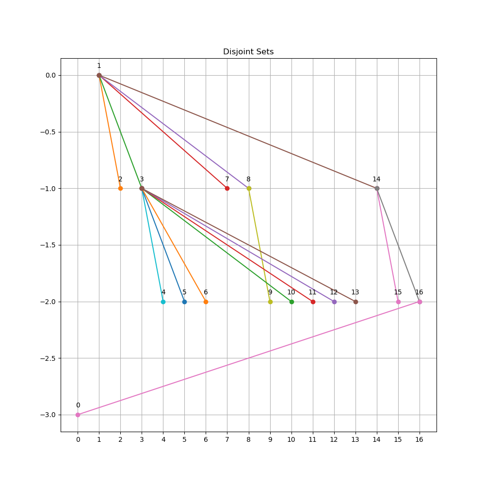
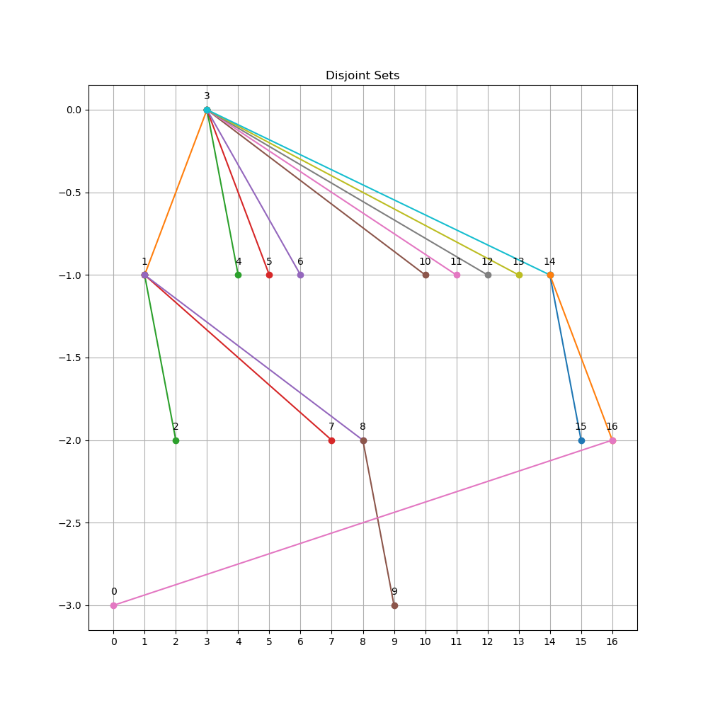

# CH8 课后习题

[toc]

<div style="page-break-after: always;"></div>

## 8.1

**a.answer**

*sample code*

```cpp
void unionSets( int x, int y ) {
    int root1 = findAncestor( x );
    int root2 = findAncestor( y );

    if ( root1 == root2 )
        return ;

    // you can make the first set the root of the second set
    // or the second set the root of the first set
    // just depends on your preference
    s[root2] = root1;
}
```

*result: array*

```poweshell
16 -1 1 1 3 3 3 1 1 8 3 3 3 3 1 14 14
```

<div style="page-break-after: always;"></div>

*result: image*



<div style="page-break-after: always;"></div>

**b.answer**

*sample code*

```cpp
void unionSets_by_height( int x, int y ) {
    int root1 = findAncestor( x );
    int root2 = findAncestor( y );

    if ( root1 == root2 )
        return ;

    if ( s[root2] < s[root1] ) {
        s[root1] = root2;
    } else {
        if ( s[root1] == s[root2] )
            --s[root1];
        s[root2] = root1;
    }
}
```

*result: array*

```poweshell
16 -4 1 1 3 3 3 1 1 8 3 3 3 3 1 14 14
```

<div style="page-break-after: always;"></div>

*result: image*


<div style="page-break-after: always;"></div>

**c.answer**

*sample code*

```cpp
void unionSets_by_size( int x, int y ) {
    int root1 = findAncestor( x );
    int root2 = findAncestor( y );

    if ( root1 == root2 )
        return ;

    if ( s[root2] < s[root1] ) {
        s[root2] += s[root1];
        s[root1] = root2;
    } else {
        s[root1] += s[root2];
        s[root2] = root1;
    }
}
```

*result: array*

```powershell
16 3 1 -17 3 3 3 1 1 8 3 3 3 3 3 14 14
```

<div style="page-break-after: always;"></div>

*result: image*




<div style="page-break-after: always;"></div>


## 8.4

**证明，如果 union 按照高度进行，那么任意树的深度均为 $O(logN)$。** -- 命题 1

**answer**

我们将该问题换一个角度证明：**当 union 按照高度进行，对于任意深度为 N 的树其所包含的节点数至少为 $2^{N}$** -- 命题 2

我们可以通过数学归纳法进行证明：

- 当 $N = 0$ 时，显然树只包含一个节点，对命题成立
- 当 $N > 0$ 时，假设对于任意深度为 $N - 1$ 的树其所包含的节点数至少为 $2^{N - 1}$。假设 T 是一颗深度为 $N$ 且其所包含的节点最少的树，那么根据 union 的规则可知，**在最后一次 union 之前 T 一定是一棵深度为 $N-1$ 的树**，否则 union 后所得的树所包含的节点数**一定不是最小**（因为是由一棵深度为 N 与一棵深度 < N 的树合并而来）。因此，T 所包含的节点数**至少为 $2^{N - 1} + 2^{N - 1} = 2^{N}$**。  

由此，命题 2 得证。

由命题 2 可知，如果 union 按照高度进行，那么任意含有 $N$ 个节点的树，其高度**至多为 $logN$**。因此，如果 union 按照高度进行，那么任意树的深度均为 $O(logN)$。命题 1 得证。


<div style="page-break-after: always;"></div>


## 附：8.1 中绘图所用代码

```py
import matplotlib.pyplot as plt


def findRoots(array : list):

    n = len(array)
    roots = []
    for i in range(n):
        if array[i] < 0:
            roots.append(i)

    for root in roots:
        drawSets(array, root)
    
```

```py

def drawSets(array : list, root : int):

    n = len(array)
    nodes1 = []
    nodes2 = []
    nodes1.append(root)
    level = 0

    plt.figure(figsize=(10, 10))
    plt.title("Disjoint Sets")
    plt.plot([root], [level], 'o')
    plt.text(root, level+0.05, str(root), ha='center', va='bottom', fontsize=10)

    while nodes1 or nodes2:
        if abs(level) % 2 == 0:
            while nodes1:
                node = nodes1.pop()
                for i in range(n):
                    if array[i] == node:
                        nodes2.append(i)
                        plt.plot([node, i], [level, level-1], '-o')
                        plt.text(i, level-1+0.05, str(i), ha='center', va='bottom', fontsize=10)
        else:
            while nodes2:
                node = nodes2.pop()
                for i in range(n):
                    if array[i] == node:
                        nodes1.append(i)
                        plt.plot([node, i], [level, level-1], '-o')
                        plt.text(i, level-1+0.05, str(i), ha='center', va='bottom', fontsize=10)
        level -= 1
        print(nodes1, nodes2)

    xlabel = [ i for i in range(n) ]
    plt.xticks(xlabel)

    plt.grid()
    plt.show()

```