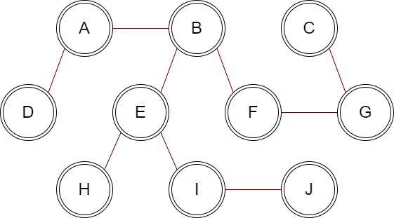

# CH9 课后习题

[toc]

## 9.1

**Answer**

$$s \ G \ D \ H \ A \ B \ E \ I \ F \ C \ t$$ 


## 9.2

**Answer**

<!-- s G H D A E I F B C t -->

$$s \ G \ H \ D \ A \ E \ I \ F \ B \ C \ t$$

可见与 9.1 中的结果相比，两者得出的结果并无太大的差距。实际上，无论是使用队列还是栈（分别对应了搜索算法中的广搜与深搜），两者的最终效果都没有太大的差别，只是相比于深搜，将广搜运用到拓扑排序中似乎更为符合人的直觉。


## 9.15

**a Answer**

- 本题中由 prim算法 以及 kruskal算法 所生成的最小生成树是相同的，具体生成过程可见后续代码部分。




**b Answer**

因为存在有权值相同的边，因此最小生成树不唯一。


## 9.26

**Answer**

Strong component 1: F 
Strong component 2: D A B C E G

- 具体实现可见后续代码部分


# Code 


## 9.1 Code

**Graph Class**

```cpp
template <typename T>
class Graph {

private:

    map<T, vector<T>> adjList;
    map<T, int> inDegree;

public:

    Graph() = default;

    void addEdge(T from, T to);

    void topSort() const;

};
```

**AddEdge method**

```cpp
template <typename T>
void Graph<T>::addEdge(T from, T to) {

    adjList[from].push_back(to);
    if (inDegree.find(from) == inDegree.end())
        inDegree[from] = 0;
    inDegree[to]++;

}
```

**TopSort method**

```cpp
template <typename T>
void Graph<T>::topSort() const {

    auto adjList = this->adjList;
    auto inDegree = this->inDegree;

    queue<T> q;
    size_t counter = 0;

    for (auto &item : inDegree)
        if (item.second == 0)
            q.push(item.first);

    while (!q.empty()) {

        counter++;

        T v = q.front();
        q.pop();
        cout << v << " ";

        for (auto &item : adjList[v]) {
            inDegree[item]--;
            if (inDegree[item] == 0)
                q.push(item);
        }

    }

    if (counter != adjList.size())
        cout << "There exists a cycle in the graph" << endl;
}
```

**Code result**

```powershell
s G D H A B E I F C t
```


## 9.2 Code


**TopSort Method**

- other code is same as 9.1

```cpp

template <typename T>
void Graph<T>::topSort() const {

    ...
    
    stack<T> s;
    size_t counter = 0;

    for (auto &item : inDegree)
        if (item.second == 0)
            s.push(item.first);

    while (!s.empty()) {

        counter++;

        T v = s.top();
        s.pop();
        cout << v << " ";

        for (auto &item : adjList[v]) {
            inDegree[item]--;
            if (inDegree[item] == 0)
                s.push(item);
        }

    }
 
    ...

}
```

**Code result**

```powershell
s G H D A E I F B C t
```


## 9.15 Code

**Prim Code**

```cpp
class Graph {

public:

    explicit Graph( size_t numVertices )
        : adjList( numVertices ), weight( numVertices ) { }

    void addEdge( int u, int v, int w ) {
        adjList[u].push_back( v );
        adjList[v].push_back( u );

        weight[u].push_back( w );
        weight[v].push_back( w );
    }

    void prim( int start ) {
        
        vector<bool> visited( adjList.size(), false );
        priority_queue< pair<int, int>, vector< pair<int, int> >, greater< pair<int, int> > > pq;

        // pair<weight, vertex>
        pq.push( make_pair( 0, start ) );

        while ( !pq.empty() ) {
            pair<int, int> p = pq.top();
            pq.pop();

            if ( visited[p.second] )
                continue;

            visited[p.second] = true;

            cout << p.second << " ";

            for ( size_t i = 0; i < adjList[p.second].size(); ++i ) {
                int v = adjList[p.second][i];
                int w = weight[p.second][i];

                if ( !visited[v] )
                    pq.push( make_pair( w, v ) );
            }
        }
    }    

private:

    vector< vector<int> > adjList;
    vector< vector<int> > weight;

};
```

**Code result**

```powershell
1 2 5 9 8 6 7 3 4 10
```

**Kruskal Code**

```cpp
struct Edge {

    int u, v, w;

    Edge(int _u, int _v, int _w) : u(_u), v(_v), w(_w) { }

    bool operator > (const Edge& rhs) const {
        return w > rhs.w;
    }
};


vector<Edge> kruskal( vector<Edge> edges, size_t numVectices ) {

    vector<Edge> mst;
    DisjSets<Edge> ds{ edges };
    priority_queue<Edge, vector<Edge>, greater<Edge>> pq;

    for ( auto & e : edges )
        pq.push( e );

    while ( mst.size() != numVectices - 1 ) {
        Edge e = pq.top();
        pq.pop();

        if ( !ds.isSameSet( e.u, e.v ) ) {
            // recieve the edge
            mst.push_back( e );
            ds.unionSets( e.u, e.v );
        }
    }

    return mst;    
}
```

**Code result**

```powershell
5 9 1
3 7 1
5 2 2
5 8 2
6 7 2
6 2 3
1 2 3
4 1 4
10 9 7
```


## 9.26 Code

**Find Component Code**

```cpp
class Graph {

public:

    Graph( size_t numVertices )
        : adjList( numVertices ), indgree( numVertices ) { }

    void addEdge( int u, int v ) {
        adjList[u].push_back( v );
        ++indgree[v];
    }

    void dfs1( stack<int> & s, vector<bool> & visited, int v ) {
        visited[v] = true;
        
        for ( size_t i = 0; i < adjList[v].size(); ++i ) {
            int next = adjList[v][i];
            if ( !visited[next] )
                dfs1( s, visited, next );
        }

        s.push( v );
    }

    void dfs2( vector<int> & path, vector<bool> & visited, int v ) {
        visited[v] = true;

        path.push_back( v );

        for ( size_t i = 0; i < adjList[v].size(); ++i ) {
            int next = adjList[v][i];
            if ( !visited[next] )
                dfs2( path, visited, next );
        }
    }

    void reverseAdjList() {
        vector< vector<int> > newAdjList( adjList.size() );
        vector<int> newIndgree( adjList.size() );

        for ( size_t i = 0; i < adjList.size(); ++i ) {
            for ( size_t j = 0; j < adjList[i].size(); ++j ) {
                int v = adjList[i][j];
                newAdjList[v].push_back( i );
                ++newIndgree[i];
            }
        }

        adjList = newAdjList;
        indgree = newIndgree;
    }

    vector<vector<int>> find_strong_component() {
        vector<vector<int>> result;

        stack<int> order;
        vector<bool> visited( adjList.size(), false );

        for ( size_t i = 0; i < adjList.size(); ++i ) {
            if ( !indgree[i] ) {
                dfs1( order, visited, i );
                break;
            }
        }

        visited.assign( adjList.size(), false );
        reverseAdjList();

        while ( !order.empty() ) {
            int v = order.top();
            order.pop();

            if ( !visited[v] ) {
                vector<int> path;
                dfs2( path, visited, v );
                result.push_back( path );
            }
        }

        return result;
    }

private:

    vector< vector<int> > adjList;
    vector<int> indgree;

};
```

**Code result**

```powershell
Strong component 1: F 
Strong component 2: D A B C E G
```