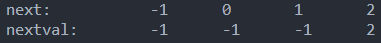
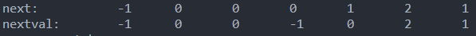
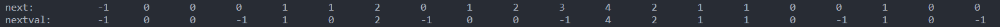

# 数据结构作业（5）

## 1. 已知串为 s='aaab', t='abcabaa', u='abcaabbabcabaacbabcba'，求它们的next函数和nextval函数。

首先给出Next函数的定义：

$$
Next[i] = \left\{
\begin{array}{ll}
-1 & i = 0 \\
Max\{k | 0 < k < i, s[0..k-1] = s[i-k..i-1]\} & i > 0 \\
0 & else
\end{array}
\right.
$$

下面给出各个串的Next函数与NextVal函数的值：

$$
\begin{array}{|c|c|c|c|c|}
\hline
j & 0 & 1 & 2 & 3 \\
\hline
s[j] & a & a & a & b \\
\hline
next[j] & -1 & 0 & 1 & 2 \\
\hline
nextval[j] & -1 & -1 & -1 & 2 \\
\hline
\end{array}
$$


$$
\begin{array}{|c|c|c|c|c|c|c|c|}
\hline
j & 0 & 1 & 2 & 3 & 4 & 5 & 6 \\
\hline
t[j] & a & b & c & a & b & a & a \\
\hline
next[j] & -1 & 0 & 0 & 0 & 1 & 2 & 1 \\
\hline
nextval[j] & -1 & 0 & 0 & -1 & 0 & 2 & 1 \\
\hline
\end{array}
$$


$$
\begin{array}{|c|c|c|c|c|c|c|c|c|c|c|c|}
\hline
j & 0 & 1 & 2 & 3 & 4 & 5 & 6 & 7 & 8 & 9 & ... \\
\hline
u[j] & a & b & c & a & a & b & b & c & a & b & ... \\
\hline
next[j] & -1 & 0 & 0 & 0 & 1 & 1 & 2 & 0 & 1 & 2 & ... \\
\hline
nextval[j] & -1 & 0 & 0 & -1 & 1 & 0 & 2 & -1 & 0 & 0 & ... \\
\hline
\end{array}
$$


**所用代码**

```cpp
vector<int> make_next(string patt) {
    vector<int> next(patt.size(), 0);
    next[0] = -1;
    int i = 0, j = -1;
    while (i < patt.size() - 1) {
        if (j == -1 || patt[i] == patt[j]) {
            i++; j++;
            next[i] = j;
        } else {
            j = next[j];
        }
    }

    return next;
}

vector<int> make_nextval(string p) {
    vector<int> nextval = make_next(p);
    for (int i = 0; i < nextval.size(); i++) {
        if (p[i] == p[nextval[i]]) {
            nextval[i] = nextval[nextval[i]];
        }
    }

    return nextval;
}
```


## 2. 解释下列每对术语的区别：空串和空白串；主串和子串；目标串和模式串。

- 空串与空白串：
  - 空串：长度为0的串
  - 空白串：指由空白符组成的串，长度不为0
- 主串与子串：
  - 主串：包含子串的串
  - 字串：串中任意个连续字符组成的子序列
- 目标串与模式串：
  - 目标串：待匹配的串，在串的匹配问题中通常为主串
  - 模式串：用于匹配的串，在串的匹配问题中通常为子串


## 3. 若x和y是两个采用顺序结构存储的串，写一算法比较这两个字符串是否相等。

```cpp
#include <iostream>
#include <string>

using namespace std;

class myString : public string {

    bool operator==(const myString& s) {
        if (this->size() != s.size()) {
            return false;
        }
        for (int i = 0; i < this->size(); i++) {
            if (this->at(i) != s.at(i)) {
                return false;
            }
        }
        return true;        
    }
};

int main() {
    string s1 = "abc";
    string s2 = "abc";
    cout << (s1 == s2) << endl;

    return 0;
}
```