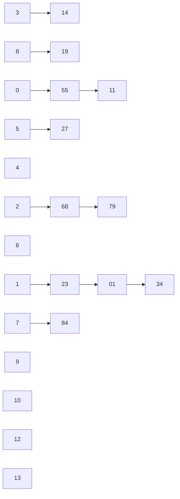

# 数据结构习题（9）

## 1. 对于一个有n个元素的线性表，采用顺序查找方法时的平均查找长度是多少？若结点是有序的，则采用折半查找法的平均查找长度是多少？

- 顺序查找方法时的平均查找长度是$\frac{n+1}{2}$
- 若结点是有序的，则采用折半查找法的平均查找长度是$\frac{n+1}{n}log_2(n+1)-1$，当n很大时，ASL约等于$log_2(n+1)-1$

## 2. 设查找表采用单链表存储，请写出对该表进行顺序查找的算法。

- 单链表存储结构

```c
typedef struct LNode
{
    ElemType data;
    struct LNode * next;
}LNode, * LinkList;

```

- 顺序查找的算法

```c
LNode * Search_LinkList(LinkList L, ElemType key)
{
    LNode * p = L->next;
    while (p != NULL && p->data != key)
    {
        p = p->next;
    }
    return p;
}
```

## 3. 试比较哈希表构造时几种冲突处理方法的优缺点。

- 开放地址法
    - 线性探测法
      - 优点：只要散列表未满，总能找到一个不冲突的散列地址；
      - 缺点：每个产生冲突的记录被散列到里冲突最近的空地址上，从而又增加了产生冲突的可能性，造成聚集现象，影响查找效率。
    - 二次探测法
      - 优点：探测序列跳跃性地散列到整个表中，不易产生冲突的聚集现象；
      - 缺点：不能保证每个散列地址都被探测到。
    - 随机探测法
      - 优点：能够有效地避免聚集现象；
      - 缺点：需要通过伪随机数发生器来产生随机数，增加了时间开销，且不能保证每个散列地址都被探测到。

- 再哈希法
  - 优点：不易产生冲突的聚集现象；
  - 缺点：计算散列地址的时间开销增大。

- 链地址法
  - 优点：不易产生冲突的聚集现象；删除记录也简单；
  - 缺点：需要额外的空间存储指针域；当冲突较多时，散列表容易退化成单链表，查找效率降低。

- 建立公共溢出区
  - 优点：不易产生冲突的聚集现象；
  - 缺点：需要额外的空间存储溢出区；查找效率降低。

## 4. 设关键字序列是(19, 14, 23, 01, 68, 84, 27, 55, 11, 34, 79)，散列表是[0..13]，散列函数是$H(key)=key MOD 11$

(1) 采用开放地址法的线性探测方法解决冲突，请构造该关键字序列的哈希表，求出在等概率情况下，该方法的查找成功和不成功的平均查找长度ASL。

- 插入19，$H(19)=8$
> [0, 0, 0, 0, 0, 0, 0, 0, 19, 0, 0, 0, 0, 0]
- 插入14，$H(14)=3$
> [0, 0, 0, 14, 0, 0, 0, 0, 19, 0, 0, 0, 0, 0]
- 插入23，$H(23)=1$
> [0, 23, 0, 14, 0, 0, 0, 0, 19, 0, 0, 0, 0, 0]
- 插入01，$H(01)=1$，冲突，线性探测结果为2
> [0, 23, 1, 14, 0, 0, 0, 0, 19, 0, 0, 0, 0, 0]
- 插入68，$H(68)=2$，冲突，线性探测结果为4
> [0, 23, 1, 14, 68, 0, 0, 0, 19, 0, 0, 0, 0, 0]
- 插入84，$H(84)=7$
> [0, 23, 1, 14, 68, 0, 0, 84, 19, 0, 0, 0, 0, 0]
- 插入27，$H(27)=5$
> [0, 23, 1, 14, 68, 27, 0, 84, 19, 0, 0, 0, 0, 0]
- 插入55，$H(55)=0$
> [55, 23, 1, 14, 68, 27, 0, 84, 19, 0, 0, 0, 0, 0]
- 插入11，$H(11)=0$，冲突，线性探测结果为6
> [55, 23, 1, 14, 68, 27, 11, 84, 19, 0, 0, 0, 0, 0]
- 插入34，$H(34)=1$，冲突，线性探测结果为9
> [55, 23, 1, 14, 68, 27, 11, 84, 19, 34, 0, 0, 0, 0]
- 插入79，$H(79)=2$，冲突，线性探测结果为10
> [55, 23, 1, 14, 68, 27, 11, 84, 19, 34, 79, 0, 0, 0]

- 查找成功的平均查找长度ASL
  
    $ASL_succ=\frac{1}{11}(1+1+1+2+3+1+1+1+7+9+9) = \frac{36}{11}$

- 查找不成功的平均查找长度ASL

    $ASL_unsucc=\frac{1}{11}(12+11+10+9+8+7+6+5+4+3+2) = \frac{77}{11} = 7$


(2) 采用链地址法解决冲突，请构造该关键字序列的哈希表。求出在等概率情况下，该方法的查找成功和不成功的平均查找长度ASL。

哈希表：



- 查找成功的平均查找长度ASL
  
    $ASL_succ=\frac{1}{11}(7 + 2*3 + 3*1) = \frac{16}{11}$

- 查找不成功的平均查找长度ASL

    $ASL_unsucc=\frac{1}{11}(3+4+3+2+1+2+1+2+2+1+1) = \frac{22}{11} = 2$