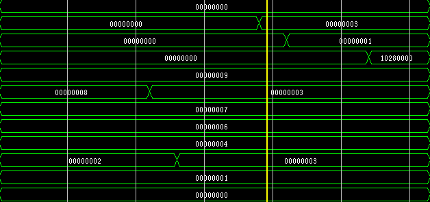
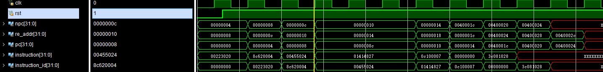

# 5级流水线CPU

[toc]

## 一、实验目的

## 二、实验要求

## 三、实验内容

## 四、实验原理

## 五、实验过程与纪录

我这里按照书中所给出的思路，尝试将一个单周期的CPU逐步的转换为一个5级流水线的CPU。

首先，我先按照cpu的执行阶段给出一些基本部件的实现逻辑（与单周期CPU的实现步骤基本相同，各个mux的实现将放在各主要部件之后）。

### 1. IF阶段（instruction fetch）

**pc(program counter)**

```verilog
// pc.v

module pc(
    input wire       clk,
    input wire       rst,
    input wire[31:0] npc,

    output reg[31:0] pc
    );

    initial begin
        pc <= `INIT_32;
    end

    always @ (posedge clk or negedge rst) begin  
        if (!rst) begin
            pc <= `INIT_32;
        end
        else begin 
            pc <= npc;
        end
    end
endmodule
```

pc模块的I/O接口：

3个input：

- clk: cpu时钟信号，上升沿触发，使pc更新
- rst：cpu复位信号，低电平有效，且为下降沿触发
- npc：经过选择器选择后的下一条指令的地址

1个output:

- pc：当前指令的地址

pc模块的功能：

- 控制pc的更新


**instruction_memory**

【注】：模块中涉及到一些常量，这些常量的定义都会放在definitions.v文件中以便于修改，这里不需要在意这些常量的值，只需要根据常量的命名大致理解其含义即可。如有需要，可以查看definitions.v文件。

```verilog
module instruction_memory(
    input wire[11:2]  instruction_addr, // PC fetch instruction address

    output wire[31:0] instruction       // IM fetch instruction from register
    );

    reg[31:0] im[`IM_LENGTH:0];
    assign instruction = im[instruction_addr];
endmodule
```

instruction_memory模块的I/O接口：

1个input：

- instruction_addr：pc模块输出的指令地址

1个output：

- instruction：根据pc指令地址从指令存储器中读取的指令

instruction_memory模块的功能：

- 跟据pc指令地址从指令存储器中读取指令


### 2. ID阶段（instruction decode）

**control**

contorl模块的内容相对比较多，这里分为指令判断部分和控制信号部分。

先是指令判断部分：

```verilog
// control.v
module control(
    input wire rst,
    input wire[5:0] opcode, // Instruction opcode
    input wire[5:0] func,   // R-Type instruction function code
    );

    /* --- Init instruction signals --- */

    // R-Type instructions
    wire type_r;
    wire inst_add, inst_addu, inst_sub, inst_subu;
    wire inst_slt, inst_sltu, inst_and, inst_or, inst_nor, inst_xor;
    wire inst_sll, inst_srl, inst_sra, inst_sllv, inst_srlv, inst_srav;
    wire inst_jr, inst_jalr;

    // I-Type instructions
    wire inst_addi, inst_addiu, inst_beq, inst_bne;
    wire inst_sltiu, inst_andi, inst_ori, inst_xori;
    wire inst_lui, inst_lw, inst_sw;

    // J-Type instructions
    wire inst_j, inst_jal;


    /* --- Decode instructions --- */

    // Whether instruction is R-Type
    assign type_r         = (opcode == `SPECIAL           ) ? 1 : 0;
    // R-Type instructions
    assign inst_add       = (type_r && func == `FUNC_ADD  ) ? 1 : 0;
    assign inst_addu      = (type_r && func == `FUNC_ADDU ) ? 1 : 0;
    assign inst_sub       = (type_r && func == `FUNC_SUB  ) ? 1 : 0;
    assign inst_subu      = (type_r && func == `FUNC_SUBU ) ? 1 : 0;
    assign inst_slt       = (type_r && func == `FUNC_SLT  ) ? 1 : 0;
    assign inst_sltu      = (type_r && func == `FUNC_SLTU ) ? 1 : 0;
    assign inst_and       = (type_r && func == `FUNC_AND  ) ? 1 : 0;
    assign inst_or        = (type_r && func == `FUNC_OR   ) ? 1 : 0;
    assign inst_nor       = (type_r && func == `FUNC_NOR  ) ? 1 : 0;
    assign inst_xor       = (type_r && func == `FUNC_XOR  ) ? 1 : 0;
    assign inst_sll       = (type_r && func == `FUNC_SLL  ) ? 1 : 0;
    assign inst_srl       = (type_r && func == `FUNC_SRL  ) ? 1 : 0;
    assign inst_sra       = (type_r && func == `FUNC_SRA  ) ? 1 : 0;
    assign inst_sllv      = (type_r && func == `FUNC_SLLV ) ? 1 : 0;
    assign inst_srlv      = (type_r && func == `FUNC_SRLV ) ? 1 : 0;
    assign inst_srav      = (type_r && func == `FUNC_SRAV ) ? 1 : 0;
    assign inst_jr        = (type_r && func == `FUNC_JR   ) ? 1 : 0;
    assign inst_jalr      = (type_r && func == `FUNC_JALR ) ? 1 : 0;

    // I-Type Instructions
    assign inst_addi      = (opcode == `INST_ADDI  ) ? 1 : 0;
    assign inst_addiu     = (opcode == `INST_ADDIU ) ? 1 : 0;
    assign inst_sltiu     = (opcode == `INST_SLTIU ) ? 1 : 0;
    assign inst_andi      = (opcode == `INST_ANDI  ) ? 1 : 0;
    assign inst_ori       = (opcode == `INST_ORI   ) ? 1 : 0;
    assign inst_xori      = (opcode == `INST_XORI  ) ? 1 : 0;
    assign inst_lui       = (opcode == `INST_LUI   ) ? 1 : 0;
    assign inst_lw        = (opcode == `INST_LW    ) ? 1 : 0;
    assign inst_sw        = (opcode == `INST_SW    ) ? 1 : 0;
    assign inst_beq       = (opcode == `INST_BEQ   ) ? 1 : 0;
    assign inst_bne       = (opcode == `INST_BNE   ) ? 1 : 0;

    // J-Type Instructions
    assign inst_j         = (opcode == `INST_J     ) ? 1 : 0;
    assign inst_jal       = (opcode == `INST_JAL   ) ? 1 : 0;
endmodule
```

control模块的I/O接口：

- rst：复位信号
- opcode：指令的opcode部分，也即指令的[31:26]位，用于判断指令类型
- func: 指令的func部分，也即指令的[5:0]位，当opcode为`SPECIAL`字段时，用于判断指令的功能 


然后是控制信号部分：

这里不妨先给出各条指令所对应的控制信号：

```txt
/** R-Type **/
/*
    instruction | RegWrite | RegDst | RegSrc | ALUOp | ALUSrc | MemWrite | MemRead | Branch | Jump | NPCOp
    --------------------------------------------------------------------------------------------------------
    add         |    1     |   rd   |  ALU   |  ADD  |   0    |    0     |    0    |   0    |   0  | NEXT 
    addu        |    1     |   rd   |  ALU   |  ADD  |   0    |    0     |    0    |   0    |   0  | NEXT 
    sub         |    1     |   rd   |  ALU   |  SUB  |   0    |    0     |    0    |   0    |   0  | NEXT 
    subu        |    1     |   rd   |  ALU   |  SUB  |   0    |    0     |    0    |   0    |   0  | NEXT 
    slt         |    1     |   rd   |  ALU   |  SLT  |   0    |    0     |    0    |   0    |   0  | NEXT 
    sltu        |    1     |   rd   |  ALU   |  SLT  |   0    |    0     |    0    |   0    |   0  | NEXT 
    and         |    1     |   rd   |  ALU   |  AND  |   0    |    0     |    0    |   0    |   0  | NEXT 
    or          |    1     |   rd   |  ALU   |  OR   |   0    |    0     |    0    |   0    |   0  | NEXT 
    nor         |    1     |   rd   |  ALU   |  NOR  |   0    |    0     |    0    |   0    |   0  | NEXT 
    xor         |    1     |   rd   |  ALU   |  XOR  |   0    |    0     |    0    |   0    |   0  | NEXT 
    sll         |    1     |   rd   |  ALU   |  SLL  |   0    |    0     |    0    |   0    |   0  | NEXT 
    srl         |    1     |   rd   |  ALU   |  SRL  |   0    |    0     |    0    |   0    |   0  | NEXT 
    sra         |    1     |   rd   |  ALU   |  SRA  |   0    |    0     |    0    |   0    |   0  | NEXT 
    sllv        |    1     |   rd   |  ALU   |  SLLV |   0    |    0     |    0    |   0    |   0  | NEXT 
    srlv        |    1     |   rd   |  ALU   |  SRLV |   0    |    0     |    0    |   0    |   0  | NEXT 
    srav        |    1     |   rd   |  ALU   |  SRAV |   0    |    0     |    0    |   0    |   0  | NEXT 
    jr          |    0     |   x    |  x     |  x    |   0    |    0     |    0    |   0    |   0  |  RS 
    jalr        |    1     | 31($ra)|  PC+8  |  x    |   0    |    0     |    0    |   0    |   0  |  RS 
*/

/** I-Type **/
/*
    instruction | RegWrite | RegDst | RegSrc | ALUOp | ALUSrc | MemWrite | MemRead | Branch | Jump |    NPCOp    | ExtOp
    -----------------------------------------------------------------------------------------------------------------------
    addi        |    1     |   rt   |  ALU   |  ADD  |   1    |    0     |    0    |   0    |   0  |    NEXT     | SIGNED
    addiu       |    1     |   rt   |  ALU   |  ADD  |   1    |    0     |    0    |   0    |   0  |    NEXT     | SIGNED 
    sltiu       |    1     |   rt   |  ALU   |  SLT  |   1    |    0     |    0    |   0    |   0  |    NEXT     | SIGNED
    andi        |    1     |   rt   |  ALU   |  AND  |   1    |    0     |    0    |   0    |   0  |    NEXT     | UNSIGNED
    ori         |    1     |   rt   |  ALU   |  OR   |   1    |    0     |    0    |   0    |   0  |    NEXT     | UNSIGNED
    xori        |    1     |   rt   |  ALU   |  XOR  |   1    |    0     |    0    |   0    |   0  |    NEXT     | UNSIGNED
    lui         |    1     |   rt   |  ALU   |  ADD  |   1    |    0     |    0    |   0    |   0  |    NEXT     | SFT16
    lw          |    1     |   rt   |  MEM   |  ADD  |   1    |    0     |    1    |   0    |   0  |    NEXT     | UNSIGNED
    sw          |    0     |   x    |  MEM   |  ADD  |   1    |    1     |    0    |   0    |   0  |    NEXT     | UNSIGNED
    beq         |    0     |   x    |  x     |  x    |   0    |    0     |    0    |   1    |   0  | NEXT/OFFSET |   x
    bne         |    0     |   x    |  x     |  x    |   0    |    0     |    0    |   1    |   0  | NEXT/OFFSET |   x
*/

/** J-Type **/
/*
    instruction | RegWrite | RegDst | RegSrc | ALUOp | ALUSrc | MemWrite | MemRead | Branch | Jump | NPCOp 
    ---------------------------------------------------------------------------------------------------------
    j           |    0     |   x    |  x     |  x    |   0    |    0     |    0    |   0    |   1  | JUMP
    jal         |    1     | 31($ra)|  PC+8  |  x    |   0    |    0     |    0    |   0    |   1  | JUMP
*/
```

代码实现：

```verilog

module contorl(

    ...

    input  wire                        zero,

    output wire[`EXT_OP_LENGTH  - 1:0] ext_op,

    output wire                        alu_src,
    output wire[`ALU_OP_LENGTH  - 1:0] alu_op,

    output wire                        mem_read,
    output wire                        mem_write,

    output wire                        reg_write,  
    output wire[`REG_SRC_LENGTH - 1:0] reg_src,
    output wire[`REG_DST_LENGTH - 1:0] reg_dst,

    output wire[`NPC_OP_LENGTH  - 1:0] npc_op
    );


    /* --- Determine control signals --- */
    
    // ExtOp
    assign ext_op =
            // shift left 16
            (inst_lui                               ) ? `EXT_OP_SFT16 :
            // signed extend 
            (inst_addi || inst_addiu || inst_sltiu  ) ? `EXT_OP_SIGNED :
            // unsigned extend
            (inst_andi || inst_ori   || inst_xori  ||
             inst_lw   || inst_sw                   ) ? `EXT_OP_UNSIGNED : `EXT_OP_DEFAULT;

    // ALUSrc
    assign alu_src =
            (inst_addi || inst_addiu || inst_sltiu || inst_andi ||
             inst_ori  || inst_xori  || inst_lw    || inst_sw    ) ? `ALU_SRC_IMM : `ALU_SRC_REG;

    // ALUOp
    assign alu_op =
            (inst_addi || inst_addiu || inst_add ||
             inst_addu || inst_lw    || inst_sw    ) ? `ALU_OP_ADD :     // Addition in ALU
            (inst_sub  || inst_subu  ||
             inst_beq  || inst_bne                 ) ? `ALU_OP_SUB :     // Subtraction in ALU
            (inst_slt  || inst_sltu  || inst_sltiu ) ? `ALU_OP_SLT :     // Set less than in ALU
            (inst_and  || inst_andi                ) ? `ALU_OP_AND :     // Bitwise AND in ALU
            (inst_or   || inst_ori                 ) ? `ALU_OP_OR  :     // Bitwise OR in ALU
            (inst_xor  || inst_xori                ) ? `ALU_OP_XOR :     // Bitwise XOR in ALU
            (inst_nor                              ) ? `ALU_OP_NOR :     // Bitwise NOR in ALU
            (inst_sll                              ) ? `ALU_OP_SLL :     // Shift left in ALU
            (inst_srl                              ) ? `ALU_OP_SRL :     // Shift right in ALU
            (inst_sra                              ) ? `ALU_OP_SRA :     // Shift right arithmetic in ALU
            (inst_sllv                             ) ? `ALU_OP_SLLV:     // Shift left variable in ALU
            (inst_srlv                             ) ? `ALU_OP_SRLV:     // Shift right variable in ALU
            (inst_srav                             ) ? `ALU_OP_SRAV:     // Shift right arithmetic variable in ALU
            `ALU_OP_DEFAULT; // Default ALU operand (output the second ALU input)

    // MemRead
    assign mem_read =
            (inst_lw) ? 1 : 0;

    // MemWrite
    assign mem_write =
            (zeroize) ? 0 :
            (inst_sw) ? 1 : 0;

    // RegWrite
    assign reg_write =
            (zeroize) ? 0 :
            ((type_r && !inst_jr)    ||
             inst_lui  || inst_lw    ||
             inst_addi || inst_addiu || inst_sltiu ||
             inst_andi || inst_ori   || inst_xori  ||
             inst_jal) ? 1 : 0;


    // RegDst
    assign reg_dst = 
            (type_r && !inst_jr) ? `REG_DST_RD :
            (inst_lui  || inst_lw    ||
             inst_addi || inst_addiu || inst_sltiu ||
             inst_andi || inst_ori   || inst_xori   ) ? `REG_DST_RT :
            (inst_jal) ? `REG_DST_REG_31 : `REG_DST_DEFAULT;


    // RegSrc
    assign reg_src =
            // Extended immediate
            (inst_lui                               ) ? `REG_SRC_IMM :

            // ALU result
            ((type_r && !inst_jr && !inst_jalr)    ||
             inst_addi || inst_addiu || inst_sltiu ||
             inst_andi || inst_ori   || inst_xori   ) ? `REG_SRC_ALU :

            // Data memory
            (inst_lw                                ) ? `REG_SRC_MEM :

            // PC + 8
            (inst_jalr || inst_jal) ? `REG_SRC_JMP_DST : `REG_SRC_DEFAULT;

    assign npc_op = 
                // normal: next instruction
                ((type_r && !inst_jr && !inst_jalr) ||
                 inst_addi || inst_addiu || inst_sltiu ||
                 inst_andi || inst_ori   || inst_xori  ||
                 inst_lui  || inst_lw    || inst_sw    ||
                 inst_beq  || inst_bne                  ) ? `NPC_OP_NEXT :

                // BEQ
                // normal: next instruction
                (inst_beq && ! zero) ? `NPC_OP_NEXT :
                // jump to target
                (inst_beq && zero) ? `NPC_OP_OFFSET :

                // BNE 
                // normal: next instruction
                (inst_bne && zero) ? `NPC_OP_NEXT : 
                // jump to target
                (inst_bne && ! zero) ? `NPC_OP_OFFSET : 

                // jump to instruction address  
                (inst_j || inst_jal) ? `NPC_OP_JUMP :
                // jump to rs data
                (inst_jr || inst_jalr) ? `NPC_OP_RS : `NPC_OP_DEFAULT;

endmodule
```


control模块的I/O接口：

input：

- zero：zero信号来自ALU模块，用于判断ALU的运算结果是否为0。若为0，则zero信号置1，否则置0

output：

- ext_op：用于指示extend模块的操作类型
- alu_src：用于指示ALU模块的第二个输入数据的来源
- alu_op：用于指示ALU模块的操作类型
- mem_read：用于指示data_memory模块是否需要读取数据
- mem_write：用于指示data_memory模块是否需要写入数据
- reg_write：用于指示register_file模块是否需要写入数据
- reg_src：用于指示register_file模块的写入数据的来源
- reg_dst：用于指示register_file模块的写入数据的目的寄存器
- npc_op：用于指示pc模块的下一条指令的地址的来源

control模块的功能：

- 判断当前指令的类型，并给出相应的控制信号


**extend**

```verilog
module extend(
    input wire[15:0]                  imm16,
    input wire[`EXT_OP_LENGTH  - 1:0] ext_op,

    output wire[31:0]                 extended_imm
    );

    assign extended_imm =
        (ext_op == `EXT_OP_SFT16)    ? {imm16, 16'b0} :           // LUI: shift left 16
        (ext_op == `EXT_OP_SIGNED)   ? {{16{imm16[15]}}, imm16} : // ADDIU: signed sign extend of imm16
        (ext_op == `EXT_OP_UNSIGNED) ? {16'b0, imm16} :           // LW, SW: unsigned sign extend of imm16
        `EXT_OP_DEFAULT                                           // fallback mode: 0
endmodule
```

extend模块的I/O接口：

input：
- imm16：指令的[15:0]位，用于扩展
- ext_op：用于指示扩展的类型，由control模块给出

output：
- extended_imm：扩展后的数据


### 3. EX阶段（execute）


**alu(algorithm logic unit)**

```verilog
module alu(
    input wire[31:0]                 alu_input1,
    input wire[31:0]                 alu_input2, 
    input wire[4:0]                  sa,
    input wire[`ALU_OP_LENGTH - 1:0] alu_op,

    output reg[31:0]                 alu_result,
    output wire                      overflow,
    output wire                      zero
    );

    // use double signed to detect overflow
    reg[32:0] alu_temp_result;
    assign alu_result = alu_temp_result[31:0];

    // detect overflow
    assign overflow = (alu_temp_result[32] != alu_temp_result[31]) ? `OVERFLOW_TRUE : `OVERFLOW_FALSE;

    // detect zero
    assign zero = (alu_result == `INIT_32) ? 1 : 0;

    // shift amount defined by sa or rs
    wire[4:0] shamt;
    assign shamt =
        (alu_op == `ALU_OP_SLL ||
         alu_op == `ALU_OP_SRL ||
         alu_op == `ALU_OP_SRA) ? sa : alu_input1[4:0];

    always @ (*) begin
        case (alu_op)
            // normal arithmetic operations
            `ALU_OP_ADD:
                alu_temp_result <= {alu_input1[31], alu_input1} + {alu_input2[31], alu_input2};
            `ALU_OP_SUB:
                alu_temp_result <= {alu_input1[31], alu_input1} - {alu_input2[31], alu_input2};

            `ALU_OP_SLT:
                alu_temp_result <= alu_input1 < alu_input2 ? 32'b1 : 32'b0;

            // bit operations
            `ALU_OP_AND:
                alu_temp_result <= {alu_input1[31], alu_input1} & {alu_input2[31], alu_input2};
            `ALU_OP_OR :
                alu_temp_result <= {alu_input1[31], alu_input1} | {alu_input2[31], alu_input2};
            `ALU_OP_NOR:
                alu_temp_result <= (({alu_input1[31], alu_input1} & ~{alu_input2[31], alu_input2}) |
                                    (~{alu_input1[31], alu_input1} & {alu_input2[31], alu_input2}));
            `ALU_OP_XOR:
                alu_temp_result <= {alu_input1[31], alu_input1} ^ {alu_input2[31], alu_input2};

            // shift left logically 
            `ALU_OP_SLL:
                alu_temp_result <= {alu_input2[31], alu_input2} << shamt;    
            `ALU_OP_SLLV:
                alu_temp_result <= {alu_input2[31], alu_input2} << shamt;

            // shift right logically
            `ALU_OP_SRL:
                alu_temp_result <= {alu_input2[31], alu_input2} >> shamt;
            `ALU_OP_SRLV:
                alu_temp_result <= {alu_input2[31], alu_input2} >> shamt;
            // shift right arithmetically
            `ALU_OP_SRA:
                alu_temp_result <= ({{31{alu_input2[31]}}, 1'b0} << (~shamt)) | (alu_input2 >> shamt);
            `ALU_OP_SRAV:
                alu_temp_result <= ({{31{alu_input2[31]}}, 1'b0} << (~shamt)) | (alu_input2 >> shamt);

            // default operation : pass input2
            `ALU_OP_DEFAULT:
                alu_temp_result <= {alu_input2[31], alu_input2};
        endcase
    end
endmodule
```

alu模块的I/O接口：

input：
- alu_input1：ALU的第一个输入数据
- alu_input2：ALU的第二个输入数据
- sa：指令的[10:6]位，用于指示移位操作的移位量
- alu_op：用于指示ALU的操作类型，由control模块给出

output：
- alu_result：ALU的运算结果
- overflow：用于指示ALU的运算结果是否溢出
- zero：用于指示ALU的运算结果是否为0

alu模块的功能：

- 根据alu_op对输入的两个数据进行相应的运算，并将结果输出到alu_result，同时给出overflow和zero信号


### 4. MEM阶段（memory）

**data_memory**

```verilog
module data_memory(
    input wire clk,
    input wire mem_write, // enable memory write

    input wire[11:2] mem_addr, // memory target address
    input wire[31:0] write_mem_data, // write data to data memory

    output wire[31:0] read_mem_data // read data from data memory
    );

    // Data Memory Storage
    reg[31:0] dm[`DM_LENGTH:0]; 
    assign read_mem_data = dm[mem_addr];

    always @ (posedge clk) begin
        if (mem_write) begin
            dm[mem_addr] <= write_mem_data;
        end
    end
endmodule
```

data_memory模块的I/O接口：

input：
- clk：时钟信号，当时钟上升沿到来时，若mem_write信号为1，则进行写入操作
- mem_write：用于指示是否进行写入操作，由control模块给出
- mem_addr：写入或读取数据的地址
- write_mem_data：写入dm的数据

output：
- read_mem_data：从dm中读取的数据

data_memory模块的功能：
- 用于存储数据，同时可以进行读取和写入操作


### 5. WB阶段（write back）

这个阶段实际上是再`reg_file`模块中实现的。根据`register file`模块的定义，当`reg_write`信号为1时，数据将会在时钟上升沿写入`gpr`中。

### 6. 选择器（mux）

在上述各个模块的实现中，都涉及到了一些选择器的使用，这里将选择器的实现逻辑单独拿出来说明。

#### if阶段

**npc(new program counter)**

- 我需要一个选择器来选择出下一条指令的地址

```verilog
// npc.v
module npc(
    input  wire [31:0]                 pc,
    input  wire [15:0]                 imm16,    // 16 bit immediate
    input  wire [25:0]                 imm26,    // 26 bit immediate
    input  wire [31:0]                 rs_data,  // rs data
    
    input  wire [`NPC_OP_LENGTH - 1:0] npc_op,   // NPC control signal

    output wire [31:0]                 npc,      // next program counter
    output wire [31:0]                 re_addr   // JAL, JAJR return address
    );

    wire[31:0] pc_4;
    assign pc_4 = pc + 32'h4;

    assign re_addr = pc + 32'h8;

    assign npc = 
        (npc_op == `NPC_OP_NEXT  ) ? pc_4 :                                       // pc + 4
        (npc_op == `NPC_OP_JUMP  ) ? {pc[31:28], imm26, 2'b00} :                  // pc = target
        (npc_op == `NPC_OP_OFFSET) ? {pc_4 + {{14{imm16[15]}}, {imm16, 2'b00}}} : // pc + 4 + offset
        (npc_op == `NPC_OP_RS    ) ? rs_data :                                    // pc = rs data
        pc_4;                                                                      // fallback mode: pc + 4
endmodule
```

npc模块的I/O接口：

input：
- pc：当前指令的地址
- imm16：指令的[15:0]位，beq和bne指令的offset，左移2位后与pc+4相加得到下一条指令的地址
- imm26：指令的[25:0]位，j和jal指令的target，左移两位后与pc的[31:28]位组合得到下一条指令的地址
- rs_data：rs寄存器的数据，jr和jalr指令的跳转地址

output:

- npc：下一条指令的地址
- re_addr：jal和jalr指令的返回地址，即pc+8，用于写入ra寄存器

npc模块的功能：

不难看出，npc模块实际上将书给出的设计图中的一些小模块集成在了一起，其具体功能包括：

- 计算pc+4
- 分支跳转时，计算pc+4+offset
- 无条件跳转时，计算target
- new pc的多路选择


#### exe阶段

**alu src mux**

- 我需要一个选择器来选择出ALU的第二个输入数据

```verilog
module alu_src_mux(
    input wire alu_src,
    input wire[31:0] rt_data,
    input wire[31:0] extend_imm,

    output wire[31:0] mux_out
    );

    assign mux_out = (alu_src == `ALU_SRC_REG) ? rt_data : extend_imm;
endmodule
```

alu_src_mux模块的I/O接口：

input：

- alu_src：由control模块给出，用于指示ALU的第二个输入数据的来源
- rt_data：rt寄存器的数据
- extend_imm：由extend模块扩展后的数据

output：

- mux_out：选择出的ALU的第二个输入数据


**reg dst mux**

- 我需要一个选择器来选择出写入数据的目的寄存器

```verilog
module reg_dst_mux(
    input wire[`REG_DST_LENGTH - 1:0] reg_dst,
    input wire[4:0] rt,
    input wire[4:0] rd,

    output wire[4:0] mux_out
    );

    wire[4:0] reg_31; // $ra
    assign reg_31 = `REG_31_ADDR;

    assign mux_out =
        (reg_dst == `REG_DST_RT    ) ? rt :
        (reg_dst == `REG_DST_RD    ) ? rd :
        (reg_dst == `REG_DST_REG_31) ? reg_31 :
        rt;
endmodule
```

reg_dst_mux模块的I/O接口：

input：

- reg_dst：由control模块给出，用于指示写入数据的目的寄存器
- rt：指令的[20:16]位，用于指定rt寄存器
- rd：指令的[15:11]位，用于指定rd寄存器

output：

- mux_out：选择出的目的寄存器的地址


#### wb阶段

**reg src mux**

- 我需要一个选择器来选择写入gpr寄存器的数据的来源

```verilog
module reg_src_mux(
    input wire[`REG_SRC_LENGTH - 1:0] reg_src,
    input wire[31:0] alu_result,
    input wire[31:0] read_mem_data,
    input wire[31:0] extend_imm,
    input wire[31:0] jmp_dst,

    output wire[31:0] mux_out
    );

    assign mux_out = 
        (reg_src == `REG_SRC_ALU    ) ? alu_result :
        (reg_src == `REG_SRC_MEM    ) ? read_mem_data :
        (reg_src == `REG_SRC_IMM    ) ? extend_imm :
        (reg_src == `REG_SRC_JMP_DST) ? jmp_dst :
        alu_result;
endmodule
```


### 7. 阶段性总结

至此，一些基本的模块的基本功能以及实现。事实上，上述的模块已经能够构成一个完整的单周期MIPS处理器。接下来，我将会在上述模块的基础上，添加一些新的模块，并且对一些模块进行面向新功能的改进，从而将其改造成一个5级流水线的MIPS CPU。

这里将上述已经实现的模块列出：

**if阶段**

- pc(program counter)
- instruction memory
- npc(new program counter)

**id阶段**

- control unit
- register file
- extend

**exe阶段**

- alu(algorithm logic unit)
- alu src mux
- reg dst mux

**mem阶段**

- data memory

**wb阶段**

- reg src mux


### 8. 流水线寄存器（pipeline register）

为了实现5级流水线，我需要在各个阶段之间添加流水线寄存器，从而使各个阶段的数据能够分离开来，并且能够在每个时钟上升沿到来时，将数据稳定的传递到下一个阶段。

#### 基本数据传递

5级流水线有4个流水线寄存器，先给出寄存器传递的最基本的数据（先不考虑控制信号）：

**reg_if_id**

```verilog
module reg_if_id(
    input wire clk,
    input wire rst,

    input wire[31:0] instructions_in,
    output reg[31:0] instructions_out
    );
endmodule
```

reg_if_id模块的I/O接口：

input:

- clk：时钟信号，时钟上升沿到来时，将当前寄存器中的数据传递到下一个寄存器，后续的寄存器同理
- rst：复位信号，当rst为1时，将当前寄存器中的数据清零，后续的寄存器同理

- instructions_in：instruction memory模块读取的指令

output:

- instructions_out：传递给id阶段的指令


**reg_id_ex**

```verilog
module reg_id_ex(
    input wire clk,
    input wire rst,

    input wire[31:0] reg1_data_in,
    input wire[31:0] reg2_data_in,
    input wire[4:0]  rs_in,
    input wire[4:0]  rt_in,
    input wire[4:0]  rd_in,
    input wire[4:0]  sa_in,
    input wire[15:0] ext_imm_in
    input wire[31:0] re_addr_in,

    output reg[31:0] reg1_data_out,
    output reg[31:0] reg2_data_out,
    output reg[4:0]  rs_out,
    output reg[4:0]  rt_out,
    output reg[4:0]  rd_out,
    output reg[4:0]  sa_out,
    output reg[15:0] ext_imm_out,
    output reg[31:0] re_addr_out
    );
endmodule
```

reg_id_ex模块的I/O接口：

input：

- clk：时钟信号
- rst：复位信号

- reg1_data_in：从register file模块读取的rs寄存器的数据
- reg2_data_in：从register file模块读取的rt寄存器的数据
- rs_in：指令的[25:21]位，用于指定rs寄存器
- rt_in：指令的[20:16]位，用于指定rt寄存器
- rd_in：指令的[15:11]位，用于指定rd寄存器
- sa_in：指令的[10:6]位，用于指示移位操作的移位量
- ext_imm_in：由extend模块扩展后的数据
- re_addr_in：由npc模块计算得出的返回地址，用于写入ra寄存器（jal和jalr指令）

output：

- reg1_data_out
- reg2_data_out
- rs_out
- rt_out
- rd_out
- sa_out
- ext_imm_out
- re_addr_out


**reg_ex_mem**

```verilog
module reg_ex_mem(
    input wire clk,
    input wire rst,

    input wire[31:0] alu_result_in,
    input wire[31:0] reg2_data_in,
    input wire[31:0] ext_imm_in,
    input wire[4:0]  dst_reg_in,
    input wire[31:0] re_addr_in,

    output reg[31:0] alu_result_out,
    output reg[31:0] reg2_data_out,
    output reg[31:0] ext_imm_out,
    output reg[4:0]  dst_reg_out,
    output reg[31:0] re_addr_out
    );
endmodule
```

reg_ex_mem模块的I/O接口：

input：

- clk：时钟信号
- rst：复位信号

- alu_result_in：alu模块的运算结果
- reg2_data_in：从register file模块读取的rt寄存器的数据
- ext_imm_in：由extend模块扩展后的数据
- dst_reg_in：由reg_dst_mux模块选择出的目的寄存器的地址
- re_addr_in：由npc模块计算得出的返回地址，用于写入ra寄存器（jal和jalr指令）

output：

- alu_result_out
- reg2_data_out
- ext_imm_out
- dst_reg_out
- re_addr_out


**reg_mem_wb**

```verilog
module reg_mem_wb(
    input wire clk,
    input wire rst,

    input wire[31:0] read_mem_data_in,
    input wire[31:0] alu_result_in,
    input wire[31:0] ext_imm_in,
    input wire[4:0]  dst_reg_in,
    input wire[31:0] re_addr_in,

    output reg[31:0] read_mem_data_out,
    output reg[31:0] alu_result_out,   
    output reg[31:0] ext_imm_out,
    output reg[4:0]  dst_reg_out,
    output reg[31:0] re_addr_out
    );
```

reg_mem_wb模块的I/O接口：

input:

- clk：时钟信号
- rst：复位信号

- read_mem_data_in：从data memory模块读取的数据
- alu_result_in：alu模块的运算结果
- ext_imm_in：由extend模块扩展后的数据
- dst_reg_in：由reg_dst_mux模块选择出的目的寄存器的地址
- re_addr_in：由npc模块计算得出的返回地址，用于写入ra寄存器（jal和jalr指令）

output：

- read_mem_data_out
- alu_result_out
- ext_imm_out
- dst_reg_out
- re_addr_out


#### 控制信号传递

首先来重温一下control模块所产生的控制信号:

- ext_op：用于指示extend模块的操作类型
- alu_src：用于指示ALU模块的第二个输入数据的来源
- alu_op：用于指示ALU模块的操作类型
- mem_read：用于指示data_memory模块是否需要读取数据
- mem_write：用于指示data_memory模块是否需要写入数据
- reg_write：用于指示register_file模块是否需要写入数据
- reg_src：用于指示register_file模块的写入数据的来源
- reg_dst：用于指示register_file模块的写入数据的目的寄存器
- npc_op：用于指示pc模块的下一条指令的地址的来源

然后将这些控制信号按照各个阶段的功能进行分类：

**if阶段**

- npc_op（补充：实际上npc_op信号集合了jump和branch控制信号。在流水线后续的实现中，brach的判断将会被提前到if阶段，从而可以减少流水线的停顿时间。而jump的判断在if阶段也能够完成，因而可以将两者进行合并。而这里为了不书写多余的模块，就不将brach分开的版本单独列出来了。同时需要注意，该信号在control模块生成后直接接入npc模块中，不需要将其加入流水线寄存器）

**id阶段**

- ext_op

**exe阶段**

- alu_src
- alu_op（补充：alu_op为控制alu模块的最终信号而不是阶段信号，换言之此处的alu_op相当于书中提到的alu_control信号）
- reg_dst

**mem阶段**

- mem_read
- mem_write

**wb阶段**

- reg_write
- reg_src


接下来，我将按照上述分类，将控制信号添加到各个流水线寄存器中。

**reg_id_ex**

```verilog
module reg_id_ex(
    ...
    // execute stage control signals
    input wire                        alu_src_in,
    input wire[`ALU_OP_LENGTH  - 1:0] alu_op_in,
    input wire[`REG_DST_LENGTH - 1:0] reg_dst_in,

    // memory stage control signals
    input wire                        mem_read_in,
    input wire                        mem_write_in,

    // write back stage control signals 
    input wire                        reg_write_in,
    input wire[`REG_SRC_LENGTH - 1:0] reg_src_in,

    output reg                        alu_src_out,
    output reg[`ALU_OP_LENGTH  - 1:0] alu_op_out,
    output reg[`REG_DST_LENGTH - 1:0] reg_dst_out,
    output reg                        mem_read_out,
    output reg                        mem_write_out,
    output reg                        reg_write_out,
    output reg[`REG_SRC_LENGTH - 1:0] reg_src_out
    );
endmodule
```


**reg_ex_mem**

```verilog
module reg_ex_mem(
    ...
    // memory stage control signals
    input wire                        mem_read_in,
    input wire                        mem_write_in,

    // write back stage control signals 
    input wire                        reg_write_in,
    input wire[`REG_SRC_LENGTH - 1:0] reg_src_in,

    output reg                        mem_read_out,
    output reg                        mem_write_out,
    output reg                        reg_write_out,
    output reg[`REG_SRC_LENGTH - 1:0] reg_src_out
    );
endmodule
```


**reg_mem_wb**

```verilog
module reg_mem_wb(
    ...
    // write back stage control signals 
    input wire                        reg_write_in,
    input wire[`REG_SRC_LENGTH - 1:0] reg_src_in,

    output reg                        reg_write_out,
    output reg[`REG_SRC_LENGTH - 1:0] reg_src_out
    );
endmodule
```


#### 简单接线

**reg_if_id**

```verilog
module reg_if_id(
    ...
    );
    always @ (posedge clk or negedge rst) begin 
        if (!rst) begin
            instructions_out <= `INIT_32;
        end
        else begin
            instructions_out <= instructions_in;
        end
    end
endmodule
```


**reg_id_ex**

```verilog
module reg_id_ex(
    ...
    );
    always @ (posedge clk or negedge rst) begin
        if (!rst) begin
            reg1_data_out <= `INIT_32;
            reg2_data_out <= `INIT_32;
            rt_out        <= `INIT_5;
            rd_out        <= `INIT_5;
            rs_out        <= `INIT_5;
            sa_out        <= `INIT_5;
            ext_imm_out   <= `INIT_32;
            re_addr_out   <= `INIT_32;

            alu_src_out   <= `ALU_SRC_DEFAULT;
            alu_op_out    <= `ALU_OP_DEFAULT;
            reg_dst_out   <= `REG_DST_DEFAULT;
            mem_read_out  <= `MEM_READ_DIS;
            mem_write_out <= `MEM_WRITE_DIS;
            reg_write_out <= `REG_WRITE_DIS;
            reg_src_out   <= `REG_SRC_DEFAULT;
        end
        else begin
            reg1_data_out <= reg1_data_in;
            reg2_data_out <= reg2_data_in;
            rt_out        <= rt_in;
            rd_out        <= rd_in;
            rs_out        <= rs_in;
            sa_out        <= sa_in;
            ext_imm_out   <= ext_imm_in;
            re_addr_out   <= re_addr_in;

            alu_src_out   <= alu_src_in;
            alu_op_out    <= alu_op_in;
            reg_dst_out   <= reg_dst_in;
            mem_read_out  <= mem_read_in;
            mem_write_out <= mem_write_in;
            reg_write_out <= reg_write_in;
            reg_src_out   <= reg_src_in;
        end
    end
endmodule
```


**reg_ex_mem**

```verilog
module reg_ex_mem(
    ...
    );
    always @ (posedge clk or negedge rst) begin
        if (!rst) begin
            alu_result_out <= `INIT_32;
            reg2_data_out  <= `INIT_32;
            ext_imm_out    <= `INIT_32;
            dst_reg_out    <= `INIT_32;
            re_addr_out    <= `INIT_32;

            mem_read_out   <= `MEM_READ_DIS;
            mem_write_out  <= `MEM_WRITE_DIS;
            reg_write_out  <= `REG_WRITE_DIS;
            reg_src_out    <= `REG_SRC_DEFAULT;
        end
        else begin
            alu_result_out <= alu_result_in;
            reg2_data_out  <= reg2_data_in;
            ext_imm_out    <= ext_imm_in;
            dst_reg_out    <= dst_reg_in;
            re_addr_out    <= re_addr_in;

            mem_read_out   <= mem_read_in;
            mem_write_out  <= mem_write_in;
            reg_write_out  <= reg_write_in;
            reg_src_out    <= reg_src_in;
        end
    end
endmodule
```


**reg_mem_wb**

```verilog
module reg_mem_wb(
    ...
    );
    always @ (posedge clk or negedge rst) begin
        if (!rst) begin
            read_mem_data_out <= `INIT_32;
            alu_result_out    <= `INIT_32;
            ext_imm_out       <= `INIT_32;
            dst_reg_out       <= `INIT_32;
            re_addr_out       <= `INIT_32;

            reg_write_out     <= `REG_WRITE_DIS;
            reg_src_out       <= `REG_SRC_DEFAULT;
        end
        else begin
            read_mem_data_out <= read_mem_data_in;
            alu_result_out    <= alu_result_in;
            ext_imm_out       <= ext_imm_in;
            dst_reg_out       <= dst_reg_in;
            re_addr_out       <= re_addr_in;

            reg_write_out     <= reg_write_in;
            reg_src_out       <= reg_src_in;
        end
    end
endmodule
```


若只需要实现一个多周期CPU，那么到这里就已经基本完成了。


### 9. 数据冒险（data hazard） 

要想实现流水线，那就不得不解决数据冒险的问题。解决数据冒险分两个部分：旁路（forwarding）和阻塞（stalling）。先来看旁路的实现。

#### 旁路单元（forwarding unit）

先给出检测冒险的条件以及解决冒险的控制信号：

|多选器控制|源|解释|
|:---:|:---:|:---:|
|`FORWARD_A`=00|ID/EX|第一个ALU操作数来自寄存器堆|
|`FORWARD_A`=01|EX/MEM|第一个ALU操作数由上一个ALU运算结果旁路获得|
|`FORWARD_A`=10|MEM/WB|第一个ALU操作数从数据存储器或者前面的ALU结果中旁路获得|
|`FORWARD_B`=00|ID/EX|第二个ALU操作数来自寄存器堆|
|`FORWARD_B`=01|EX/MEM|第二个ALU操作数由上一个ALU运算结果旁路获得|
|`FORWARD_B`=10|MEM/WB|第二个ALU操作数从数据存储器或者前面的ALU结果中旁路获得|

1) EX 冒险：

```py
if (EX/MEM.RegWrite and
    EX/MEM.RegisterRd != 0 and
    EX/MEM.RegisterRd == ID/EX.RegisterRs) ForwardA = 10

if (EX/MEM.RegWrite and
    EX/MEM.RegisterRd != 0 and
    EX/MEM.RegisterRd == ID/EX.RegisterRt) ForwardB = 10
```

2) MEM 冒险：

```py
if (MEM/WB.RegWrite and
    MEM/WB.RegisterRd != 0 and
    not (EX/MEM.RegWrite and
         EX/MEM.RegisterRd != 0 and
         EX/MEM.RegisterRd == ID/EX.RegisterRs) and
    MEM/WB.RegisterRd == ID/EX.RegisterRs) ForwardA = 01

if (MEM/WB.RegWrite and
    MEM/WB.RegisterRd != 0 and
    not (EX/MEM.RegWrite and
         EX/MEM.RegisterRd != 0 and
         EX/MEM.RegisterRd == ID/EX.RegisterRt) and
    MEM/WB.RegisterRd == ID/EX.RegisterRt) ForwardB = 01
```

当然，上述只是旁路的一部分情况（以rd为写入寄存器的情况），更具体的实现旁路单元的代码如下：

```verilog
module forwarding_unit(
    input wire      ex_mem_regwrite,
    input wire[4:0] ex_mem_regdst,
    input wire      mem_wb_regwrite,
    input wire[4:0] mem_wb_regdst,

    input wire[4:0] id_ex_rs,
    input wire[4:0] id_ex_rt,

    output wire[1:0] forward_A,
    output wire[1:0] forward_B
    );

    assign forward_A = (ex_mem_regwrite == `REG_WRITE_EN && ex_mem_regdst != `REG_0_ADDR
                          && ex_mem_regdst == id_ex_rs) ? 2'b10 : 
                          (mem_wb_regwrite == `REG_WRITE_EN && mem_wb_regdst != `REG_0_ADDR
                          && mem_wb_regdst == id_ex_rs &&
                          (ex_mem_regwrite == `REG_WRITE_DIS || ex_mem_regdst == `REG_0_ADDR 
                          || ex_mem_regdst != id_ex_rs)) ? 2'b01 : 2'b00;

    assign forward_B = (ex_mem_regwrite == `REG_WRITE_EN && ex_mem_regdst != `REG_0_ADDR
                          && ex_mem_regdst == id_ex_rt) ? 2'b10 : 
                          (mem_wb_regwrite == `REG_WRITE_EN && mem_wb_regdst != `REG_0_ADDR
                          && mem_wb_regdst == id_ex_rt &&
                          (ex_mem_regwrite == `REG_WRITE_DIS || ex_mem_regdst == `REG_0_ADDR 
                          || ex_mem_regdst != id_ex_rt)) ? 2'b01 : 2'b00;
endmodule
```

forwarding_unit模块的I/O接口：

input：

- ex_mem_regwrite：reg_ex_mem模块的reg_write信号
- ex_mem_regdst：reg_ex_mem模块中的dst_reg编号
- mem_wb_regwrite：reg_mem_wb模块的reg_write信号
- mem_wb_regdst：reg_mem_wb模块中的dst_reg编号
- id_ex_rs：reg_id_ex模块中的rs编号
- id_ex_rt：reg_id_ex模块中的rt编号

output：

- forward_A：选择器的控制信号，用于选择ALU的第一个输入数据
- forward_B：选择器的控制信号，用于选择ALU的第二个输入数据

同时，还要实现旁路选择器：

```verilog
module forward_mux(
    input wire[1:0] forward_C,
    input wire[31:0] rs_rt_imm,
    input wire[31:0] write_data,
    input wire[31:0] alu_result,

    output wire[31:0] mux_out
    );

    assign mux_out = 
        (forward_C == 2'b10) ? alu_result :
        (forward_C == 2'b01) ? write_data :
        rs_rt_imm;
endmodule
```

forward_mux模块的I/O接口：

input：

- forward_C：forwarding_unit模块的输出信号，forward_A或forward_B
- rs_rt_imm：reg_id_ex模块中的reg1_data或reg2_data
- write_data：reg_mem_wb模块中的read_mem_data或alu_result
- alu_result：reg_ex_mem模块中的alu_result

output：

- mux_out：选择出的数据


还要注意的是，由于verilog中变量赋值的特点，在上述实现中gpr寄存器的读写顺序为先读后写，而这将会导致一种书上没有提到的数据冒险。而解决方法也很简单，只需在`register_file`模块中实现写入数据的旁路即可，修改如下：

```verilog
module register_file(
    ...
    );

    ...

    // Get register data from GPR

    // assign reg1_data = (rs == `REG_0_ADDR) ? `INIT_32 : gpr[rs];
    // assign reg2_data = (rt == `REG_0_ADDR) ? `INIT_32 : gpr[rt];

    assign reg1_data =  (rs == `REG_0_ADDR) ? `INIT_32 :
                        (reg_write && (write_reg_addr == rs)) ? write_data : gpr[rs];
                
    assign reg2_data =  (rt == `REG_0_ADDR) ? `INIT_32 :
                        (reg_write && (write_reg_addr == rt)) ? write_data : gpr[rt];
                    
    ...
endmodule
```


#### 分支判断提前

为了减少beq和bne指令的停顿时间，可以将其分支判断提前到id阶段，从而将分支预测错误的代价减小到只有一条指令。

为此，我们先需要实现一个分支判断单元：

```verilog
module branch_judge(
    input wire[31:0] reg1_data,
    input wire[31:0] reg2_data,

    output wire zero
    );

    // rs - rt = diff
    wire[32:0] diff;

    assign diff = {reg1_data[31], reg1_data} - {reg2_data[31], reg2_data};
    assign zero = (diff == `INIT_33) ? 1'b1 : 1'b0;
endmodule
```

该模块接口与功能很简单，就不再赘述了。

同时，我们可以将旁路单元提前到id阶段：

```verilog
module forwarding_unit(
    ...
    input wire[4:0] if_id_rs,
    input wire[4:0] if_id_rt,
    ...
    );

    ...
    // just change the id_ex_rs and id_ex_rt to if_id_rs and if_id_rt
    ...
endmodule
```

#### 阻塞单元（stalling unit）

旁路单元不能解决所有的数据冒险。由于我们将分支判断提前到了id阶段，那么用于分支判断的数据将可能仍在exe阶段或mem阶段过程中未产生，这是旁路单元无法解决的。因此，我们需要在id阶段对这中情况用冒险检测单元进行检测，从而决定是否需要阻塞。

冒险检测单元的实现如下：

```verilog
module stall_unit(
    input wire       mem_read_exe,
    input wire       mem_read_mem,
    input wire[4:0]  dst_reg_exe,
    input wire[4:0]  dst_reg_mem,
    input wire[4:0]  if_id_rs,
    input wire[4:0]  if_id_rt,

    output wire[3:0] stall_C
    );

    assign stall_C = 
        (mem_read_mem && (dst_reg_mem == if_id_rs || dst_reg_mem == if_id_rt)) ? `MEM_STALL :
        (mem_read_exe && (dst_reg_exe == if_id_rs || dst_reg_exe == if_id_rt)) ? `EXE_STALL :
        `NON_STALL;
endmodule
```

stall_unit模块的I/O接口：

input：

- mem_read_exe: reg_id_ex模块的mem_read信号
- mem_read_mem: reg_ex_mem模块的mem_read信号
- dst_reg_exe: reg_id_ex模块的dst_reg信号
- dst_reg_mem: reg_ex_mem模块的dst_reg信号
- if_id_rs: reg_if_id模块的rs信号
- if_id_rt: reg_if_id模块的rt信号

output：

- stall_C: 停顿控制信号，分4位，分别对应控制：pc、if_id、id_ex、ex_mem模块对于上一阶段的指令到下一阶段的更新


同时要将reg_dst_mux模块提前到id阶段，这里不需要对其进行修改，而是在reg_id_ex模块中增加dst_reg信号：

```verilog
module reg_id_ex(
    ...
    input wire[4:0] dst_reg_in,
    ...
    output reg[4:0] dst_reg_out
    );
    ...
endmodule
```

篇幅问题，具体的修改这里就不给出了，可以参考源代码。

然后，我们需要在相关的模块中实现停顿的功能：

**pc模块**

```verilog
module pc(
    ...
    input wire[3:0] stall_C,
    ...
    );

    always @ (posedge clk or negedge rst) begin  
        if (!rst) begin
            pc <= `INIT_32;
        end
        else if (stall_C[0] == 0) begin
            pc <= npc;
        end
        else begin
            // do nothing
        end
    end

endmodule
```


**reg_if_id模块**

```verilog
module reg_if_id(
    ...
    input wire[3:0] stall_C,
    ...
    );

    always @ (posedge clk or negedge rst) begin 
        if (!rst) begin
            instruction_out <= `INIT_32;
        end
        else if (stall_C[1] == 0) begin
            instruction_out <= instructions_in;
        end
        else begin
            // do nothing
        end
    end

endmodule
```


**reg_id_ex模块**

reg_id_ex模块的修改相对比较复杂，这里给出大概的解释：

stall分为两种，一种解决id阶段指令与exe阶段指令之间的数据冒险，另一种解决id阶段指令与mem阶段指令之间的数据冒险。对于第一种，对应的stall_C为`1110`；对于第二种，对应的stall_C为`1111`。

当`stall_C[2] == 1 && stall_C[3] == 0`时，这将意味这id阶段的指令不会被更新到exe阶段当中，而处于exe阶段及其之后的指令将会继续执行。那么，在时钟上升沿到来时，处于reg_id_ex模块中的数据应该清零，这将表示exe阶段被空出

当`stall_C[2] == 1 && stall_C[3] == 1`时，这将意味这id阶段的指令不会被更新到exe阶段当中，同时，处于exe阶段的指令也不会更新到mem阶段当中，而处于mem阶段及其之后的指令将会继续执行。

而当`stall_C[2] == 0`时，这将意味着id阶段的指令可以正常更新到exe阶段当中，而处于id阶段及其之后的指令将会继续执行。


```verilog
module reg_id_ex(
    ...
    input wire[3:0] stall_C,
    ...
    );

    always @ (posedge clk or negedge rst) begin
        if (!rst) begin
            reg1_data_out <= `INIT_32;
            reg2_data_out <= `INIT_32;
            rt_out        <= `INIT_5;
            rd_out        <= `INIT_5;
            rs_out        <= `INIT_5;
            sa_out        <= `INIT_5;
            ext_imm_out   <= `INIT_32;
            re_addr_out   <= `INIT_32;

            alu_src_out   <= `ALU_SRC_DEFAULT;
            alu_op_out    <= `ALU_OP_DEFAULT;
            reg_dst_out   <= `REG_DST_DEFAULT;
            mem_read_out  <= `MEM_READ_DIS;
            mem_write_out <= `MEM_WRITE_DIS;
            reg_write_out <= `REG_WRITE_DIS;
            reg_src_out   <= `REG_SRC_DEFAULT;
        end
        else if (stall_C[2] == 0) begin 
            reg1_data_out <= reg1_data_in;
            reg2_data_out <= reg2_data_in;
            rt_out        <= rt_in;
            rd_out        <= rd_in;
            rs_out        <= rs_in;
            sa_out        <= sa_in;
            ext_imm_out   <= ext_imm_in;
            re_addr_out   <= re_addr_in;

            alu_src_out   <= alu_src_in;
            alu_op_out    <= alu_op_in;
            reg_dst_out   <= reg_dst_in;
            mem_read_out  <= mem_read_in;
            mem_write_out <= mem_write_in;
            reg_write_out <= reg_write_in;
            reg_src_out   <= reg_src_in;
        end
        else if (stall_C[2] == 1 && stall_C[3] == 0) begin
            reg1_data_out <= `INIT_32;
            reg2_data_out <= `INIT_32;
            rt_out        <= `INIT_5;
            rd_out        <= `INIT_5;
            rs_out        <= `INIT_5;
            sa_out        <= `INIT_5;
            ext_imm_out   <= `INIT_32;
            re_addr_out   <= `INIT_32;

            alu_src_out   <= `ALU_SRC_DEFAULT;
            alu_op_out    <= `ALU_OP_DEFAULT;
            reg_dst_out   <= `REG_DST_DEFAULT;
            mem_read_out  <= `MEM_READ_DIS;
            mem_write_out <= `MEM_WRITE_DIS;
            reg_write_out <= `REG_WRITE_DIS;
            reg_src_out   <= `REG_SRC_DEFAULT;
        end
        else begin
            // stall_C[2] == 1 && stall_C[3] == 1
            // do nothing
        end
    end

endmodule
```


**reg_ex_mem模块**

与上一个模块类似

```verilog
module reg_ex_mem(
    ...
    input wire[3:0] stall_C,
    ...
    );

    always @ (posedge clk or negedge rst) begin
        if (!rst) begin
            alu_result_out <= `INIT_32;
            reg2_data_out  <= `INIT_32;
            ext_imm_out    <= `INIT_32;
            dst_reg_out    <= `INIT_32;
            re_addr_out    <= `INIT_32;

            mem_read_out   <= `MEM_READ_DIS;
            mem_write_out  <= `MEM_WRITE_DIS;
            reg_write_out  <= `REG_WRITE_DIS;
            reg_src_out    <= `REG_SRC_DEFAULT;
        end
        else if (stall_C[2] == 0) begin 
            alu_result_out <= alu_result_in;
            reg2_data_out  <= reg2_data_in;
            ext_imm_out    <= ext_imm_in;
            dst_reg_out    <= dst_reg_in;
            re_addr_out    <= re_addr_in;

            mem_read_out   <= mem_read_in;
            mem_write_out  <= mem_write_in;
            reg_write_out  <= reg_write_in;
            reg_src_out    <= reg_src_in;
        end
        else begin
            alu_result_out <= `INIT_32;
            reg2_data_out  <= `INIT_32;
            ext_imm_out    <= `INIT_32;
            dst_reg_out    <= `INIT_32;
            re_addr_out    <= `INIT_32;

            mem_read_out   <= `MEM_READ_DIS;
            mem_write_out  <= `MEM_WRITE_DIS;
            reg_write_out  <= `REG_WRITE_DIS;
            reg_src_out    <= `REG_SRC_DEFAULT;
        end
    end

endmodule
```

#### 预测错误的代价

由于我采用的时静态预测，并且将分支判断提前到了id阶段，那么该cpu的所有跳转指令的预测错误代价都是一条指令。

修改本身并不复杂，这里给出修改的部分：

```verilog
module control(
    ...
    input wire[3:0] flush_C,
    ...
    );
    // PC Flush
    assign flush_C[0] = 0;

    // IF Flush 
    assign flush_C[1] = 
                 // BEQ BNE
                ((inst_beq && zero)  || (inst_bne && !zero) ||
                 // J JAL JALR JR
                 (inst_j  || inst_jal || inst_jalr || inst_jr)) ? 1 : 0;
                
    // ID Flush
    assign flush_C[2] = 0;
    // EXE Flush
    assign flush_C[3] = 0;
endmodule
```

```verilog
module reg_if_id(
    ...
    input wire[3:0] flush_C,
    ...
    );
    always @ (posedge clk or negedge rst) begin 
        if (!rst) begin
            instructions_out <= `INIT_32;
        end
        else if (flush_C[1] == 1) begin
            instructions_out <= `INIT_32;
        end
        else if (stall_C[1] == 0) begin
            instructions_out <= instructions_in;
        end
        else begin
            // do nothing
        end
    end
endmodule
```


### 10. 顶层模块 (cpu top)

到目前为止，一个5级流水线CPU已经基本成型，接下来就是将各个模块进行连接，形成一个完整的CPU。

```verilog
module cpu_top(
    input wire clk,
    input wire rst 
    );

    /* 
     * Instanciate modules
     */

    /* --- Stage 1: Instruction Fetch --- */

    wire[31:0] npc;
    wire[31:0] re_addr;
    wire[31:0] pc;
    wire[31:0] instruction;

    /* if/id register */
    wire[31:0] instruction_id;


    /* --- Stage 2: Instruction Decode --- */

    // Decode instruction opcode and funct
    wire[5:0] opcode;
    wire[5:0] func;

    // Decode registers 
    wire[4:0] rs;
    wire[4:0] rt;
    wire[4:0] rd;
    wire[4:0] sa;

    // Decode 16 bit and 26 bit immediates
    wire[15:0] imm16;
    wire[25:0] imm26;

    // Assign decoded instruction to variables
    assign opcode = instruction_id[31:26];
    assign func   = instruction_id[5:0];
    assign rs     = instruction_id[25:21];
    assign rt     = instruction_id[20:16];
    assign rd     = instruction_id[15:11];
    assign sa     = instruction_id[10:6];
    assign imm16  = instruction_id[15:0];
    assign imm26  = instruction_id[25:0];

    // Control unit
    wire[`EXT_OP_LENGTH-1:0]  ext_op;
    wire                      alu_src;
    wire[`ALU_OP_LENGTH-1:0]  alu_op;
    wire                      mem_read;
    wire                      mem_write;
    wire                      reg_write;
    wire[`REG_SRC_LENGTH-1:0] reg_src;
    wire[`REG_DST_LENGTH-1:0] reg_dst;
    wire[`NPC_OP_LENGTH-1:0]  npc_op;
    wire[3:0]                 flush_C;

    // stall unit
    wire[3:0]  stall_C;
    // register file
    wire[31:0] reg1_data;
    wire[31:0] reg2_data;
    // extention unit
    wire[31:0] ext_imm;
    // forwarding unit
    wire[1:0]  forward_A;
    wire[1:0]  forward_B;
    // forwarding mux
    wire[31:0] forward_mux_out_A;
    wire[31:0] forward_mux_out_B;
    // alu src mux
    wire[31:0] alu_src_mux_out;
    // branch judge
    wire       zero;
    // reg dst mux
    wire[4:0]  reg_dst_mux_out;

    /* id/ex register */
    wire[31:0] reg1_data_exe;
    wire[31:0] reg2_data_exe;
    wire[4:0]  rs_exe;
    wire[4:0]  rt_exe;
    wire[4:0]  rd_exe;
    wire[4:0]  sa_exe;
    wire[31:0] ext_imm_exe;
    wire[31:0] re_addr_exe;
    wire[4:0]  dst_reg_exe;
    wire                      alu_src_exe;
    wire[`ALU_OP_LENGTH -1:0] alu_op_exe;
    wire[`REG_DST_LENGTH-1:0] reg_dst_exe;
    wire                      mem_read_exe;
    wire                      mem_write_exe;
    wire                      reg_write_exe;
    wire[`REG_SRC_LENGTH-1:0] reg_src_exe;


    /* --- Stage 3: Execute --- */

    // ALU
    wire[31:0] alu_result;
    
    // ex/mem register
    wire[31:0] alu_result_mem;
    wire[31:0] reg2_data_mem; 
    wire[31:0] ext_imm_mem;
    wire[4:0]  dst_reg_mem;
    wire[31:0] re_addr_mem;
    wire                      mem_read_mem;
    wire                      mem_write_mem;
    wire                      reg_write_mem;
    wire[`REG_SRC_LENGTH-1:0] reg_src_mem;


    /* --- Stage 4: Memory Access --- */

    // Data memory
    wire[31:0] read_mem_data;

    // mem/wb register
    wire[31:0] read_mem_data_wb;
    wire[31:0] alu_result_wb;
    wire[31:0] ext_imm_wb;
    wire[4:0]  dst_reg_wb;
    wire[31:0] re_addr_wb;
    wire                      reg_write_wb;
    wire[`REG_SRC_LENGTH-1:0] reg_src_wb;


    /* --- Stage 5: Write Back --- */

    // Register source mux
    wire[31:0] reg_src_mux_out;


    /* --- Stage 1: Instruction Fetch --- */

    npc inst_npc(
        .pc(pc),
        .imm16(imm16),
        .imm26(imm26),
        .rs_data(forward_mux_out_A),
        .npc_op(npc_op),

        .npc(npc),
        .re_addr(re_addr)
    );

    pc inst_pc(
        .clk(clk),
        .rst(rst),
        .npc(npc),
        .stall_C(stall_C),

        .pc(pc)
    );

    instruction_memory inst_instruction_memory(
        .instruction_addr(pc[11:2]),

        .instruction(instruction)
    );

    /* if/id register */

    reg_if_id inst_reg_if_id(
        .clk(clk),
        .rst(rst),
        .stall_C(stall_C),
        .flush_C(flush_C),
        .instructions_in(instruction),

        .instructions_out(instruction_id)
    );


    /* --- Stage 2: Instruction Decode --- */

    control inst_control(
        .rst(rst),
        .opcode(opcode),
        .func(func),
        .zero(zero),

        .ext_op(ext_op),
        .alu_src(alu_src),
        .alu_op(alu_op),
        .mem_read(mem_read),
        .mem_write(mem_write),
        .reg_write(reg_write),
        .reg_src(reg_src),
        .reg_dst(reg_dst),
        .npc_op(npc_op)
        .flush_C(flush_C)
    );

    stall_unit inst_stall_unit(
        .mem_read_exe(mem_read_exe),
        .mem_read_mem(mem_read_mem),
        .dst_reg_exe(dst_reg_exe),
        .dst_reg_mem(dst_reg_mem),
        .if_id_rs(rs),
        .if_id_rt(rt),

        .stall_C(stall_C)
    );

    register_file inst_register_file(
        .clk(clk),
        .rs(rs),
        .rt(rt),
        .write_reg_addr(dst_reg_wb),
        .write_data(reg_src_mux_out),
        .reg_write(reg_write_wb),

        .reg1_data(reg1_data),
        .reg2_data(reg2_data)
    );

    extend inst_extend(
        .imm16(imm16),
        .ext_op(ext_op),

        .extended_imm(ext_imm)
    );

    forwarding_unit_id inst_forwarding_unit(
        .ex_mem_regwrite(reg_write_mem),
        .ex_mem_regdst(dst_reg_mem),
        .mem_wb_regwrite(reg_write_wb),
        .mem_wb_regdst(dst_reg_wb),
        .if_id_rs(rs),
        .if_id_rt(rt),

        .forward_A(forward_A),
        .forward_B(forward_B)
    );

    forward_mux inst_forward_mux_A(
        .forward_C(forward_A),
        .rs_rt_imm(reg1_data),
        .write_data(reg_src_mux_out),
        .alu_result(alu_result_mem),

        .mux_out(forward_mux_out_A)
    );

    forward_mux inst_forward_mux_B(
        .forward_C(forward_B),
        .rs_rt_imm(reg2_data),
        .write_data(reg_src_mux_out),
        .alu_result(alu_result_mem),

        .mux_out(forward_mux_out_B)
    );

    alu_src_mux inst_alu_src_mux(
        .alu_src(alu_src),
        .rt_data(forward_result_B),
        .extend_imm(ext_imm),

        .mux_out(alu_src_mux_out)
    );

    branch_judge inst_branch_judge(
        .reg1_data(forward_mux_out_A),
        .reg2_data(forward_mux_out_B),

        .zero(zero)
    );

    reg_dst_mux inst_reg_dst_mux(
        .reg_dst(reg_dst),
        .rt(rt),
        .rd(rd),

        .mux_out(reg_dst_mux_out)
    );

    /* id/ex register */

    reg_id_ex inst_reg_id_ex(
        .clk(clk),
        .rst(rst),
        .stall_C(stall_C),
        .reg1_data_in(forward_mux_out_A),
        .reg2_data_in(alu_src_mux_out),   
        .rs_in(rs),
        .rt_in(rt),
        .rd_in(rd),
        .sa_in(sa),
        .ext_imm_in(ext_imm),
        .re_addr_in(re_addr),
        .dst_reg_in(reg_dst_mux_out),

        .alu_src_in(alu_src),
        .alu_op_in(alu_op),
        .reg_dst_in(reg_dst),
        .mem_read_in(mem_read),
        .mem_write_in(mem_write),
        .reg_write_in(reg_write),
        .reg_src_in(reg_src),

        .reg1_data_out(reg1_data_exe),
        .reg2_data_out(reg2_data_exe),
        .rs_out(rs_exe),
        .rt_out(rt_exe),
        .rd_out(rd_exe),
        .sa_out(sa_exe),
        .ext_imm_out(ext_imm_exe),
        .re_addr_out(re_addr_exe),
        .dst_reg_out(dst_reg_exe),

        .alu_src_out(alu_src_exe),
        .alu_op_out(alu_op_exe),
        .reg_dst_out(reg_dst_exe),
        .mem_read_out(mem_read_exe),
        .mem_write_out(mem_write_exe),
        .reg_write_out(reg_write_exe),
        .reg_src_out(reg_src_exe)
    );


    /* --- Stage 3: Execute --- */

    alu inst_alu(
        .alu_input1(reg1_data_exe),
        .alu_input2(reg2_data_exe),
        .sa(sa_exe),
        .alu_op(alu_op_exe),

        .alu_result(alu_result)
    );

    /* ex/mem register */

    reg_ex_mem inst_reg_ex_mem(
        .clk(clk),
        .rst(rst),
        .stall_C(stall_C),
        .alu_result_in(alu_result),
        .reg2_data_in(reg2_data_exe),
        .ext_imm_in(ext_imm_exe),
        .dst_reg_in(dst_reg_exe),
        .re_addr_in(re_addr_exe),
        
        .mem_read_in(mem_read_exe),
        .mem_write_in(mem_write_exe),
        .reg_write_in(reg_write_exe),
        .reg_src_in(reg_src_exe),

        .alu_result_out(alu_result_mem),
        .reg2_data_out(reg2_data_mem),
        .ext_imm_out(ext_imm_mem),
        .dst_reg_out(dst_reg_mem),
        .re_addr_out(re_addr_mem),

        .mem_read_out(mem_read_mem),
        .mem_write_out(mem_write_mem),
        .reg_write_out(reg_write_mem),
        .reg_src_out(reg_src_mem)
    );


    /* --- Stage 4: Memory Access --- */

    data_memory inst_data_memory(
        .clk(clk),
        .mem_write(mem_write_mem),
        .mem_addr(alu_result_mem[11:2]),
        .write_mem_data(reg2_data_mem),

        .read_mem_data(read_mem_data)
    );

    /* mem/wb register */

    reg_mem_wb inst_reg_mem_wb(
        .clk(clk),
        .rst(rst),
        .read_mem_data_in(read_mem_data),
        .alu_result_in(alu_result_mem),
        .ext_imm_in(ext_imm_mem),
        .dst_reg_in(dst_reg_mem),
        .re_addr_in(re_addr_mem),

        .reg_write_in(reg_write_mem),
        .reg_src_in(reg_src_mem),

        .read_mem_data_out(read_mem_data_wb),
        .alu_result_out(alu_result_wb),
        .ext_imm_out(ext_imm_wb),
        .dst_reg_out(dst_reg_wb),
        .re_addr_out(re_addr_wb),

        .reg_write_out(reg_write_wb),
        .reg_src_out(reg_src_wb)
    );


    /* --- Stage 5: Write Back --- */

    reg_src_mux inst_reg_src_mux(
        .reg_src(reg_src_wb),
        .alu_result(alu_result_wb),
        .read_mem_data(read_mem_data_wb),
        .extend_imm(ext_imm_wb),
        .re_addr(re_addr_wb),

        .mux_out(reg_src_mux_out)
    );


endmodule
```


### 11. 常量定义 (definitions)

接下来给出到目前为止所有常量的定义：

```verilog
// Instruction Memory Length
`define IM_LENGTH 1023
`define DM_LENGTH 1023

`define REG_0_ADDR    5'b00000
`define REG_31_ADDR   5'b11111

// Init reg/wire with zeros
`define INIT_32 32'h00000000
`define INIT_16 16'h0000
`define INIT_5  5'b00000

/* --- Instruction Decode --- */

// R-Type instructions
`define SPECIAL 6'b000000 // R-Type opcode

// func code
`define FUNC_ADD        6'b100000  // ADD
`define FUNC_ADDU       6'b100001  // ADDU
`define FUNC_SUB        6'b100010  // SUB
`define FUNC_SUBU       6'b100011  // SUBU
`define FUNC_SLT        6'b101010  // SLT
`define FUNC_SLTU       6'b101011  // SLTU
`define FUNC_AND        6'b100100  // AND
`define FUNC_OR         6'b100101  // OR
`define FUNC_NOR        6'b100111  // NOR
`define FUNC_XOR        6'b100110  // XOR
`define FUNC_SLL        6'b000000  // SLL
`define FUNC_SRL        6'b000010  // SRL
`define FUNC_SRA        6'b000011  // SRA
`define FUNC_SLLV       6'b000100  // SLLV
`define FUNC_SRLV       6'b000110  // SRLV
`define FUNC_SRAV       6'b000111  // SRAV

`define FUNC_JR         6'b001000  // JR
`define FUNC_JALR       6'b001001  // JALR

// I-Type instructions
`define INST_ADDI       6'b001000  // ADDI
`define INST_ADDIU      6'b001001  // ADDIU
`define INST_SLTIU      6'b001011  // SLTIU
`define INST_ANDI       6'b001100  // ANDI
`define INST_ORI        6'b001101  // ORI
`define INST_XORI       6'b001110  // XORI
`define INST_LUI        6'b001111  // LUI
`define INST_LW         6'b100011  // LW
`define INST_SW         6'b101011  // SW
`define INST_BEQ        6'b000100  // BEQ
`define INST_BNE        6'b000101  // BNE

// J-Type instructions
`define INST_J          6'b000010  // J
`define INST_JAL        6'b000011  // JAL


/* --- Control Signals --- */

// ExtOp Control Signals
`define EXT_OP_LENGTH   2           // Bits of signal ExtOp
`define EXT_OP_DEFAULT  2'b00       // ExtOp default value
`define EXT_OP_SFT16    2'b01       // LUI: Shift Left 16
`define EXT_OP_SIGNED   2'b10       // `imm16` signed extended to 32 bit
`define EXT_OP_UNSIGNED 2'b11       // `imm16` unsigned extended to 32 bit

// ALUSrc Control Signals
`define ALU_SRC_DEFAULT 1'b0         // ALU source default value
`define ALU_SRC_REG     1'b0         // ALU source: register file
`define ALU_SRC_IMM     1'b1         // ALU Source: immediate

// ALU Control Signals 
`define ALU_OP_LENGTH  4            // Bits of signal ALUOp
`define ALU_OP_DEFAULT 4'b0000      // ALUOp default value     0
`define ALU_OP_ADD     4'b0001      // ALU add                 1
`define ALU_OP_SUB     4'b0010      // ALU sub                 2
`define ALU_OP_SLT     4'b0011      // ALU set less than       3
`define ALU_OP_AND     4'b0100      // ALU and                 4
`define ALU_OP_OR      4'b0101      // ALU or                  5
`define ALU_OP_XOR     4'b0110      // ALU xor                 6
`define ALU_OP_NOR     4'b0111      // ALU nor                 7
    // respect to shamnt
`define ALU_OP_SLL     4'b1000      // ALU shift left logical  8
`define ALU_OP_SRL     4'b1001      // ALU shift right logical 9
`define ALU_OP_SRA     4'b1010      // ALU shift right arith   10
    // respect to rs
`define ALU_OP_SLLV    4'b1011      // ALU shift left logical  11
`define ALU_OP_SRLV    4'b1100      // ALU shift right logical 12
`define ALU_OP_SRAV    4'b1101      // ALU shift right arith   13
    // overflow detection
`define OVERFLOW_TRUE  1'b1
`define OVERFLOW_FALSE 1'b0
    // zero detection
`define ZERO_TRUE      1'b1
`define ZERO_FALSE     1'b0

// RegDst Control Signals
`define REG_DST_LENGTH  2          // Bits of signal RegDst
`define REG_DST_DEFAULT 2'b00      // Register default value                      0
`define REG_DST_RT      2'b01      // Register write destination: rt              1
`define REG_DST_RD      2'b10      // Register write destination: rd              2
`define REG_DST_REG_31  2'b11      // Register write destination: 31 bit gpr($ra) 3

// RegSrc Control Signals
`define REG_SRC_LENGTH  3          // Bits of signal RegSrc
`define REG_SRC_DEFAULT 3'b000     // Register default value                    0
`define REG_SRC_ALU     3'b001     // Register write source: ALU                1   
`define REG_SRC_MEM     3'b010     // Register write source: Data Memory        2
`define REG_SRC_IMM     3'b011     // Register write source: Extended immediate 3
`define REG_SRC_RETURN  3'b100     // Register write source: Jump destination   4

// NPCOp Control Signals
`define NPC_OP_LENGTH   3          // Bits of signal NPCOp
`define NPC_OP_DEFAULT  3'b000     // NPCOp default value
`define NPC_OP_NEXT     3'b001     // NPCOp next instruction
`define NPC_OP_JUMP     3'b010     // NPCOp jump instruction
`define NPC_OP_OFFSET   3'b011     // NPCOp offset instruction
`define NPC_OP_RS       3'b100     // NPCOp rs instruction

    // Branching signals
`define BRANCH_TRUE     1'b1       // Branching signal: true
`define BRANCH_FALSE    1'b0       // Branching signal: false

// Memory Write EN
`define MEM_WRITE_EN    1'b1       // Enable memory write
`define MEM_WRITE_DIS   1'b0       // Disable memory write

// Memory Read EN
`define MEM_READ_EN     1'b1       // Enable memory read
`define MEM_READ_DIS    1'b0       // Disable memory read

// RegWrite
`define REG_WRITE_EN    1'b1       // Enable register write
`define REG_WRITE_DIS   1'b0       // Disable register write


/* --- Hazard Contorl --- */

// Forwarding Control Signals
`define FORWARD_ONE_CYCLE  2'b10
`define FORWARD_TWO_CYCLE  2'b01
`define FORWARD_ZERO_CYCLE 2'b00

// Stall Contorl Signals
`define EXE_STALL      4'b0111       // Stall signal: EXE
`define MEM_STALL      4'b1111       // Stall signal: MEM
`define NON_STALL      4'b0000       // Stall signal: NONE
```


### 12. 阶段性总结，及初步测试

至此，一个5级流水线CPU已经基本成型，接下来就是对其进行测试。

我们给出如下测试代码：

```assembly
add  $6, $1, $2
lw   $2, 4($3)
and  $a, $2, $5
nor  $9, $a, $1
jal  0x00100007
nop
lui $b, 1011
lui $8, 1028
```

给出寄存器初值：

```assembly
0x00000000
0x00000001
0x00000002
0x00000004
0x00000006
0x00000007
0x00000008
0x00000009
0x00000000
0x00000000
0x00000000
0x00000000
```

给出数据存储器初值：

```assembly
0x00000001
0x00000002
0x00000003
0x00000004
0x00000005
0x00000006
0x00000007
0x00000008
0x00000009
0x0000000a
```

测试结果如下：

**pc，instruction及if_id中的instruction_id**



**gpr**



由上可见，测试结果符合预期。那么接下来就是将cpu逻辑与开发板的外设进行连接。


## 六、实验总结