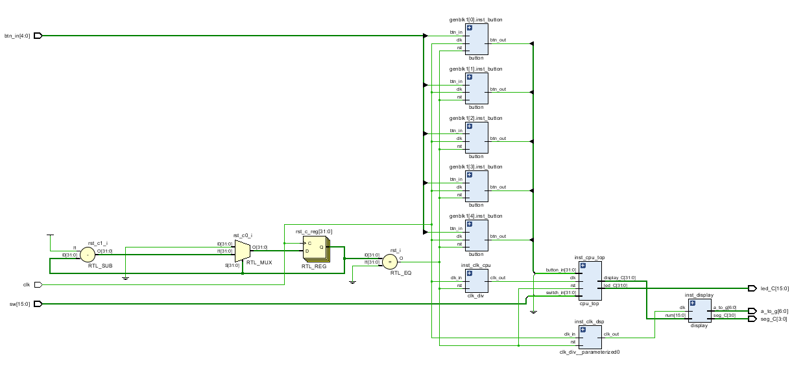

# 5级流水线CPU

[toc]

## 一、实验目的

1. 熟悉流水线CPU的设计与实现
2. 熟悉中断的处理流程
3. 熟悉硬件程序的设计与实现

## 二、实验要求

1. 在Vivado中设计并实现一个5级流水线CPU，能够运行mips指令集的子集
2. 能够处理中断请求，包括硬件中断与软件中断。
3. 实现开发板的烧录，使开发板能够运行冒泡排序程序，同时能够通过拨码开关输入数据，通过LED显示数据，通过按键进行数据的切换、排序、确认等操作。

## 三、实验内容

1. 设计并实现一个5级流水线CPU，能够运行mips指令集的子集
2. 编写硬件中断程序，将其转换为bin文件后导入到开发板中
3. 将导入了排序程序的CPU烧录到FPGA中，利用开发板上的按键控制CPU的运行，观察开发板输出的变化，验证设计的实践正确性

## 四、实验原理

5级流水线cpu与单周期cpu的区别主要在于流水线的划分，以及数据冒险的处理。同时，相较于我之前所写的单周期cpu，这次我还加入了中断处理的功能，并扩充了cpu的指令集。具体见下文。

## 五、实验过程与纪录

### 指令集

这次我设计的是一个5级流水线cpu，指令集仿用mips指令集，共计48条指令，如下：


其中比较特殊的包含1条空指令`nop`，12条自陷指令`teq`、`tne`、`tge`、`tgeu`、`tlt`、`tltu`、`teqi`、`tnei`、`tgei`、`tgeiu`、`tlti`、`tltiu`，两条协处理器指令`mfc0`、`mtc0`，以及系统调用`syscall`，中断返回`eret`。

### 项目结构

文件结构结构如下：


包含了硬件各个模块与cpu的电路设计图如下：



### 设计思路

设计图（由于接线比较复杂，这里只给出了模块与阶段之间的关系）：


与书上给出的示例一样，我同样将流水线分为`IF`、`ID`、`EX`、`MEM`、`WB`五个阶段


#### 1. IF阶段（instruction fetch）

这一阶段包含了三个模块：

- `pc` (program counter)
- `npc` (new program counter)
- `instruction_memory` (instruction memory)

其中`pc`模块用于存储if阶段的指令地址；`npc`模块实际是个能够进行简单计算的多选器，用于计算下一条指令的地址；`instruction_memory`模块用于存储指令。

#### 2. ID阶段（instruction decode）

id阶段包含了以下模块：

- `control` (control unit)
- `extend` (sign extend unit)
- `registe_file` (register file)
- `forwarding_unit` (forwarding unit)
- `stall_unit` (stall unit)
- `alu_src_mux` (ALU source mux)
- `forwarding_mux_A` (forwarding mux A)
- `forwarding_mux_B` (forwarding mux B)
- `reg_dst_mux` (register destination mux)
- `branch_judge` (branch judge unit)

`control`模块用于识别指令并以此产生相应的模块控制信号；
`extend`模块用于对指令的立即数进行扩展，由`control`单元给出扩展的类型；
`register_file`包含32个通用寄存器`gpr`，能够处理数据的读写；
`forwarding_unit`用于生成旁路选择控制信号，控制旁路选择器`forwarding_mux_A`和`forwarding_mux_B`，从而实现不同阶段数据间的旁路；
`stall_unit`用于生成阻塞信号；
`alu_src_mux`用于选择ALU的第二个输入数据；
`reg_dst_mux`用于选择写入数据的目的寄存器；
`branch_judge`用于判断分支跳转的条件。

另外需要提一下的是，协处理器`cp0`中数据的读出，也就是`mfc0`指令的阶段同样也被我放在了id阶段中处理。这样做的好处是能够将与协处理器相关的数据冒险并入到`fowarding_unit`与`stall_unit`中一并处理。具体可以查看配套的实现代码。

可见所涉及的模块比较多，这是由于我将分支与跳转判断提前到了id阶段。分支跳转判断的提前可以将分支延迟槽缩小至1，从而能够一定程度上提高流水线的效率。但由于分支判断的提前意味着id阶段与exe阶段、mem阶段、wb阶段之间会出现新的数据冒险，从而需要在id阶段引入额外的冒险处理单元。

id阶段的数据冒险判断条件如下：

**数据旁路**


**阻塞**


同时，这里给出部分指令所涉及到的控制信号（不包括中断指令与协处理器指令）：

```txt
/** R-Type **/
/*
    instruction | RegWrite | RegDst | RegSrc | ALUOp | ALUSrc | MemWrite | MemRead | Branch | Jump | NPCOp
    --------------------------------------------------------------------------------------------------------
    add         |    1     |   rd   |  ALU   |  ADD  |   0    |    0     |    0    |   0    |   0  | NEXT 
    addu        |    1     |   rd   |  ALU   |  ADD  |   0    |    0     |    0    |   0    |   0  | NEXT 
    sub         |    1     |   rd   |  ALU   |  SUB  |   0    |    0     |    0    |   0    |   0  | NEXT 
    subu        |    1     |   rd   |  ALU   |  SUB  |   0    |    0     |    0    |   0    |   0  | NEXT 
    slt         |    1     |   rd   |  ALU   |  SLT  |   0    |    0     |    0    |   0    |   0  | NEXT 
    sltu        |    1     |   rd   |  ALU   |  SLT  |   0    |    0     |    0    |   0    |   0  | NEXT 
    and         |    1     |   rd   |  ALU   |  AND  |   0    |    0     |    0    |   0    |   0  | NEXT 
    or          |    1     |   rd   |  ALU   |  OR   |   0    |    0     |    0    |   0    |   0  | NEXT 
    nor         |    1     |   rd   |  ALU   |  NOR  |   0    |    0     |    0    |   0    |   0  | NEXT 
    xor         |    1     |   rd   |  ALU   |  XOR  |   0    |    0     |    0    |   0    |   0  | NEXT 
    sll         |    1     |   rd   |  ALU   |  SLL  |   0    |    0     |    0    |   0    |   0  | NEXT 
    srl         |    1     |   rd   |  ALU   |  SRL  |   0    |    0     |    0    |   0    |   0  | NEXT 
    sra         |    1     |   rd   |  ALU   |  SRA  |   0    |    0     |    0    |   0    |   0  | NEXT 
    sllv        |    1     |   rd   |  ALU   |  SLLV |   0    |    0     |    0    |   0    |   0  | NEXT 
    srlv        |    1     |   rd   |  ALU   |  SRLV |   0    |    0     |    0    |   0    |   0  | NEXT 
    srav        |    1     |   rd   |  ALU   |  SRAV |   0    |    0     |    0    |   0    |   0  | NEXT 
    jr          |    0     |   x    |  x     |  x    |   0    |    0     |    0    |   0    |   0  |  RS 
    jalr        |    1     | 31($ra)|  PC+8  |  x    |   0    |    0     |    0    |   0    |   0  |  RS 
*/

/** I-Type **/
/*
    instruction | RegWrite | RegDst | RegSrc | ALUOp | ALUSrc | MemWrite | MemRead | Branch | Jump |    NPCOp    | ExtOp
    -----------------------------------------------------------------------------------------------------------------------
    addi        |    1     |   rt   |  ALU   |  ADD  |   1    |    0     |    0    |   0    |   0  |    NEXT     | SIGNED
    addiu       |    1     |   rt   |  ALU   |  ADD  |   1    |    0     |    0    |   0    |   0  |    NEXT     | SIGNED 
    sltiu       |    1     |   rt   |  ALU   |  SLT  |   1    |    0     |    0    |   0    |   0  |    NEXT     | SIGNED
    andi        |    1     |   rt   |  ALU   |  AND  |   1    |    0     |    0    |   0    |   0  |    NEXT     | UNSIGNED
    ori         |    1     |   rt   |  ALU   |  OR   |   1    |    0     |    0    |   0    |   0  |    NEXT     | UNSIGNED
    xori        |    1     |   rt   |  ALU   |  XOR  |   1    |    0     |    0    |   0    |   0  |    NEXT     | UNSIGNED
    lui         |    1     |   rt   |  ALU   |  ADD  |   1    |    0     |    0    |   0    |   0  |    NEXT     | SFT16
    lw          |    1     |   rt   |  MEM   |  ADD  |   1    |    0     |    1    |   0    |   0  |    NEXT     | UNSIGNED
    sw          |    0     |   x    |  MEM   |  ADD  |   1    |    1     |    0    |   0    |   0  |    NEXT     | UNSIGNED
    beq         |    0     |   x    |  x     |  x    |   0    |    0     |    0    |   1    |   0  | NEXT/OFFSET |   x
    bne         |    0     |   x    |  x     |  x    |   0    |    0     |    0    |   1    |   0  | NEXT/OFFSET |   x
*/

/** J-Type **/
/*
    instruction | RegWrite | RegDst | RegSrc | ALUOp | ALUSrc | MemWrite | MemRead | Branch | Jump | NPCOp 
    ---------------------------------------------------------------------------------------------------------
    j           |    0     |   x    |  x     |  x    |   0    |    0     |    0    |   0    |   1  | JUMP
    jal         |    1     | 31($ra)|  PC+8  |  x    |   0    |    0     |    0    |   0    |   1  | JUMP
*/
```


#### 3. EX阶段（execute）

exe阶段包含了以下模块：

- `alu` (algorithm logic unit)

exe阶段只有一个模块，即alu模块，用于进行算术逻辑运算。另外提一下，对于某些不需要使用alu模块进行数据计算的指令，其数据同样需要经过alu模块，不做任何处理，最终以alu模块的输出作为数据的输出。这样做的好处是提高指令处理的一致性，从而能够减少数据冒险处理的复杂度。


#### 4. MEM阶段（memory）

mem阶段包含了以下模块：

- `data_memory` (data memory)
- `io_memory` (io memory)

`data_memory`模块用于存储数据，同时也用于处理`lw`和`sw`指令；
`io_memory`模块中包含了与外设的直接接口，以及一部分缓存空间，如下：

| address | function |
| :-----: | :------: |
| 0       | display  |
| 1       | LED      |
| 2       | switch   |
| 3       | button   |
| 4 - ... | buffer   |

具体的实现可以查看配套代码。

我采用了统一编址的方式访问外设。这样做的好处是能将访存指令与io访问统一起来，从而使程序的执行显得更为自然。

同时，在mem阶段中，`cp0`将会完成对中断的处理，并且产生相应的中断信号，使cpu转到中断处理程序中执行。将中断处理固定在mem阶段能够便于实现cpu的精确异常，降低cpu的复杂度。


#### 5. WB阶段（write back）

wb阶段包含了以下模块：

- `reg_src_mux` (register source mux)

这个阶段涉及到了寄存器堆以及协处理器的数据写回。`reg_src_mux`模块用于选择写入寄存器的数据的来源。

#### 6. 流水线寄存器 (pipeline register)

流水线寄存器用于存储流水线各个阶段的数据，同时也用于控制流水线的数据传递。我使用4个流水线寄存器，分别为：

- `reg_if_id` (instruction fetch / instruction decode)
- `reg_id_ex` (instruction decode / execute)
- `reg_ex_mem` (execute / memory)
- `reg_mem_wb` (memory / write back)

对于指令的清空以及停顿实际上为控制信号控制流水线进行处理。


#### 7. 协处理器 0 (coprocessor 0)

cp0是一个比较特殊的模块，它主要用于处理异常、中断、系统调用等，也即是系统控制。

标准准的cp0包含32个辅助其工作的寄存器，我在这里给出我使用到的部分寄存器的功能：


**Count (id 9)**


`Count`寄存器用于存储当前的时钟周期数，可读可写，通常配合`Compare`寄存器使用，用于实现定时器。


**Compare (id 11)**


`Compare`寄存器用于存储定时器的比较值，可读可写，通常配合`Count`寄存器使用，用于实现定时器。当`Count`寄存器的值与`Compare`寄存器的值相等时，将会产生时钟中断信号，这个中断会一直保持，直到有新的值写入`Compare`寄存器。


**Status (id 12)**


`Status`寄存器用于存储cpu的状态，可读可写，其中包含了一些控制cpu运行的控制位，如下：

- `CU3` - `CU0`：用于控制协处理器的使能，由于我只使用了`cp0`，因此只需要将`CU0`置为1即可
- `IM7` - `IM0`：（interrupt mask），0表示屏蔽中断，1表示允许中断。其中`IM7` - `IM2`用于控制硬件中断，`IM1` - `IM0`用于控制软件中断。中断能否被处理器相应是由`Status`寄存器与`Cause`寄存器共同决定的，唯有当`Status`寄存器中的 `IM`位与`Cause`寄存器中的`IP`位同时为1时，相应中断才会被处理器相应。
- `UM`：（user mode），0表示内核态，1表示用户态。我在本次实现中没有区分内核态与用户态，因此将`UM`置为0即可。
- `EXL`：（exception level），0表示正常运行，1表示异常处理。当`EXL`为1时，cpu将会跳转到异常处理程序中执行，同时处理器将进入内核模式，直到异常处理程序执行完毕，`EXL`才会被清零。
- `IE`：（interrupt enable），表示能否相应中断。


**Cause (id 13)**


`Cause`寄存器主要纪录最近一次异常的类型，同时也控制软件的中断请求。

- `BD`：（branch delay），0表示异常发生在分支延迟槽中，1表示异常发生在分支延迟槽之外。
- `IP7` - `IP0`：（interrupt pending），0表示无中断请求，1表示有中断请求。其中`IP7` - `IP2`用于控制硬件中断，`IP1` - `IP0`用于控制软件中断。中断能否被处理器相应是由`Status`寄存器与`Cause`寄存器共同决定的，唯有当`Status`寄存器中的 `IM`位与`Cause`寄存器中的`IP`位同时为1时，相应中断才会被处理器相应。
- `ExcCode`：（exception code），用于纪录最近一次异常的类型，我的实现如下：


**EPC (id 14)**

`EPC`寄存器用于存储最近一次异常的指令地址，可读可写。


**Config (id 16)**


`Config`寄存器用于存储cpu的配置信息。

#### 8. 硬件中断程序

为了实现本次实验的要求，我需要实现以下6个硬件中断程序：

- `timer int`：定时器中断，用于显示数据的刷新
- `sort int`：当“排序”的按钮被按下时，将处理的数据进行排序
- `confirm int`：当“确认”按钮被按下时，将当前拨码开关的数据写入缓存区
- `switch int`：当“切换”按钮被按下时，转换显示的数据（当前拨码开关的数据/缓存区的数据）
- `nxt int`：当“下一个”的按钮被按下时，将处理的数据转向下一个
- `pre int`：当“上一个”的按钮被按下时，将处理的数据转向上一个

程序对应的mips汇编代码如下：

**timer int**


**sort int**


**confirm int**


**switch int**


**nxt int**


**pre int**


#### 9. 仿真

测式数据冒险：


测试lst中断：


测试nxt中断：


测试sort中断：


从测试结果可以看出，中断处理程序能够正常执行，且能够正确处理中断请求。

#### 10. 开发板烧录

烧录后的效果如下：


显示正常，中断处理正常，能够正常处理中断请求，实现数据的输入、显示、排序、切换等功能。

至此，本次实验完成。

## 六、实验总结

这是一次十分有意义且有趣的实验。通过本次实验我对流水线型的cpu有了更深入的了解，同时也对中断的处理有了更深入的认识。同时，本次实验也让我对硬件程序的设计与实现有了更深入的认识。希望这几次实验的积累能够运用到我以后的开发中。