# Vivado 实验：单周期CPU设计实验

[TOC]

## 一、实验目的

1. 熟悉单周期CPU的运行流程以及设计原理
2. 熟悉使用Vivado进行数字电路设计的流程 

## 二、实验要求

1. 在Vivado中设计单周期CPU
2. 利用设计的单周期CPU运行冒泡排序程序，并将其烧到FPGA开发板中，运行验证其正确性

## 三、实验内容

1. 使用Verilog等HDL语言在Vivado中设计单周期CPU
2. 编写冒泡排序的汇编程序，将其导出为bin文件并导入CPU中执行，在Vivado中进行仿真，观察仿真波形，验证设计的理论正确性
3. 将导入了排序程序的CPU烧录到FPGA中，利用开发板上的按键控制CPU的运行，观察开发板输出的变化，验证设计的实践正确性

## 四、实验原理

单周期CPU（Single Cycle CPU）即一种能够在一个时钟周期内完成一台指令的执行的CPU。CPU本质上是一个数字逻辑电路，若使用Verilog，则只需将所设计的逻辑电路中的各个逻辑部件用Verilog语言以模块设计的方式描述出来，并最后将其组合即可。

## 五、实验过程与纪录

### **指令集**

为了能够满足本次实验的要求，我将在MIPS核心指令集的基础上增加一部分指令，最终的指令集如下：

| instruction | format | opcode | funct | operation |
| ----------- | ------ | ------ | ----- | --------- |
| add         | R      | 000000 | 100000| R[rd] = R[rs] + R[rt] |
| subu        | R      | 000000 | 100011| R[rd] = R[rs] - R[rt] |
| and         | R      | 000000 | 100100| R[rd] = R[rs] & R[rt] |
| or          | R      | 000000 | 100101| R[rd] = R[rs] \| R[rt] |
| nor         | R      | 000000 | 100111| R[rd] = ~(R[rs] \| R[rt]) |
| slt         | R      | 000000 | 101010| R[rd] = (R[rs] < R[rt]) ? 1 : 0 |
| sll         | R      | 000000 | 000000| R[rd] = R[rt] << shamt |
| addiu       | I      | 001001 |       | R[rt] = R[rs] + imm |
| lui         | I      | 001111 |       | R[rt] = {imm, 16'b0} |
| lw          | I      | 100011 |       | R[rt] = MEM[R[rs] + SignExtImm] |
| sw          | I      | 101011 |       | MEM[R[rs] + SignExtImm] = R[rt] |
| beq         | I      | 000100 |       | if (R[rs] == R[rt]) PC = PC + 4 + BranchAddr |
| j           | J      | 000010 |       | PC = JumpAddr |
| halt        | /      | 111111 |       | CPU halt |
| nop         | /      |        |       | no operation |
| syscall     | /      |        |       | system call |

特别的，对于`syscall`指令：

| v0 | operation |
| -- | --------- |
| 1  | output integer from R[a0] |
| 2  | input  integer from R[a0] |

以上总计16条指令，所有指令的长度均为32位，其中指令格式如下：

- R-Type指令格式 
> opcode(6) rs(5) rt(5) rd(5) shamt(5) funct(6)
- I-Type指令格式
> opcode(6) rs(5) rt(5) imm(16)
- J-Type指令格式
> opcode(6) addr(26)
- Halt指令格式
> opcode = 111111
- Syscall指令格式
> 32'h0000_000c
- Nop指令格式
> 32'h0000_0000

### **项目目录**

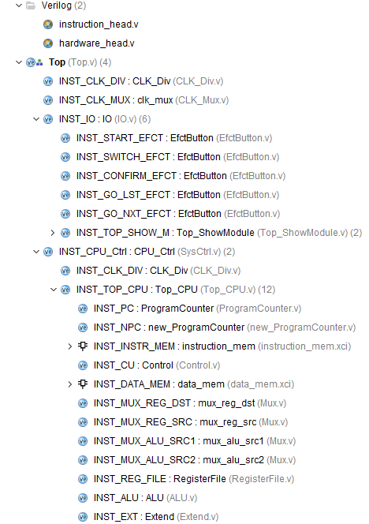

### **CPU电路设计**

由于本次设计主要仿用MIPS指令，因此在电路设计上可以直接仿用MIPS核心指令集单周期实现中的使用的电路设计，如下图：

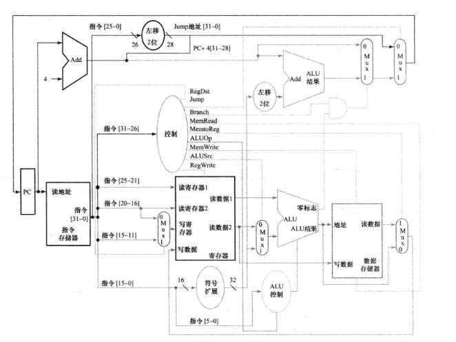

 
### **CPU模块设计**

- **指令头文件**

为了方便后续的模块设计，此处先给出一个指令头文件，其中包含了一些指令的常量定义，如下：

```verilog

// Insturction Memory Capacity
`define IM_LENGTH           255
// Data Memory Capacity
`define DM_LENGTH           255 
// 32 digits of 0
`define INITIAL_VAL         32'h00000000

// R-Type instructions
`define INST_R_TYPE         6'b000000 // R-Type opcode, decode via function code
`define FUNC_ADD            6'b100000 // ADD func code 0/20H
`define FUNC_SUBU           6'b100011 // SUBU func code 0/23H
`define FUNC_AND            6'b100100 // AND func code 0/24H
`define FUNC_OR             6'b100101 // OR func code 0/25H
`define FUNC_NOR            6'b100111 // NOR func code 0/27H
`define FUNC_SLT            6'b101010 // SLT func code 0/2AH
`define FUNC_SLL            6'b000000 // SLL func code 0/00H

// I-Type instructions
`define INST_LUI            6'b001111 // LUI 0FH
`define INST_ADDIU          6'b001001 // ADDIU 9H
`define INST_LW             6'b100011 // LW 23H
`define INST_SW             6'b101011 // SW 2BH
`define INST_BEQ            6'b000100 // BEQ 4H

// J-Type instructions
`define INST_J              6'b000010 // J 2H

// Halt instruction
`define INST_HALT           6'b111111 // HALT 3FH

// System call
`define INST_SYSCALL        6'b001100 // SYSCALL 0CH
`define SYS_OP_LENGTH       2         // Bits of signal SysOp
`define SYSCALL_OUTPUT_INT  2'b01     // Print integer
`define SYSCALL_INPUT_INT   2'b10     // Input integer

// No operation
`define INST_NOP            6'b000000 // NOP 0H

// ALU Control Signals
`define ALU_CTRL_LENGTH     4 // Bits of signal ALUOp
`define ALU_CTRL_DEFAULT    4'b0010 // ALUOp default value
`define ALU_CTRL_AND        4'b0000 // ALUOp AND
`define ALU_CTRL_OR         4'b0001 // ALUOp OR
`define ALU_CTRL_ADD        4'b0010 // ALUOp ADD
`define ALU_CTRL_SUB        4'b0110 // ALUOp SUB
`define ALU_CTRL_SLT        4'b0111 // ALUOp SLT
`define ALU_CTRL_NOR        4'b1100 // ALUOp NOR
`define ALU_CTRL_SHIFT_L     4'b1000 // ALUOp Shift Left

// RegDst Control Signals
`define REG_DST_RT          1'b0 // Register write destination: rt
`define REG_DST_RD          1'b1 // Register write destination: rd

// ALUSrc Control Signals
`define ALU_SRC_REG         1'b0 // ALU source: register file
`define ALU_SRC_IMM         1'b1 // ALU Source: immediate
`define ALU_SRC_SHIFT       1'b1 // ALU Source: shift command
    
// RegSrc Control Signals
`define REG_SRC_LENGTH      2 // Bits of signal RegSrc
`define REG_SRC_DEFAULT     2'b00 // Register default value
`define REG_SRC_ALU         2'b01 // Register write source: ALU
`define REG_SRC_MEM         2'b10 // Register write source: Data Memory
`define REG_SRC_IMM         2'b11 // Register write source: Extended immediate

// ExtOp Control Signals
`define EXT_OP_LENGTH       2 // Bits of Signal ExtOp
`define EXT_OP_DEFAULT      2'b00 // ExtOp default value
`define EXT_OP_SFT16        2'b01 // LUI: Shift Left 16
`define EXT_OP_SIGNED       2'b10 // `imm16` signed extended to 32 bit
`define EXT_OP_UNSIGNED     2'b11 // `imm16` unsigned extended to 32 bit

// NPCOp Control Signals
`define NPC_OP_LENGTH       3 // Bits of NPCOp
`define NPC_OP_DEFAULT      3'b000 // NPCOp default value
`define NPC_OP_NEXT         3'b001 // Next instruction: normal
`define NPC_OP_JUMP         3'b010 // Next instruction: J
`define NPC_OP_OFFSET       3'b011 // Next instruction: BEQ
`define NPC_OP_HALT         3'b100 // Next instruction: HALT
```

接下来将使用Verilog语言对上述电路进行模块化设计：


- **程序计数器（Program Counter）**

该部件我将使用两个模块进行实现:

1. ProgramCounter.v

该模块定义了PC的基本接口以及其在CPU中的时序逻辑，如下：

```verilog
module ProgramCounter(
    input wire          clk,
    input wire          rst, // reset signal
    input wire [31:0]   npc,

    output reg [31:0]   pc
    );

    initial begin
        pc <= `INITIAL_VAL;
    end

    always @(posedge clk or negedge rst)
    begin 
        if (!rst)
            pc <= `INITIAL_VAL;
        else
            pc <= npc;
    end
endmodule
```

2. new_ProgramCounter.v

该模块用于生成PC的下一个值，其实际本应为多个MUX等部件的组合，但为了避免代码变得零散，此处直接将其整合：

```verilog
module new_ProgramCounter(
    input wire [`NPC_OP_LENGTH-1 : 0]   npc_op,     // NPCOp control signal

    input wire [31:0]                   pc,         // Program counter
    input wire [15:0]                   imm16,      // 16 bit immediate
    input wire [25:0]                   imm26,      // 26 bit immediate

    output reg [31:0]                   npc         // Next program counter
    );

    wire [31:0]                         pc_4;
    assign pc_4 = pc + 32'h4;

    always @ (*) begin
        case (npc_op)
            `NPC_OP_NEXT:                           // Basic next instruction: pc+4
                npc <= pc_4;
            `NPC_OP_JUMP:                           // Jump to offset: J
                npc <= {pc[31:28], imm26, 2'b00};
            `NPC_OP_OFFSET:                         // PC+4+offset: BEQ
                npc <= {pc_4 + {{14{imm16[15]}}, {imm16, 2'b00}}};
            `NPC_OP_HALT:
                npc <= pc;                          // Halt
            default:
                npc <= pc_4;                        // Default
        endcase
    end
endmodule
```

上述两段代码都比较容易理解，这里只提一些关键的点：不难看出`pc`在每个`clk`的上升沿到来时进行更新，在`rst`的下降沿到来时进行初始化复位（也即`rst`信号常态应为高电平）。新地址生成中的选择将由`npc_op`信号控制，其将由控制器生成，后续将会介绍。`halt`指令的实现中，`pc`的值将会保持不变，当然，通过这样的实现CPU并不会真正的停止，而是会一直执行`halt`指令，真正的“停机”会在后续进行介绍。其余的指令同MIPS指令实现一致，不再赘述。


- **指令存储器（Instruction Memory）**

该部件用于取出指令存储器中的指令，其实现如下：

```verilog
module InstructionMemory(
    // address for instruction
    input wire [31:0]   pc_addr,

    output wire [31:0]  instruction
    );

    reg [7:0]           im[`IM_LENGTH:0]; 

    assign instruction[31:24]   = im[pc_addr];
    assign instruction[23:16]   = im[pc_addr+1];
    assign instruction[15:8]    = im[pc_addr+2];
    assign instruction[7:0]     = im[pc_addr+3];
endmodule
```

该模块逻辑非常简单，其输入一个32位的地址，并从指令存储器中取出4个字节的指令，将其拼接为一个32位的指令并输出。

但由于最后需要将程序烧录到FPGA中，因此为了便于IM的初始化，此处使用IP核进行实现，如下图：

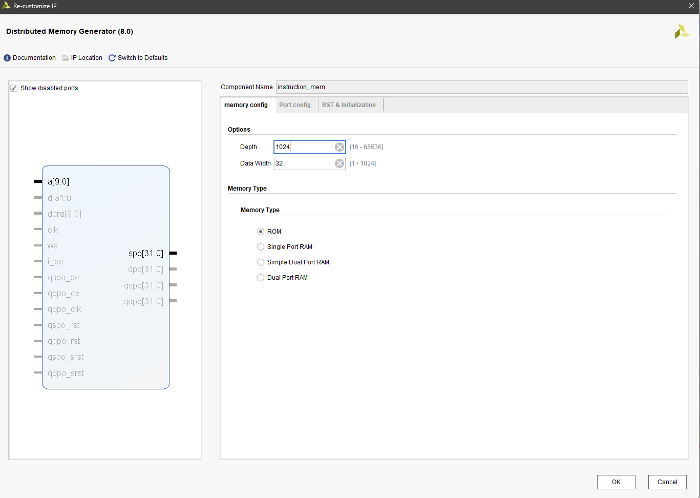

初始化使用的coe文件将会在后续给出。


- **寄存器堆（Register File）**

```verilog
module RegisterFile(

    input wire          syscall,
    output wire[31:0]   sys_out,

    input wire          clk,
    input wire          reg_write,          // "Register Write" signal

    input wire[4:0]     read_reg1_addr,     // Register rs address
    input wire[4:0]     read_reg2_addr,     // Register rt address
    input wire[4:0]     write_reg_addr,     // "Write" target register address
    input wire[31:0]    write_data,         // "Write" target register data

    output wire [31:0]  reg1_data,          // Register rs data
    output wire [31:0]  reg2_data,          // Register rt data

    output wire [`SYS_OP_LENGTH - 1:0] sys_op, // System operation signal

    output wire[7:0]    debug_reg_single    // Debug signal
    );

    // General purpose register
    reg [31:0]          gpr[31:0];

    integer i;
    initial begin
        for (i = 0; i < 32; i = i + 1) gpr[i] = 0;
    end

    // System operation signal
    assign sys_op  = gpr[2][`SYS_OP_LENGTH - 1:0]; // $v0
    assign sys_out = (syscall && (sys_op == `SYSCALL_OUTPUT_INT)) ? gpr[4] : 32'h0; // $a0

    // Debug signal output 
    assign debug_reg_single = gpr[4][7:0];

    assign reg1_data        = (read_reg1_addr == 0) ? `INITIAL_VAL : gpr[read_reg1_addr];
    assign reg2_data        = (read_reg2_addr == 0) ? `INITIAL_VAL : gpr[read_reg2_addr];

    always @ (posedge clk) begin
        if (reg_write && (write_reg_addr != 0)) begin
            // write data to register
            gpr[write_reg_addr] <= write_data;
        end
    end
endmodule
```

输入部分：

`clk`        : 时钟信号
`reg_write`  : 寄存器写使能信号
`read_reg1_addr` : 读取寄存器1的编号，5位，可编码32个寄存器
`read_reg2_addr` ：同上一条
`write_reg_addr` ：写入寄存器的编号，5位，可编码32个寄存器，需要注意，`$zero`寄存器被定义为永远为0，其值将不会被改变
`write_data` ：写入寄存器的数据，32位

输出部分：

`reg1_data` ：寄存器1的数据
`reg2_data` ：寄存器2的数据
`sys_op`    ：系统调用信号，2位，用于区分系统调用的类型，其值为`$v0`寄存器的低2位
`sys_out`   ：系统调用输出的数据，32位，当检测为syscall指令输出功能时，其值为`$a0`寄存器的值

debug部分：

`debug_reg_single` ：用于调试的信号，8位，其值为`$a0`寄存器的低8位

寄存器部分：

`gpr` ：32个32位的通用寄存器，其编号为0-31，其中`$zero`寄存器的编号为0，其值永远为0，不可被改变，所有的寄存器都被初始化为0

gpr编号如下：

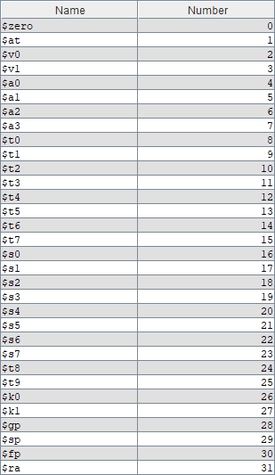

寄存器的读写：

寄存器的读不需要时钟信号，但写需要由时钟信号clk的上升沿进行触发，当`reg_write`信号为高电平时，将会进行写操作，写入的寄存器编号为`write_reg_addr`，写入的数据为`write_data`，当`write_reg_addr`为0时，写入操作将会被忽略。

需要注意的是，在本设计中，寄存器的值的写入实际上是在该指令时钟周期的下一个上升沿中执行的，这样做的好处主要有两个：一是可以避免对同一寄存器的同时读与写，二是可以保证其最终写入时其余部件的值已经被更新完毕，保证最终写入寄存器的值的正确性。其后的数据存储器的设计也同理，在之后将不再赘述。


- **算术逻辑单元（Arithmetic logical unit (ALU)）**

该模块用于进行算术逻辑运算，其实现如下：

```verilog

module ALU(

    input [`ALU_CTRL_LENGTH - 1:0] alu_ctrl,   // ALU control signal

    input [31:0]                   alu_input1, // ALU first input
    input [31:0]                   alu_input2, // ALU second input

    output wire [31:0]             alu_result, // ALU result
    output wire                    zero        // Whether result == 0, to determine BEQ
    );

    reg [32:0]                     alu_reg;

    assign alu_result = alu_reg[31:0];

    // Whether ALU result is zero
    assign zero       = (alu_reg == 0) ? 1'b1 : 1'b0;

    always @(*) begin 
        case (alu_ctrl)
            `ALU_CTRL_ADD:
                alu_reg <= {alu_input1[31], alu_input1} + {alu_input2[31], alu_input2};
            `ALU_CTRL_SUB:
                alu_reg <= {alu_input1[31], alu_input1} - {alu_input2[31], alu_input2};
            `ALU_CTRL_AND:
                alu_reg <= alu_input1 & alu_input2;
            `ALU_CTRL_OR:
                alu_reg <= alu_input1 | alu_input2;
            `ALU_CTRL_NOR:
                alu_reg <= ~(alu_input1 | alu_input2);
            `ALU_CTRL_SLT:
                alu_reg <= (alu_input1 < alu_input2) ? 1 : 0;
            `ALU_CTRL_SHIFT_L:
                alu_reg <= (alu_input1 << alu_input2[10:6]);
            default:
                alu_reg <= {alu_input2[31], alu_input2};
        endcase
    end
endmodule
```

该模块重点介绍两个部分：

`alu_ctrl` ：ALU控制信号，4位，用于控制ALU的运算类型，其值将由控制器生成
`zero`     : 用于判断运算结果是否为0，其会被用来判断BEQ指令的跳转条件，见后续Mux部分


- **数据存储器（Data Memory）**

该模块用于数据的存取与读写，其实现如下：

```verilog
module DataMemory(
    input wire          clk,
    input wire          mem_write, // Data memory write signal: MemWrite

    input wire[31:0]    mem_addr, // Data memory target address
    input wire[31:0]    write_mem_data, // Data: write to data memory

    output wire[31:0]   read_mem_data // Data: read from data memory
    );

    // Data Memory Storage
    reg[31:0]           dm[`DM_LENGTH:0];
    assign read_mem_data = dm[mem_addr];

    always @(posedge clk) begin
        if (mem_write) begin
            dm[mem_addr] <= write_mem_data;
        end    
    end
endmodule
```

数据存储器的读写特点在寄存器堆中已经介绍过，具体可以参考上述部分。

同样的，为了方便烧板时的初始化，此处使用IP核进行实现，如下图：

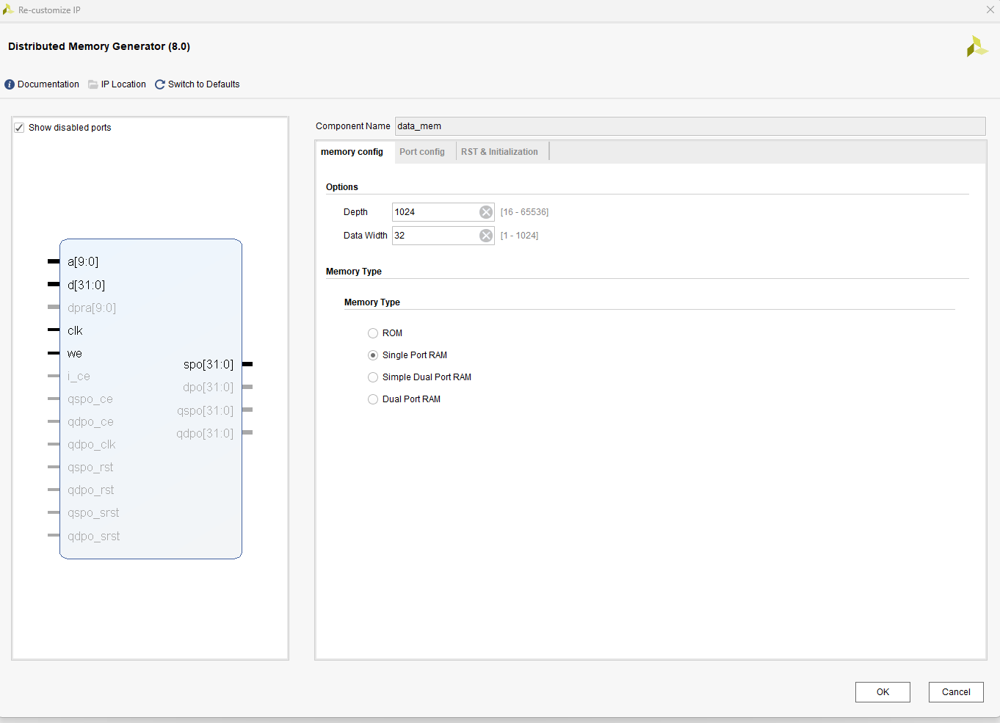


- **控制器（Controller）**

该模块用于生成CPU的控制信号，受益于Verilog逻辑实现的便利性，每条指令的控制信号可简单的通过判断语句进行生成。

其实现如下：

```verilog
module Control(

    output wire                         syscall,
    input wire[`SYS_OP_LENGTH - 1:0]    sys_op, // System operation signal

    input wire[5:0] opcode,     // Instruction opcode
    input wire[5:0] func,       // R-Type instruction function
    input wire      zero,       // For instruction BEQ, determine the result of rs - rt

    // Control signals 
    output wire[`ALU_CTRL_LENGTH - 1:0] alu_ctrl,
    output wire                         reg_dst,
    output wire                         reg_write,
    output wire                         alu_src1,
    output wire                         alu_src2,
    output wire                         mem_write,
    output wire[`REG_SRC_LENGTH - 1:0]  reg_src,
    output wire[`EXT_OP_LENGTH  - 1:0]  ext_op, 
    output wire[`NPC_OP_LENGTH  - 1:0]  npc_op,

    output wire                         halt
    );

    // R-type 
    wire type_r, add, subu, _and, _or, _nor, slt, sll;
    // I-type
    wire lui, addiu, lw, sw, beq;
    // J-type
    wire j;

    // Whether instruction is R-Type 
    assign type_r   = (opcode == `INST_R_TYPE && func != `INST_SYSCALL) ? 1 : 0;
    // R-type instructions
    assign add      = (type_r && func == `FUNC_ADD) ? 1 : 0;
    assign subu     = (type_r && func == `FUNC_SUBU) ? 1 : 0;
    assign _and     = (type_r && func == `FUNC_AND) ? 1 : 0;
    assign _or      = (type_r && func == `FUNC_OR) ? 1 : 0;
    assign _nor     = (type_r && func == `FUNC_NOR) ? 1 : 0;
    assign slt      = (type_r && func == `FUNC_SLT) ? 1 : 0;
    assign sll      = (type_r && func == `FUNC_SLL) ? 1 : 0;

    // I-type instructions
    assign lui      = (opcode == `INST_LUI) ? 1 : 0;
    assign addiu    = (opcode == `INST_ADDIU) ? 1 : 0;
    assign lw       = (opcode == `INST_LW) ? 1 : 0;
    assign sw       = (opcode == `INST_SW) ? 1 : 0;
    assign beq      = (opcode == `INST_BEQ) ? 1 : 0;

    // J-type instructions
    assign j        = (opcode == `INST_J) ? 1 : 0;

    // Halt instruction
    assign halt     = (opcode == `INST_HALT) ? 1 : 0;

    // System call
    assign syscall  = (func == `INST_SYSCALL) ? 1 : 0;

    // Determine control signals
    assign alu_ctrl =   (add || addiu || lw || sw)  ? `ALU_CTRL_ADD :    // Addition in ALU
                        (subu || beq)               ? `ALU_CTRL_SUB :    // Subtraction in ALU
                        (_and)                      ? `ALU_CTRL_AND :    // Bitwise AND in ALU
                        (_or)                       ? `ALU_CTRL_OR :     // Bitwise OR in ALU
                        (_nor)                      ? `ALU_CTRL_NOR :    // Bitwise NOR in ALU
                        (slt)                       ? `ALU_CTRL_SLT :    // Set less than in ALU
                        (sll)                       ? `ALU_CTRL_SHIFT_L: // Shift left in ALU 
                                                      `ALU_CTRL_DEFAULT; // Default ALU operand (output the second ALU input)

    // RegDst signal
    assign reg_dst  =   (add || subu || _and || _or || _nor || slt || sll) ? 1 : 0;
    // ALUSrc1 signal
    assign alu_src1 =   (sll) ? 1 : 0;
    // ALUSrc2 signal
    assign alu_src2 =   (addiu || lw || sw || sll) ? 1 : 0;

    // Write signals
    assign reg_write =  ( lui || type_r || add  || subu || 
                         _and ||   _or  || _nor ||  slt || 
                        addiu ||   lw   ||
                        (syscall && (sys_op == `SYSCALL_INPUT_INT))) ? 1 : 0;

    assign mem_write =  (sw) ? 1 : 0;

    assign reg_src   =  (lui)                          ? `REG_SRC_IMM :    // Source: Extended immediate
                        (addiu || add || subu || _and 
                        || _or || _nor || slt || sll)  ? `REG_SRC_ALU :    // Source: ALU result
                        (lw)                           ? `REG_SRC_MEM :
                                                         `REG_SRC_DEFAULT; // Source: Data memory

    assign ext_op    =  (lui)       ? `EXT_OP_SFT16 :       // Extend module operation: shift left 16
                        (addiu)     ? `EXT_OP_SIGNED :      // Extend module operation: signed extend
                        (lw || sw)  ? `EXT_OP_UNSIGNED :    // Extend module operation: unsigned extend
                                      `EXT_OP_DEFAULT;      // Extend module operation: default operation (unsigned extend)

    assign npc_op    =  (j)             ? `NPC_OP_JUMP :    // Jump
                        (beq && zero)   ? `NPC_OP_OFFSET :  // Branch equal
                        (beq && ~zero)  ? `NPC_OP_DEFAULT : // Branch not equal
                        (halt)          ? `NPC_OP_HALT :    // Halt
                                          `NPC_OP_NEXT;     // Next instruction: normal
endmodule
```

控制信号依据指令的opcode与func部分进行判断（每条指令的opcode与func可见前述指令表），输出信号如下：

`alu_ctrl`  ：ALU控制信号，4位，用于控制ALU的运算类型
`reg_dst`   ：寄存器写入目标信号，1位，用于控制寄存器写入的目标寄存器
`reg_write` ：寄存器写使能信号，1位，用于控制寄存器的写使能
`alu_src1`  ：ALU第一个输入信号，1位，用于控制ALU的第一个输入
`alu_src2`  ：ALU第二个输入信号，1位，用于控制ALU的第二个输入
`mem_write` ：数据存储器写使能信号，1位，用于控制数据存储器的写使能
`reg_src`   ：寄存器写入来源信号，2位，用于控制寄存器写入的来源
`ext_op`    ：扩展模块操作信号，2位，用于控制扩展模块的操作
`npc_op`    ：下一条指令地址生成信号，3位，用于控制下一条指令地址的生成

`syscall`   : 系统调用信号，1位，用于控制系统调用的发生

各控制信号具体值所对应的功能可见前述指令头文件。

需要注意的是，由于`syscall`指令的特殊性，其控制信号将会在`sys_op`信号的控制下产生


- **扩展模块（Extend）**

该模块用于对立即数进行扩展，其实现如下：

```verilog
module Extend(
    input wire[15:0]                 imm16,  // 16 bit immediate
    input wire[`EXT_OP_LENGTH - 1:0] ext_op, // ExtOp control signal
    
    output reg[31:0]                 ext_out // Extend module output
    );

    always @ (*) begin
        case (ext_op)
            `EXT_OP_SFT16:
                ext_out <= {imm16, 16'b0};           // LUI: 16 digit shift left
            `EXT_OP_SIGNED:
                ext_out <= {{16{imm16[15]}}, imm16}; // signed extend of immediate
            `EXT_OP_UNSIGNED:
                ext_out <= {16'b0, imm16};           // unsigned extend of immediate
            default:
                ext_out <= {16'b0, imm16};           // Default
        endcase
    end
endmodule
```

该模块的输入为16位的立即数`imm16`，其输出为32位的扩展后的立即数`ext_out`，其扩展方式由`ext_op`信号控制


- **多路选择器（Multiplexer）**

```verilog
module mux_reg_dst(
    input wire syscall,
    input wire[`SYS_OP_LENGTH - 1:0] sys_op,

    input wire      reg_dst,  // mux control signal: RegDst
    input wire[4:0] mux_in_0, // mux input source: rt
    input wire[4:0] mux_in_1, // mux input source: rd

    output reg[4:0] mux_out   // mux output
    );


    always @ (*) begin
        case (reg_dst)
            `REG_DST_RT:
                mux_out <= mux_in_0;
            `REG_DST_RD:
                mux_out <= mux_in_1;
        endcase
        if (syscall && (sys_op == `SYSCALL_INPUT_INT)) begin
            mux_out <= 5'b00100; // $a0
        end
    end
endmodule


module mux_reg_src(
    input wire syscall,        // syscall signal
    input wire[`SYS_OP_LENGTH - 1:0] sys_op, // system operation signal
    input wire[31:0] sys_in,   // system input data

    input wire[`REG_SRC_LENGTH - 1:0] reg_src, // mux control signal: RegSrc
    input wire[31:0] mux_in_0, // mux input source: ALU result
    input wire[31:0] mux_in_1, // mux input source: Data Memory
    input wire[31:0] mux_in_2, // mux input source: Extend module output

    output reg[31:0] mux_out   // mux output
    );

    always @ (*) begin
        case (reg_src)
            `REG_SRC_ALU:
                mux_out <= mux_in_0;
            `REG_SRC_MEM:
                mux_out <= mux_in_1;
            `REG_SRC_IMM:
                mux_out <= mux_in_2;
            default:
                mux_out <= mux_in_0;
        endcase

        if (syscall && (sys_op == `SYSCALL_INPUT_INT)) begin
            mux_out <= sys_in; // system input data
        end
    end
endmodule

module mux_alu_src1(
    input wire alu_src1,       // mux control signal: ALUSrc1
    input wire[31:0] mux_in_0, // mux input source: reg1 (rs) data
    input wire[31:0] mux_in_1, // mux input source: reg2 (rt) data

    output reg[31:0] mux_out   // mux output
    );

    always @(*) begin
        case (alu_src1)
            `ALU_SRC_SHIFT:
                mux_out <= mux_in_1;
            default:
                mux_out <= mux_in_0;
        endcase
    end
endmodule

module mux_alu_src2(
    input wire       alu_src2, // mux control signal: ALUSrc2
    input wire[31:0] mux_in_0, // mux input source: register file
    input wire[31:0] mux_in_1, // mux input source: immediate

    output reg[31:0] mux_out   // mux output
    );

    always @ (*) begin
        case (alu_src2)
            `ALU_SRC_REG:
                mux_out <= mux_in_0;
            `ALU_SRC_IMM:
                mux_out <= mux_in_1;
            default:
                mux_out <= mux_in_0;
        endcase
    end
endmodule
```

共计4个多路选择器：

`mux_reg_dst` ：寄存器写入目标选择器，其控制信号为`reg_dst`，输出为5位，用于控制寄存器写入的目标寄存器编号

`mux_reg_src` ：寄存器写入来源选择器，其控制信号为`reg_src`，输出为32位，用于控制寄存器写入的来源

`mux_alu_src1` ：ALU第一个输入选择器，其控制信号为`alu_src1`，输出为32位，用于控制ALU的第一个输入

`mux_alu_src2` ：ALU第二个输入选择器，其控制信号为`alu_src2`，输出为32位，用于控制ALU的第二个输入

需要注意的是，当`syscall`信号为高电平且`sys_op`指示为输入功能时，`mux_reg_src`将会选择`sys_in`作为输入，并且`mux_reg_dst`将会选择`$a0`寄存器作为写入目标寄存器


CPU的各个部件已经全部介绍完毕，接下来将会介绍CPU的顶层模块：

- **顶层模块（CPU）**

该模块用于将CPU的各个部件进行连接，以及部分调试信号的输出，其实现如下：

```verilog
module Top_CPU(
    input wire                          clk,
    input wire                          rst,     // reset signal

    output wire                         halt,    // halt signal
    output wire                         syscall, // syscall signal
    output wire [`SYS_OP_LENGTH - 1:0]  sys_op,  // syscall operation

    input wire [31:0]                   sys_inf_in,  // system input interface
    output wire [31:0]                  sys_inf_out, // system output interface

    // debug information
    output wire [7:0]                   debug_reg_single,
    output wire [5:0]                   debug_opcode,
    output wire [5:0]                   debug_func,
    output wire [7:0]                   debug_dm_single,
    output wire [9:0]                   debug_pc,
    output wire [7:0]                   debug_alu
    );


    // Instruction fetch moudle i/o
    wire [31:0]                         pc;
    wire [31:0]                         npc;
    wire [31:0]                         instruction;

    // Decode instruction type and function
    wire [5:0]                          opcode;
    wire [5:0]                          func;

    // Decode registers
    wire [4:0]                          rs;
    wire [4:0]                          rt;
    wire [4:0]                          rd;

    // Decode 16 bit and 26 bit immediates
    wire [15:0]                         imm16;
    wire [25:0]                         imm26;

    // Assign decoded instruction to variables
    assign opcode =                     instruction[31:26];
    assign func   =                     instruction[5:0];
    assign rs     =                     instruction[25:21];
    assign rt     =                     instruction[20:16];
    assign rd     =                     instruction[15:11];
    assign imm16  =                     instruction[15:0];
    assign imm26  =                     instruction[25:0];

    // MUX
    wire [4:0]                          reg_dst_out;
    wire [31:0]                         reg_src_out;
    wire [31:0]                         alu_src_out1;
    wire [31:0]                         alu_src_out2;

    // Data memory
    wire [31:0]                         read_mem_data;

    // Extend module
    wire [31:0]                         ext_out;

    // Register file
    wire [31:0]                         reg1_data;
    wire [31:0]                         reg2_data;

    // ALU
    wire [31:0]                         alu_result;

    // Control signals

    wire [`ALU_CTRL_LENGTH - 1:0]       alu_ctrl;
    wire reg_dst;
    wire reg_write;
    wire alu_src1;
    wire alu_src2;
    wire mem_write;
    wire [`REG_SRC_LENGTH - 1:0]        reg_src;
    wire [`EXT_OP_LENGTH - 1:0]         ext_op;
    wire [`NPC_OP_LENGTH - 1:0]         npc_op;
    wire zero;

    assign debug_opcode   = opcode;
    assign debug_func     = func;
    assign debug_dm_single = read_mem_data[7:0];
    assign debug_pc        = pc[9:0];
    assign debug_alu       = alu_result[7:0];

    // Instruction fetch module: PC, NPC, instruction
    ProgramCounter INST_PC(
        .clk(clk),
        .rst(rst),
        .npc(npc),
        .pc(pc));

    new_ProgramCounter INST_NPC(
        .npc_op(npc_op),
        .pc(pc),
        .imm16(imm16),
        .imm26(imm26),
        .npc(npc));


    // // simulate instruction memory
    // InstructionMemory INST_INSTR_MEM(
    //     .pc_addr(pc),
    //     .instruction(instruction));


    // IP catalog instruction memory
    instruction_mem INST_INSTR_MEM(
        .a(pc[11:2]),
        .spo(instruction));


    // Module: Control Unit
    Control INST_CU(
        .syscall(syscall),
        .sys_op(sys_op),
        .opcode(opcode),
        .func(func),
        .zero(zero),
        .alu_ctrl(alu_ctrl),
        .reg_write(reg_write),
        .reg_dst(reg_dst),
        .alu_src1(alu_src1),
        .alu_src2(alu_src2),
        .mem_write(mem_write),
        .reg_src(reg_src),  
        .ext_op(ext_op),
        .npc_op(npc_op),
        .halt(halt));


    // // Module: Data Memory
    // DataMemory INST_DATA_MEM(
    //     .clk(clk),
    //     .mem_write(mem_write),
    //     .mem_addr(alu_result),
    //     .write_mem_data(reg2_data),
    //     .read_mem_data(read_mem_data));

    // IP catalog data memory
    data_mem INST_DATA_MEM(
        .clk(clk),
        .a(alu_result[11:2]),
        .d(reg2_data),
        .we(mem_write),
        .spo(read_mem_data));


    // Module: Multiplexers
    mux_reg_dst INST_MUX_REG_DST(
        .syscall(syscall),
        .sys_op(sys_op),

        .reg_dst(reg_dst),
        .mux_in_0(rt),
        .mux_in_1(rd),
        .mux_out(reg_dst_out));

    mux_reg_src INST_MUX_REG_SRC(
        .syscall(syscall),
        .sys_op(sys_op),
        .sys_in(sys_inf_in),

        .reg_src(reg_src),
        .mux_in_0(alu_result),
        .mux_in_1(read_mem_data),
        .mux_in_2(ext_out),
        .mux_out(reg_src_out));

   mux_alu_src1 INST_MUX_ALU_SRC1(
        .alu_src1(alu_src1),
        .mux_in_0(reg1_data),
        .mux_in_1(reg2_data),
        .mux_out(alu_src_out1)); 

    mux_alu_src2 INST_MUX_ALU_SRC2(
        .alu_src2(alu_src2),
        .mux_in_0(reg2_data),
        .mux_in_1(ext_out),
        .mux_out(alu_src_out2));

    // Module: Register File
    RegisterFile INST_REG_FILE(
        .syscall(syscall),
        .sys_out(sys_inf_out),

        .clk(clk),
        .reg_write(reg_write),
        .read_reg1_addr(rs),
        .read_reg2_addr(rt),
        .write_reg_addr(reg_dst_out),
        .write_data(reg_src_out),
        .reg1_data(reg1_data),
        .reg2_data(reg2_data),
        .sys_op(sys_op),
        .debug_reg_single(debug_reg_single));

    // Module: ALU
    ALU INST_ALU(
        .alu_ctrl(alu_ctrl),
        .alu_input1(alu_src_out1),
        .alu_input2(alu_src_out2),
        .alu_result(alu_result),
        .zero(zero));
    
    // Module: Extend
    Extend INST_EXT(
        .ext_op(ext_op),
        .imm16(imm16),
        .ext_out(ext_out));
endmodule
```

CPU的部分到此已经介绍完毕，接下来将会介绍CPU与FPGA输入输出接口的设计。


### **FPGA接口模块设计**

这部分需要实现的主要有三个部分：

1. LED灯以及数码管的显示
2. 按键及拨码开关功能的实现
3. cpu与FPGA输入输出交互的实现

这里先从一些零散简单的部分开始介绍

- **FPGA BASYS3 Basic I/O**

在介绍下述模块之前，先给出FPGA BASYS3的基本输入输出接口，如下图：

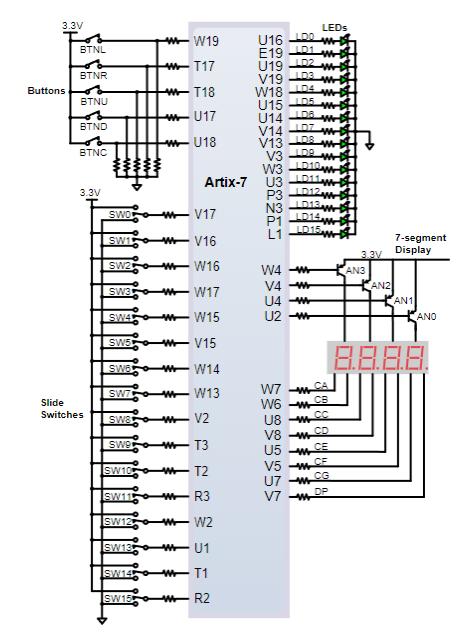

在本次实验中我将使用到所有的基础接口，以下先给出各接口功能及其对应开发板端口：

| input/output | name |
| :----: | :----: |
| input | clk_main |
| input | start |
| input | go_lst |
| input | go_nxt |
| input | switch |
| input | confirm |
| input | [`NUM_SIZE-1:0] cur_num |
| output | [`ARRAY_SIZE-1:0] cue_lgt |
| output | [`SEG_SIZE-1:0] seg |
| output | [6:0] a_to_g |

并定义数组变量: `array` : 用于作为暂存输入数据的缓冲区

`clk_main` : 主时钟信号，用于控制整个系统的运行
`start`    : 开始信号，开始排序（实际使用为~start作为cpu的复位信号，具体见后续）
`seg`, `a_to_g` : 数码管显示信号，用于控制数码管的显示
`cue_lgt`  : 用于控制LED灯的亮灭，其值为当前操作的`array`元素的下标
`go_lst`   : cur_index = (cur_index == 0) arr_size-1 : cur_index - 1 
`go_nxt`   : cur_index = (cur_index == arr_size-1) 0 : cur_index + 1
`switch`   : 功能切换开关，通常功能为：0：显示cur_num，1：显示array[cur_index]。（在后续我为其添加了切换显示调试信号的功能，具体可见最终顶层文件中的定义）
`confirm`  : 确认键：用于确认输入的数据，将`cur_num`写入`array[cur_index]`中

对应的FPGA端口如下：

```xdc
set_property PACKAGE_PIN W7 [get_ports {a_to_g[6]}]
set_property PACKAGE_PIN W6 [get_ports {a_to_g[5]}]
set_property PACKAGE_PIN U8 [get_ports {a_to_g[4]}]
set_property PACKAGE_PIN V8 [get_ports {a_to_g[3]}]
set_property PACKAGE_PIN U5 [get_ports {a_to_g[2]}]
set_property PACKAGE_PIN V5 [get_ports {a_to_g[1]}]
set_property PACKAGE_PIN U7 [get_ports {a_to_g[0]}]
set_property PACKAGE_PIN W4 [get_ports {seg[3]}]
set_property PACKAGE_PIN V4 [get_ports {seg[2]}]
set_property PACKAGE_PIN U4 [get_ports {seg[1]}]
set_property PACKAGE_PIN U2 [get_ports {seg[0]}]
set_property PACKAGE_PIN U16 [get_ports {cue_lgt[15]}]
set_property PACKAGE_PIN E19 [get_ports {cue_lgt[14]}]
set_property PACKAGE_PIN U19 [get_ports {cue_lgt[13]}]
set_property PACKAGE_PIN V19 [get_ports {cue_lgt[12]}]
set_property PACKAGE_PIN W18 [get_ports {cue_lgt[11]}]
set_property PACKAGE_PIN U15 [get_ports {cue_lgt[10]}]
set_property PACKAGE_PIN U14 [get_ports {cue_lgt[9]}]
set_property PACKAGE_PIN V14 [get_ports {cue_lgt[8]}]
set_property PACKAGE_PIN V13 [get_ports {cue_lgt[7]}]
set_property PACKAGE_PIN V3 [get_ports {cue_lgt[6]}]
set_property PACKAGE_PIN W3 [get_ports {cue_lgt[5]}]
set_property PACKAGE_PIN U3 [get_ports {cue_lgt[4]}]
set_property PACKAGE_PIN P3 [get_ports {cue_lgt[3]}]
set_property PACKAGE_PIN N3 [get_ports {cue_lgt[2]}]
set_property PACKAGE_PIN P1 [get_ports {cue_lgt[1]}]
set_property PACKAGE_PIN L1 [get_ports {cue_lgt[0]}]
set_property PACKAGE_PIN R2 [get_ports {cur_num[15]}]
set_property PACKAGE_PIN T1 [get_ports {cur_num[14]}]
set_property PACKAGE_PIN U1 [get_ports {cur_num[13]}]
set_property PACKAGE_PIN W2 [get_ports {cur_num[12]}]
set_property PACKAGE_PIN R3 [get_ports {cur_num[11]}]
set_property PACKAGE_PIN T2 [get_ports {cur_num[10]}]
set_property PACKAGE_PIN T3 [get_ports {cur_num[9]}]
set_property PACKAGE_PIN V2 [get_ports {cur_num[8]}]
set_property PACKAGE_PIN W13 [get_ports {cur_num[7]}]
set_property PACKAGE_PIN W14 [get_ports {cur_num[6]}]
set_property PACKAGE_PIN V15 [get_ports {cur_num[5]}]
set_property PACKAGE_PIN W15 [get_ports {cur_num[4]}]
set_property PACKAGE_PIN W17 [get_ports {cur_num[3]}]
set_property PACKAGE_PIN W16 [get_ports {cur_num[2]}]
set_property PACKAGE_PIN V16 [get_ports {cur_num[1]}]
set_property PACKAGE_PIN V17 [get_ports {cur_num[0]}]
set_property PACKAGE_PIN W5 [get_ports clk_main]
set_property PACKAGE_PIN U17 [get_ports confirm]
set_property PACKAGE_PIN W19 [get_ports go_lst]
set_property PACKAGE_PIN T17 [get_ports go_nxt]
set_property PACKAGE_PIN U18 [get_ports start]
set_property PACKAGE_PIN T18 [get_ports switch]
```

所有端口均采用`LVCMOS33`模式


- **硬件常量头文件**

同样的，为了方便后续的代码编写，这里先将一些常用的硬件常量进行宏定义，如下：

```verilog
`define CLK_MAIN_DELAY 16'hff
`define CLK_CPU_DELAY  16'hffff
`define BTN_EFCT_DELAY 32'd100_000
`define GO_BTN_DELAY   32'hffffff

`define ARRAY_SIZE 16
`define NUM_SIZE   16

// 7-segment display delay 
`define SEG_DELAY 16'hffff

// Segment Number
`define SEG_SIZE 4
`define SEG_1st  4'b0111
`define SEG_2nd  4'b1011
`define SEG_3rd  4'b1101
`define SEG_4th  4'b1110
`define SEG_DEF  4'b1111

// Segment Value
`define SEG_VAL_0    7'b0000001
`define SEG_VAL_1    7'b1001111
`define SEG_VAL_2    7'b0010010
`define SEG_VAL_3    7'b0000110
`define SEG_VAL_4    7'b1001100
`define SEG_VAL_5    7'b0100100
`define SEG_VAL_6    7'b0100000
`define SEG_VAL_7    7'b0001111
`define SEG_VAL_8    7'b0000000
`define SEG_VAL_9    7'b0000100
`define SEG_VAL_A    7'b0001000
`define SEG_VAL_B    7'b1100000
`define SEG_VAL_C    7'b0110001
`define SEG_VAL_D    7'b1000010
`define SEG_VAL_E    7'b0110000
`define SEG_VAL_F    7'b0111000
`define SEG_VAL_DEF  7'b1111111
```

这里主要定义了一些延时常量，以及数码管显示的常量等，后续将会用到。


- **时钟分频模块（clk divider）**

正如其名，该模块用于对时钟信号进行分频，其实现如下：

```verilog
module CLK_Div #(parameter N = 16'hffff) (
    input   wire    clk_in,
    output  wire    clk_out
    );

    reg [15:0]      cnt = 0;
    reg             out = 0;

    assign clk_out = out;

    always @(posedge clk_in) begin
        if (cnt == N) begin
            cnt <= 0;
            out <= ~out;
        end
        else begin
            cnt <= cnt + 1;
        end 
    end
endmodule
```


- **按钮消抖模块**

开发板上的按钮往往在按下时会产生抖动从而产生误触发或者多触发的情况，如图：

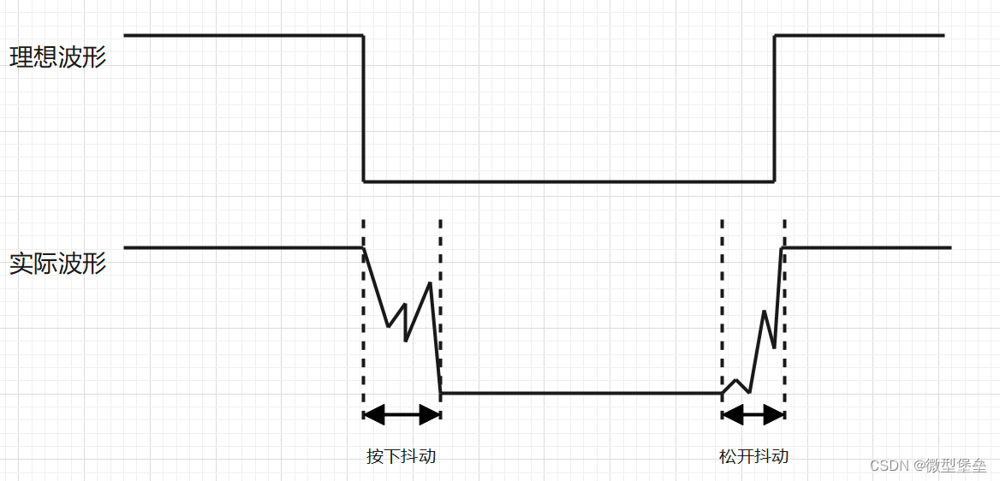

为了解决这个问题，这里使用一个简单的消抖模块对按钮进行消抖，其实现如下：

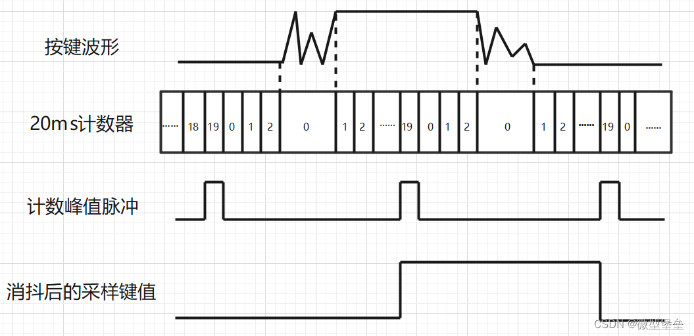

```verilog
module EfctButton #(N = `BTN_EFCT_DELAY) ( // effective button
    input wire clk,
    input wire btn,
    output reg efct_btn // 1: pressed, 0: not pressed
    );

    initial begin
        efct_btn = 0;
    end

    reg [31:0] cnt;
    always @(posedge clk) begin
        if (btn) begin
            cnt <= cnt + 1;
            if (cnt == N) begin
                cnt <= 0;
                efct_btn <= 1;
            end
        end else begin
            cnt <= 0;
            efct_btn <= 0;
        end
    end
endmodule
```


- **7段数码管显示模块**

该模块用于对数码管进行显示，其实现如下：

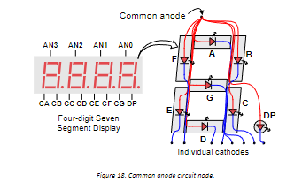

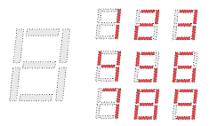

```verilog
module ShowNum(
    input wire          clk,
    input wire [6:0]    rst,
    input wire [`NUM_SIZE - 1:0]    num,
    output reg [`SEG_SIZE - 1:0]    seg,
    output reg [6:0]    a_to_g
    );

    initial begin
        seg    = `SEG_DEF;
        a_to_g = `SEG_VAL_DEF;
    end

    reg [1:0]           seg_num = 0;
    reg [3:0]           x = 0;

    always @ (posedge clk) begin
        case (seg_num)
            0: begin x = num[15:12]     ;    seg = `SEG_1st; end
            1: begin x = num[11:8]      ;    seg = `SEG_2nd; end
            2: begin x = num[7:4]       ;    seg = `SEG_3rd; end
            3: begin x = num[3:0]       ;    seg = `SEG_4th; end
        endcase
        seg_num <= (seg_num + 1) % `SEG_SIZE;
    end

    always @ (x or rst) begin
        case (x)
            0:  a_to_g = `SEG_VAL_0;
            1:  a_to_g = `SEG_VAL_1;
            2:  a_to_g = `SEG_VAL_2;
            3:  a_to_g = `SEG_VAL_3;
            4:  a_to_g = `SEG_VAL_4;
            5:  a_to_g = `SEG_VAL_5;
            6:  a_to_g = `SEG_VAL_6;
            7:  a_to_g = `SEG_VAL_7;
            8:  a_to_g = `SEG_VAL_8;
            9:  a_to_g = `SEG_VAL_9;
            10: a_to_g = `SEG_VAL_A;
            11: a_to_g = `SEG_VAL_B;
            12: a_to_g = `SEG_VAL_C;
            13: a_to_g = `SEG_VAL_D;
            14: a_to_g = `SEG_VAL_E;
            15: a_to_g = `SEG_VAL_F;
            default: a_to_g = `SEG_VAL_DEF;
        endcase
        if (rst) a_to_g = rst;
    end
endmodule
```

rst信号在此处用于实际进行板烧录后测试使用，此处可忽略


- **IO模块**

该模块主要对开发板输入进行简单处理，以及将需输出数据转化为开发板上的输出数据，可以将其看为IO部分的顶层模块，其实现如下：

```verilog
module IO(
    input wire       clk,

    input wire       start,
    input wire       switch,
    input wire       confirm,
    input wire       go_lst,
    input wire       go_nxt,

    input wire[`ARRAY_SIZE-1:0] cur_index,
    input wire[`NUM_SIZE-1:0]   show_num,

    input wire[6:0]  debug,

    output wire      start_efct,
    output wire      switch_efct,
    output wire      confirm_efct,
    output wire      go_lst_efct,
    output wire      go_nxt_efct,

    output reg [`ARRAY_SIZE-1:0] cue_lgt,
    output wire[`SEG_SIZE - 1:0] seg,
    output wire[6:0] a_to_g
    );

    initial begin
        cue_lgt   = 16'b0;
    end

    // cue_lgt shows the current index
    always @ (cur_index) begin
        cue_lgt            <= 16'b0;
        cue_lgt[cur_index] <= 1'b1;
    end

    EfctButton #(.N(32'd100_000)) INST_START_EFCT (
        .clk(clk),
        .btn(start),
        .efct_btn(start_efct));

    EfctButton #(.N(32'd100_000)) INST_SWITCH_EFCT (
        .clk(clk),
        .btn(switch),
        .efct_btn(switch_efct));

    EfctButton #(.N(32'd100_000)) INST_CONFIRM_EFCT (
        .clk(clk),
        .btn(confirm),
        .efct_btn(confirm_efct));

    EfctButton #(.N(32'd100_000)) INST_GO_LST_EFCT (
        .clk(clk),
        .btn(go_lst),
        .efct_btn(go_lst_efct));

    EfctButton #(.N(32'd100_000)) INST_GO_NXT_EFCT (
        .clk(clk),
        .btn(go_nxt),
        .efct_btn(go_nxt_efct));

    Top_ShowModule INST_TOP_SHOW_M(
        .clk(clk),
        .debug(debug),
        .num(show_num),
        .seg(seg),
        .a_to_g(a_to_g));

endmodule
```

- **CPU控制模块**

在PC模块中提到过`halt`指令的停机问题，这里将会对其进行解决。

CPU控制模块的主要功能为：控制CPU的启停。具体实现方式为将开发板的时钟信号经过控制逻辑的处理后再输入给CPU，从而达到控制CPU启停的效果。

控制CPU的启停目的有多个：在遇到`halt`、`syscall`中断信号、内部异常中断信号等时，能够令CPU停机，等候中断信号的处理，并在处理完毕后继续执行；在调试时，能够令CPU停机，以便于观察CPU的内部状态；方便对CPU进行单独降频，保证指令的正确执行等。

该模块的实现如下：

```verilog
module CPU_Ctrl(
    // signal: system -> cpu
    input wire clk,
    input wire rst,
    input wire start,
    input wire cpu_wake,   // wake signal from cpu
    input wire cpu_slep,   // sleep signal from cpu

    // input interface: system -> cpu
    input wire [31:0] sys_inf_in, // system input interface

    // signal: cpu -> system
    output reg cpu_stat,
    output reg sysc_mp, 
    output wire [`SYS_OP_LENGTH - 1:0] sys_op, // syscall operation from cpu

    // output interface: cpu -> system
    output wire[31:0] sys_inf_out, // system output interface

    // debug information: cpu -> system
    output wire [7:0] debug_reg_single,
    output wire [5:0] debug_opcode,
    output wire [5:0] debug_func,
    output wire [7:0] debug_dm_single,
    output wire [9:0] debug_pc,
    output wire [7:0] debug_alu,

    output wire halt    // halt signal from cpu
    );

    wire syscall; // syscall signal to cpu

    wire clk_div;
    wire clk_cpu;  // cpu clock
    assign clk_cpu = (cpu_stat) ? clk_div : 0;

    initial begin
        cpu_stat = 0;
        sysc_mp = 0;
    end

    // change the syscall signal to a mono pulse signal
    reg syc_flg = 1;
    always @ (posedge clk) begin
        if (!syscall) begin 
            syc_flg <= 1;
            sysc_mp <= 0;
        end else begin
            if (syc_flg) begin
                sysc_mp <= 1;
                syc_flg <= 0;
            end else begin
                sysc_mp <= 0;
            end
        end
    end

    // control the cpu state
    always @ (posedge clk) begin
        if (cpu_wake || start)
            cpu_stat <= 1;
        else if (cpu_slep || halt) 
            cpu_stat <= 0;
    end

    CLK_Div #(.N(`CLK_CPU_DELAY)) INST_CLK_DIV(
        .clk_in(clk),
        .clk_out(clk_div));

    Top_CPU INST_TOP_CPU(
        .clk(clk_cpu),
        .rst(rst),

        .halt(halt),
        .syscall(syscall),
        .sys_op(sys_op),

        .sys_inf_in(sys_inf_in),
        .sys_inf_out(sys_inf_out),

        // debug information
        .debug_reg_single(debug_reg_single),
        .debug_opcode(debug_opcode),
        .debug_func(debug_func),
        .debug_dm_single(debug_dm_single),
        .debug_pc(debug_pc),
        .debug_alu(debug_alu));
endmodule
```

CPU的时钟状态由`cpu_stat`控制，`cpu_stat`则会在`clk`上升沿到来时根据各中断信号与启动信号进行更新，从而控制CPU的启停。

注：此模块中还包含了一个将`syscall`进行单脉冲处理的逻辑，其原应用实现于`syscall`的连续调用，但由于`syscall`本身使用频率并不高，此处没有进行进一步实现，但此处仍然保持该逻辑，若后续需要使用，可直接进行拓展。


- **最终顶层模块（Top）**

该模块为本次实验的最终顶层模块，先看代码：

```verilog
module Top(
    input wire clk_main, // main clock

    // button input, high level active
    input wire start,   // start to sort the array (use as reset)
    input wire go_lst,  // go to the last number 
    input wire go_nxt,  // go to the next number 
    input wire switch,  // switch between the current number and the debug information
    input wire confirm, // confirm to input the current number to the array
    // dip switch input, high level active
    input wire [`NUM_SIZE - 1:0]  cur_num, 

    output wire [`ARRAY_SIZE-1:0] cue_lgt, // cue light show the current index
    output wire [`SEG_SIZE - 1:0] seg,     
    output wire [6:0]  a_to_g
    );

    // reg clk_main;
    // reg debug = 0;
    // reg rst = 1;

    wire clk_div; // divided clock, convinient for debugging
    wire clk;     // clk chosen by clk_mux (clk_main or clk_div)

    // cpu debug information
    wire        debug;
    assign      debug = (cur_num[0]) ? 1'b1 : 1'b0;

    wire [7:0]  debug_reg_single; // debug information: single register value from gpr
    wire [7:0]  debug_dm_single;  // debug information: single data memory value from dm
    wire [5:0]  debug_opcode;     // debug information: opcode from instruction[31:26]
    wire [5:0]  debug_func;       // debug information: func from instruction[5:0]
    wire [9:0]  debug_pc;         // debug information: pc from pc[9:0]
    wire [7:0]  debug_alu;        // debug information: alu result from alu_result[7:0]
    // cpu debug signals
    wire cpu_wake; // debug signal: wake signal from cpu
    wire cpu_slep; // debug signal: sleep signal from cpu
    // debug pin
    reg [6:0] pin;

    // cpu status
    wire cpu_stat;                      // cpu state (0: sleep, 1: wake)
    wire halt;                          // halt signal from cpu 
    wire sysc_mp;                       // syscall mono pulse
    wire [`SYS_OP_LENGTH - 1:0] sys_op; // syscall operation from cpu 

    // array : a buffer between CPU and hardware 
    reg [15:0] array [0:`ARRAY_SIZE-1]; // array stores the 16 numbers
    reg [3:0]  index;                   // for sequential array traversal
    reg [3:0]  cur_index;               // current index of the array

    // ShowNum input interface
    wire [`NUM_SIZE:0] show_num; // show_num will be given to the ShowNum module  
                                 // and be shown on the seven-segment display 

    // system interface 
    reg [31:0] sys_inf_in;  // system input interface
    wire[31:0] sys_inf_out; // system output interface

    wire start_efct;   // effective start signal
    wire go_lst_efct;  // effective go_lst signal
    wire go_nxt_efct;  // effective go_nxt signal
    wire switch_efct;  // effective switch signal
    wire confirm_efct; // effective confirm signal

    wire   rst; 
    assign rst = ~start;

    wire   array_acc;    // array access signal
    assign array_acc = sysc_mp || confirm_efct;

    integer i;
    initial begin
        index = 0;
        cur_index  = 0;
        sys_inf_in = 0;

        pin = 0;

        // 16'hffff stands for not a number
        for (i = 0; i < 16; i = i + 1) array[i] = 16'hffff;

        // clk_main = 0;
        // forever 
        //     #1 clk_main = ~clk_main;
    end

    assign cpu_slep = (cur_num[1] && debug) ? 1'b1 : 1'b0;
    assign cpu_wake = (cur_num[2] && debug) ? 1'b1 : 1'b0;

    // To simplify the problem, I chose to use 
    // sequential array traversal to interact with the CPU.
    // When the start button is pressed, the index is reset to 0.
    // And every communication with the CPU will increase the index by 1.
    always @ (posedge array_acc) begin
        if (confirm_efct) begin
            array[cur_index] <= cur_num;
        end else if (sysc_mp && (sys_op == `SYSCALL_INPUT_INT)) begin
            $display("sys_op = `SYSCALL_INPUT_INT, sys_inf_in  = %d", array[index]);
            sys_inf_in   <= array[index];
            index <= (index+1) % `ARRAY_SIZE;
        end else if (sysc_mp && (sys_op == `SYSCALL_OUTPUT_INT)) begin
            $display("sys_op = `SYSCALL_OUTPUT_INT, sys_inf_out = %d", sys_inf_out);
            array[index] <= sys_inf_out[15:0];
            index <= (index+1) % `ARRAY_SIZE;
        end
    end

    // if go_lst (go_nxt) is pressed, cur_index - 1 (cur_index + 1)
    reg [31:0] cnt = `GO_BTN_DELAY;
    always @ (posedge clk_main) begin
        if (!go_lst_efct && !go_nxt_efct) begin
            cnt <= `GO_BTN_DELAY;
        end else begin 
            cnt <= cnt + 1;
            if (cnt == `GO_BTN_DELAY) begin
                cur_index <= cur_index + go_nxt_efct - go_lst_efct;
                if (cur_index == `ARRAY_SIZE) cur_index <= 0;
                else if (cur_index == -1)     cur_index <= `ARRAY_SIZE - 1;
                cnt <= 0;
            end
        end
    end

    // assign show_num = (switch) ? array[cur_index] : cur_num;
    assign show_num = ( switch ? 
                      // debug information
                      ( debug ? (
                       (cur_num[15]) ? {8'h00, debug_reg_single} :
                       (cur_num[14]) ? {2'h0, debug_opcode, 2'h0, debug_func} :
                       (cur_num[13]) ? {8'h00, debug_dm_single} :
                       (cur_num[12]) ? {8'h00, debug_pc} :
                       (cur_num[11]) ? {8'h00, debug_alu} :
                       (cur_num[10]) ? {3'h0, cpu_stat, 3'h0, halt, 3'h0, sysc_mp, index} :
                       (cur_num[9])  ? sys_op :
                       (cur_num[8])  ? sys_inf_in[15:0] :
                       (cur_num[7])  ? sys_inf_out[15:0] : 
                       array[cur_index]) : array[cur_index]) :
                       // normal information
                       cur_num);


    CLK_Div #(.N(`CLK_MAIN_DELAY)) INST_CLK_DIV(
        .clk_in(clk_main),
        .clk_out(clk_div));

    clk_mux INST_CLK_MUX (
        .clk_in1(clk_div),
        .clk_in2(clk_main),
        .chose(debug),
        .clk_out(clk));

    IO INST_IO (
        .clk(clk_main),
        .debug(pin),

        .start(start),
        .confirm(confirm),
        .go_lst(go_lst),
        .go_nxt(go_nxt),

        .show_num(show_num),
        .cur_index(cur_index),

        .start_efct(start_efct),
        .switch_efct(switch_efct),
        .confirm_efct(confirm_efct),
        .go_lst_efct(go_lst_efct),
        .go_nxt_efct(go_nxt_efct),

        .cue_lgt(cue_lgt),
        .seg(seg),
        .a_to_g(a_to_g));

    CPU_Ctrl INST_CPU_Ctrl(
        .clk(clk),
        .rst(rst),
        .start(start_efct),
        .cpu_slep(cpu_slep),
        .cpu_wake(cpu_wake),
        .sys_inf_in(sys_inf_in),

        .cpu_stat(cpu_stat),
        .halt(halt),
        .sysc_mp(sysc_mp),
        .sys_op(sys_op),
        .sys_inf_out(sys_inf_out),

        .debug_reg_single(debug_reg_single),
        .debug_opcode(debug_opcode),
        .debug_func(debug_func),
        .debug_dm_single(debug_dm_single),
        .debug_pc(debug_pc),
        .debug_alu(debug_alu));

endmodule
```

该模块实现了各个按钮的功能，以及对IO顶层与CPU控制模块的实例化，同时也实现了对CPU的调试功能。

其中还有一个便于调试的`pin`信号，该信号可以通过在`IO`模块中的`debug`信号中进行选择，从而将`pin`信号输出到开发板上的LED灯上，方便调试。

同时，模块中还包含一个时钟选择模块，该模块用于在调试时对CPU进行单独降频，便于观察CPU的内部状态。其实现如下：

```verilog
module clk_mux(
    input wire clk_in1,
    input wire clk_in2,
    input wire chose,
    output wire clk_out
    );

    assign clk_out = chose ? clk_in1 : clk_in2;
endmodule
```

至此，所有模块已经全部实现完毕，在最后我们给出switch信号的功能表：

switch 未按下时，默认显示当前输入的数字。

cur_num[0] 为1时，开发板将进入调试模式，此时：

switch按下时：

| cur_num | func |
| :-----: | :--: |
|   15    | {8'h00, debug_reg_single} |
|   14    | {2'h0, debug_opcode, 2'h0, debug_func} |
|   13    | {8'h00, debug_dm_single} |
|   12    | {8'h00, debug_pc} |
|   11    | {8'h00, debug_alu} |
|   10    | {3'h0, cpu_stat, 3'h0, halt, 3'h0, sysc_mp, index} |
|   9     | sys_op |
|   8     | sys_inf_in[15:0] |
|   7     | sys_inf_out[15:0] |

其余默认为array[cur_index]。


### **冒泡排序程序**

先给出一个普通的由MIPS汇编实现的冒泡排序程序：

```asm
# mips bubble sort
.data

arr : .word 5, 4, 3, 2, 1
n   : .word 5

.text

main:

    la $s0, arr # $s0 = &arr[0]
    lw $s1, n   # $s1 = n

    addi $t0, $zero, -1 # i = -1

loop1:

    addi $t0, $t0, 1 # i = i + 1
    beq $t0, $s1, exit # if i == n, exit
    addi $t1, $zero, -1 # j = -1

loop2:

    addi $t1, $t1, 1 # j = j + 1

    # $t3 = n - 1 - i
    addi $t2, $s1, -1 # $t2 = n - 1
    sub $t3, $t2, $t0 # $t3 = n - 1 - i
    ble $t3, $t1, loop1 # if n - 1 - i <= j, loop1

    # $t4 = &arr[j]
    sll $t4, $t1, 2 # $t4 = j * 4
    add $t4, $t4, $s0 # $t4 = &arr[j]
    # $t5 = &arr[j + 1]
    addi $t3, $t1, 1 # $t3 = j + 1
    sll $t3, $t3, 2 # $t3 = (j + 1) * 4
    add $t5, $t3, $s0 # $t5 = &arr[j + 1]

    lw $t6, 0($t4) # $t6 = arr[j]
    lw $t7, 0($t5) # $t7 = arr[j + 1]

    bgt $t6, $t7, swap # if arr[j] > arr[j + 1], swap

    j loop2

swap:
    sw $t6, 0($t5) # arr[j + 1] = arr[j]
    sw $t7, 0($t4) # arr[j] = arr[j + 1]

    j loop2

exit:
    li $v0, 10
    syscall
```

在针对该CPU进行调整后，得到如下的汇编程序：

```asm
nop

add $s0, $zero, $zero # arr address  
add $s1, $zero, $zero # arr length 

addiu $s2, $zero, 0x00ff # not num flg

addiu $t0, $zero, 0x0010 # N = 16, i = 16

load_array:

addiu $t0, $t0, -1      # N--

addiu $v0, $zero, 2     # syscall input integer to $a0
syscall 

beq   $a0, $s2, not_num 

# if is efct num
sll   $t1, $s1, 2       # arr_len * 4
add   $t1, $t1, $s0     # arr_base + arr_len * 4
sw    $a0, 0($t1)       # store integer in array
addiu $s1, $s1, 1       # arr_len++

not_num:

beq   $t0, $zero, sort_arr
j     load_array

sort_arr:

addiu $t0, $zero, -1    # i = -1

loop1: 

addiu $t0, $t0, 1        # i++
beq   $t0, $s1, exit     #if i == n, exit
addiu $t1, $zero, -1     # j = -1

loop2:

addiu $t1, $t1, 1        # j++

# $t3 = n - 1 - i
addiu $t2, $s1, -1       # t2 = n - 1
subu  $t3, $t2, $t0      # t3 = n - 1 - i
beq   $t1, $t3, loop1    # if j == n - 1 - i, loop1

# $t4 = &arr[j]
sll   $t4, $t1, 2        # t4 = j * 4
add   $t4, $t4, $s0      # t4 = arr_base + j * 4
# $t5 = &arr[j + 1]
addiu $t5, $t4, 4        # t5 = t4 + 4

# $t6 = arr[j] 
lw    $t6, 0($t4)        # t6 = *t4
# $t7 = arr[j + 1]
lw    $t7, 0($t5)        # t7 = *t5

slt   $t8, $t7, $t6      # t8 = t7 < t6
beq   $t8, $zero, loop2  # if t7 >= t6, loop2

# swap
sw    $t6, 0($t5)        # arr[j + 1] = arr[j]
sw    $t7, 0($t4)        # arr[j] = arr[j + 1]

j     loop2

exit:

add $t0, $zero, $zero  # i = 0

output_array:

beq   $t0, $s1, end      # if i == n, end

sll  $t1, $t0, 2        # t1 = i * 4
add  $t1, $t1, $s0      # t1 = arr_base + i * 4
lw   $a0, 0($t1)        # a0 = arr[i]

addiu $v0, $zero, 1      # syscall output integer
syscall

addiu $t0, $t0, 1        # i++

j    output_array

end:

halt
```

接下来将其转换为机器码，并且写入im的初始化coe文件中：

```coe
memory_initialization_radix=16;
memory_initialization_vector=
00000000
00008020
00008820
241200ff
24080010
2508ffff
24020002
0000000c
10920004
00114880
01304820
ad240000
26310001
11000001
08000005
2408ffff
25080001
1111000f
2409ffff
25290001
262affff
01485823
112bfff9
00096080
01906020
258d0004
8d8e0000
8daf0000
01eec02a
1300fff5
adae0000
ad8f0000
08000013
00004020
11110007
00084880
01304820
8d240000
24020001
0000000c
25080001
08000022
00000000
fc000000
```

这里顺便给出dm的初始化coe文件：

```coe
memory_initialization_radix=16;
memory_initialization_vector=
00000000

....（省略）

00000000
```


### **仿真与烧录**

最终生成的电路总览：

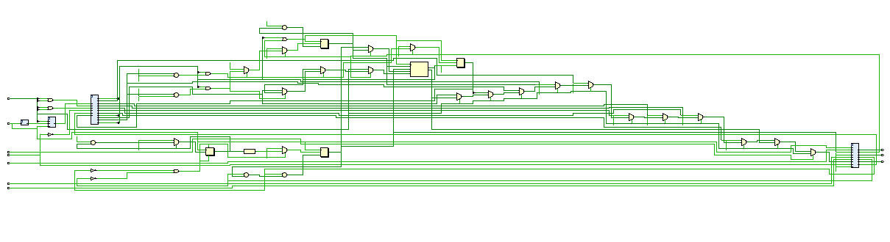

由于篇幅问题，此处将不再给出每条指令的仿真波形图，仅给出最终的仿真波形图：

初始值：

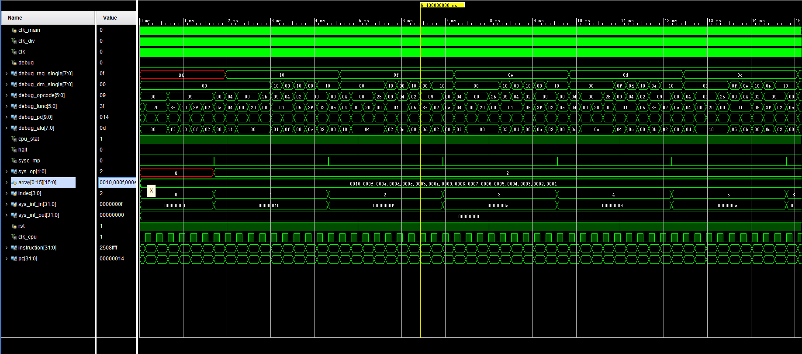

终止值：

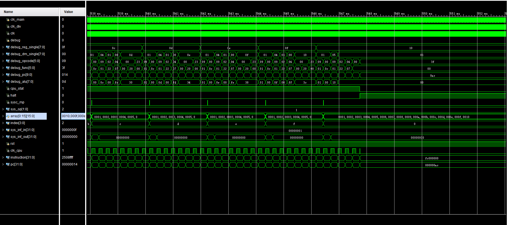

可以看到，最终的数组已经实现了从小到大的排序，并且cpu时钟的控制功能也正常实现。本次的实验也到此结束。

最后附上两张调试功能的测试图：

**debug_pc**
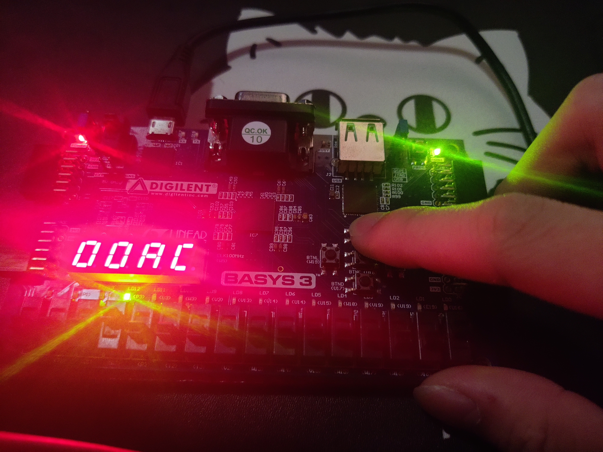

**debug_opcode & de_bug_func**


## 六、实验总结

相当有趣的一次实验。由于此前我很少尝试硬件程序的编写，所以所实话在这次实验中我是踩了不少坑的，其中最为典型的就是单元件模块用两个时钟触发（事实上在理论仿真以及语法上这是被允许的行为，然而事实是FPGA的开发板上并没有能够允许你同时输入两个时钟的元件）。这次实验也让我让对硬件程序的编写有了更深的理解，同时也对CPU的工作原理更加熟悉。

当然，本次实验的代码仍存在这一些不足以及一些我认为可以改进的地方，比方说array数组与cpu的数据交互方式以及syscall的实现方式等等，这些问题我都会在下一次的流水线cpu的实验中尝试进行改进。