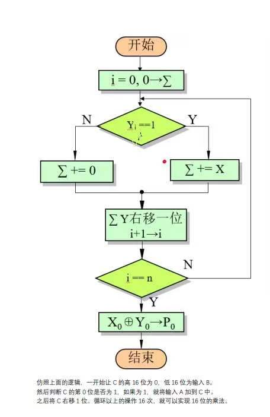
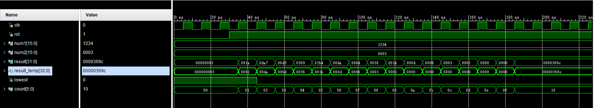
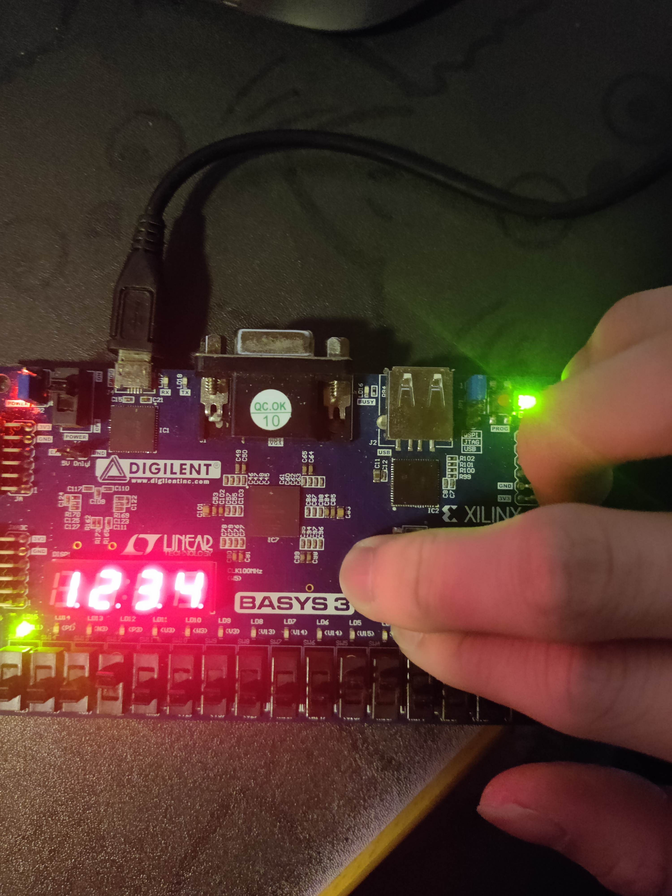
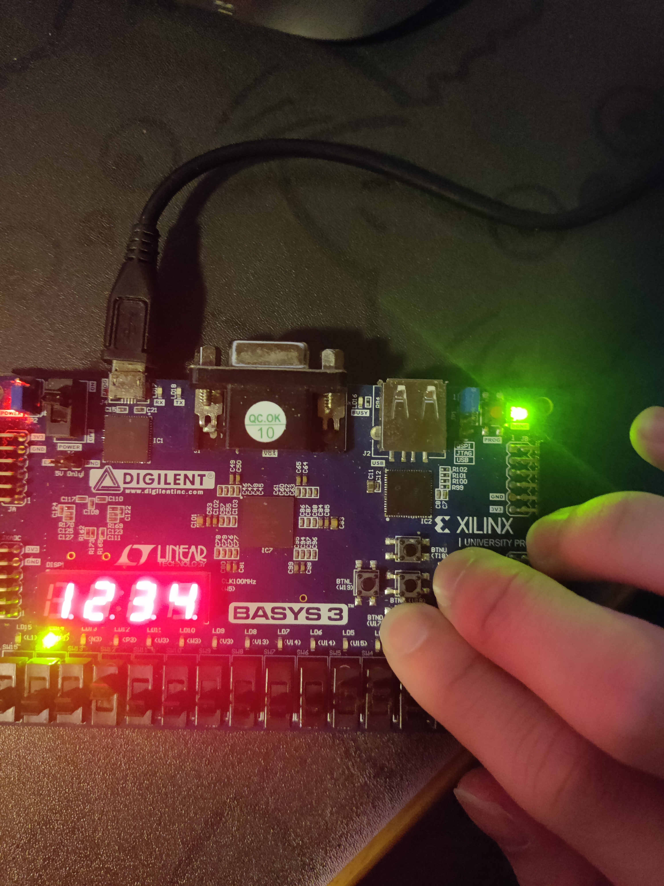
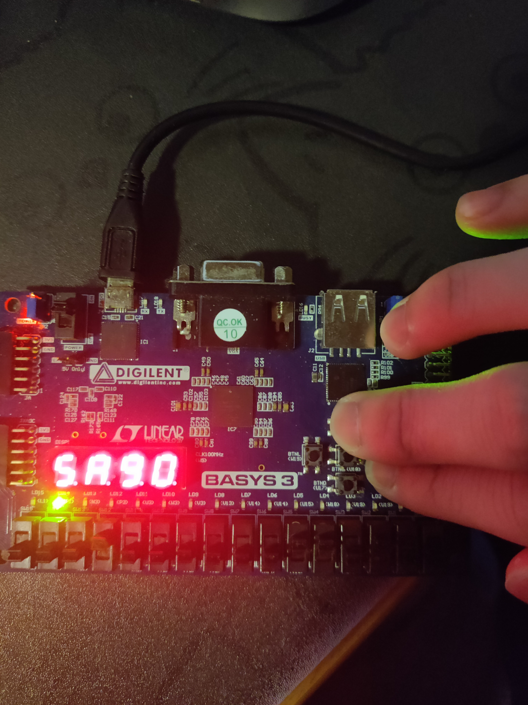
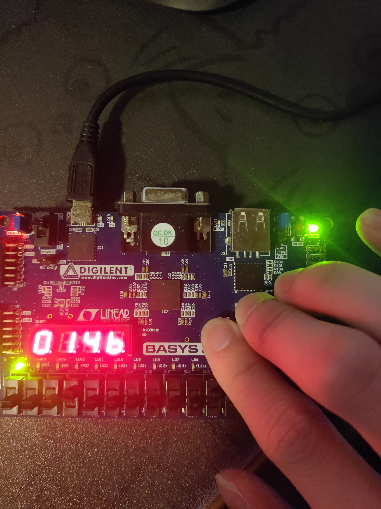

# 第七次实验报告

## 实验一：Vivado：乘法器设计

### 1. 实验目的

1. 熟悉一般乘法器的设计方法

### 2. 实验内容

1. 设计一个16位乘法器，其中乘数和被乘数均为16位，乘积为32位
2. 使用Vivado进行仿真，并将其综合到FPGA开发板上进行验证

### 3. 实验原理
乘法器的运行流程图如下：



该乘法器的运作方式与我们平时计算的时候使用的竖式计算类似。

该乘法器需要两个两个寄存器，一个16位寄存器用于存放乘数，一个33位寄存器用于存放乘积（其中最高位用于存放加法时产生的进位）。

### 4. 实验过程与纪录

**verilog实现代码**

```verilog
module multiplier(

    input wire clk,
    input wire rst,

    input wire[15:0] num1,
    input wire[15:0] num2,

    output wire[31:0] result
    );

    reg [32:0] result_temp;
    assign result = result_temp[31:0];

    wire   lowest; 
    assign lowest = result_temp[0];

    reg[5:0] count = 0;

    wire[16:0] temp;
    assign temp = result_temp[32:16] + num1;

    always @(posedge clk or negedge rst) begin
        if (!rst) begin
            result_temp[32:16] <= 0;
            result_temp[15:0]  <= num2;
            count              <= 0;
        end else if (count != 5'h10) begin
            if (lowest) begin
                result_temp <= {temp, result_temp[15:0]} >> 1;
            end else begin
                result_temp <= result_temp >> 1;
            end
            count <= count + 1;
        end else begin
            // do nothing
        end
    end
endmodule
```

1. 如上，初始时，将`result_temp`的高16位清零，将`result_temp`的低16位赋值为`num2`，将`count`清零。
2. 当`count`不为16时，如果`result_temp`的最低位为1，则将`result_temp`的高16位与`num1`相加，然后将`result_temp`右移一位，否则直接将`result_temp`右移一位，然后将`count`加1。重复该过程。
3. 当`count`为16时，停止计算。


**仿真结果**

计算 $3H * 1234H$



如图，仿真结果正确。

**烧板**

计算 $1234H * 1234H = 014b 5a90H$

- *num1*：1234H


- *num2*：1234H


- *result: low*：5a90H


- *result: high*：014bH


可见，结果正确。乘法器设计成功。


## 实验二：8086汇编：音乐中断程序设计

### 1. 实验目的

1. 熟悉8086汇编语言的中断程序编写
2. 熟悉8086架构中程序与外设的交互方式

### 2. 实验内容

1. 设计一个中断程序，使其被调用时能够发出一段音乐
2. 设计一个中断程序，使其能够在屏幕中显示出一段文字

### 3. 实验原理

通过61H端口控制扬声器发声，同时利用8253芯片中的2号计数器产生相应频率的方波，从而发出不同的音调。

### 4. 实验过程与纪录

**音乐中断程序**

```assembly
INT_51:                                      ; play music
    PUSH AX                                  ; save registers
    PUSH BX
    PUSH CX
    PUSH DX
    PUSH DI
    PUSHF

    MOV AL, 0B6H                             ; control word
    OUT 43H, AL                              ; send control to 43h, let 8253 know we want to set timer 2

    LEA DI, FREQ_L                           ; load music frequency and duration
music_loop:
    MOV DX, 0012H                            ; the input frequency of timer 8253: 1.193182 MHz (1234DE H)
    MOV AX, 34DEH

    MOV BX, [DI]                             ; load frequency, if 0, end music
    CMP BX, 0
    JZ  END_51

    DIV BX                                   ; (0012 34DE H)  / (frequency), get the number of clock cycles
    OUT 42H, AL                              ; THEN SEND THE NUMBER OF CLOCK CYCLES TO 8253
    MOV AL, AH
    OUT 42H, AL

    IN  AL, 61H                              ; get the current status of speaker
    MOV AH, AL                               ; save the status to ah
    OR  AL, 3                                ; set the last two bits to 1, enable speaker
    OUT 61H, AL                              ; send the new status to 61h

    INC DI                                   ; load duration to bx
    INC DI
    MOV BX, [DI]
    CALL FUNC_DELAY_DURATION                 ; delay for the duration

    INC DI                                   ; point to the next frequency
    INC DI
    MOV AL, AH                               ; restore the status of speaker
    OUT 61H, AL

    CALL FUNC_DELAY                         ; delay between two notes

    JMP music_loop
END_51:
    POPF                                     ; restore registers
    POP DI
    POP DX
    POP CX
    POP BX
    POP AX
    IRET
```

**清屏中断**

```assembly
INT_50:                                       ; clear screen
    PUSH AX                                   ; save registers
    PUSH BX
    PUSH CX
    PUSH DX
    PUSH ES
    PUSHF

    MOV AX, 0B800H                           ; video memory
    MOV ES, AX
    MOV BX, 0
    MOV CX, 80*24                            ; screen size
clear_loop:                                  ; clear screen loop
    MOV WORD PTR ES:[BX], 0
    ADD BX, 2
    LOOP clear_loop 
END_50:
    POPF                                     ; restore registers
    POP ES
    POP DX
    POP CX
    POP BX
    POP AX
    IRET
```

完整的程序见附件。

**运行测试**


如图，程序运行正常，音乐正常播放。
