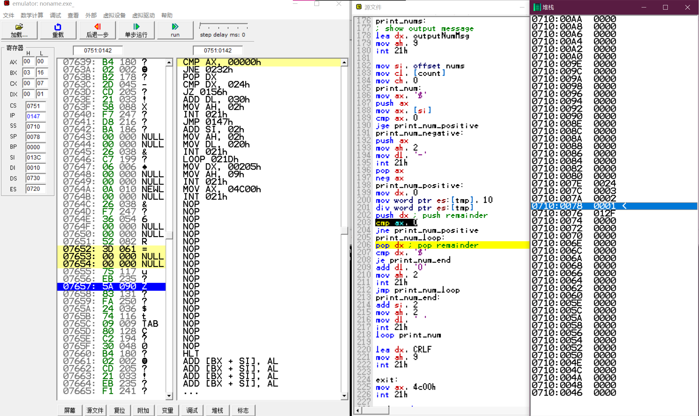
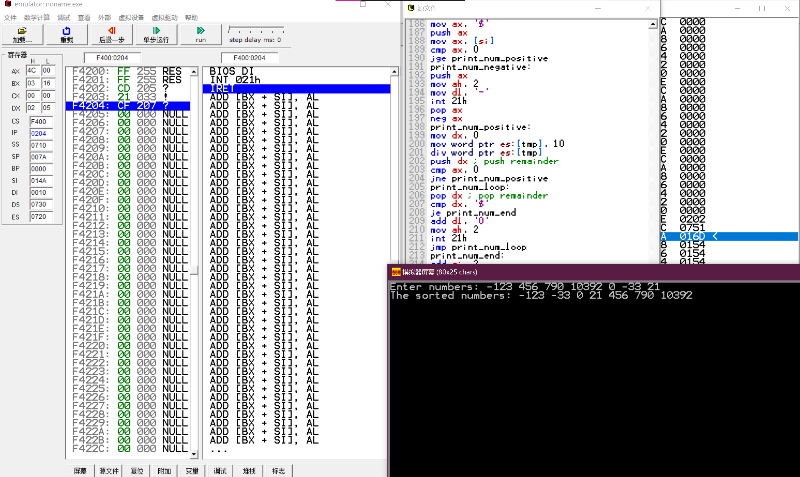

# 计算机组成原理第四次理论作业

## 1.冒泡排序程序

**8086汇编码**

- 以下程序实现了不定长16位有符号整型数组的输入排序与输出（输入数字以空格进行分隔）

```assembly
assume cs:code, ds:data, ss:stack, es:extra

stack segment
          dw 128 dup(?)
stack ends

extra segment
    tmp   dw 128 dup(?)
extra ends

data segment
    intputNumMsg  db "Enter numbers: $"
    outputNumMsg  db "The sorted numbers: $"
    errorNumMsg   db "Error: Invalid input!$"

    input_str     db 0FFh
    input_str_len db 0
    input_str_ptr db 0FFh dup(0)

    nums          dw 100 dup(0)
    count         db 0

    CRLF          db 0dh, 0ah, '$'
data ends

code segment
    main:              
                       mov  ax, data
                       mov  ds, ax
                       mov  ax, stack
                       mov  ss, ax
                       mov  sp, 128
                       mov  ax, extra
                       mov  es, ax

    ; show input message
                       lea  dx, intputNumMsg
                       mov  ah, 9
                       int  21h

    ; input string
                       lea  dx, input_str
                       mov  ah, 0ah
                       int  21h

    ; add '$' to the end of string
                       mov  bl, [input_str_len]
                       mov  bh, 0
                       mov  byte ptr [input_str_ptr + bx], '$'

    ; CRLF
                       lea  dx, CRLF
                       mov  ah, 9
                       int  21h


    rtrim:             
                       mov  bl, [input_str_len]
                       mov  bh, 0
                       mov  al, ' '
    rtrim_loop:        
                       cmp  byte ptr [input_str_ptr + bx], al
                       je   rtrim_delete
                       jne  rtrim_end
    rtrim_delete:      
                       mov  byte ptr [input_str_ptr + bx], '$'
                       dec  bx
                       mov  [input_str_len], bl
                       jmp  rtrim_loop
    rtrim_end:         nop


    get_nums:          
                       mov  si, offset input_str_ptr
                       mov  di, offset nums
                       mov  cl, [input_str_len]
                       mov  ch, 0
                       sub  ax, ax                                ; reset ax, zf, sf
                       mov  bx, 0
                       mov  dx, 0
    get_char:          
    ; bl : current char, ax: current number, bh: sign
                       mov  bl, [si]
                       cmp  bl, '$'
                       je   get_nums_end
                       cmp  bl, ' '
                       je   save_num
                       cmp  bl, '-'
                       je   set_sign
                       cmp  bl, '0'
                       jb   get_nums_error
                       cmp  bl, '9'
                       ja   get_nums_error

                       sub  bl, '0'                               ; convert char to number

    ; get current number
                       mov  word ptr es:[tmp], 10
                       mul  word ptr es:[tmp]
                       cmp  dx, 0
                       ja   get_nums_overflow
                       add  al, bl
                       adc  ah, 0

                       inc  si
                       loop get_char

    save_num:          
                       cmp  bh, 0
                       je   save_num_positive
    save_num_negative: 
                       neg  ax
                       mov  bh, 0
    save_num_positive: 
                       mov  [di], ax
                       add  di, 2
                       mov  ax, 0

                       inc  si
                       inc  word ptr [count]
                       cmp  cx, 0
                       je   get_nums_end
                       loop get_char

    set_sign:          
                       mov  bh, 1
                       inc  si
                       loop get_char

    get_nums_error:    
                       lea  dx, errorNumMsg
                       mov  ah, 9
                       int  21h
                       jmp  exit
    get_nums_overflow: 
                       lea  dx, errorNumMsg
                       mov  ah, 9
                       int  21h
                       jmp  exit

    get_nums_end:      nop


    sort_nums:         
                       mov  si, 0
                       mov  di, 2
                       mov  cl, [count]
                       mov  ch, 0
                       mov  ax, 2
                       mul  cl
                       mov  cx, ax
    sort_nums_loop:    
                       cmp  si, cx
                       jnb  sort_nums_end
    sort_nums_loop2:   
                       cmp  di, cx
                       jnb  next_num
                       mov  ax, [nums + si]
                       mov  bx, [nums + di]
                       cmp  ax, bx
                       jle  not_swap
    swap:              
                       mov  [nums + si], bx
                       mov  [nums + di], ax
    not_swap:          
                       add  di, 2
                       jmp  sort_nums_loop2
    next_num:          
                       add  si, 2
                       mov  di, si
                       add  di, 2
                       jmp  sort_nums_loop
    sort_nums_end:     nop


    print_nums:        
    ; show output message
                       lea  dx, outputNumMsg
                       mov  ah, 9
                       int  21h

                       mov  si, offset nums
                       mov  cl, [count]
                       mov  ch, 0
    print_num:         
                       mov  ax, '$'
                       push ax
                       mov  ax, [si]
                       cmp  ax, 0
                       jge  print_num_positive
    print_num_negative:
                       push ax
                       mov  ah, 2
                       mov  dl, '-'
                       int  21h
                       pop  ax
                       neg  ax
    print_num_positive:
                       mov  dx, 0
                       mov  word ptr es:[tmp], 10
                       div  word ptr es:[tmp]
                       push dx                                    ; push remainder
                       cmp  ax, 0
                       jne  print_num_positive
    print_num_loop:    
                       pop  dx                                    ; pop remainder
                       cmp  dx, '$'
                       je   print_num_end
                       add  dl, '0'
                       mov  ah, 2
                       int  21h
                       jmp  print_num_loop
    print_num_end:     
                       add  si, 2
                       mov  ah, 2
                       mov  dl, ' '
                       int  21h
                       loop print_num

                       lea  dx, CRLF
                       mov  ah, 9
                       int  21h

    exit:              
                       mov  ax, 4c00h
                       int  21h

code ends
end main
```

**运行截图**



## 2.n的阶乘

**8086汇编码**

- 以下只给出核心计算部分，输入输出可重用上一题的代码

```assembly

data segment
    n dw 0
data ends

fact:
    mov ax, 1
    mov cx, [n]
fact_loop:
    mul cx
    loop fact_loop
    mov ah, 4ch
    int 21h
```

**运行截图**

- 下图为程序运行时的堆栈情况，本程序中主要将栈用于将逆序的数字转为正序输出


- 运行结果

