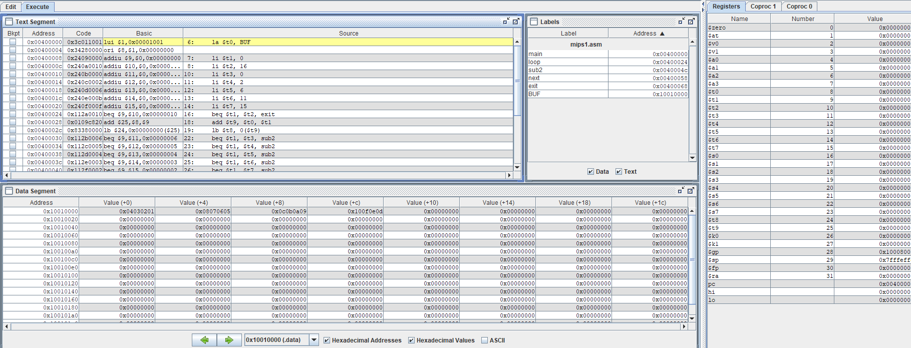
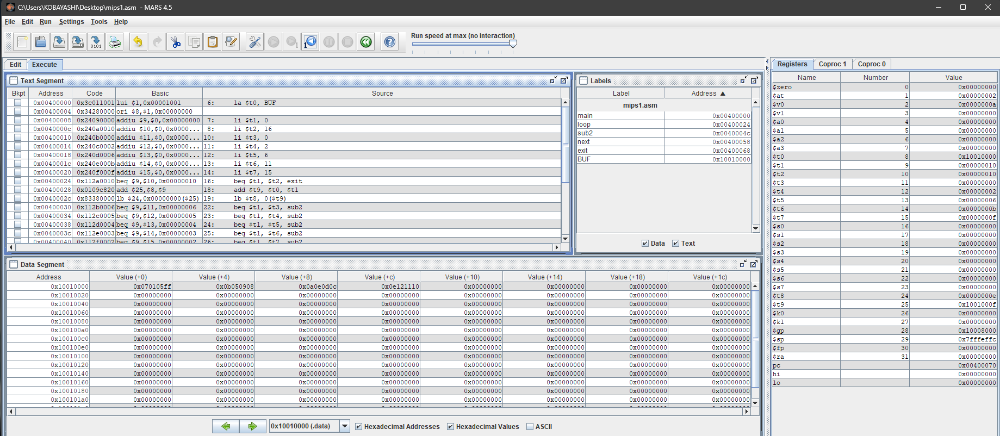

# 计算机组成原理第8次理论作业

## 1. 请编写MIPS汇编程序，实现对BUF中16个字节进行处理：将第1、3、7、12、16个数据的值减2，其余数据的值加3。

```asm
.data
BUF: .byte 1,2,3,4,5,6,7,8,9,10,11,12,13,14,15,16

.text
main:
    la $t0, BUF
    li $t1, 0
    li $t2, 16

    li $t3, 0
    li $t4, 2
    li $t5, 6
    li $t6, 11
    li $t7, 15
loop:
    beq $t1, $t2, exit

    add $t9, $t0, $t1
    lb $t8, 0($t9)

    # if $t1 == 1 || $t1 == 3 || $t1 == 7 || $t1 == 12 || $t1 == 16, sub 2
    beq $t1, $t3, sub2
    beq $t1, $t4, sub2
    beq $t1, $t5, sub2
    beq $t1, $t6, sub2
    beq $t1, $t7, sub2

    # else add 3
    addi $t8, $t8, 3
    j next

sub2:
    subi $t8, $t8, 2
    j next

next:
    add $t9, $t0, $t1
    sb $t8, 0($t9)
    addi $t1, $t1, 1
    j loop

exit:
    li $v0, 10
    syscall
```

**执行前**



**执行后**




## 2. 请编写MIPS汇编程序，用MIPS移位指令和加法指令实现将$S1寄存器的内容乘以10的功能。

```asm
.text

main:
    li $s1, 10

    sll $s2, $s1, 1
    sll $s3, $s1, 3

    add $s1, $s2, $s3

    li $v0, 10
    syscall
```