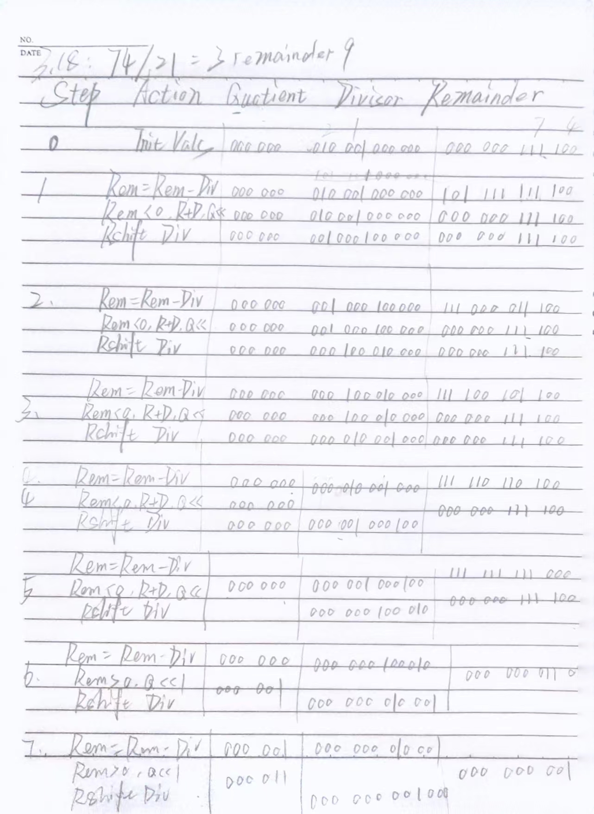
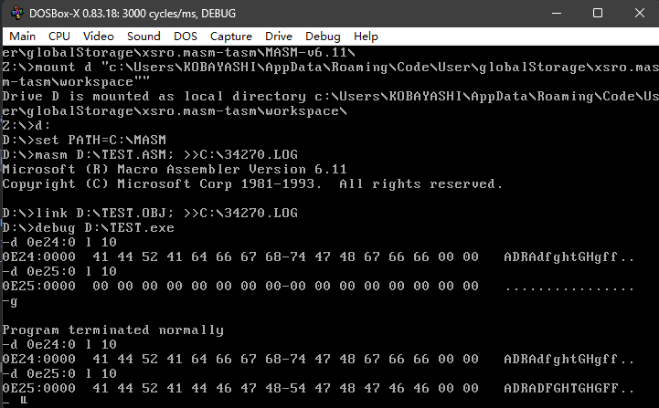
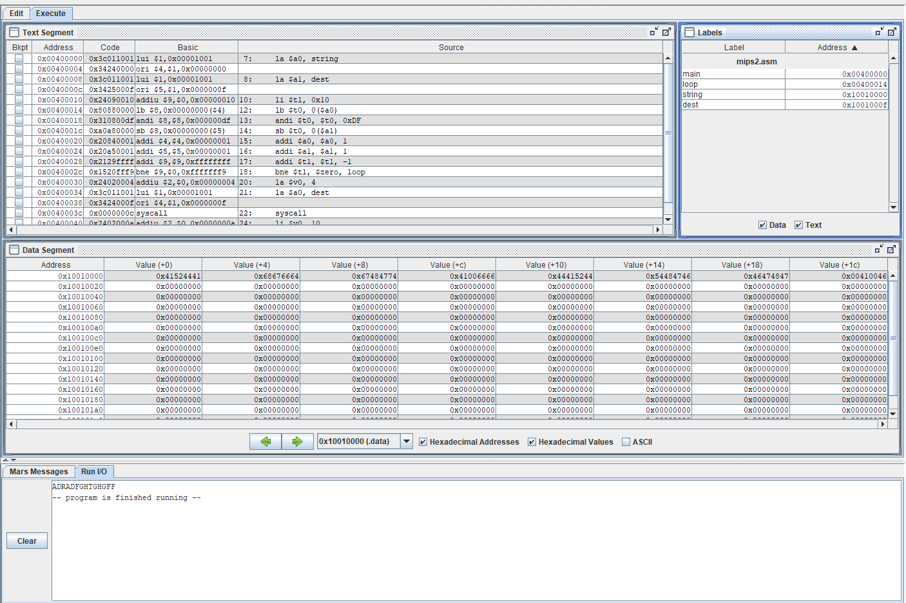

# 计算机组成原理第七次理论作业

## 3.1

5730

## 3.2

5730

## 3.13

Step|Action|Multipicand|Product/Multiplier
:-:|:-:|:-:|:-:
0|Initial Vals|0110 0010|0000 0000 0001 0010
1|nop<br>Rshif Mplier|0110 0010|0000 0000 0001 0010<br>0000 0000 0000 1001 
2|Prod = Prod + Mcand<br>Rshift Mplier|0110 0010|0110 0010 0000 1001<br>0011 0001 0000 0100
3|nop<br>Rshif Mplier|0110 0010|0011 0001 0000 0100<br>0001 1000 1000 0010
4|nop<br>Rshif Mplier|0110 0010|0001 1000 1000 0010<br>0000 1100 0100 0001
5|Prod = Prod + Mcand<br>Rshift Mplier|0110 0010|0110 1110 0100 0001<br>0011 0111 0010 0000
6|nop<br>Rshif Mplier|0110 0010|0011 0111 0010 0000<br>0001 1011 1001 0000
7|nop<br>Rshif Mplier|0110 0010|0001 1011 1001 0000<br>0000 1101 1100 1000
8|nop<br>Rshif Mplier|0110 0010|0000 1101 1100 1000<br>0000 0110 1110 0100

即: $62H \times 12H = 6E4H$

## 3.18



## 3.20

无论是有符号补码整数还是无符号整数其表示的都为 201326592

## 3.22

0x0C000000 = 0000 1100 0000 0000 0000 0000 0000 0000

若其表示单精度浮点数，那么：

S = 0
E = 0001 1000 = 24 - 127 = -103
F = 1 + 0000 0000 0000 0000 0000 00 = 1

即其表示的数为 $(-1)^0 \times 2^{-103} \times 1 = 2^{-103}$

## 3.23

63.35 = 111111.01 = 1.1111101 * 2^5

则：

S = 0
E = 5 + 127 = 132 = 1000 0100
F = 1111101 

故IEEE标准下的位模式为：0 1000 0100 1111 1010 0000 0000 0000 000


## 运行下列8086程序，分析该程序实现什么功能？截屏显示结果。

```asm
assume cs:code, ds:data, es:extra

DATA SEGMENT 
string db 'ADRAdfghtGHgff'
count equ $-string
DATA ENDS 

EXTRA SEGMENT 
dest db count dup (?)
EXTRA ENDS 

CODE SEGMENT
begin:

    mov ax, data
    mov ds, ax
    mov ax, extra
    mov es, ax

    mov cx, count
    lea si, string
    lea di, dest
    cld

again:
    lodsb
    and al, 0DFH
    stosb
    loop again

    mov ah, 4CH
    int 21H
CODE ENDS
end begin
```

分析：

该程序将存于DS段中的字符串string转为大写并复制到了ES段的dest中。

运行截图：




## 编写一个MIPS汇编程序实现上述功能，运行，并截屏显示结果

```asm
.data
string: .asciiz "ADRAdfghtGHgff"
dest: .space 16

.text
main:
    la $a0, string
    la $a1, dest

    li $t1, 0x10
loop:
    lb $t0, 0($a0)
    andi $t0, $t0, 0xDF
    sb $t0, 0($a1)
    addi $a0, $a0, 1
    addi $a1, $a1, 1
    addi $t1, $t1, -1
    bne $t1, $zero, loop

    la $v0, 4
    la $a0, dest
    syscall

    li $v0, 10
    syscall
```

运行截图：

