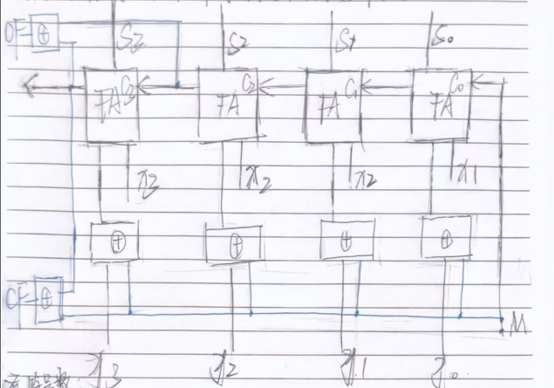

# 计算机组成原理 期中测试题

## 一、选择题

1. B
2. A
3. A
4. D
5. F
6. B
7. A
8. E
9. A
10. C

## 二

instruction word: 100011  00101  00100  10100  00000  010100
(1000 1100 1010 0100 1010 0000 0001 0100)

**1**

    sign-extend: 1111 1111 1111 1111 1010 0000 0001 0100
    jump Shift-left 2: 0010 1001 0010 1000 0000 0101 0000

**2**

    New PC: PC + 4
    Path: PC -> Add(PC+4) -> Branch Mux -> Jump Mux -> PC

**3**

    WrReg Mux : 4 or 20
    ALU Mux : 32'b1111 1111 1111 1111 1010 0000 0001 0100 (-24556)
    Mem/ALU Mux : 0
    Branch Mux : PC + 4
    Jump Mux : PC + 4


**4**

ALU : 10 and -24556
Add (PC+4) : PC and 4
Add (Branch) : PC+4 and -24556 * 4


**5**

Read Register 1 : 5
Read Register 2 : 4
Write Register : 0
Write Data : -4
RegWrite : 1
RegDst : 0
MemtoReg : 1


## 三、True or False

(1) Only one adder is required in pipelined MIPS datapath. (F)
(2) Because the register file is both read and written on the same clock cycle, and MIPS datapath using edge-triggered writes must have more than one copy of the register file. (F)
(3) Reordering code is a possible way to avoid pipeline stalls. (T)
(4) Forwarding is primarily an attempt to fix Data Hazards in a pipeline. (T)
(5) In a pipelined system, forwarding will eliminate the need of any stalls. (F)
(6) In the MIPS ISA each register holds 32 bits. (T)


## 四

(1) False
(2) False
(3) True
(4) True

## 五、分析题

1. AL : 77H  CF : CY  OF : OV  SF : PL  ZF : NZ

2. IF:300ns; ID:400ns; EX:350ns; MEM:500ns; WB:100ns
    (1) clock cycle time in pipelined : 500ns
        clock cycle time in nonpipelined : 1650ns
    (2) total execution time of a lw instruction in a pipelined: 2500ns
        in a nonpipelined: 1650ns

3. For each code sequence below, state whether it must stall, can avoid stalls using only forwarding, or can execute without stalling or forwarding.

**Sequence 1**

```asm
lw $t0, 0($t0)
add $t1, $t0, $t0
```

must stall

**Sequence 2**

```asm
add $t1, $t0, $t0
addi $t2, $t0, #5
addi $t4, $t1, #5
```

can avoid stalls using only forwarding

**Sequence 3**

```asm
addi $t1, $t0, #1
addi $t2, $t0, #2
addi $t3, $t0, #2
addi $t3, $t0, #4
addi $t5, $t0, #5
```

can execute without stalling or forwarding


4. (A) 5 (B) 10000

5. 00400004hex | jal 00400200hex
    功能：jump and link (jal)指令，跳转到指定的地址同时将下一条指令的地址保存到$ra寄存器中
    执行完这条指令后$ra寄存器的内容是：00400008hex
    jal 指令的目标地址是：00400200hex

## 六

```asm
    add $t0, $zero, $zero    # 将$t0清零
loop:
    beq $a1, $zero, finish   # 如果$a1为0，跳转到finish
    add $t0, $t0, $a0        # $t0 = $t0 + $a0
    sub $a1, $a1, 1          # $a1 = $a1 - 1
    j loop                   # 跳转到loop
finish:
    addi $t0, $t0, 100       # $t0 = $t0 + 100
    add $v0, $t0, $zero      # $v0 = $t0
```

上述程序计算的是：$v0 = $a0 * $a1 + 100

假设$a0和$a1用于输入，且在开始时分别包括整数6和5，程序执行完成后，$v0寄存器的值时：130

## 七、将以下C代码改成MIPS汇编语言程序：

```c
int A[100], B[100];
for (i = 1; i < 100; i++) {
    A[i] = A[i-1] + B[i];
}
```

假设A和B的基址地址分别存放在寄存器$S0和$S1中
```asm
addi $t0, $zero, 1
addi $t1, $zero, 100
loop:
    beq $t0, $t1, finish
    sll $t2, $t0, 2
    add $t2, $t2, $s0
    lw $t3, 0($t2)  # A[i]
    lw $t4, -4($t2) # A[i-1]
    lw $t5, 0($s1)  # B[i]
    add $t6, $t4, $t5 # A[i-1] + B[i]
    sw $t6, 0($t2)  # A[i] = A[i-1] + B[i]
    addi $t0, $t0, 1
    j loop
finish:
    nop
```

## 八、请设计一个既可以用于两个4位补码表示的带符号数做加减法运算，又可以用于两个4位无符号数做加减法运算的电路，可以用全加器、与、或、非、异或门等基本数字逻辑电路。要求设计的电路中包含监测溢出标志位OF和进位标志位CF的电路。解释其工作原理。



模式位M：当M=0时表示加法，当M=1时表示减法

有符号数：

当M复位时（M=0），y中的每一位与M进行异或并将$C_0$设为M，得到结果为y本身，此时x的补码与y的补码相加表示x+y

当M置位时（M=1），y中的每一位与M进行异或并将$C_0$设为M，得到结果为y的相反数的补码，此时x的补码与y的相反数的补码相加表示x-y

OF位：溢出位，当两个符号位相同且结果符号位与原符号位不同时，溢出
由此可以得到溢出位的判断公式：$OF = C_3 \oplus C_4$


无符号数：

当M复位时（M=0），x与y相加，此时x与y两数原码相加表示x+y

当M置位时（M=1），不妨将$x-y$表示为$x+(2^n-y)-2^n$，其中$2^n$表示$2^4$，即将$x-y$的结果表示为$x$的补码与$-y$的补码相加，求$-y$的补码原理同上，此时$x$的补码与$-y$的补码相加表示$x-y$

CF位：进位位，当两个数相加最高产生进位或者两个数相减最高位借位时，CF置位
由此可以得到进位位的判断公式：$CF = C_4 \oplus M$