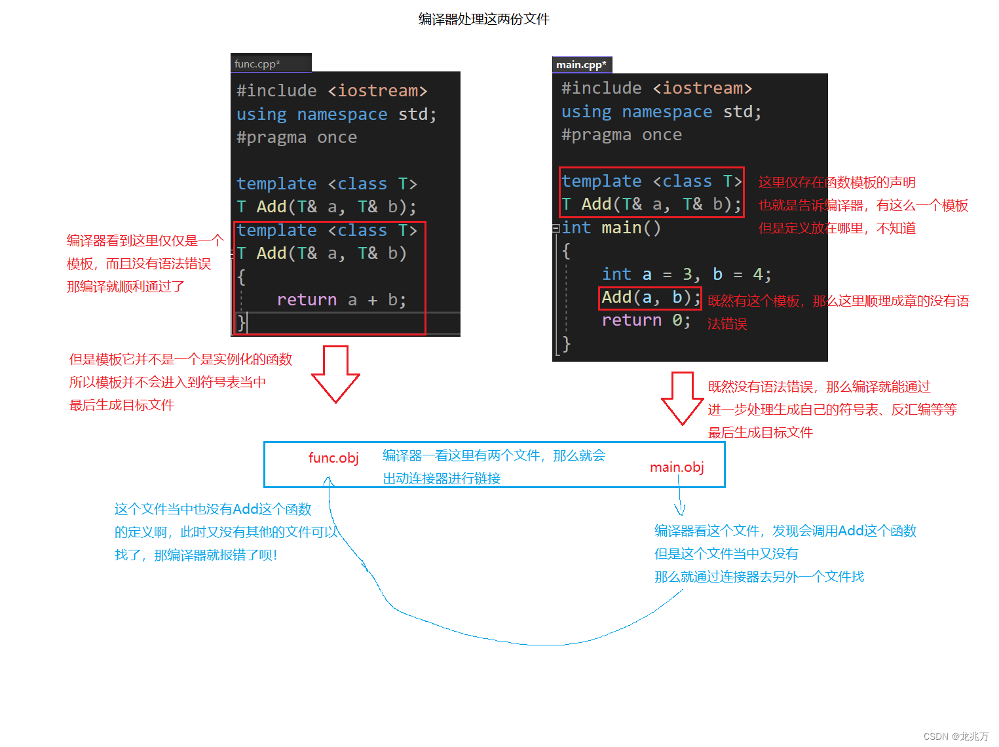

# 模板在多文件中使用的注意事项

我们知道，函数模板与类模板都不是一个具体的函数和具体的类，想要使用真正的函数或者真正的类必须要对模板进行实例化。所以在多文件中，模板的声明和定义分离将会造成链接错误。

例如：

```cpp
// Test.h
template <typename T>
T add(T& a, T& b);
```

```cpp
// Test.cpp
#include "Test.h"
T add(T& a, T& b)
{
    return a + b;
}
```

```cpp
// main.cpp
#include "Test.h"
int main()
{
    int a = 1, b = 2;
    int c = add(a, b);
    return 0;
}
```

此时将会报错：
  


为什么会报错：

头文件在预处理的过程中会在源文件中展开，所以在上述情况中，编译时仅仅处理两个文件

  

与函数模板一样，类模板在多文件中声明和定义分离的时候，也会发生链接错误。

那么解决方案有两种：

一是：**声明和定义依然分离，在定义的文件中显式实例化**：

```cpp
template <typename T>
T add(T& a, T& b)
{
    return a + b;
}

// 显示实例化：告诉编译器有类型
template int add<int>(int& a, int& b);
```

这种方法其实并不好，因为这样做已经丧失了模板的意义

所以第二中方法就是：**将声明和定义放在同一个文件中**：

对于类模板而言同理