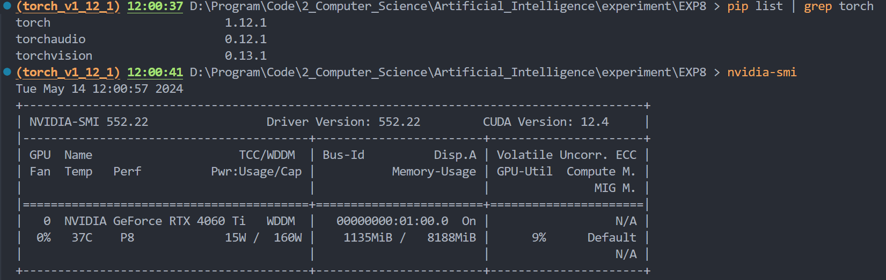

# 中药图片分类

## 1. 文件结构

本次实验中我共编写了三个文件，分别为：

- [`train.py`](./train.py)：用于训练模型的文件
- [`cnn.py`](./cnn.py)：CNN模型的实现
- [`MyDataset.py`](./MyDataset.py)：自定义数据集类，用于处理数据

## 2. 本次实验的环境



## 3. 注意

`train.py`文件中有变量控制是否使用较大的测试集：

```py
USE_LARGE_TEST_DATASET = False 
```

若使用CPU进行训练，或者GPU显存并不充裕，建议不要将其设为`True`
