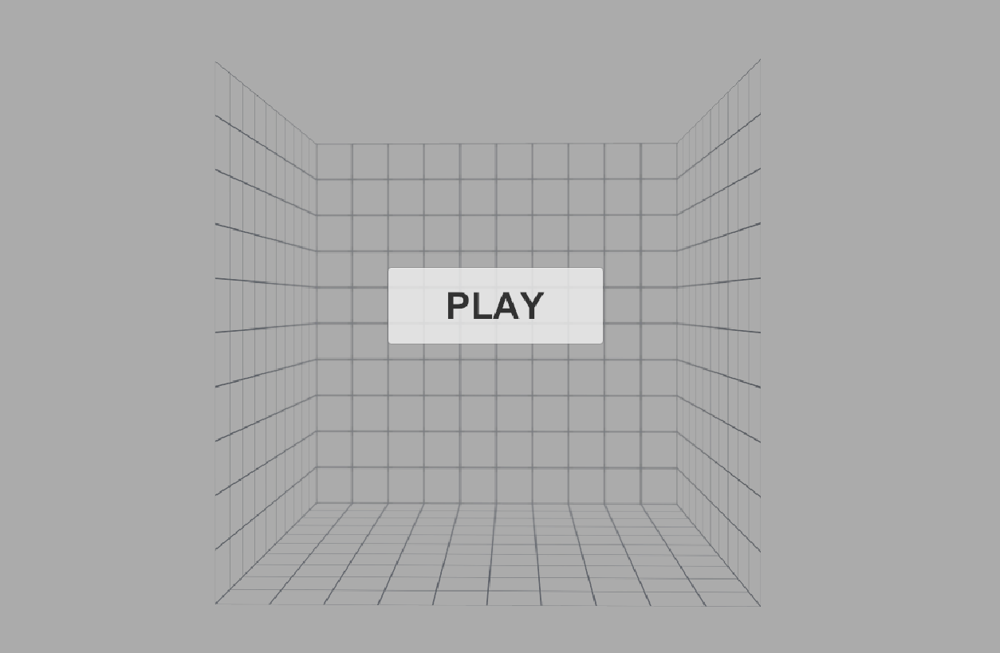
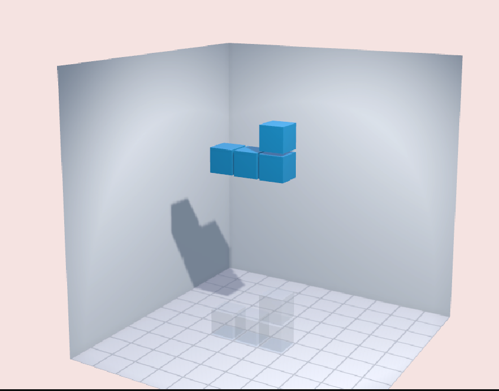
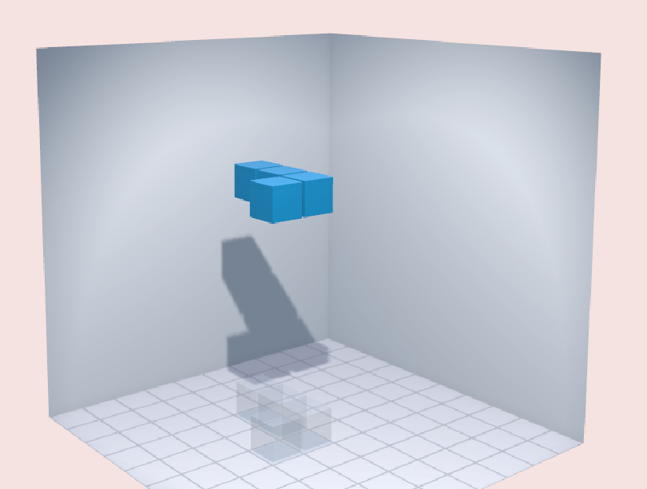
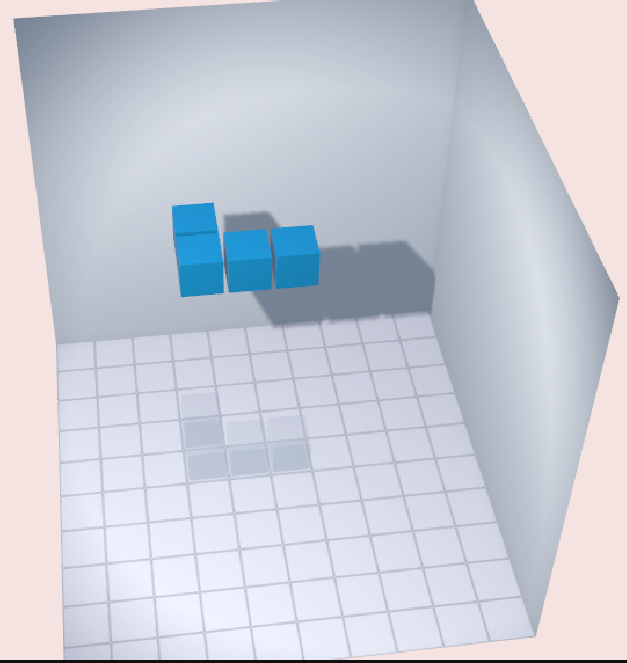
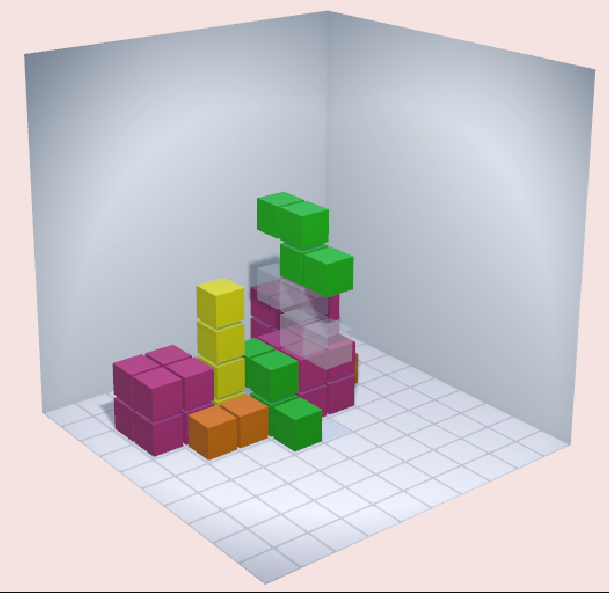
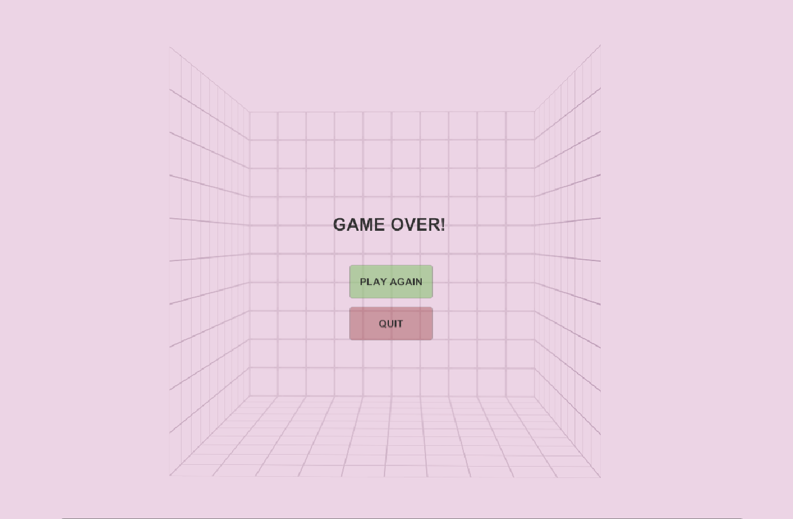

# 一、实验概述

本实验主要在于使用Unity框架开发一个3D的俄罗斯方块游戏。本人在此项目中主要负责游戏逻辑的编写。

# 二、技术路线与方案

我主要把游戏的逻辑分为了以下几个部分：

1. 游戏的开始与终止
2. 方块的生成
3. 方块的行为（包括方块的下落、方块的水平移动、方块的旋转等）
4. 方块影子（用于提示方块下落的位置）的行为
5. 方块的消除
6. 游戏计分
7. 玩家的键盘输入
8. 玩家视角的移动

为了实现以上的逻辑，我主要编写了以下的脚本：

1. `GameManager.cs`
2. `SpawnManager.cs`
3. `BlockController.cs`
4. `ShadowController.cs`
5. `GridManager.cs`
6. `ScoreManager.cs`
7. `InputManager.cs`
8. `CameraController.cs`

## GameManager

- 用于控制游戏的开始、结束、退出等逻辑。使用单例模式实现。

1. 游戏的开始

```cs
public class GameManager : MonoBehaviour
{
    private void StartGame()
    {
        isGameOver = false;
        spawnManager = FindFirstObjectByType<SpawnManager>();
        if (spawnManager != null)
        {
            spawnManager.SpawnBlock();
        }
        else
        {
            Debug.LogError("SpawnManager not found in the scene!");
        }
    }
}
```

2. 游戏的结束

```cs
public class GameManager : MonoBehaviour
{
    public void GameOver()
    {
        if (!isGameOver)
        {
            isGameOver = true;
            Debug.Log("Game Over");
            SceneManager.LoadScene("GameOver");
        }
    }
}
```

3. 游戏的退出

```cs
public class GameManager : MonoBehaviour
{
    public void QuitGame()
    {
        #if UNITY_EDITOR
            UnityEditor.EditorApplication.isPlaying = false;
        #else
            Application.Quit();
        #endif
    }
}
```

除上述之外，该文件中还涉及到了一些与Unity的部件进行连接的方法，这里忽略。

## SpawnManager

- 用于控制方块的生成逻辑，使用单例模式实现。

`SpawnManager`在生成一个方块的同时，还会生成一个对应的影子，用于提示方块下落的位置。其中，方块与其对应的影子将被存储在以下两个数组中：

```cs
public class SpawnManager : MonoBehaviour
{
    [SerializeField] private GameObject[] blockPrefabs;
    [SerializeField] private GameObject[] shadowPrefabs;
}
```

具体的方块生成逻辑如下：

```cs
public class SpawnManager : MonoBehaviour
{
    public void SpawnBlock()
    {
        // Validate prefab arrays
        if (blockPrefabs == null || blockPrefabs.Length == 0)
        {
            Debug.LogError("Block prefabs array is empty!");
            return;
        }

        if (shadowPrefabs == null || shadowPrefabs.Length != blockPrefabs.Length)
        {
            Debug.LogError("Shadow prefabs array is missing or doesn't match blocks array!");
            return;
        }

        // Randomly select a block
        int randomIndex = Random.Range(0, blockPrefabs.Length);
        
        // Instantiate block and shadow
        GameObject block = Instantiate(blockPrefabs[randomIndex], spawnPosition, Quaternion.identity);
        GameObject shadow = Instantiate(shadowPrefabs[randomIndex], spawnPosition, Quaternion.identity);

        // Set up block controller
        BlockController blockController = block.GetComponent<BlockController>();
        if (blockController == null)
        {
            Debug.LogError("Block prefab is missing BlockController component!");
            Destroy(block);
            Destroy(shadow);
            return;
        }

        // Set up shadow controller
        ShadowController shadowController = shadow.GetComponent<ShadowController>();
        if (shadowController != null)
        {
            shadowController.SetParentBlock(blockController);
        }
        else
        {
            Debug.LogError("Shadow prefab is missing ShadowController component!");
            Destroy(shadow);
        }

        // Check if the spawn position is valid
        if (!GridManager.Instance.IsValidMove(blockController))
        {
            GameManager.Instance.GameOver();
        }
    }
}
```

## BlockController

- 主要用于控制方块的行为逻辑。

1. 方块的下落

```cs
public class BlockController : MonoBehaviour
{
    private void Fall()
    {
        transform.position += Vector3.down;

        if (!GridManager.Instance.IsValidMove(this))
        {
            transform.position += Vector3.up;
            LockBlock();
        }
    }
}
```

2. 方块的水平移动

```cs
public class BlockController : MonoBehaviour
{
    public void MoveHorizontal(Vector3 direction)
    {
        if (!IsActive) return;

        transform.position += direction;
        if (!GridManager.Instance.IsValidMove(this))
        {
            transform.position -= direction;
        }
    }
}
```

3. 方块的旋转

```cs
public class BlockController : MonoBehaviour
{
    public void Rotate(Vector3 axis)
    {
        if (!IsActive) return;

        transform.RotateAround(transform.TransformPoint(rotationPoint), axis, 90);
        if (!GridManager.Instance.IsValidMove(this))
        {
            transform.RotateAround(transform.TransformPoint(rotationPoint), axis, -90);
        }
    }
}
```

4. 方块的快速下落

```cs
public class BlockController : MonoBehaviour
{
    public void QuickDrop()
    {
        if (!IsActive) return;

        while (GridManager.Instance.IsValidMove(this))
        {
            transform.position += Vector3.down;
        }
        transform.position += Vector3.up;
        LockBlock();
    }
}
```

## ShadowController

- 主要控制方块影子的行为逻辑。

方块影子的行为比较简单，基本当正在下落的方块的水平位置发生改变的时候，在实方块的位置处生成一个新的影子方块，并将影子方块落到能够到达的最底部位置。具体的实现如下：

```cs
public class ShadowController : MonoBehaviour
{
    private void Update()
    {
        if (parentBlock == null || !parentBlock.IsActive)
        {
            Destroy(gameObject);
            return;
        }

        UpdateShadowPosition();
    }

    private void UpdateShadowPosition()
    {
        transform.SetPositionAndRotation(parentBlock.transform.position, parentBlock.transform.rotation);

        do
        {
            transform.position += Vector3.down;
        } while (GridManager.Instance.IsValidMove(this));

        transform.position += Vector3.up;
    }
}
```

## GridManager

- 游戏框体的属性，并提供添加方块的逻辑、判断方块位置是否合法的逻辑、行满判断逻辑、行消除逻辑等。使用单例模式实现。

1. 游戏框体属性

```cs
public class GridManager : MonoBehaviour
{
    // 用于控制框体的大小
    public int width = 10;
    public int height = 15;
    public int depth = 10;

    // 记录消除的行数，主要在分数的计算
    public int linesCleared = 0;
}
```

2. 判断方块位置（移动）是否合法

```cs
public class GridManager : MonoBehaviour
{
    public bool IsValidMove(Vector3[] positions)
    {
        foreach (Vector3 pos in positions)
        {
            Vector3 roundedPos = RoundVector(pos);
            if (!IsInsideGrid(roundedPos) || GridPositionOccupied(roundedPos))
            {
                return false;
            }
        }
        return true;
    }

    private bool IsInsideGrid(Vector3 pos)
    {
        return pos.x >= 0 && pos.x < width &&
               pos.y >= 0 && pos.y < height &&
               pos.z >= 0 && pos.z < depth;
    }

    private bool GridPositionOccupied(Vector3 pos)
    {
        return grid[(int)pos.x, (int)pos.y, (int)pos.z] != null;
    }
}
```

3. 行满判断与行消除

需要提到的是，对于行消除逻辑的实现，我设计的是当X或Z行被方块填满时便消除该行，并将该行上方的方块下移。

这里只给出部分的实现：

```cs
public class GridManager : MonoBehaviour
{
    private bool IsLineX(int x, int y)
    {
        for (int z = 0; z < depth; z++)
        {
            if (grid[x, y, z] == null)
            {
                return false;
            }
        }
        return true;
    }

    private void ClearLineX(int x, int y)
    {
        for (int z = 0; z < depth; z++)
        {
            Destroy(grid[x, y, z].gameObject);
            grid[x, y, z] = null;
        }
    }

    private void DropBlocksAbove(int clearedY)
    {
        for (int y = clearedY; y < height - 1; y++)
        {
            for (int x = 0; x < width; x++)
            {
                for (int z = 0; z < depth; z++)
                {
                    if (grid[x, y + 1, z] != null)
                    {
                        grid[x, y, z] = grid[x, y + 1, z];
                        grid[x, y, z].transform.position += Vector3.down;
                        grid[x, y + 1, z] = null;
                    }
                }
            }
        }
    }
}
```

## ScoreManager

- 用于计算游戏的分数，并提供显示分数的逻辑。使用单例模式实现。

```cs
public class ScoreManager : MonoBehaviour
{
    private void UpdateScoreDisplay()
    {
        if (scoreText != null)
        {
            int score = GridManager.Instance.linesCleared * 100;
            scoreText.text = $"Score: {score}";
        }
    }

    private void Update()
    {
        UpdateScoreDisplay();
    }
}
```

## InputManager

- 用于处理玩家的键盘输入。这部分使用单例模式进行实现。需要提到的是，在控制方块逻辑的部分，我实现了一个坐标变化，用于将方块的移动转换为相对于玩家当前视角的移动。具体的实现逻辑如下：

```cs
public class InputManager : MonoBehaviour
{
    private BlockController activeBlock;
    private Camera mainCamera;

    private void Start()
    {
        mainCamera = Camera.main;
    }

    private void Update()
    {
        // Find the active block if not already assigned
        if (activeBlock == null || !activeBlock.IsActive)
        {
            activeBlock = FindFirstObjectByType<BlockController>();
            return;
        }

        // Handle horizontal movement
        if (Input.GetKeyDown(KeyCode.LeftArrow) || Input.GetKeyDown(KeyCode.A))
        {
            MoveBlockRelativeToCamera(Vector3.left);
        }
        else if (Input.GetKeyDown(KeyCode.RightArrow) || Input.GetKeyDown(KeyCode.D))
        {
            MoveBlockRelativeToCamera(Vector3.right);
        }
        else if (Input.GetKeyDown(KeyCode.UpArrow) || Input.GetKeyDown(KeyCode.W))
        {
            MoveBlockRelativeToCamera(Vector3.forward);
        }
        else if (Input.GetKeyDown(KeyCode.DownArrow) || Input.GetKeyDown(KeyCode.S))
        {
            MoveBlockRelativeToCamera(Vector3.back);
        }

        // Handle rotation
        else if (Input.GetKeyDown(KeyCode.Z))
        {
            activeBlock.Rotate(Vector3.right);
        }
        else if (Input.GetKeyDown(KeyCode.X))
        {
            activeBlock.Rotate(Vector3.up);
        }
        else if (Input.GetKeyDown(KeyCode.C))
        {
            activeBlock.Rotate(Vector3.forward);
        }

        // Handle quick drop
        else if (Input.GetKeyDown(KeyCode.Space))
        {
            activeBlock.QuickDrop();
        }
    }

    private void MoveBlockRelativeToCamera(Vector3 direction)
    {
        if (mainCamera == null) return;

        // Get the camera's forward and right vectors, ignoring Y component
        Vector3 cameraForward = mainCamera.transform.forward;
        cameraForward.y = 0;
        cameraForward.Normalize();

        Vector3 cameraRight = mainCamera.transform.right;
        cameraRight.y = 0;
        cameraRight.Normalize();

        // Calculate the movement direction relative to the camera
        Vector3 moveDirection = Vector3.zero;

        if (direction == Vector3.forward)
            moveDirection = cameraForward;
        else if (direction == Vector3.back)
            moveDirection = -cameraForward;
        else if (direction == Vector3.right)
            moveDirection = cameraRight;
        else if (direction == Vector3.left)
            moveDirection = -cameraRight;

        // Round the move direction to the nearest axis
        moveDirection = RoundDirectionToAxis(moveDirection);

        activeBlock.MoveHorizontal(moveDirection);
    }

    private Vector3 RoundDirectionToAxis(Vector3 direction)
    {
        float x = Mathf.Abs(direction.x);
        float z = Mathf.Abs(direction.z);

        if (x > z)
        {
            return new Vector3(Mathf.Sign(direction.x), 0, 0);
        }
        else
        {
            return new Vector3(0, 0, Mathf.Sign(direction.z));
        }
    }
}
```

## CameraController

- 用于控制玩家视角的移动。这部分使用单例模式进行实现。视角的控制主要通过捕获用户的鼠标操作来完成，具体的实现如下：

```cs
public class CameraController : MonoBehaviour
{
    [SerializeField] private float sensitivity = 5.0f;
    [SerializeField] private float smoothSpeed = 30.0f;
    [SerializeField] private float minVerticalRotation = -30f;
    [SerializeField] private float maxVerticalRotation = 60f;
    [SerializeField] private float distanceMultiplier = 1.5f;
    [SerializeField] private float minDistance = 30f;
    [SerializeField] private float maxDistance = 50f;
    
    private Vector3 centerPoint;
    private float orbitDistance;
    private Vector2 currentRotation;

    private void Start()
    {
        GridManager gridManager = GridManager.Instance;
        if (gridManager == null)
        {
            Debug.LogError("GridManager not found!");
            return;
        }

        centerPoint = new Vector3(
            gridManager.width * 0.5f,
            gridManager.height * 0.5f,
            gridManager.depth * 0.5f
        );

        float maxDimension = Mathf.Max(gridManager.width, gridManager.height, gridManager.depth);
        orbitDistance = Mathf.Clamp(maxDimension * distanceMultiplier, minDistance, maxDistance);

        Vector3 directionFromCenter = (transform.position - centerPoint).normalized;
        currentRotation.x = Mathf.Asin(directionFromCenter.y) * Mathf.Rad2Deg;
        currentRotation.y = Mathf.Atan2(directionFromCenter.x, directionFromCenter.z) * Mathf.Rad2Deg;

        UpdateCameraPosition();
    }

    private void Update()
    {
        if (Input.GetMouseButton(1))
        {
            float mouseX = Input.GetAxis("Mouse X") * sensitivity;
            float mouseY = Input.GetAxis("Mouse Y") * sensitivity;

            currentRotation.x = Mathf.Clamp(currentRotation.x - mouseY, minVerticalRotation, maxVerticalRotation);
            currentRotation.y += mouseX;

            UpdateCameraPosition();
        }

        float scroll = Input.GetAxis("Mouse ScrollWheel");
        if (scroll != 0)
        {
            orbitDistance = Mathf.Clamp(orbitDistance - scroll * 5f, minDistance, maxDistance);
            UpdateCameraPosition();
        }
    }

    private void UpdateCameraPosition()
    {
        float verticalRotation = currentRotation.x * Mathf.Deg2Rad;
        float horizontalRotation = currentRotation.y * Mathf.Deg2Rad;

        Vector3 targetPosition = centerPoint + new Vector3(
            Mathf.Sin(horizontalRotation) * Mathf.Cos(verticalRotation),
            Mathf.Sin(verticalRotation),
            Mathf.Cos(horizontalRotation) * Mathf.Cos(verticalRotation)
        ) * orbitDistance;

        transform.position = Vector3.Lerp(transform.position, targetPosition, smoothSpeed * Time.deltaTime);

        transform.rotation = Quaternion.Slerp(
            transform.rotation,
            Quaternion.LookRotation(centerPoint - transform.position),
            smoothSpeed * Time.deltaTime
        );
    }
}
```

# 三、实验效果











