# 作业一

## 环境搭建

1. 安装 Qt 6.80


配置 Qt 到环境变量：

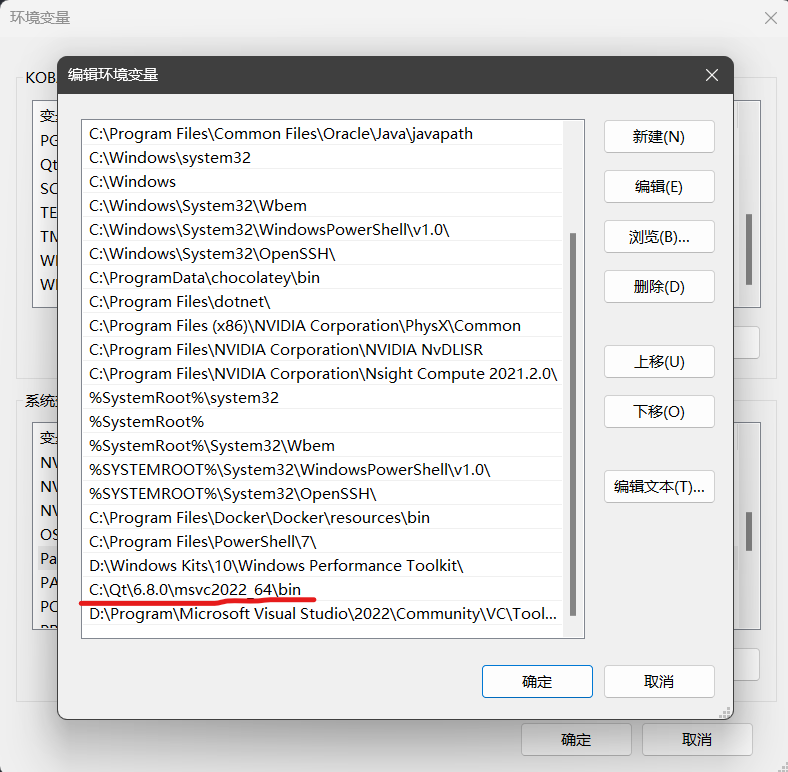

2. 安装 Visual Studio 2022

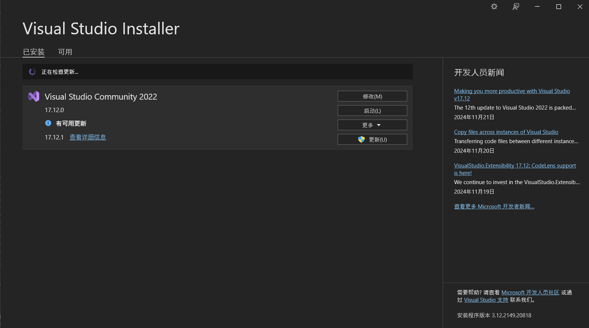

将VS配套的MSVC工具包添加到环境变量：

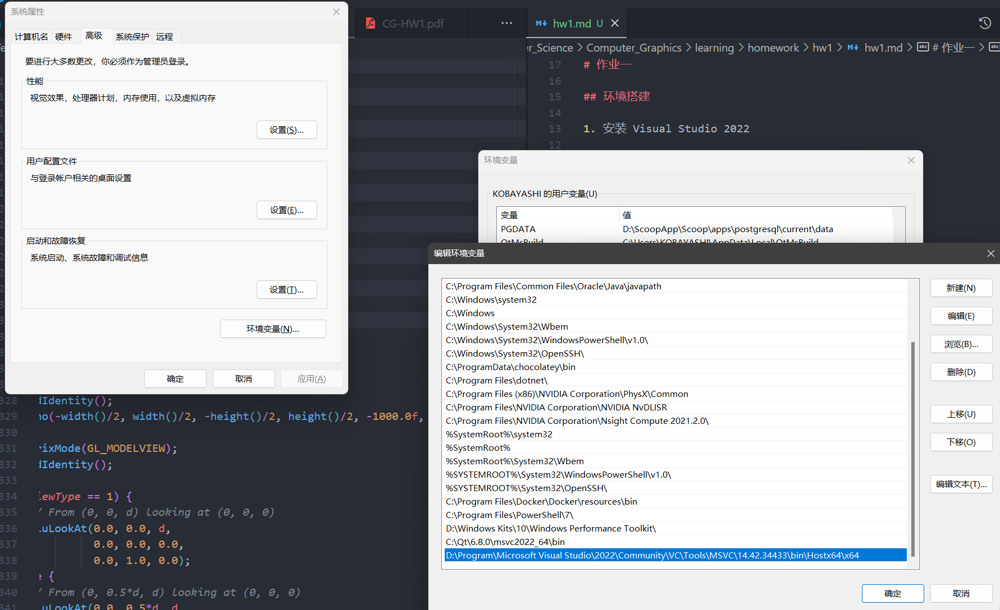

在 VS 上安装 Qt 插件


在 Qt 扩展的设置中，配置 Qt 的版本如下：

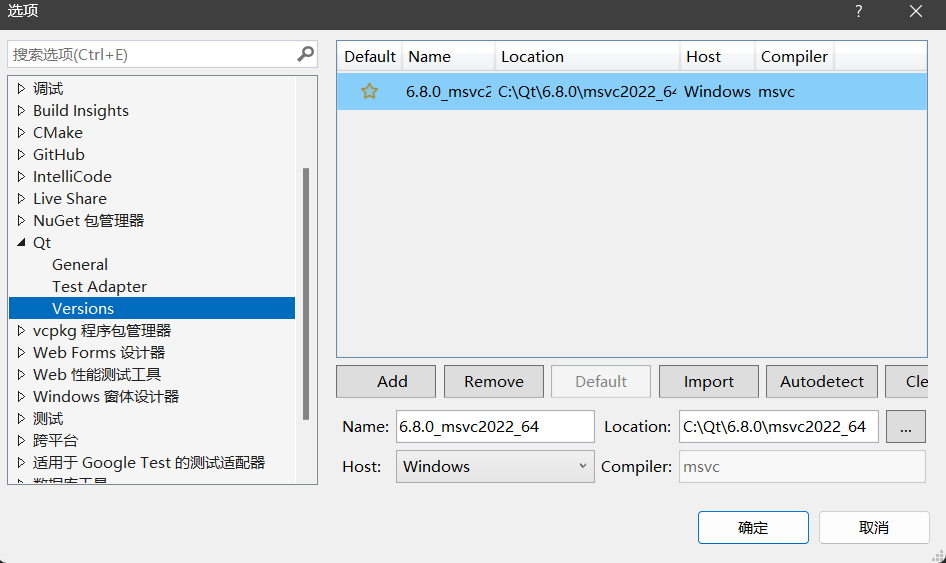

3. 生成VS项目文件

到CGTemplate文件夹下：

- 首先编写`CGTemplate.pro`文件如下：

```text
QT += core gui opengl openglwidgets

CONFIG += console qt c++11

DEFINES += QT_DEPRECATED_WARNINGS

INCLUDEPATH += "D:\Program\Code\Temp\HEAD\OpenGL\glew-2.2.0\include"

LIBS += \
	Glu32.lib \
	OpenGL32.lib
LIBS += glew32.lib

SOURCES += \
    main.cpp \
    myglwidget.cpp

HEADERS += \
    myglwidget.h
```

- 在`CGTempalte`文件夹下，运行指令：

```powershell
PS> qmake -tp vs
```

4. 配置项目

打开生成的VS项目文件，在项目属性中配置链接器中的附加库目录如下：

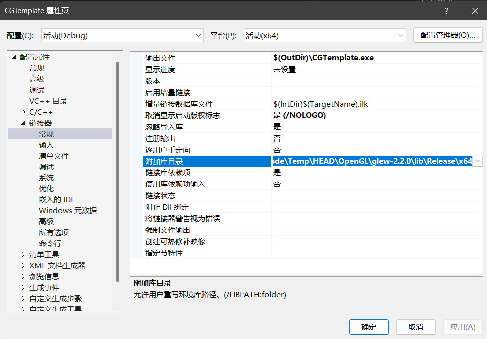

5. 编译运行

最终的运行效果如图：

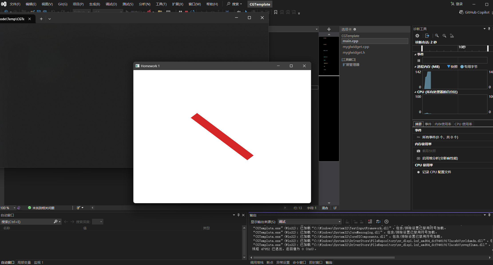

## 绘制平面姓名首字母

我的姓名首字母为LJZ。

### 使用`GL_TRIANGLES`进行绘制

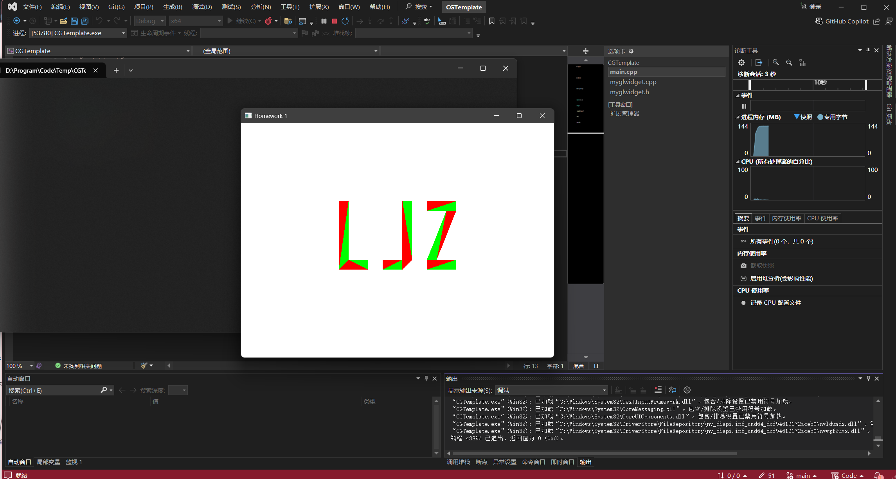

### 使用`GL_TRIANGLE_STRIP`进行绘制

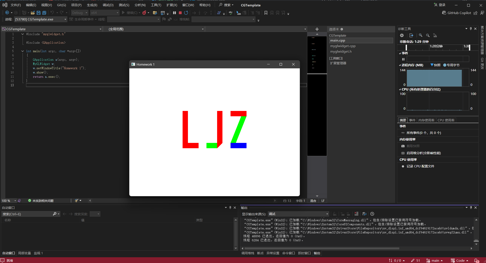

### 使用`GL_QUAD_STRIP`进行绘制

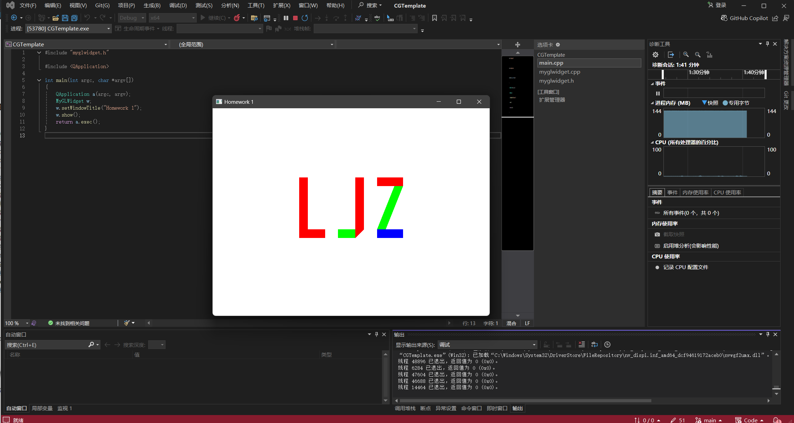

### 讨论内容

#### 比较 GL_TRIANGLES, GL_TRIANGLE_STRIP, GL_QUAD_STRIP 的绘制开销（需要的 glVertex 调用次数）

**使用`GL_TRIANGLES`进行绘制**

```cpp
void draw_L_1()
{
    glBegin(GL_TRIANGLES);
    glColor3f(1.0f, 0.0f, 0.0f);
    glVertex2f(-120.0f, 80.0f);
    glVertex2f(-100.0f, 80.0f);
    glVertex2f(-120.0f, -60.0f);
    glEnd();

    glBegin(GL_TRIANGLES);
    glColor3f(0.0f, 1.0f, 0.0f);
    glVertex2f(-100.0f, 80.0f);
    glVertex2f(-120.0f, -60.0f);
    glVertex2f(-100.0f, -40.0f);
    glEnd();

    glBegin(GL_TRIANGLES);
    glColor3f(1.0f, 0.0f, 0.0f);
    glVertex2f(-120.0f, -60.0f);
    glVertex2f(-100.0f, -40.0f);
    glVertex2f(-60.0f, -60.0f);
    glEnd();

    glBegin(GL_TRIANGLES);
    glColor3f(0.0f, 1.0f, 0.0f);
    glVertex2f(-100.0f, -40.0f);
    glVertex2f(-60.0f, -60.0f);
    glVertex2f(-60.0f, -40.0f);
    glEnd();
}

void draw_J_1()
{
    glBegin(GL_TRIANGLES);
    glColor3f(0.0f, 1.0f, 0.0f);
    glVertex2f(30.0f, 80.0f);
    glVertex2f(10.0f, 80.0f);
    glVertex2f(30.0f, -40.0f);
    glEnd();

    glBegin(GL_TRIANGLES);
    glColor3f(1.0f, 0.0f, 0.0f);
    glVertex2f(10.0f, 80.0f);
    glVertex2f(30.0f, -40.0f);
    glVertex2f(10.0f, -60.0f);
    glEnd();

    glBegin(GL_TRIANGLES);
    glColor3f(0.0f, 1.0f, 0.0f);
    glVertex2f(10.0f, -40.0f);
    glVertex2f(-30.0f, -60.0f);
    glVertex2f(10.0f, -60.0f);
    glEnd();

    glBegin(GL_TRIANGLES);
    glColor3f(1.0f, 0.0f, 0.0f);
    glVertex2f(-30.0f, -40.0f);
    glVertex2f(10.0f, -40.0f);
    glVertex2f(-30.0f, -60.0f);
    glEnd();
}

void draw_Z_1()
{
    glBegin(GL_TRIANGLES);
    glColor3f(1.0f, 0.0f, 0.0f);
    glVertex2f(60.0f, 80.0f);
    glVertex2f(120.0f, 80.0f);
    glVertex2f(60.0f, 60.0f);
    glEnd();

    glBegin(GL_TRIANGLES);
    glColor3f(0.0f, 1.0f, 0.0f);
    glVertex2f(120.0f, 80.0f);
    glVertex2f(60.0f, 60.0f);
    glVertex2f(120.0f, 60.0f);
    glEnd();

    glBegin(GL_TRIANGLES);
    glColor3f(1.0f, 0.0f, 0.0f);
    glVertex2f(120.0f, 60.0f);
    glVertex2f(100.0f, 60.0f);
    glVertex2f(80.0f, -40.0f);
    glEnd();

    glBegin(GL_TRIANGLES);
    glColor3f(0.0f, 1.0f, 0.0f);
    glVertex2f(100.0f, 60.0f);
    glVertex2f(80.0f, -40.0f);
    glVertex2f(60.0f, -40.0f);
    glEnd();

    glBegin(GL_TRIANGLES);
    glColor3f(1.0f, 0.0f, 0.0f);
    glVertex2f(60.0f, -40.0f);
    glVertex2f(60.0f, -60.0f);
    glVertex2f(120.0f, -40.0f);
    glEnd();

    glBegin(GL_TRIANGLES);
    glColor3f(0.0f, 1.0f, 0.0f);
    glVertex2f(60.0f, -60.0f);
    glVertex2f(120.0f, -40.0f);
    glVertex2f(120.0f, -60.0f);
    glEnd();
}
```

在本次的绘制中，字母`L`使用了12次`glVertex2f`函数，字母`J`使用了12次`glVertex2f`函数，字母`Z`使用了18次`glVertex2f`函数。


**使用`GL_TRIANGLE_STRIP`进行绘制**

```cpp
void draw_L_2()
{
    glBegin(GL_TRIANGLE_STRIP);
    glColor3f(1.0f, 0.0f, 0.0f);
    glVertex2f(-120.0f, 80.0f);
    glVertex2f(-100.0f, 80.0f);
    glVertex2f(-120.0f, -60.0f);
    glVertex2f(-100.0f, -40.0f);
    glVertex2f(-60.0f, -60.0f);
    glVertex2f(-60.0f, -40.0f);
    glEnd();
}

void draw_J_2()
{
    glBegin(GL_TRIANGLE_STRIP);
    glColor3f(1.0f, 0.0f, 0.0f);
    glVertex2f(30.0f, 80.0f);
    glVertex2f(10.0f, 80.0f);
    glVertex2f(30.0f, -40.0f);
    glVertex2f(10.0f, -60.0f);
    glEnd();

    glBegin(GL_TRIANGLE_STRIP);
    glColor3f(0.0f, 1.0f, 0.0f);
    glVertex2f(10.0f, -60.0f);
    glVertex2f(10.0f, -40.0f);
    glVertex2f(-30.0f, -60.0f);
    glVertex2f(-30.0f, -40.0f);
    glEnd();
}

void draw_Z_2()
{
    glBegin(GL_TRIANGLE_STRIP);
    glColor3f(1.0f, 0.0f, 0.0f);
    glVertex2f(60.0f, 80.0f);
    glVertex2f(120.0f, 80.0f);
    glVertex2f(60.0f, 60.0f);
    glVertex2f(120.0f, 60.0f);
    glEnd();

    glBegin(GL_TRIANGLE_STRIP);
    glColor3f(0.0f, 1.0f, 0.0f);
    glVertex2f(120.0f, 60.0f);
    glVertex2f(100.0f, 60.0f);
    glVertex2f(80.0f, -40.0f);
    glVertex2f(60.0f, -40.0f);
    glEnd();

    glBegin(GL_TRIANGLE_STRIP);
    glColor3f(0.0f, 0.0f, 1.0f);
    glVertex2f(60.0f, -40.0f);
    glVertex2f(60.0f, -60.0f);
    glVertex2f(120.0f, -40.0f);
    glVertex2f(120.0f, -60.0f);
    glEnd();
}
```

在本次的绘制中，字母`L`使用了6次`glVertex2f`函数，字母`J`使用了8次`glVertex2f`函数，字母`Z`使用了12次`glVertex2f`函数。

**使用`GL_QUAD_STRIP`进行绘制**

```cpp
void draw_L_3()
{
    glBegin(GL_QUAD_STRIP);
    glColor3f(1.0f, 0.0f, 0.0f);
    glVertex2f(-120.0f, 80.0f);
    glVertex2f(-100.0f, 80.0f);
    glVertex2f(-120.0f, -60.0f);
    glVertex2f(-100.0f, -40.0f);
    glVertex2f(-60.0f, -60.0f);
    glVertex2f(-60.0f, -40.0f);
    glEnd();
}

void draw_J_3()
{
    glBegin(GL_QUAD_STRIP);
    glColor3f(1.0f, 0.0f, 0.0f);
    glVertex2f(30.0f, 80.0f);
    glVertex2f(10.0f, 80.0f);
    glVertex2f(30.0f, -40.0f);
    glVertex2f(10.0f, -60.0f);
    glEnd();

    glBegin(GL_QUAD_STRIP);
    glColor3f(0.0f, 1.0f, 0.0f);
    glVertex2f(10.0f, -60.0f);
    glVertex2f(10.0f, -40.0f);
    glVertex2f(-30.0f, -60.0f);
    glVertex2f(-30.0f, -40.0f);
    glEnd();
}

void draw_Z_3()
{
    glBegin(GL_QUAD_STRIP);
    glColor3f(1.0f, 0.0f, 0.0f);
    glVertex2f(60.0f, 80.0f);
    glVertex2f(120.0f, 80.0f);
    glVertex2f(60.0f, 60.0f);
    glVertex2f(120.0f, 60.0f);
    glEnd();

    glBegin(GL_QUAD_STRIP);
    glColor3f(0.0f, 1.0f, 0.0f);
    glVertex2f(120.0f, 60.0f);
    glVertex2f(100.0f, 60.0f);
    glVertex2f(80.0f, -40.0f);
    glVertex2f(60.0f, -40.0f);
    glEnd();

    glBegin(GL_QUAD_STRIP);
    glColor3f(0.0f, 0.0f, 1.0f);
    glVertex2f(60.0f, -40.0f);
    glVertex2f(60.0f, -60.0f);
    glVertex2f(120.0f, -40.0f);
    glVertex2f(120.0f, -60.0f);
    glEnd();
}
```

在本次的绘制中，字母`L`使用了6次`glVertex2f`函数，字母`J`使用了8次`glVertex2f`函数，字母`Z`使用了12次`glVertex2f`函数。

**总结**

可以发现，在合理分配布局的情况下，使用`GL_TRIANGLE_STRIP`或者`GL_QUAD_STRIP`相比直接使用`GL_TRIANGLES`会使绘制效率更高。

#### 比较以下两个视角下，Orthogonal 及 Perspective 投影方式产生的图像

这里先给出两种投影的实现代码：

```cpp
void MyGLWidget::setOrthogonalProjection(int viewType)
{
    glMatrixMode(GL_PROJECTION);
    glLoadIdentity();
    glOrtho(-width()/2, width()/2, -height()/2, height()/2, -1000.0f, 1000.0f);

    glMatrixMode(GL_MODELVIEW);
    glLoadIdentity();

    if (viewType == 1) {
        // From (0, 0, d) looking at (0, 0, 0)
        gluLookAt(0.0, 0.0, d, 0.0, 0.0, 0.0, 0.0, 1.0, 0.0);
    } else {
        // From (0, 0.5*d, d) looking at (0, 0, 0)
        gluLookAt(0.0, 0.5*d, d, 0.0, 0.0, 0.0, 0.0, 1.0, 0.0);
    }

    glMatrixMode(GL_MODELVIEW);
    glTranslatef(0.0f, 0.0f, -d);
}

void MyGLWidget::setPerspectiveProjection(int viewType)
{
    glMatrixMode(GL_PROJECTION);
    glLoadIdentity();
    gluPerspective(45.0, (float)width() / (float)height(), 0.1, 1000.0);

    glMatrixMode(GL_MODELVIEW);
    glLoadIdentity();

    if (viewType == 1) {
        // From (0, 0, d) looking at (0, 0, 0)
        gluLookAt(0.0, 0.0, d, 0.0, 0.0, 0.0, 0.0, 1.0, 0.0);
    } else {
        // From (0, 0.5*d, d) looking at (0, 0, 0)
        gluLookAt(0.0, 0.5*d, d, 0.0, 0.0, 0.0, 0.0, 1.0, 0.0);
    }

    glMatrixMode(GL_MODELVIEW);
    glTranslatef(0.0f, 0.0f, -d);
}
```

1) 从(0, 0, d)看向原点(0, 0, 0)

- Orthogonal投影方式下：

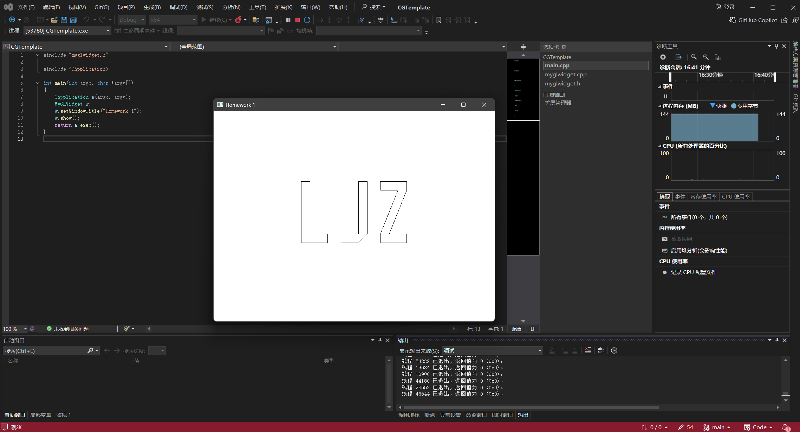

- Perspective投影方式下：

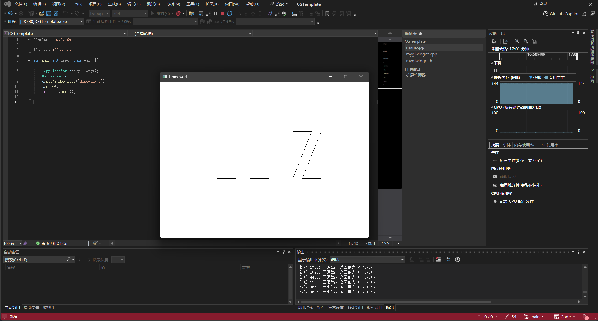

2) 从(0, 0.5*d, d)看向原点(0, 0, 0)

- Orthogonal投影方式：

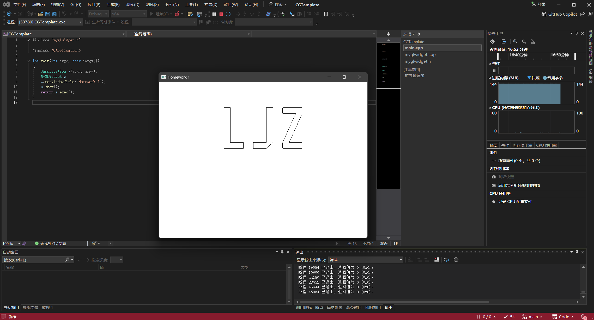

- Perspective投影方式下：

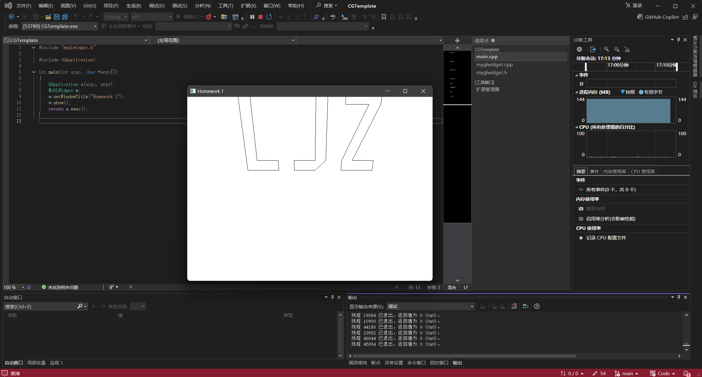

## 绘制立体姓氏首字母

先简单写个定时更新，用来暂时字母的旋转：

在`myglwidget.h`中添加：

```cpp
class MyGLWidget : public QOpenGLWidget{
    ...
private:
    float d = 200.0f;
    float rotationX, rotationY, rotationZ;
    QTimer *timer;
private slots:
    void updateRotation();
};
```

在`myglwidget.cpp`中添加：

```cpp
MyGLWidget::MyGLWidget(QWidget *parent)
    : QOpenGLWidget(parent),
      scene_id(0)
{
    timer = new QTimer(this);
    connect(timer, SIGNAL(timeout()), this, SLOT(updateRotation()));
    timer->start(16); 
}

void MyGLWidget::updateRotation()
{
    rotationX += 0.5f;
    rotationY += 0.7f;
    rotationZ += 0.3f;

    if (rotationX > 360.0f)
        rotationX -= 360.0f;
    if (rotationY > 360.0f)
        rotationY -= 360.0f;
    if (rotationZ > 360.0f)
        rotationZ -= 360.0f;

    update(); // Request a repaint
}
```

一个简单的TIMER就写完了。

随后绘制出3d的字母`L`：

```cpp
void draw_L_3d()
{
    // Front face - Red
    glColor3f(1.0f, 0.0f, 0.0f);
    glBegin(GL_QUAD_STRIP);
    glVertex3f(-10.0f, 80.0f, 10.0f);
    glVertex3f(10.0f, 80.0f, 10.0f);
    glVertex3f(-10.0f, -60.0f, 10.0f);
    glVertex3f(10.0f, -40.0f, 10.0f);
    glVertex3f(50.0f, -60.0f, 10.0f);
    glVertex3f(50.0f, -40.0f, 10.0f);
    glEnd();

    // Back face - Green
    glColor3f(0.0f, 1.0f, 0.0f);
    glBegin(GL_QUAD_STRIP);
    glVertex3f(-10.0f, 80.0f, -10.0f);
    glVertex3f(10.0f, 80.0f, -10.0f);
    glVertex3f(-10.0f, -60.0f, -10.0f);
    glVertex3f(10.0f, -40.0f, -10.0f);
    glVertex3f(50.0f, -60.0f, -10.0f);
    glVertex3f(50.0f, -40.0f, -10.0f);
    glEnd();

    // Side faces - Blue
    glColor3f(0.0f, 0.0f, 1.0f);
    glBegin(GL_QUAD_STRIP);
    glVertex3f(-10.0f, 80.0f, 10.0f);
    glVertex3f(-10.0f, 80.0f, -10.0f);
    glVertex3f(10.0f, 80.0f, 10.0f);
    glVertex3f(10.0f, 80.0f, -10.0f);
    glVertex3f(10.0f, -40.0f, 10.0f);
    glVertex3f(10.0f, -40.0f, -10.0f);
    glVertex3f(50.0f, -40.0f, 10.0f);
    glVertex3f(50.0f, -40.0f, -10.0f);
    glVertex3f(50.0f, -60.0f, 10.0f);
    glVertex3f(50.0f, -60.0f, -10.0f);
    glVertex3f(-10.0f, -60.0f, 10.0f);
    glVertex3f(-10.0f, -60.0f, -10.0f);
    glVertex3f(-10.0f, 80.0f, 10.0f);
    glVertex3f(-10.0f, 80.0f, -10.0f);
    glEnd();
}
```

这里的绘制思路非常简单，只需要将先前绘制L的代码稍作修改，在两个不同的z坐标上绘制出两个平面L，随后用GL_QUAD_STRIP直接将侧面绘制出来即可。

最后编写一个scene：

```cpp
void MyGLWidget::scene_a()
{
    glClear(GL_COLOR_BUFFER_BIT | GL_DEPTH_BUFFER_BIT);
    glEnable(GL_DEPTH_TEST);
    glDisable(GL_CULL_FACE);

    glMatrixMode(GL_PROJECTION);
    glLoadIdentity();
    gluPerspective(45.0, (GLfloat)width() / (GLfloat)height(), 0.1, 1000.0);

    glMatrixMode(GL_MODELVIEW);
    glLoadIdentity();
    glTranslatef(0.0f, 0.0f, -200.0f); // Changed to center the L shape

    // Apply rotation
    glRotatef(rotationX, 1.0f, 0.0f, 0.0f);
    // glRotatef(rotationY, 0.0f, 1.0f, 0.0f);
    // glRotatef(rotationZ, 0.0f, 0.0f, 1.0f);

    draw_L_3d();

    glDisable(GL_DEPTH_TEST);
}
```

最后将其注册到对应的按键上即可。最终的实现效果如下（更详细的可以看配套的视频展示）：


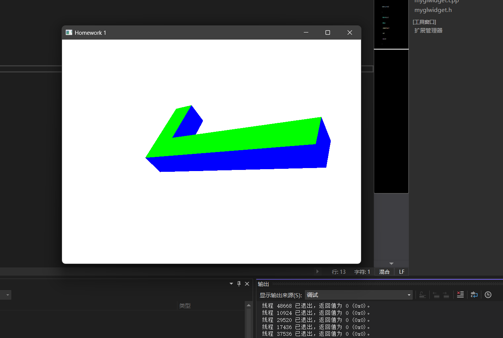

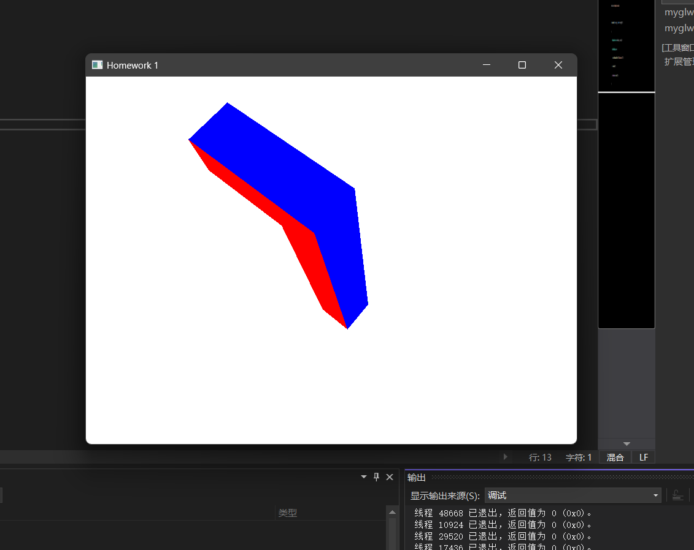

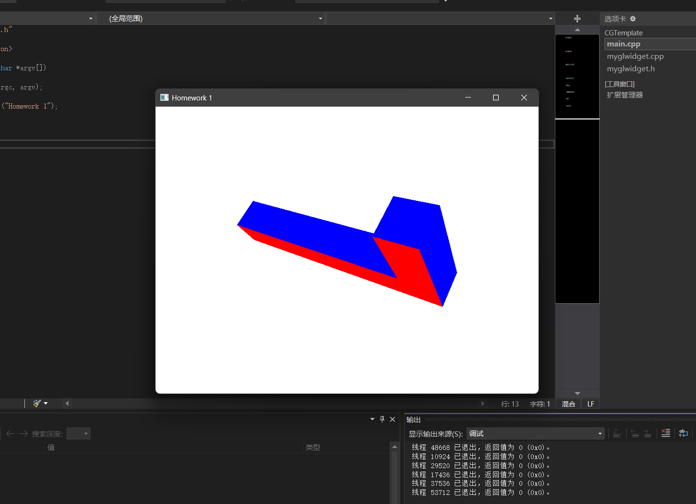


## 补充：代码运行说明

在本代码中，我自定义了许多触发按键，如下：

```cpp
void MyGLWidget::paintGL()
{
    switch (scene_id)
    {
        case 0: scene_0(); break;
        case 1: scene_1(); break;
        case 2: scene_2(); break;
        case 3: scene_3(); break;
        case 4: scene_4(); break;
        case 5: scene_5(); break;
        case 6: scene_6(); break;
        case 7: scene_7(); break;
        case 10: scene_a(); break;
        case 11: scene_b(); break;
        case 12: scene_c(); break;
        case 13: scene_d(); break;
        default: scene_0(); break;
    }
}
```

其中功能对应如下：

- KEY 0: 通过`GL_LINE_LOOP`绘制的`LJZ`
- KEY 1: 通过`GL_TRIANGLES`绘制的`LJZ`
- KEY 2: 通过`GL_TRIANGLE_STRIP`绘制的`LJZ`
- KEY 3: 通过`GL_QUAD_STRIP`绘制的`LJZ`
- KEY 4: 通过`OrthogonalProjection`投影，从(0, 0, d)看向原点(0, 0, 0)
- KEY 5: 通过`OrthogonalProjection`投影，从(0, 0.5*d, d)看向原点(0, 0, 0)
- KEY 6: 通过`PerspectiveProjection`投影，从(0, 0, d)看向原点(0, 0, 0)
- KEY 7: 通过`PerspectiveProjection`投影，从(0, 0.5*d, d)看向原点(0, 0, 0)
- KEY A: 3d的字母`L`，绕着X轴旋转
- KEY B: 3d的字母`L`，绕着Y轴旋转
- KEY C: 3d的字母`L`，绕着Z轴旋转
- KEY D: 3d的字母`L`，绕着XYZ轴同时旋转