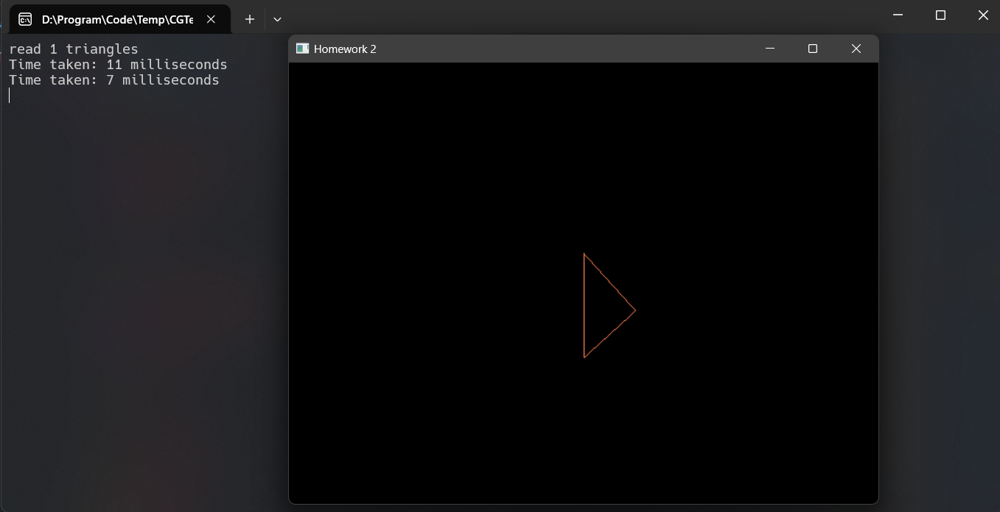
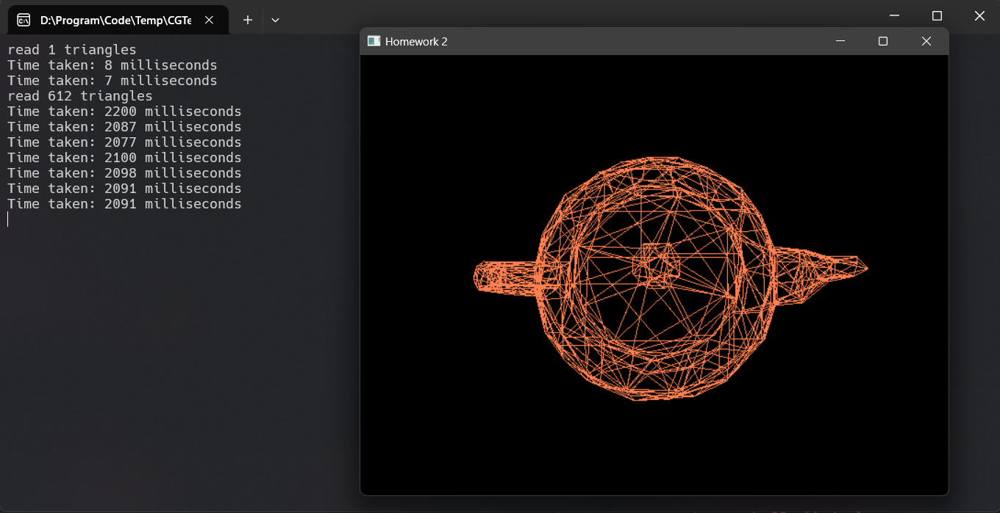
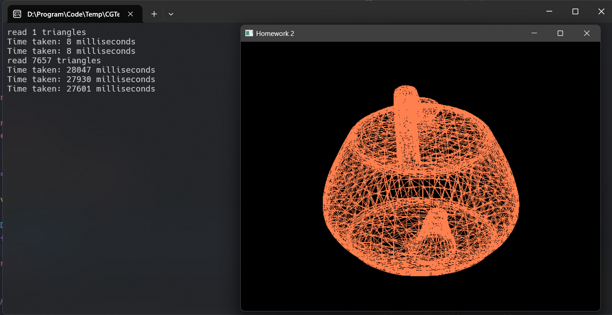
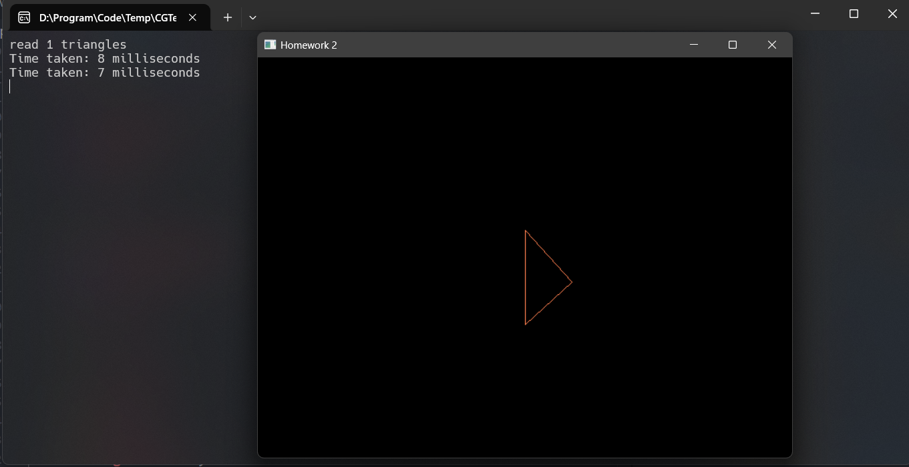
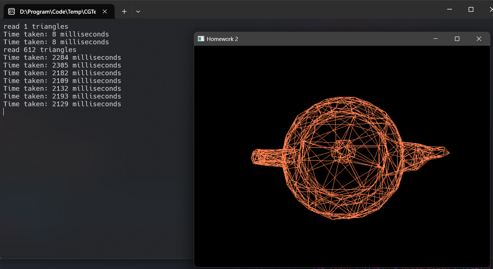
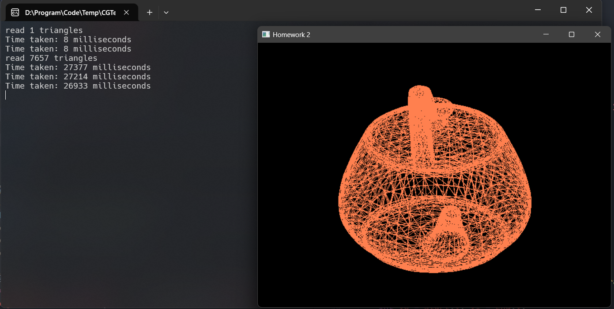
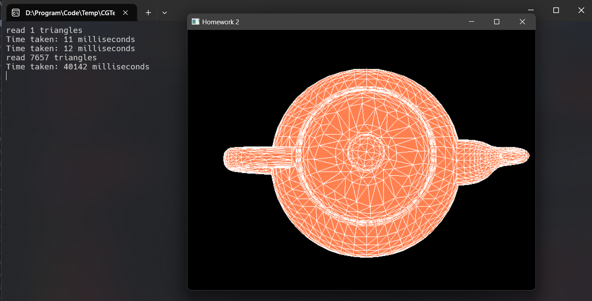
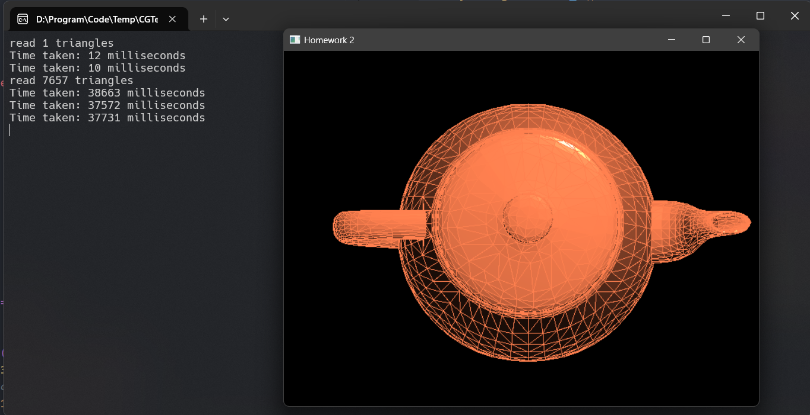
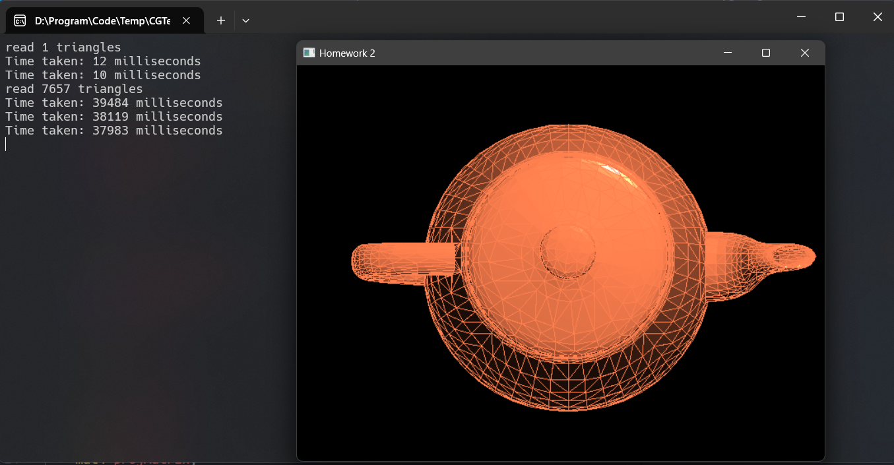
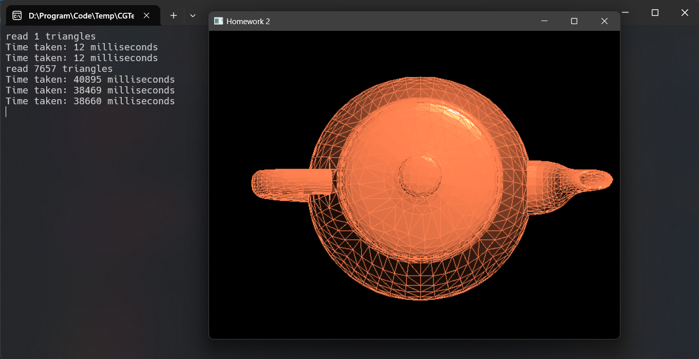

# 作业二

## 实现三角形的光栅化算法

### 用DDA实现三角形边的绘制

- DDA (Digital Differential Analyzer) 算法是一种增量式扫描转换算法。
- 它通过计算每一步的增量来绘制直线，在斜率小时按照起点到终点的x坐标差计算增量，在斜率大时按照起点到终点的y坐标差计算增量。

**实现过程**：

1. 计算 x 和 y 方向的差值（dx 和 dy）。
2. 确定步数（steps）为 dx 和 dy 的最大值。
3. 计算每步 x 和 y 的增量。
4. 从起点开始，每一步更新 x 和 y，并绘制像素。

**关键代码**：

```cpp
void MyGLWidget::dda(FragmentAttr& start, FragmentAttr& end, int id) {
	float x0 = start.x, x1 = end.x;
	float y0 = start.y, y1 = end.y;
	float z0 = start.z, z1 = end.z;

	float dx = x1 - x0;
	float dy = y1 - y0;
	float dz = z1 - z0;

	if (dx == 0 && dy == 0)
		return ;

	float steps = max(abs(dx), abs(dy));

	float xIncrement = dx / steps;
	float yIncrement = dy / steps;
	float zIncrement = dz / steps;

	float x = x0;
	float y = y0;
	float z = z0;

	for (int i = 0; i < steps; ++i) {
		if (x < 0 || x >= WindowSizeW || y < 0 || y >= WindowSizeH)
			return /* Do Nothing */;

		int index = (int)y * WindowSizeW + (int)x;	
		if (temp_z_buffer[index] > z) {
			temp_z_buffer[index] = z;
			temp_render_buffer[index] = lineColor;
		}
		x += xIncrement;
		y += yIncrement;
		z += zIncrement;
	}
}
```

**绘制效果（含计时）**：

- 绘制一个三角形



- 绘制teapot600



- 绘制teapot8000



### 用bresenham实现三角形边的绘制

- Bresenham 算法是一种基于整数运算的高效的光栅化算法。
- 它通过累积误差来决定下一个像素的位置，避免了浮点数运算。

**实现过程**：

1. 计算 dx 和 dy，确定主要方向。
2. 初始化误差项。
3. 对每个 x（或 y，取决于斜率），计算对应的 y（或 x）并绘制像素。
4. 更新误差项，决定是否需要在次要方向上移动。

**关键代码**：

```cpp
void MyGLWidget::bresenham(FragmentAttr& start, FragmentAttr& end, int id) {
	int x0 = start.x, x1 = end.x;
	int y0 = start.y, y1 = end.y;
	float z0 = start.z, z1 = end.z;

	int dx = abs(x1 - x0);
  	int dy = abs(y1 - y0);

	if (dx == 0 && dy == 0) 
		return ; 

  	int sx = (x0 < x1) ? 1 : -1;
  	int sy = (y0 < y1) ? 1 : -1;
	int err = dx - dy;

	float steps = max(dx, dy);
	float zIncrement = (z1 - z0) / steps;

	int x = x0;
	int y = y0;
	float z = z0;

	while (x != x1 || y != y1) {

		if (x < 0 || x >= WindowSizeW || y < 0 || y >= WindowSizeH)
			return /* Do Nothing */;

		int index = y * WindowSizeW + x;
		if (temp_z_buffer[index] > z) {
			temp_z_buffer[index] = z;
			temp_render_buffer[index] = lineColor;
		}
		int e2 = 2 * err;
		if (e2 > -dy) { err -= dy; x += sx; }
		if (e2 < dx) { err += dx; y += sy; }
		z += zIncrement;
	}
}
```

**绘制效果（含计时）**：

- 绘制一个三角形



- 绘制teapot600



- 绘制teapot8000




### 用edge-walking填充

- Edge-walking 算法通过扫描三角形的边缘，确定每一行需要填充的起点和终点，然后在这些点之间进行插值和填充。

**实现过程**：

1. 创建边缘表，记录每一行的边缘像素。
2. 对每一行，找出左右边界。
3. 在边界之间进行插值和填充。
4. 应用选定的着色模型（Gouraud、Phong 或 Blinn-Phong）。

**关键代码**：

```cpp
void MyGLWidget::edge_walking(FragmentAttr* transformedVertices) {
	std::vector<std::vector<std::pair<int, float>>> edge_table(WindowSizeH);

	for (int y = 0; y < WindowSizeH; ++y) {
		for (int x = 0; x < WindowSizeW; ++x) {
			int index = y * WindowSizeW + x;
			if (temp_render_buffer[index] != vec3(0.0, 0.0, 0.0))
				edge_table[y].push_back({x, temp_z_buffer[index]});
		}
	}

	for (int y = 0; y < WindowSizeH; ++y) {
        if (edge_table[y].size() >= 2) {
            std::sort(edge_table[y].begin(), edge_table[y].end());
            
            for (size_t i = 0; i < edge_table[y].size() - 1; ++i) {
				int x_start = edge_table[y][i].first;
                int x_end = edge_table[y][i + 1].first;
                float z_start = edge_table[y][i].second;
                float z_end = edge_table[y][i + 1].second;

				if (x_start == x_end) continue;

				for (int x = x_start + 1; x < x_end; ++x) {
					int index = y * WindowSizeW + x;	

					float t = (float)(x - x_start) / (x_end - x_start);
					float interpolated_z = z_start + t * (z_end - z_start);
					temp_z_buffer[index] = interpolated_z;

					switch(shadingMode) {
					case GOURAUD:
						temp_render_buffer[index] = GouraudShading(x, y, transformedVertices);
						break;
					case PHONG:
						temp_render_buffer[index] = PhongShading(x, y, transformedVertices);
						break;
					case BLINN_PHONG:
						temp_render_buffer[index] = BlinnPhongShading(x, y, transformedVertices);
						break;
					default:
						temp_render_buffer[index] = objectColor;
					}
				}
			}
		}
	}
}
```

**绘制效果（这里给出的是直接填色的效果）**：



### 针对不同面数的模型，从实际运行时间角度讨论DDA、bresenham的绘制效率

我尽量使两个函数的实现结构与调用的函数保持一致。分析上述实际运行时间，发现DDA与Bresenham在绘制不同面数的模型时所耗费的时间差不多。更准确地讲，DDA的绘制效率会稍微高一点。我推测在Bresenham算法中，将部分浮点运算转换为整数运算所获得的时间收益，并不足以抵消将浮点类型转换为整数类型所带来的时间损耗。

## 实现光照、着色

顶点着色函数：

```cpp
vec3 MyGLWidget::calculateVertexLighting(const vec3& position, const vec3& normal) {
    vec3 norm = normalize(normal);
    vec3 lightDir = normalize(lightPosition - position);
    vec3 viewDir = normalize(camPosition - position);
    vec3 reflectDir = reflect(-lightDir, norm);

    vec3 ambient = ambientStrength * lightColor;

    float diff = max(dot(norm, lightDir), 0.0f);
    vec3 diffuse = diff * lightColor;

    float spec = pow(max(dot(viewDir, reflectDir), 0.0f), 32);
    vec3 specular = specularStrength * spec * lightColor;

    vec3 result = (ambient + diffuse + specular) * objectColor;
    return result;
}
```

计算三角形重心坐标的函数：

```cpp
void MyGLWidget::calculateBarycentricCoordinates(int x, int y, FragmentAttr* v, float& alpha, float& beta, float& gamma) {
    vec2 p(x, y);
    vec2 a(v[0].x, v[0].y);
    vec2 b(v[1].x, v[1].y);
    vec2 c(v[2].x, v[2].y);

    vec2 v0 = b - a, v1 = c - a, v2 = p - a;
    float d00 = dot(v0, v0);
    float d01 = dot(v0, v1);
    float d11 = dot(v1, v1);
    float d20 = dot(v2, v0);
    float d21 = dot(v2, v1);
    float denom = d00 * d11 - d01 * d01;

    beta = (d11 * d20 - d01 * d21) / denom;
    gamma = (d00 * d21 - d01 * d20) / denom;
    alpha = 1.0f - beta - gamma;
}
```

### 用Gouraud实现三角形内部的着色

- Gouraud 着色在顶点级别计算光照，然后在三角形内部进行颜色插值。
- 这种方法计算量较小，但可能在高光效果上不够精确。

**实现过程**：

1. 在顶点着色阶段计算每个顶点的颜色。
2. 在光栅化阶段，使用重心坐标对顶点颜色进行插值。

**关键代码**：

```cpp
vec3 MyGLWidget::GouraudShading(int x, int y, FragmentAttr* v) {
    float alpha, beta, gamma;
    calculateBarycentricCoordinates(x, y, v, alpha, beta, gamma);

    vec3 color = alpha * v[0].color + beta * v[1].color + gamma * v[2].color;
    return color;
}
```

**绘制效果（含计时）**：



### 用Phong模型实现三角形内部的着色

- Phong 着色在每个像素级别计算光照。
- 它对法向量插值，再根据插值法向量计算每个像素的光照

**实现过程**：

1. 在三角形的每个顶点处提供法向量
2. 对三角形内部的法向量进行插值处理
3. 在每个像素处，使用插值后的法向量重新计算光照方程，得到像素的最终颜色

**关键代码**：

```cpp
vec3 MyGLWidget::PhongShading(int x, int y, FragmentAttr* v) {
    float alpha, beta, gamma;
    calculateBarycentricCoordinates(x, y, v, alpha, beta, gamma);

    // Interpolate position and normal
    vec3 position = alpha * vec3(v[0].pos_mv) + beta * vec3(v[1].pos_mv) + gamma * vec3(v[2].pos_mv);
    vec3 normal = normalize(alpha * v[0].normal + beta * v[1].normal + gamma * v[2].normal);

    // Calculate lighting
    vec3 lightDir = normalize(lightPosition - position);
    vec3 viewDir = normalize(camPosition - position);
    vec3 reflectDir = reflect(-lightDir, normal);

    // Ambient
    vec3 ambient = ambientStrength * lightColor;

    // Diffuse
    float diff = max(dot(normal, lightDir), 0.0f);
    vec3 diffuse = diff * lightColor;

    // Specular
    float spec = pow(max(dot(viewDir, reflectDir), 0.0f), 32);
    vec3 specular = specularStrength * spec * lightColor;

    // Combine results
    vec3 result = (ambient + diffuse + specular) * objectColor;
    return result;
}
```

**绘制效果（含计时）**：



### 用Blinn-Phong实现三角形内部的着色

- 与 Phong 着色类似，但改进了光照计算中的高光部分。

**实现过程**：

1. 在三角形的每个顶点处计算法向量和光照信息
2. 在每个像素处，插值法向量并计算半程向量（光源方向与观察方向的中点向量）
3. 使用插值后的法向量和半程向量计算高光分量以及最终像素颜色

**关键代码**：

```cpp
vec3 MyGLWidget::BlinnPhongShading(int x, int y, FragmentAttr* v) {
    float alpha, beta, gamma;
    calculateBarycentricCoordinates(x, y, v, alpha, beta, gamma);

    // Interpolate position and normal
    vec3 position = alpha * vec3(v[0].pos_mv) + beta * vec3(v[1].pos_mv) + gamma * vec3(v[2].pos_mv);
    vec3 normal = normalize(alpha * v[0].normal + beta * v[1].normal + gamma * v[2].normal);

    // Calculate lighting
    vec3 lightDir = normalize(lightPosition - position);
    vec3 viewDir = normalize(camPosition - position);
    vec3 halfwayDir = normalize(lightDir + viewDir);

    // Ambient
    vec3 ambient = ambientStrength * lightColor;

    // Diffuse
    float diff = max(dot(normal, lightDir), 0.0f);
    vec3 diffuse = diff * lightColor;

    // Specular
    float spec = pow(max(dot(normal, halfwayDir), 0.0f), 64);
    vec3 specular = specularStrength * spec * lightColor;

    // Combine results
    vec3 result = (ambient + diffuse + specular) * objectColor;
    return result;
}
```

**绘制效果（含计时）**：



### 结合实际运行时间讨论三种不同着色方法的效果、着色效率

分析上述三种着色方法的实际运行时间，发现Gouraud着色的绘制效率最高，其次是Phong和Blinn-Phong。Gouraud直接对像素值进行插值不重新应用光照模型，计算开销最小。Blinn-Phong相较于Phong还多了一个半程向量计算，计算开销最大。

而从图中可以看出，Blinn-Phong对高亮的着色的效果明显优于两外两种方法。