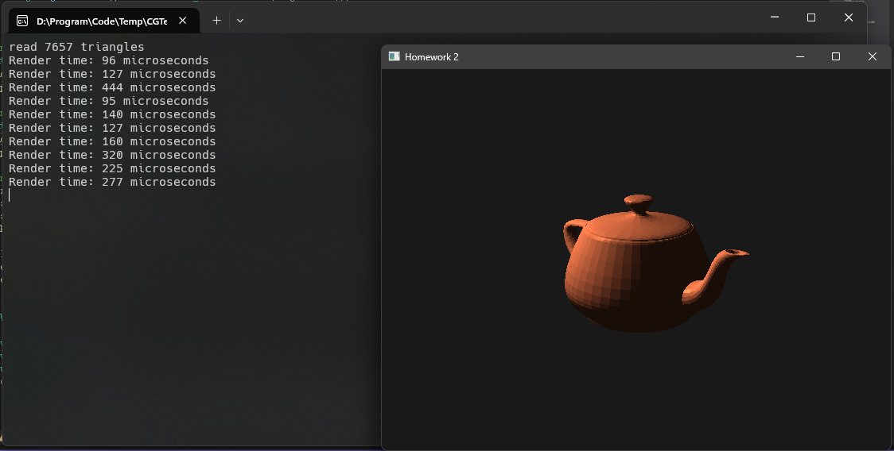
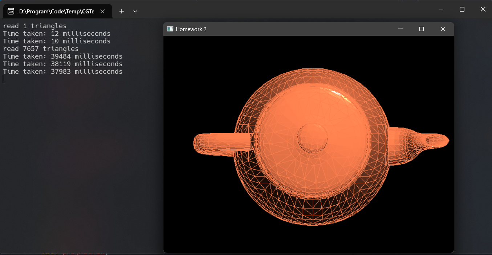
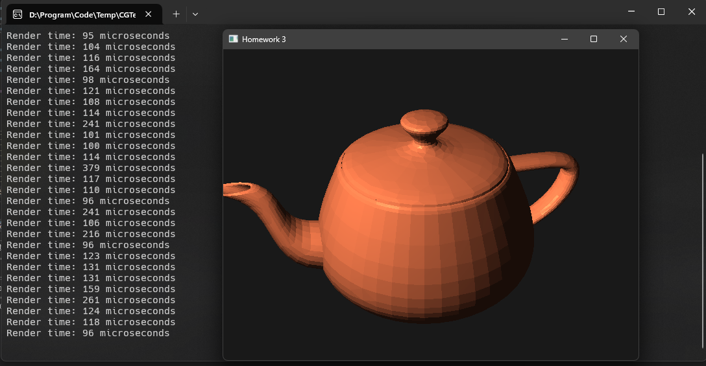
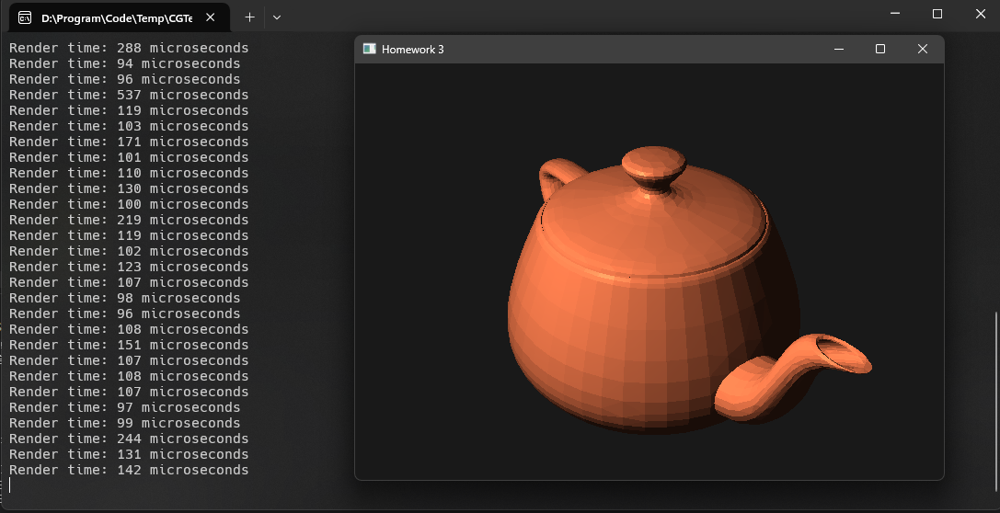

# 作业三：Phong shading 与 VBO 绘制三维物体

## 1. 代码实现

### 初始化着色器

- 首先在`MyGLWidget`中定义一个成员变量`shaderProgram`。顶点着色器与片段着色器连接为一个渲染管线后将其ID存储在该变量中：

```cpp
class MyGLWidget : public QOpenGLWidget, protected QOpenGLExtraFunctions {
private:
    GLuint shaderProgram;
}
```

- 定义顶点着色器

顶点着色器主要用于处理每个顶点的数据变换，起到一个数据预处理的作用。实现如下：

```glsl
#version 330 core
layout (location = 0) in vec3 aPos;
layout (location = 1) in vec3 aNormal;

out vec3 FragPos;
out vec3 Normal;

uniform mat4 model;
uniform mat4 view;
uniform mat4 projection;

void main()
{
    FragPos = vec3(model * vec4(aPos, 1.0));
    Normal = mat3(transpose(inverse(model))) * aNormal;  
    gl_Position = projection * view * vec4(FragPos, 1.0);
}
```

- 定义片段着色器

片段着色器主要用于计算每个像素的颜色。它将会接收来自顶点着色器的输出数据，并根据光照模型进行计算后合并光照效果后输出最终的颜色。实现如下：

```glsl
#version 330 core
out vec4 FragColor;

in vec3 Normal;
in vec3 FragPos;

uniform vec3 lightPos;
uniform vec3 viewPos;
uniform vec3 lightColor;
uniform vec3 objectColor;

void main()
{
    // ambient
    float ambientStrength = 0.1;
    vec3 ambient = ambientStrength * lightColor;
  	
    // diffuse 
    vec3 norm = normalize(Normal);
    vec3 lightDir = normalize(lightPos - FragPos);
    float diff = max(dot(norm, lightDir), 0.0);
    vec3 diffuse = diff * lightColor;
    
    // specular
    float specularStrength = 0.5;
    vec3 viewDir = normalize(viewPos - FragPos);
    vec3 reflectDir = reflect(-lightDir, norm);  
    float spec = pow(max(dot(viewDir, reflectDir), 0.0), 32);
    vec3 specular = specularStrength * spec * lightColor;  
        
    vec3 result = (ambient + diffuse + specular) * objectColor;
    FragColor = vec4(result, 1.0);
}
```

- 编译连接着色器

着色器的编译与连接将会在`initShaders`中完成，得到的结果将会存储在`shaderProgram`中。

```cpp
void MyGLWidget::initShaders()
{
    // Read vertex shader
    std::ifstream vertexFile("shaders/vertex_shader.glsl");
    std::string vertexSource((std::istreambuf_iterator<char>(vertexFile)),
                              std::istreambuf_iterator<char>());
    const char* vertexShaderSource = vertexSource.c_str();

    // Read fragment shader
    std::ifstream fragmentFile("shaders/fragment_shader.glsl");
    std::string fragmentSource((std::istreambuf_iterator<char>(fragmentFile)),
                                std::istreambuf_iterator<char>());
    const char* fragmentShaderSource = fragmentSource.c_str();

    // Compile vertex shader
    GLuint vertexShader = glCreateShader(GL_VERTEX_SHADER);
    glShaderSource(vertexShader, 1, &vertexShaderSource, NULL);
    glCompileShader(vertexShader);

    // Compile fragment shader
    GLuint fragmentShader = glCreateShader(GL_FRAGMENT_SHADER);
    glShaderSource(fragmentShader, 1, &fragmentShaderSource, NULL);
    glCompileShader(fragmentShader);

    // Link shaders
    shaderProgram = glCreateProgram();
    glAttachShader(shaderProgram, vertexShader);
    glAttachShader(shaderProgram, fragmentShader);
    glLinkProgram(shaderProgram);

    // Delete shaders as they're linked into our program now and no longer necessary
    glDeleteShader(vertexShader);
    glDeleteShader(fragmentShader);
}
```

### 初始化场景

`initScene`主要是用于读取物体模型以及初始化摄像机，为了方便起见，我在该函数中直接将物体的坐标中心变换到了原点。实现如下：

```cpp
void MyGLWidget::initScene()
{
    objModel.loadModel("./objs/teapot_8000.obj");

    vec3 center = objModel.centralPoint;
    mat4 centerTransform = glm::translate(mat4(1.0f), -center);
    for (auto& vertex : objModel.vertices_data) {
        vec4 centered = centerTransform * vec4(vertex, 1.0f);
        vertex = vec3(centered);
    }
    objModel.centralPoint = vec3(0.0f);

    camPosition = vec3(300 * cos(degree * 3.14 / 180.0), 100, 300 * sin(degree * 3.14 / 180.0));
    camLookAt = vec3(0.0f);
    camUp = vec3(0, 1, 0);
    projMatrix = glm::perspective(glm::radians(35.0f), (float)WindowSizeW / (float)WindowSizeH, 0.1f, 2000.0f);
    lightPosition = vec3(0, 100, 100);
}
```

### 初始化缓存区

`initBufferes`用于初始化OpenGL缓冲区，为3D模型的渲染做准备。这个过程包括了创建和配置顶点数组对象（VAO）、顶点缓冲对象（VBO）和元素缓冲对象（EBO）。实现如下：

```cpp
void MyGLWidget::initBuffers()
{
    std::vector<float> vertexData;
    std::vector<uint> indices;
    for (uint i = 0; i < static_cast<unsigned int>(objModel.triangleCount); ++i) {
        for (uint j = 0; j < 3; ++j) {
            const auto& vertex = objModel.vertices_data[objModel.triangles[i][j]];
            const auto& normal = objModel.normals_data[objModel.triangle_normals[i][j]];
            vertexData.insert(vertexData.end(), {vertex.x, vertex.y, vertex.z, normal.x, normal.y, normal.z});
        }
        indices.insert(indices.end(), {i*3, i*3+1, i*3+2});
    }

    glGenVertexArrays(1, &VAO);
    glGenBuffers(1, &VBO);
    glGenBuffers(1, &EBO);

    glBindVertexArray(VAO);

    glBindBuffer(GL_ARRAY_BUFFER, VBO);
    glBufferData(GL_ARRAY_BUFFER, vertexData.size() * sizeof(float), vertexData.data(), GL_STATIC_DRAW);

    glBindBuffer(GL_ELEMENT_ARRAY_BUFFER, EBO);
    glBufferData(GL_ELEMENT_ARRAY_BUFFER, indices.size() * sizeof(unsigned int), indices.data(), GL_STATIC_DRAW);

    glVertexAttribPointer(0, 3, GL_FLOAT, GL_FALSE, 6 * sizeof(float), (void*)0);
    glEnableVertexAttribArray(0);
    glVertexAttribPointer(1, 3, GL_FLOAT, GL_FALSE, 6 * sizeof(float), (void*)(3 * sizeof(float)));
    glEnableVertexAttribArray(1);

    glBindVertexArray(0);
}
```

### 绘制

`paintGL`函数是绘制函数。它将会传递参数到着色器中并完成最终的绘制。实现如下：

```cpp
void MyGLWidget::paintGL()
{
    auto start_time = std::chrono::high_resolution_clock::now();

    glClear(GL_COLOR_BUFFER_BIT | GL_DEPTH_BUFFER_BIT);

    glUseProgram(shaderProgram);

    mat4 model = mat4(1.0f);
    model = glm::rotate(model, degree, vec3(0.0f, 1.0f, 0.0f));
    mat4 view = glm::lookAt(camPosition, camLookAt, camUp);

    glUniformMatrix4fv(glGetUniformLocation(shaderProgram, "model"), 1, GL_FALSE, glm::value_ptr(model));
    glUniformMatrix4fv(glGetUniformLocation(shaderProgram, "view"), 1, GL_FALSE, glm::value_ptr(view));
    glUniformMatrix4fv(glGetUniformLocation(shaderProgram, "projection"), 1, GL_FALSE, glm::value_ptr(projMatrix));

    glUniform3fv(glGetUniformLocation(shaderProgram, "lightPos"), 1, glm::value_ptr(lightPosition));
    glUniform3fv(glGetUniformLocation(shaderProgram, "viewPos"), 1, glm::value_ptr(camPosition));
    glUniform3fv(glGetUniformLocation(shaderProgram, "lightColor"), 1, glm::value_ptr(lightColor));
    glUniform3fv(glGetUniformLocation(shaderProgram, "objectColor"), 1, glm::value_ptr(objectColor));

    glBindVertexArray(VAO);
    glDrawElements(GL_TRIANGLES, objModel.triangleCount * 3, GL_UNSIGNED_INT, 0);
    glBindVertexArray(0);

    auto end_time = std::chrono::high_resolution_clock::now();
    auto duration = std::chrono::duration_cast<std::chrono::microseconds>(end_time - start_time);
    qDebug() << "Render time:" << duration.count() << "microseconds";
}
```

## 2. 运行效果



## 3. 对比 Phong shading 与 OpenGL 自带的 smoothing shading 的区别

Phong shading 和 OpenGL 的 smooth shading 是两个不同层面的概念。Phong shading 是一种光照计算模型，而 smooth shading 是一种顶点数据插值技术。在一个 OpenGL 应用中，两种技术往往是互补的：smooth shading 用于平滑地插值顶点属性，而 Phong shading 则利用这些插值后的数据在每个像素上进行光照的计算。

## 4. 使用 VBO 进行绘制及通过 glVertex 进行绘制的区别

### 使用glVertex进行绘制的实现

在HW2中，我们使用了 glVertex 进行绘制：

```cpp
void MyGLWidget::scene_1()
{
	// 选择要加载的model
	// objModel.loadModel("./objs/teapot_600.obj");
	objModel.loadModel("./objs/teapot_8000.obj");
	//objModel.loadModel("./objs/rock.obj");
	//objModel.loadModel("./objs/cube.obj");
	//objModel.loadModel("./objs/singleTriangle.obj");
	
	// 自主设置变换矩阵
	camPosition = vec3(100 * sin(degree * 3.14 / 180.0) + objModel.centralPoint.x, 100 * cos(degree * 3.14 / 180.0) + objModel.centralPoint.y, 10+ objModel.centralPoint.z);
	camLookAt = objModel.centralPoint;     // 例如，看向物体中心
	camUp = vec3(0, 1, 0);         // 上方向向量
	projMatrix = glm::perspective(radians(25.0f), 1.0f, 0.1f, 2000.0f);

	// 单一点光源，可以改为数组实现多光源
	lightPosition = objModel.centralPoint + vec3(0,100,100);
	clearBuffer(render_buffer);
	clearZBuffer(z_buffer);
	for (int i = 0; i < objModel.triangleCount; i++) {
		Triangle nowTriangle = objModel.getTriangleByID(i);
		drawTriangle(nowTriangle);
	}
	glClear(GL_COLOR_BUFFER_BIT);
	renderWithTexture(render_buffer, WindowSizeH, WindowSizeW);
}
```

读上述代码，我们发现最终的绘制通过调用函数`renderWithTexture`完成，该函数的作用是将缓存数组中的像素显示在窗口上，实现如下：

```cpp
void renderWithTexture(vec3* render_buffer,int h, int w) {
	glMatrixMode(GL_PROJECTION);
	glPushMatrix();
	glLoadIdentity();
	glMatrixMode(GL_MODELVIEW);
	glPushMatrix();
	glLoadIdentity();
	glEnable(GL_TEXTURE_2D);	
	GLuint texID;
    glGenTextures(1, &texID);
    glBindTexture(GL_TEXTURE_2D, texID);
    glTexParameteri(GL_TEXTURE_2D, GL_TEXTURE_MIN_FILTER, GL_LINEAR);
    glTexParameteri(GL_TEXTURE_2D, GL_TEXTURE_MAG_FILTER, GL_LINEAR);
    glTexImage2D(GL_TEXTURE_2D, 0, GL_RGB, w, h, 0, GL_RGB, GL_FLOAT, render_buffer);
    glEnable(GL_TEXTURE_2D);
    glBindTexture(GL_TEXTURE_2D, texID);
	glBegin(GL_QUADS);
	glTexCoord2f(0.0f, 0.0f);
	glVertex2f(-1.0f, -1.0f);
	glTexCoord2f(0.0f, 1.0f);
	glVertex2f(-1.0f, 1.0f);
	glTexCoord2f(1.0f, 1.0f);
	glVertex2f(1.0f, 1.0f);
	glTexCoord2f(1.0f, 0.0f);
	glVertex2f(1.0f, -1.0f);
	glEnd();
	glDisable(GL_TEXTURE_2D);
	glPopMatrix();
	glMatrixMode(GL_PROJECTION);
	glPopMatrix();
	glPopAttrib();
}
```

### 对比

1. 数据传输：

- VBO：将顶点数据存储在GPU内存中，减少CPU到GPU的数据传输操作。
- glVertex：每次绘制时都需要从CPU传输数据到GPU。

2. 性能

- VBO：能够最大限度调用GPU的并行计算功能，能够显著提高渲染效率。
- glVertex：由于每次绘制都需要从CPU传输数据到GPU，因此效率较低。

3. 实际对比

- VBO：


- glVertex：



可以看到，绘制同一个模型时，VBO相较于glVertex绘制速度有巨大的提升。

## 5. 讨论 VBO 中是否使用 index array 的效率的区别

### 不使用EBO的实现

在上述的代码实现中已经包含了EBO的实现，如果要将其去除，只需要去除`initBuffers`中的EBO的创建与配置，以及将`paintGL`中的`glDrawElements`改为`glDrawArrays`即可。

```cpp
glDrawArrays(GL_TRIANGLES, 0, objModel.triangleCount * 3);
```

### 对比

- 不使用EBO的实现：



- 使用EBO的实现：
  


使用EBO时，顶点数据只需要存储一次，通过复用顶点数据，提高了绘制的效率。然而，似乎8000左右的三角形绘制对于VBO绘制来说还是太少了，最终绘制所用的时间均不超过1ms，两者并无明显的差别。

## 6. 对比、讨论 HW3 和 HW2 的渲染结果、效率的差别

- HW3：


- HW2：


效率方面的对比我在上述讨论VBO与glVertex绘制的区别时已经进行讨论。从绘制效果上看，两者也并不能看出有很大的区别（HW2中有边的展示，但是不是很影响，主要看块内的着色即可）。