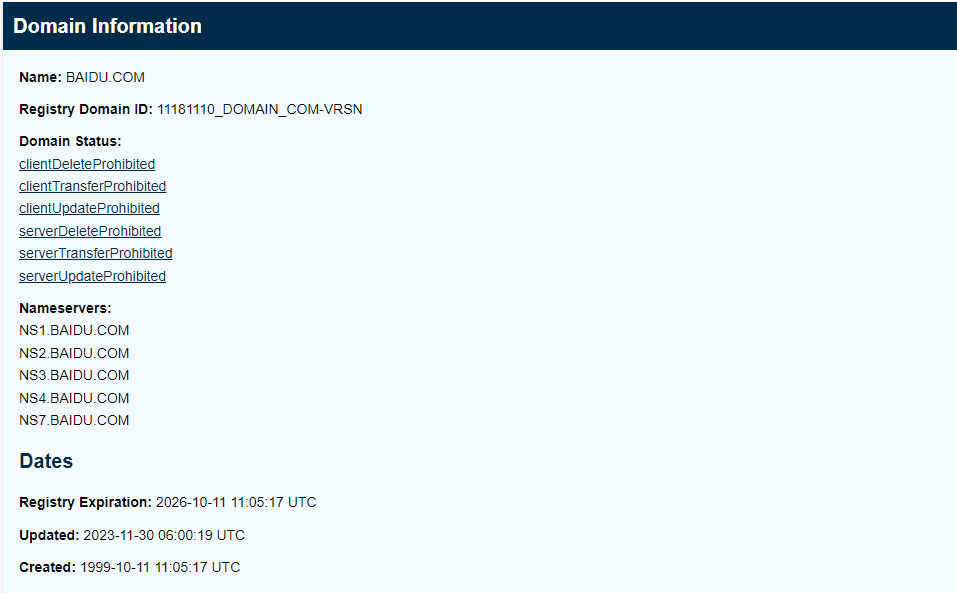

# p4 p7 p8 p15

# p18

**a**

whois数据库是一个用来查询域名是否被注册，以及被注册的域名的详细信息的数据库

**b**

我使用的是ICANN WHOIS（https://lookup.icann.org/）

**c**

**d**

- 使用nslookup找出一台具有多个IP地址的Web服务器：

- 你所在的机构（学校或公司）的Web服务器具有多个IP地址吗？答：没有。

**e**

ARIN查不到，换用另外的whois数据库查询：

实际范围为：202.116.64.0—202.116.95.255

**f**

攻击者可以通过whois和nslookup工具查询到机构的IP范围、DNS服务器地址，以便定位机构。

**g**

1. 透明度和问责制

- WHOIS服务提供了域名和IP地址注册信息的透明度，这对于维护互联网的开放性和问责制至关重要。
- 公众可以查询谁拥有特定的域名或IP地址，这有助于防止匿名滥用互联网资源。

2. 安全和打击网络犯罪

- 执法机构和安全研究人员可以使用WHOIS数据来调查和打击网络犯罪、垃圾邮件和网络钓鱼等活动。
- 公众访问可以帮助识别可疑的域名注册模式，从而提高整体网络安全性。

3. 技术运营和故障排除

- 网络管理员和技术人员可以使用WHOIS数据来解决网络问题，如确定特定IP地址的所有者以处理滥用投诉。

4. 学术研究和互联网发展

- 研究人员可以利用WHOIS数据进行互联网结构、域名市场和网络拓扑等方面的研究，推动互联网的发展和改进。

# p23

# 24

# 26

