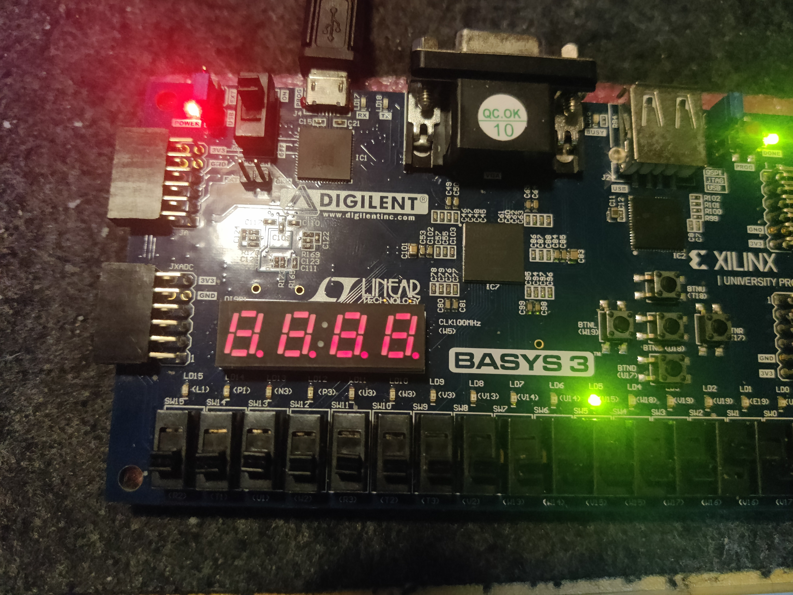
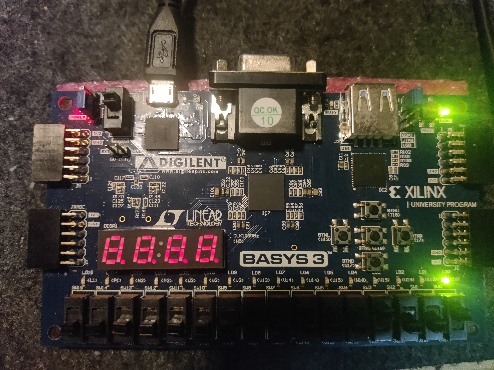

# 实验四：流水灯

## 一、实验目的

1. 熟悉使用vivado进行FPGA开发的流程

## 二、实验内容

使用vivado进行FPGA开发，实现流水灯功能：

1. 16个LED灯依次循环点亮
2. 实现功能位：（使用拨码开关）
   1. Run：开始运行
   2. Stop：停止运行
   3. Reset：重置
   4. Reverse：反转

## 三、实验原理

1. 时钟分频

   由于FPGA的时钟频率过高，因此需要对时钟进行分频，以便于观察到LED灯的变化。

2. verilog编写循环与控制逻辑

## 四、实验器材

1. BASYS3开发板
2. Vivado 2017.4

## 五、实验过程纪录

**初始状态**


**暂停状态**



**重置状态**



## 六、实验代码


**Top.v**

```verilog
module Top(
    input CLK,
    input Reset,
    input Reverse,
    input Stop,
    input Run,

    output [15:0] LED
    );

    StreamLight _StreamLight(
        .CLK_in(CLK),
        .Reset(Reset),
        .Reverse(Reverse),
        .Stop(Stop),
        .Run(Run),
        .LED(LED)
        );
endmodule
```

**StreamLight.v**

以下是流水灯实现的verilog代码：

input：
CLK_in：时钟信号
Reset：重置信号
Reverse：反转信号
Stop：暂停信号
Run：运行信号

output：
LED：LED灯输出 LED[15]为最左边的灯，LED[0]为最右边的灯

代码思路：
该模块通过使用cnt计数的方式实现CLK信号的分频，从而时人眼能够观察到灯的变化；其次是通过二进制码左移与右移的方式来控制每盏灯的亮灭，从而实现流水灯的效果。


```verilog
module StreamLight(
    input CLK_in,
    input Reset,
    input Reverse,
    input Stop,
    input Run,

    output reg [15:0] LED
    );

    reg [31:0] cnt = 0;

    always @(posedge CLK_in) begin
        if (!Run) begin
            cnt <= 0;
            LED <= 0;
        end
        else if (Reset) begin
            cnt <= 0;
            LED <= 1;
        end
        else if (Stop) begin
            cnt <= cnt;
            LED <= LED;
        end
        else begin
            if (cnt == 10000000) begin
                cnt <= 0;
                if (Reverse) begin 
                    LED <= (LED >> 1);
                    if (LED == 0)
                        LED <= 16'h8000;
                end
                else begin
                LED <= (LED << 1);
                if (LED == 0)
                    LED <= 1;
                end
            end
            else begin
                cnt <= cnt + 1;
                LED <= LED;
            end
        end
    end
endmodule
```