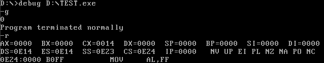
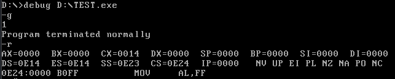
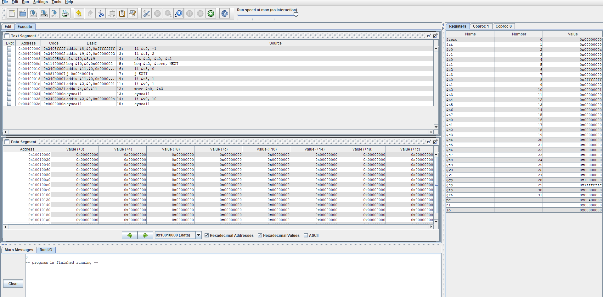
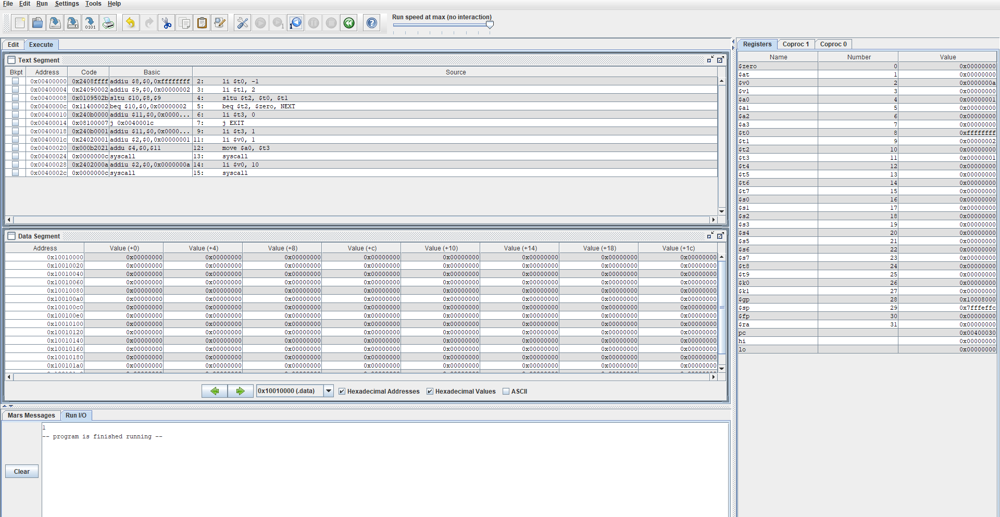

# 计算机组成原理第四次理论作业

[toc]

## 4.1 

**4.1.1**

指令：`AND Rd,Rs,Rt`
解释：`Reg[Rd] = Reg[Rs] AND Reg[Rt]`

控制单元产生的控制信号：

|控制信号名|控制信号值|
|:---:|:---:|
|RegDst|0|
|RegWrite|1|
|ALUSrc|0|
|Branch|0|
|MemRead|0|
|MemWrite|0|
|MemtoReg|1|
|ALUOp1|1|
|ALUOp0|0|

**4.1.2**

该指令将使用除了分支操作中计算转移地址的Add单元和与之配套的左移两位运算单元、数据存储器以及符号扩展单元之外的所有功能单元

**4.1.3**

2中所述的4个单元均会产生输出，但不会被使用；
没有单元不产生输出


## 4.2

指令：`LWI Rt,Rd(Rs)`
解释：`Reg[Rt] = Mem[Reg[Rd] + Reg[Rs]]`

**4.2.1**

对于上述指令而言，已有的还可以被使用的单元有：

指令存储器、寄存器堆（读与写端口）、ALU、数据存储器

**4.2.2**

对于上述指令而言，还需要增加的单元有：

无，已有的单元足以完成指令的执行

**4.2.3**

为了支持这些指令，还需要增加的控制信号有：

无，已有的控制信号足以完成指令的执行


## 4.3

**4.3.1**

改进前后的时钟周期分别为：

改进前：

```
Clock Cycle Time = 
    I-Mem +  (read instruction)
    Regs  +  (assume that the Regs and Control start at the same time.
             Regs cost 200ps, Control Unit cost 100ps, 
             Regs cost more 100ps, 
             so the CCT depends on Regs)
    Mux   +  (select ALU input)
    ALU   + 
    Data Memory + 
    Mux     (select value from memory to be written into Registers)
```

$$CCT = 400ps + 200ps + 30ps + 120ps + 350ps + 30ps = 1130ps$$

改进后：

$$CCT_new = CCT + 300ps = 1430ps$$

**4.3.2**

改进后将获得的加速比：

$$Speedup = \frac{1}{0.95}*\frac{1130}{1430} = 0.83$$

**4.3.3**

改进前后的性价比：

$$OldCost = I-Mem + Regs + Control + ALU + D-Mem + 2*Add + 3*Mux = 3890$$

$$NewCost = OldCost + 600 = 4490$$

$$RelativeCost = \frac{4490}{3890} = 1.15$$

## 4.4

**4.4.1**

如果只考虑连续取指，那么时钟周期为200ps

**4.4.2**

如果只需考虑无条件相对跳转指令，那么时钟周期应为：

$$T = I-Mem + Sign-Extend + Shift-Left-2 + Add + Mux$$
$$T = 200 + 15 + 10 + 70 + 20 = 315ps$$

**4.4.3**

如果只需考虑有条件相对跳转指令，那么时钟周期应为：

$$T = I-Mem + Regs + Mux + ALU + Mux$$
$$T = 200 + 90 + 20 + 90 + 20 = 420ps$$

**4.4.4**

要使用到Shift-Left-2单元的指令有：beq

**4.4.5**

该单元位于其关键路径上的指令有：无（综合4.4.3与4.4.4可得出此结论）

**4.4.6**

只考虑beq和add指令：

根据4.4.2与4.4.3的结算结果可得出，当SL2的延时超过105ps时，beq指令的关键路径将会变为包含SL2单元的路径，此后SL2延时的增长将会导致时钟周期的增长

## 4.7

原指令字：

1010 1100 0110 0010 0000 0000 0001 0100

**4.7.1**

Sign-Extend单元的输出为：

0000 0000 0000 0000 0000 0000 0001 0100

Jump's Shift-Left-2单元的输出为：

0001 1000 1000 0000 0000 0101 0000

**4.7.2**

ALU控制单元的输入为：

ALUOp[1-0] = 00 Instructon[5-0] = 010100(ignore)

**4.7.3**

该指令执行后新的PC值为：

$$New PC = PC + 4$$

Path:

$$PC -> Add(PC+4) -> Branch Mux -> Jump Mux -> PC$$

**4.7.4**

给出每个多选器数据输出的值：

Mux Name | Output
-|-
WrReg Mux | 0 or 2 (RegDst is X)
ALU Mux | 20
Mem/ALU Mux | X
Branch Mux | PC + 4
Jump Mux | PC + 4

**4.7.5**

ALU的输入为：-3 20

Add(PC+4)：PC 4

Add(Branch)：PC 4

**4.7.6**

给出寄存器堆所有输入信号的值：

1. Read Register 1

2. Read Register 2

3. Write Register

4. Write Data

5. RegWrite

## 4.8

**4.8.1**

流水线处理器的时钟周期为：350ps

非流水线处理器的时钟周期为：250ps + 350ps + 150ps + 300ps + 200ps = 1250ps

**4.8.2**

lw指令在流水线处理器和非流水线处理器中的总延迟分别是：

流水线处理器：1750ps

非流水线处理器：1250ps

**4.8.3**

划分：ID

划分后处理器的时钟周期为：300ps

**4.8.4**

假设没有阻塞和冒险，数据存储器的利用率为：20% + 15% = 35%

**4.8.5**

假设没有阻塞和冒险，寄存器堆的写寄存器端口的利用率为：45% + 20% = 65%

**4.8.6**

在这种设计下，指令仅经过其所需的阶段，这将意味着，以下指令所需的时钟周期为：

LW 5 cycles
SW 4 cycles (no WB)
R-type 4 cycles (no MEM)
BEQ 3 cycles (no MEM or WB)

由此可得出：

多周期设计的总执行时间是流水线设计的总执行时间的 $0.20 * 5 + 0.20 * 3 + 0.60 * 4 = 4$ 倍

单周期设计的总执行时间是流水线设计的总执行时间的 $1250/350 = 3.57$ 倍

## 2.23

```asm
$t2 = 3
```

## 2.25

**2.25.1**

I-type指令合适

**2.25.2**

```asm
addi $t2, $t2, -1
beq $t2, $zero, loop
```

## 简述如何使用SF、ZF、OF、CF标志位来判断两个数的大小关系

有符号数比较：

等于：ZF = 1
大于：OF ^ SF = 0
小于：OF ^ SF = 1

无符号数比较：

等于：ZF = 1
大于：CF = 0 and ZF = 0
小于：CF = 1


## 下面两段程序执行完后相关寄存器的值分别为多少？这两段程序的区别是什么？运行这两个程序，检查分析结果是否正确（结果需截屏）

**program1**
```asm
code segment
assume cs:code
begin:
    mov al, -1
    cmp al, 2   
    jg NEXT
    mov dl, '0'
    jmp EXIT
NEXT:
    mov dl, '1'
EXIT:
    mov ah, 2
    int 21h
    mov ah, 4ch
    int 21h
code ends
end begin
```

**运行结果及执行完后相关寄存器的值**



**program2**
```asm
code segment
assume cs:code
begin:
    mov al, -1
    cmp al, 2   
    ja NEXT
    mov dl, '0'
    jmp EXIT
NEXT:
    mov dl, '1'
EXIT:
    mov ah, 2
    int 21h
    mov ah, 4ch
    int 21h
code ends
end begin
```

**运行结果及执行完后相关寄存器的值**


**结果分析**

两个程序的区别在于：

在`program1`中，程序使用了`ja`指令进行跳转，而在`program2`中，程序使用了`jg`指令进行跳转

`ja`指令是无符号数比较的跳转指令，而`jg`指令是有符号数比较的跳转指令

`cmp`比较-1与2，相当于将-1的补码与2的补码进行相加，比较后相关的符号位：

ZF = 0(NZ) OF = 0(NV) CF = 0(NC) SF = 1(NA)

`jg`指令的判断条件为：OF ^ SF = 0，但此时 OF ^ SF = 1，因此`jg`不会使程序跳转，最终程序会输出`0`

`ja`指令的判断条件为：CF = 0 and ZF = 0，因此`ja`会使程序跳转到`NEXT`标签处，最终程序会输出`1`

## 编写实现上述两个程序功能的MIPS程序，运行并截屏

**program1**
```asm
.text
    li $t0, -1
    li $t1, 2
    slt $t2, $t0, $t1
    beq $t2, $zero, NEXT
    li $t3, 0
    j EXIT
NEXT:
    li $t3, 1
EXIT:
    li $v0, 1
    move $a0, $t3
    syscall
    li $v0, 10
    syscall
```

**运行结果及执行完后相关寄存器的值**



**program2**
```asm
.text
    li $t0, -1
    li $t1, 2
    sltu $t2, $t0, $t1
    beq $t2, $zero, NEXT
    li $t3, 0
    j EXIT
NEXT:
    li $t3, 1
EXIT:
    li $v0, 1
    move $a0, $t3
    syscall
    li $v0, 10
    syscall
```

**运行结果及执行完后相关寄存器的值**

