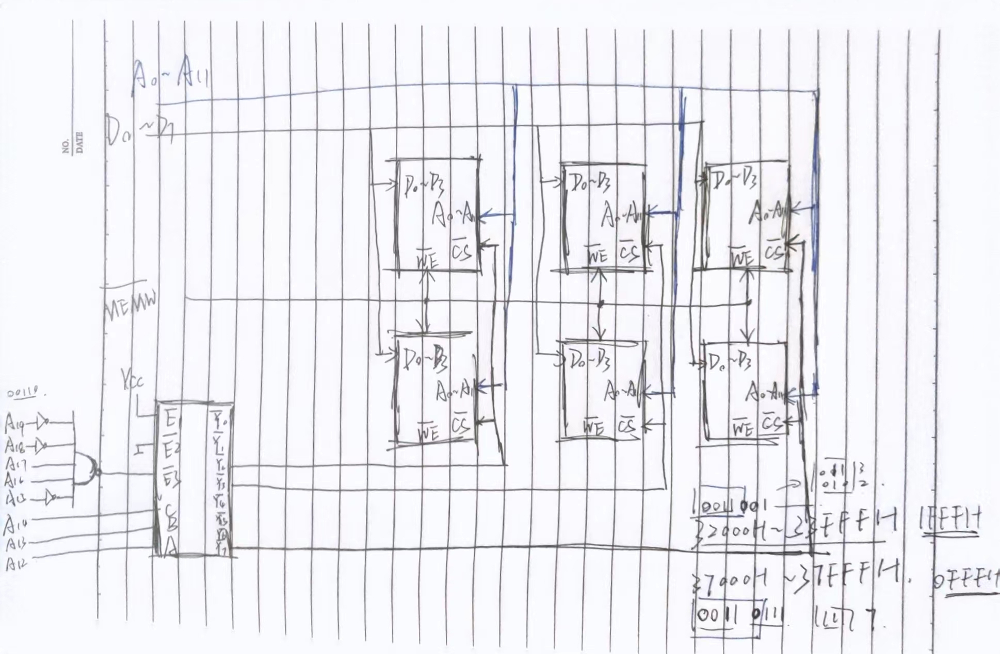
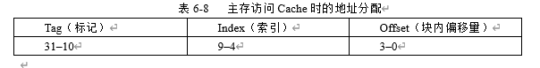
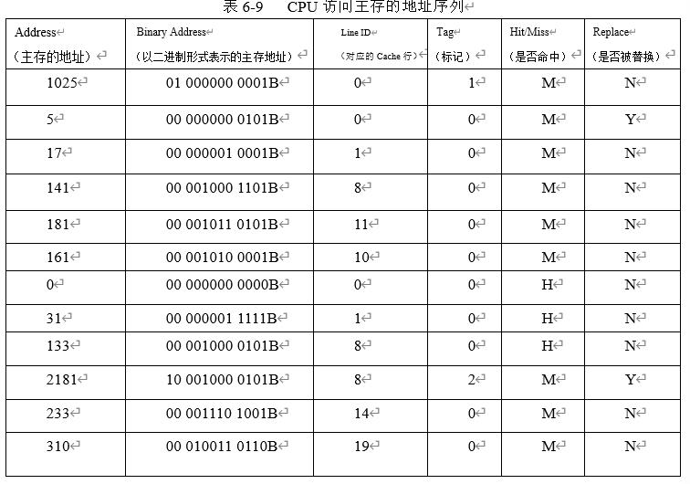
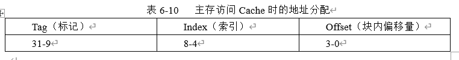
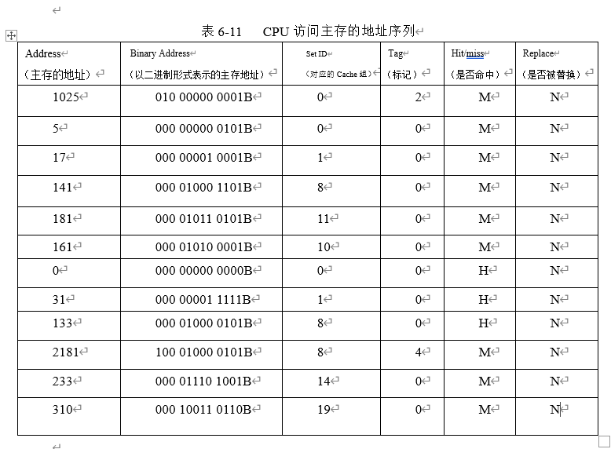
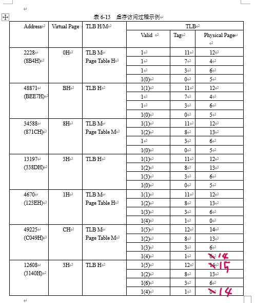
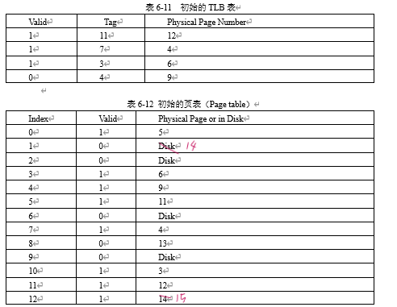

# 存储器习题（11.24）

## 1. 若某微机系统的系统RAM存储器由四个模块组成，每个模块的容量为128K字节，若四个模块的地址是连续的，最低地址为00000H，试指出每个模块的首末地址。

- 模块一：
  - 首地址：00000H
  - 末地址：1FFFFH
- 模块二：
  - 首地址：20000H
  - 末地址：3FFFFH
- 模块三：
  - 首地址：40000H
  - 末地址：5FFFFH
- 模块四：
  - 首地址：60000H
  - 末地址：7FFFFH

## 2. 对于下列芯片，它们的片内地址线各有多少根？若分别用以下芯片组成容量为64K字节的模块，试指出分别需要多少芯片？

(1) Intel 2114 (1Kx4bit)

- 片内地址线：10根
- 需要芯片：128块

(2) Intel 6116 (2Kx8bit)

- 片内地址线：11根
- 需要芯片：32块

(3) Intel 2164 (64Kx1bit)

- 片内地址线：16根
- 需要芯片：8块

(4) Intel 3148 (4Kx8bit)

- 片内地址线：12根
- 需要芯片：16块

## 3. 某SRAM芯片，容量为4Kx4位，该芯片有数据线、地址线、片选信号线$\overline{CS}$和读写控制信号线$\overline{WR}$。请问：

(1) 该RAM芯片有几根地址线？几根数据线？

- 地址线：12根
- 数据线：4根

(2) 现要在8088为CPU的微机系统中，用该芯片构成RAM2（地址范围为：32000H-33FFFH）和RAM4（地址范围为：37000H-37FFFH）两个内存模块，请画出扩展这两个模块的存储器连接图。（连接图中可选用三八译码器和与非门等。）

- 如下图：

# 存储器习题（11.28）

## 1. 假设在一个微机系统中，主存的地址为32位，主存访问Cache时采用直接相联映像方式，主存访问Cache时的地址分配如表6-8所示。CPU访问主存的十进制形式的地址序列如表6-9最左列所示。请问：

(1) Cache块的大小是多少个字节？

- Offset为4位，所以块大小为$2^4=16Byte$

(2) Cache有多少个条目？

- Index为6位，所以条目数为$2^6=64$

(3) 若从开机起，CPU按表6-9的主存地址访问Cache，请完成表6-9的填写。有多少个块被替换了？命中率是多少？

- 完成表格如下：（这里假设Cache初始为空）

- 有两个块被替换了
- 命中率为：$3/12 = 25\%$

# 存储器习题（12.1）

（接上题）

## 2. 若Cache块的大小和个数与题1相同，现改为2路组相连映射。参照表6-8画出主存访问Cache时的地址分配表，填入表6-10。若从开机起，CPU按表6-11的主存地址访问Cache，请完成表6-11的填写。有多少个块被替换了？命中率是多少？并与题1的结果进行比较。

- 相连度每增加1位，组数就会减少1/2，因此用来索引cache的位数也要相应减1，而标记位则是增1。因此得到新的Cache地址分配表如下：

- 完成表格如下：（这里假设Cache初始为空）

- 没有块被替换
- 命中率为：$3/12 = 25\%$

- 可以看出，相连度增加后，命中率没有变化，替换次数减少了。实际上当查询次数足够多时，2路相连的cache替换数相对会更少，命中率也更高。

# 海明码习题（12.8）

## 1. 已知：信息码为：“11001100”（k=8），试求出海明码。

- 过程如下：

| 位置 | 1 | 2 | 3 | 4 | 5 | 6 | 7 | 8 | 9 | 10 | 11 | 12 |
| ---- | - | - | - | - | - | - | - | - | - | -- | -- | -- |
| 编码之后的数据位 | **p1** | **p2** | d1 | **p3** | d2 | d3 | d4 | **p4** | d5 | d6 | d7 | d8 |
| P1 | X |   | X |   | X |   | X |   | X |   | X |   |
| P2 |   | X | X |   |   | X | X |   |   | X | X |   |
| P3 |   |   |   | X | X | X | X |   |   |   |   | X |
| P4 |   |   |   |   |   |   |   | X | X | X | X | X |
| 海明码 | 1 | 0 | 1 | 1 | 1 | 0 | 0 | 0 | 1 | 1 | 0 | 0 |

- 海明码为：101110001100

## 2. 已知：接收的海明码字为：“100110001100”（k=8），试求出发送端的信息码。

- 校验位分别为：$p_1=1,p_2=0,p_3=1,p_4=0$，海明码检测到错误位为3，即第三位发生错误，因此正确信息码为：$1100 1100$

# 虚存习题（12.8）

虚拟存储器采用页表来追踪虚拟地址到物理地址的映射。假设下列数据构成了一个微机系统中的虚拟地址流。假设页的大小是4KB（即：$2^{12}$B），有一个4条目的块表（TLB）如表6-11所示，初始页表如表6-12所示。采用最近最少使用替换算法（LRU）。当某个页要从磁盘装入主存时，页表中最大的主存页号加1。页表中，若某个虚拟页在内存中，则Valid位为1；不在内存中，则Valid位为0。

- 虚存访问过程如下：

- 最终的页表如下：

