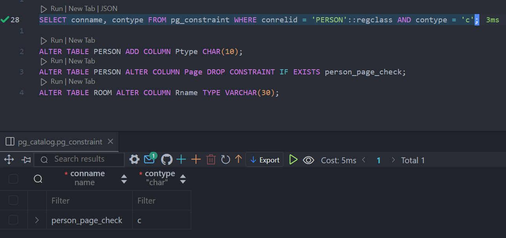
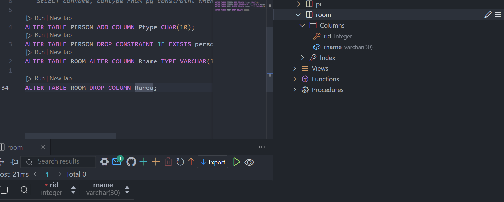
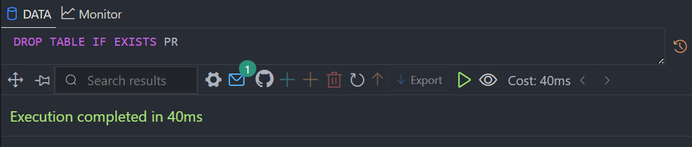
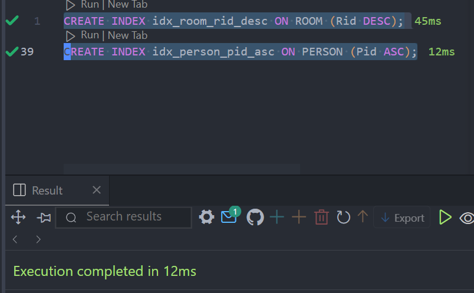
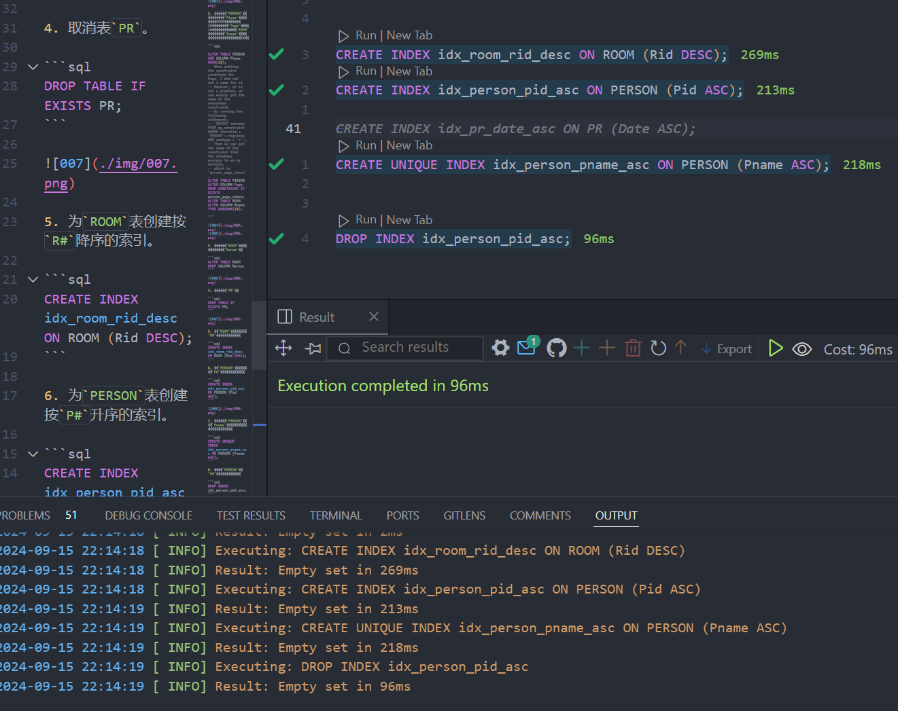
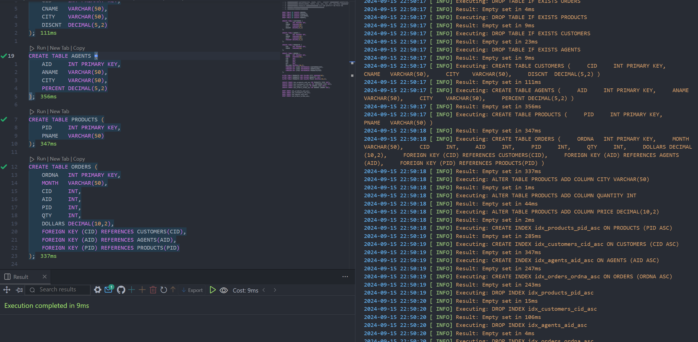

# 实验二

## 实验目的

熟悉SQL的数据定义语言，能够熟练地使用SQL语句来创建和更改基本表，创建和取消索引。

## 实验环境

- OS: Windows 11


- Database: PostgreSQL 16


- IDE: Visual Studio Code (with plugin `PostgreSQL`)


## 实验内容

- 使用`CREATE`语句创建基本表。
- 更改基本表的定义，增加列，删除列，修改列的数据类型。
- 创建表的升降序索引。
- 取消表、表的索引或表的约束。

## 实验步骤

1. 使用SQL语句创建关系数据库表。

- 人员关系表 `PERSON(P#, Pname, Page, Pgender)`，其中`P#`为主键，`Page`具有约束：大于18

```sql
CREATE TABLE IF NOT EXISTS PERSON (
    Pid INT PRIMARY KEY,
    Pname VARCHAR(50),
    Page INT CHECK (Page > 18),
    Pgender CHAR(1)
);
```

- 房间表 `ROOM(R#, Rname, Rarea)`，其中`R#`为主键

```sql
CREATE TABLE IF NOT EXISTS ROOM (
    Rid INT PRIMARY KEY,
    Rname VARCHAR(50),
    Rarea INT
);
```

- 关系表P-R `PR(P#, R#, Date)`，其中`P#`和`R#`为外键

```sql
CREATE TABLE IF NOT EXISTS PR (
    Pid INT,
    Rid INT,
    Date DATE,
    PRIMARY KEY (Pid, Rid),                     -- set (Pid, Rid) as primary key
    FOREIGN KEY (Pid) REFERENCES PERSON(Pid),   -- set Pid as foreign key to PERSON table
    FOREIGN KEY (Rid) REFERENCES ROOM(Rid)      -- set Rid as foreign key to ROOM table
);
```


2. 更改表`PERSON`，增加属性`Ptype`（类型是CHAR，长度为10），取消`Page`大于18的约束。把表`ROOM`中的属性`Rname`的数据类型改成长度为30。

```sql

ALTER TABLE PERSON ADD COLUMN Ptype CHAR(10);
-- When setting the constraint condition for Page, I did not set a name for it.
-- However, it is not a problem, we can easily get the name of the anonymous constraint
-- by running the following statement:
-- `SELECT conname FROM pg_constraint WHERE conrelid = 'PERSON'::regclass AND contype = 'c'`;
-- Then we can get the name of the constraint that the database assigns to us by default,
-- which is `person_page_check`.
ALTER TABLE PERSON ALTER COLUMN Page DROP CONSTRAINT IF EXISTS person_page_check;
ALTER TABLE ROOM ALTER COLUMN Rname TYPE VARCHAR(30);

```




3. 删除表`ROOM`中的一个属性`Rarea`。

```sql
ALTER TABLE ROOM DROP COLUMN Rarea;
```



4. 取消表`PR`。

```sql
DROP TABLE IF EXISTS PR;
```



5. 为`ROOM`表创建按`R#`降序的索引。

```sql
CREATE INDEX idx_room_rid_desc ON ROOM (Rid DESC);
```

6. 为`PERSON`表创建按`P#`升序的索引。

```sql
CREATE INDEX idx_person_pid_asc ON PERSON (Pid ASC);
```



7. 创建表`PERSON`的按`Pname`升序排序的唯一性索引。

```sql
CREATE UNIQUE INDEX idx_person_pname_asc ON PERSON (Pname ASC);
```

8. 取消`PERSON`表`P#`的升序索引。

```sql
DROP INDEX idx_person_pid_asc;
```




## 自我实践

1. 创建数据库表`CUSTOMERS(CID, CNAME, CITY,  DISCNT)`，数据库表`AGENTS(AID, ANAME, CITY, PERCENT)`，数据库表`PRODUCTS(PID, PNAME)`。其中`CID`，`AID`，`PID`分别是各表的主键，具有唯一性约束。
2. 创建数据库表`ORDERS(ORDNA, MONTH, CID, AID, PID, QTY, DOLLARS)`。其中，`ORDNA`是主键，具有唯一性约束。`CID`，`AID`，`PID`是外键，分别参照的是表`CUSTOMERS`的`CID`字段，表`AGENTS`的`AID`字段，表`PRODUCTS`的`PID`字段。
3. 增加数据库表`PRODUCTS`的三个属性列：`CITY`，`QUANTITY`，`PRICE`。
4. 为以上4个表建立各自的按主键增序排列的索引。
5. 取消步骤4建立的4个索引。

```sql
DROP TABLE IF EXISTS ORDERS;
DROP TABLE IF EXISTS PRODUCTS;
DROP TABLE IF EXISTS CUSTOMERS;
DROP TABLE IF EXISTS AGENTS;

CREATE TABLE CUSTOMERS (
    CID     INT PRIMARY KEY,
    CNAME   VARCHAR(50),
    CITY    VARCHAR(50),
    DISCNT  DECIMAL(5,2)
);

CREATE TABLE AGENTS (
    AID     INT PRIMARY KEY,
    ANAME   VARCHAR(50),
    CITY    VARCHAR(50),
    PERCENT DECIMAL(5,2)
);

CREATE TABLE PRODUCTS (
    PID     INT PRIMARY KEY,
    PNAME   VARCHAR(50)
);

CREATE TABLE ORDERS (
    ORDNA   INT PRIMARY KEY,
    MONTH   VARCHAR(50),
    CID     INT,
    AID     INT,
    PID     INT,
    QTY     INT,
    DOLLARS DECIMAL(10,2),
    FOREIGN KEY (CID) REFERENCES CUSTOMERS(CID),
    FOREIGN KEY (AID) REFERENCES AGENTS(AID),
    FOREIGN KEY (PID) REFERENCES PRODUCTS(PID)
);

ALTER TABLE PRODUCTS ADD COLUMN CITY VARCHAR(50);
ALTER TABLE PRODUCTS ADD COLUMN QUANTITY INT;
ALTER TABLE PRODUCTS ADD COLUMN PRICE DECIMAL(10,2);

CREATE INDEX idx_products_pid_asc ON PRODUCTS (PID ASC);
CREATE INDEX idx_customers_cid_asc ON CUSTOMERS (CID ASC);
CREATE INDEX idx_agents_aid_asc ON AGENTS (AID ASC);
CREATE INDEX idx_orders_ordna_asc ON ORDERS (ORDNA ASC);

DROP INDEX idx_products_pid_asc;
DROP INDEX idx_customers_cid_asc;
DROP INDEX idx_agents_aid_asc;
DROP INDEX idx_orders_ordna_asc;
```

