# 数据库实验10 - 安全综合案例

## 实验目的

通过完成一个综合案例的实验，加深对数据库安全控制的理解。

## PostgreSQL 数据库安全性控制简明教程

PostgreSQL是一款强大的开源关系型数据库管理系统，为了确保数据库的安全性，我们可以采取一系列措施来进行安全性控制。以下是一个简明的教程，涵盖了一些基本的安全性控制措施

### 1. 访问控制

**1.1 创建登录用户和密码**

首先，创建数据库的登录用户，并为其分配密码：

```sql
CREATE USER your_user WITH PASSWORD 'your_password';
```

**1.2 授予权限**

根据需要，授予用户相应的权限，例如：

```sql
GRANT SELECT, INSERT, UPDATE, DELETE ON your_table TO your_user;
```

### 2. 角色管理

**2.1 创建角色**

使用角色进行权限管理是一种有效的方式。创建角色并授予权限：

```sql
CREATE ROLE data_admin;
GRANT data_admin TO your_user;
```

**2.2 分配角色**

将角色分配给用户，以便用户继承角色的权限：

```sql
GRANT data_admin TO your_user;
```

### 3. SSL加密

启用SSL加密以确保数据在传输过程中的安全：

```sql
ssl = on
```

### 4. 存储过程和函数的权限控制

**4.1 创建存储过程**

```sql
CREATE OR REPLACE PROCEDURE your_procedure()
AS
$$
BEGIN
   -- Your logic here （e.x. SELECT * FROM your_table WHERE condition;）
END;
$$
LANGUAGE plpgsql;
```

**4.2 授予权限**

为用户授予执行存储过程的权限：

```sql
GRANT EXECUTE ON PROCEDURE your_procedure() TO your_user;
```

### 5. 行级安全

使用行级安全策略限制用户对数据的访问：

```sql
ALTER TABLE your_table ENABLE ROW LEVEL SECURITY;
CREATE POLICY your_policy
    USING (your_condition)
    FOR ALL
    USING (true);
```

### 6. 审计日志

启用审计日志以跟踪数据库活动：

```sql
logging_collector = on
log_statement = 'all'
log_director = '/var/log/postgresql'
```

以上只是一个入门级的教程，实际上，数据库安全性控制涉及到更多方面，包括定期备份、更新数据库软件、监控异常活动等。在实际应用中，应根据具体需求和环境进行更详细的安全性配置。

## 课内实验

问题：赵老师当了2008级电子商务班的班主任，他要能查到全校的课程信息以及本班学生的选课信息，如何让他有权查到这些信息？主要内容如下：

### 1. 登录管理

为新老师创建登录账号logzhao，验证该账号与数据库的连接访问是否正确？

```sql
CREATE USER logzhao WITH PASSWORD 'password123';
```

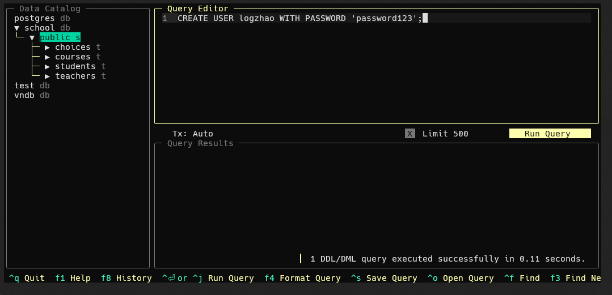

验证连接：使用以下命令尝试连接到数据库：

```powershell
psql -U logzhao -d school -h 127.0.0.1 -p 5432
```

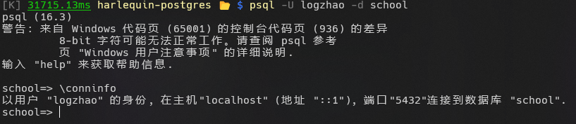

可以看见连接成功。查看登录的账号信息，账号信息符合预期，说明账号创建正确。

### 2. 对用户授权

**问题1**：试解决赵老师能查询本年级学生的选课信息？

首先创建2008级学生选课信息的视图`scview`，把访问该视图的权限授予赵老师，最后验证赵老师能否访问该视图？

- 创建视图：

```sql
CREATE OR REPLACE VIEW scview AS
SELECT s.sid, s.sname, s.grade, c.cid, c.cname, ch.score
FROM STUDENTS s
JOIN CHOICES ch ON s.sid = ch.sid
JOIN COURSES c ON ch.cid = c.cid
WHERE s.grade = 2008;
```

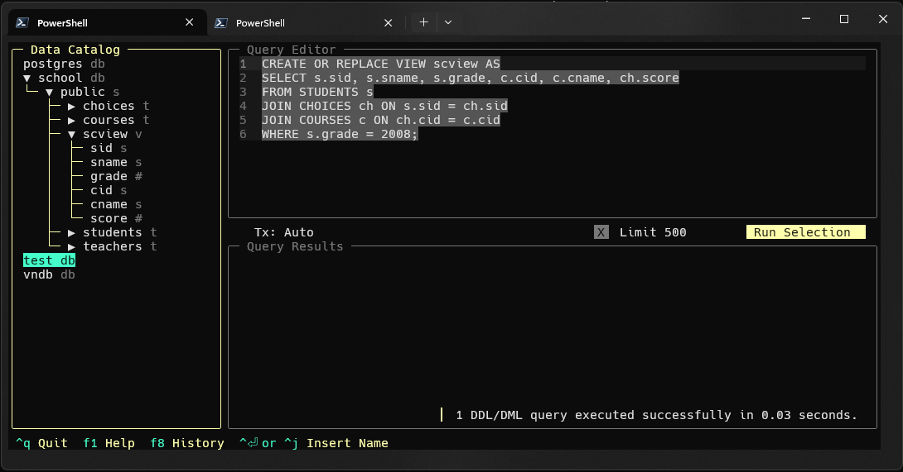

- 把访问权限授予赵老师：

```sql
GRANT SELECT ON scview TO logzhao;
```

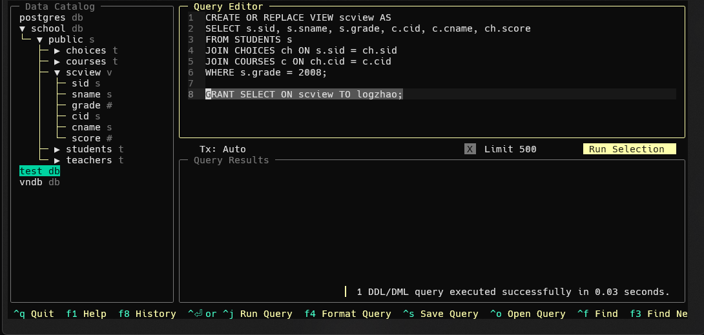


- 验证赵老师能否访问该视图：
```sql
SET ROLE logzhao;

SELECT * FROM scview LIMIT 5;

-- back to default role
RESET ROLE;
```

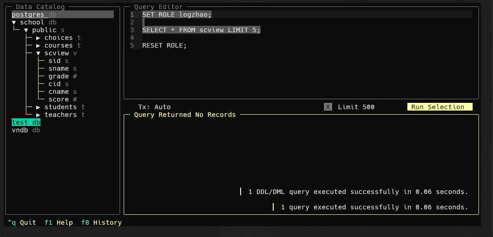

可见，访问语句执行正确。


**问题2**：试解决让赵老师了解某课程的选课情况？

首先创建能查询指定课程选课信息的存储过程`scpro`，把执行该存储过程的权限授予赵老师，最后验证赵老师能否执行存储过程？

- 创建存储过程：

在一个PROCEDURE中只进行select而不对得到的值进行处理在postgres中式是不被允许的，因此这里定义了一个临时的表，并将得到的结果插入到临时表中。

```sql
CREATE OR REPLACE PROCEDURE scpro(IN course_id VARCHAR)
LANGUAGE plpgsql
AS $$
BEGIN
    CREATE TEMPORARY TABLE IF NOT EXISTS temp_results (
        sid VARCHAR,
        sname VARCHAR,
        cname VARCHAR,
        score NUMERIC
    );

    DELETE FROM temp_results;

    INSERT INTO temp_results (sid, sname, cname, score)
    SELECT s.sid, s.sname, c.cname, ch.score
    FROM STUDENTS s
    JOIN CHOICES ch ON s.sid = ch.sid
    JOIN COURSES c ON ch.cid = c.cid
    WHERE c.cid = course_id;
END;
$$;
```

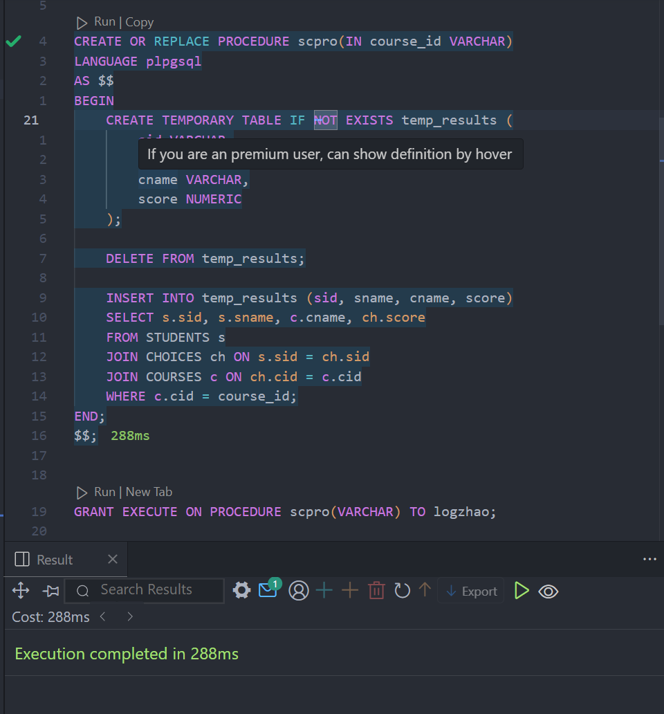

- 把执行权限授予赵老师：

```sql
GRANT EXECUTE ON PROCEDURE scpro(VARCHAR) TO logzhao;
```

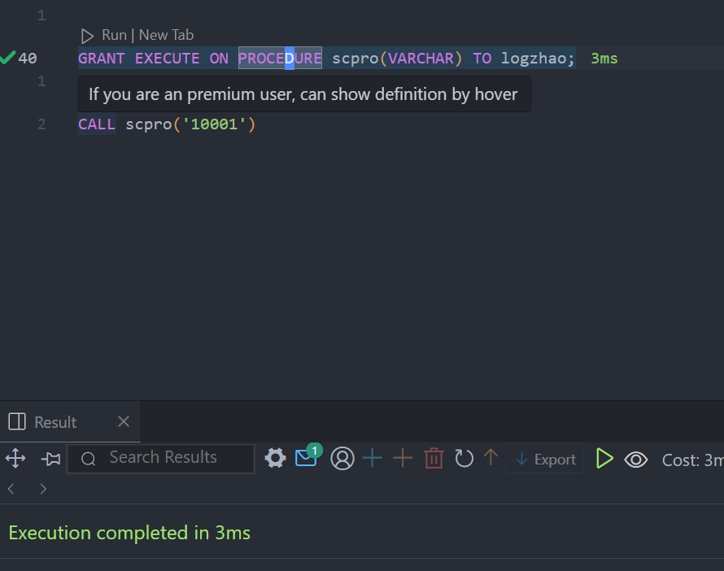

- 验证赵老师能否执行存储过程：

```sql
SET ROLE logzhao;

CALL scpro('10001');

RESET ROLE;
```

直接执行，发现赵老师没有访问`temp_results`表的权限，因此无法执行存储过程。

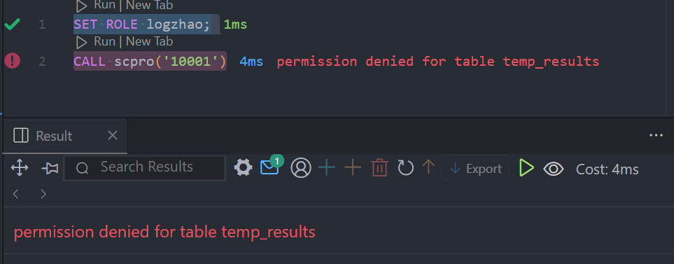

赋予权限后，发现没有权限访问school中的几个表格还是不够：

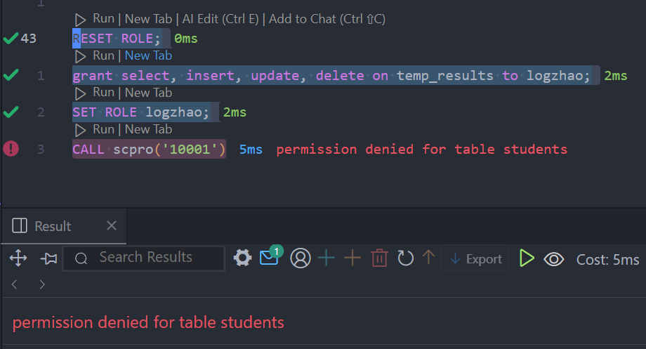

全部赋予权限后，正常执行：

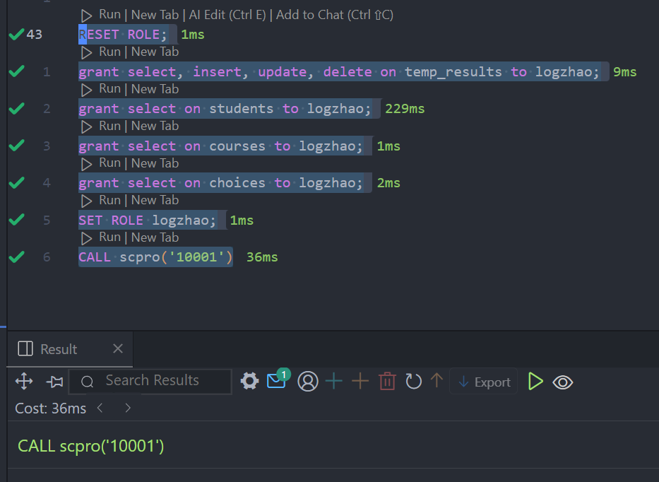

补充内容：撤销赵老师查询某课程的选课情况的权限，再验证赵老师能否执行存储过程？

```sql
RESET ROLE;
REVOKE EXECUTE ON PROCEDURE scpro FROM logzhao;
SET ROLE logzhao;
CALL scpro('10001');
```

执行后，发现撤销权限后，赵老师依旧能够执行存储过程：

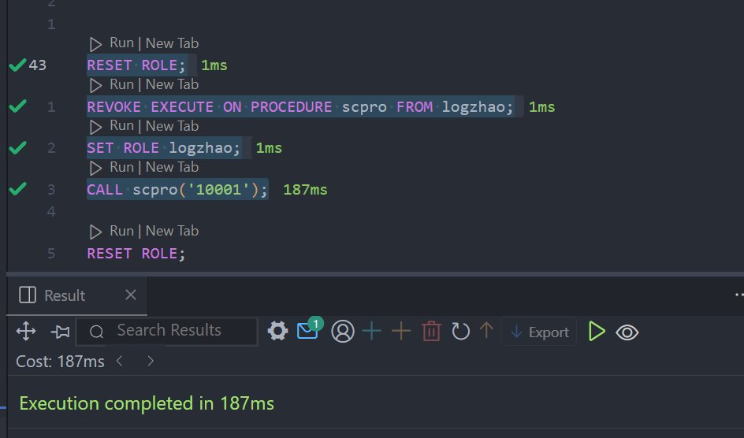

检查后发现，`public`中有`scpro`过程的`execute`权限，将其撤销后，logzhao便无法执行。

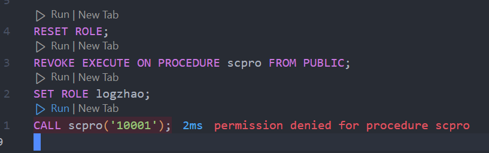

### 3. 角色管理

**问题**：假如学校新增10个辅导员，都要在`student`表中添加、修改和删除学生，要个个设置权限，方便吗？

**可以考虑利用数据库的角色管理来实现**：

首先创建辅导员角色`m_role`，然后对角色进行插入操作授权，再创建各个辅导员的登录以及对应的登录用户，使这些用户成为角色成员，再验证用户是否有插入操作的权限？

- 创建角色并授权：

```sql
CREATE ROLE m_role;
GRANT INSERT, UPDATE, DELETE ON student TO m_role;

DO $$
BEGIN
    FOR i IN 1..10 LOOP
        EXECUTE format('CREATE USER counselor%s WITH PASSWORD ''password%s''', i, i);
        EXECUTE format('GRANT m_role TO counselor%s', i);
    END LOOP;
END $$;
```

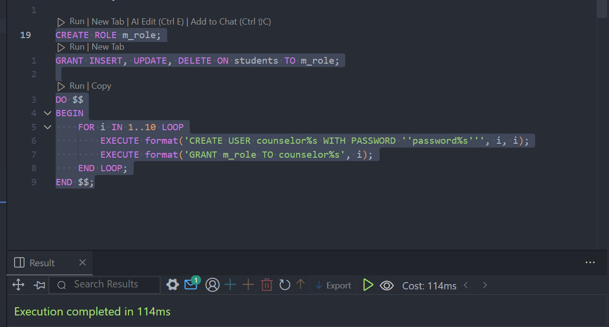

- 验证插入操作权限

```sql
SET ROLE counselor1;

INSERT INTO STUDENTS (sid, sname, email, grade) VALUES ('S1001', 'New Student', 'new@example.com', 2023);

RESET ROLE;
```

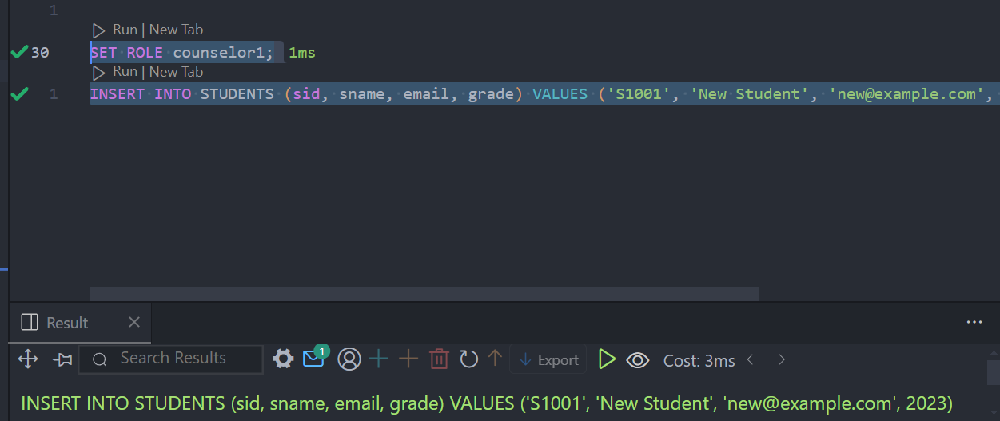

**还可以考虑应用程序角色来实现**：

创建应用程序角色，激活该角色，对其进行插入操作的授权，验证是否具有该操作的权限？

- 创建应用程序角色，并授予权限：

```sql
CREATE ROLE app_role;
GRANT INSERT ON students TO app_role;
```

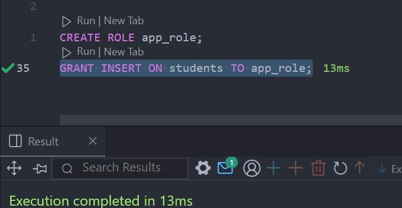

- 验证插入操作权限：

```sql
SET ROLE app_role;
INSERT INTO STUDENTS (sid, sname, email, grade) VALUES ('S1002', 'App Student', 'app@example.com', 2023);

RESET ROLE;
```

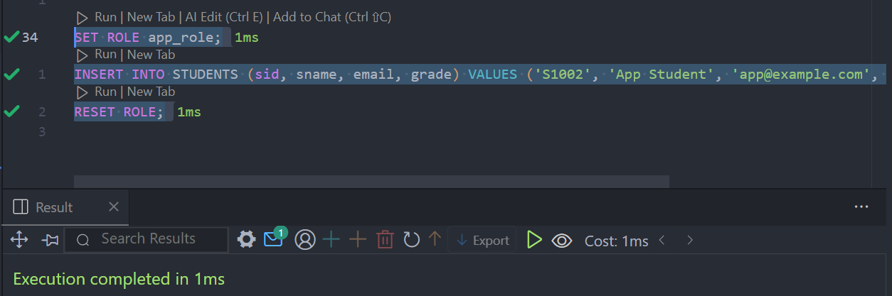