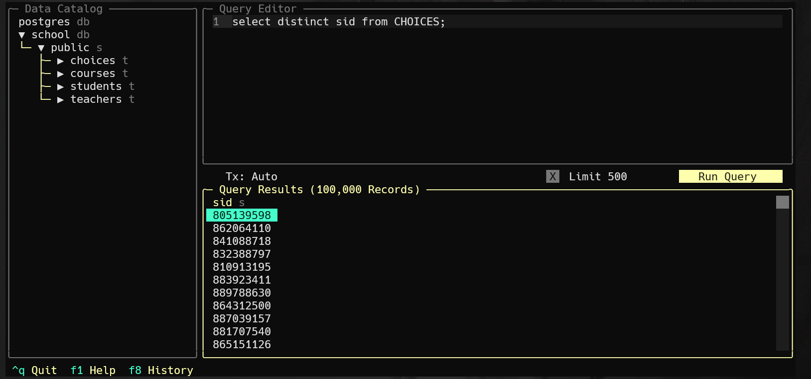

# 实验三 单表查询

## 实验目的

熟悉SQL语句的数据查询语言，能够使用SQL语句对数据库进行单表查询。

## 实验环境

- OS: Windows 11


- Database: PostgreSQL 16


- UI: harlequin-postgres


## 实验内容

1. 查询的目标表达式为所有列、指定列或指定列的运算。
2. 使用`DISTINCT`保留字消除重复行。
3. 对查询结果排序和分组。
4. 集合分组使用集函数进行各项统计。


## 实验步骤

### 课内实验

以`school`数据库为例在该数据库中存在4张表格，分别为：

    STUDENTS(sid,sname,email,grade)

    TEACHERS(tid,tname,email,salary)

    COURSES(cid,cname,hour)

    CHOICES(no,sid,tid,cid,score)

在数据库中，存在这样的关系：学生可以选择课程。一个课程对应一个老师。在表`CHOICES`中保存学生的选课记录。

请按照以下要求编写SQL语句：

    查询学生的选课成绩合格的课程成绩，并把成绩换算为绩点(60分对应绩点为1,每增加1分，绩点增加0.1)；

    查询课时是48或64的课程的名称；

    查询所有课程名称中含有data的课程编号；

    查询所有选课记录的课程号(不重复显示)；

    统计所有老师的平均工资；

    查询所有学生的编号，姓名和平均成绩，按总平均成绩降序排列；

    统计各个课程的选课人数和平均成绩；

    查询至少选修了三门课程的学生编号。

1. 查询学生的选课成绩合格的课程成绩，并把成绩换算为绩点(60分对应绩点为1,每增加1分，绩点增加0.1)：

```sql
select 
    sid,
    score, 
    cast(
        case when score >= 60 then (score - 60) * 0.1 + 1 else 0 end as decimal(3, 1)
    ) as grade_point 
from 
    CHOICES
order by
    sid, score;
```


2. 查询课时是48或64的课程的名称：

```sql
select 
    cname,
    hour
from 
    COURSES
where
    hour = 48 or hour = 64;
```


3. 查询所有课程名称中含有data的课程编号：

```sql
select
    cid,
    cname
from
    COURSES
where
    cname like '%data%';
```


4. 查询所有选课记录的课程号(不重复显示)：

```sql
select 
    distinct cid 
from 
    CHOICES;
```


5. 统计所有老师的平均工资：

```sql
select
    avg(salary) as avg_salary
from
    TEACHERS;
```


6. 查询所有学生的编号，姓名和平均成绩，按总平均成绩降序排列：

```sql
select
    stu.sid, 
    stu.sname, 
    -- avg function will ignore null values,
    -- return null if all values of a column
    -- are null.
    cast(avg(cho.score) as decimal(4, 2)) as avg_score
from
    STUDENTS stu, CHOICES cho
where
    stu.sid = cho.sid
group by
    stu.sid
having 
    -- There are some students who do not have any records, 
    -- if we use avg function, the result will be null.
    -- If you don't want to ignore null values,
    -- just remove the "having" clause.
    avg(cho.score) is not null
order by
    avg_score desc;
```


7. 统计各个课程的选课人数和平均成绩：

```sql
select
    cid,
    -- I don't know why some students can choose the same 
    -- course multiple times, so I use "distinct" to eliminate 
    -- duplicates. If you don't want to eliminate duplicates,
    -- just remove the "distinct" keyword.
    count(distinct sid) as num_students, 
    cast(avg(score) as decimal(4, 2)) as avg_score
from
    CHOICES
group by
    cid
order by
    cid;
```
    


8. 查询至少选修了三门课程的学生编号：

```sql
select 
    sid, 
    count(cid) as num_courses
from 
    CHOICES
group by
    sid
having
    count(cid) >= 3;
```


### 自我实践

    查询全部课程的详细记录；
    查询所有有选修课的学生的编号；
    查询课时<88(hour)的课程的编号；
    请找出总分超过400分的学生；
    查询课程的总数；
    查询所有课程和选修该课程的学生总数；
    查询选修成绩合格的课程超过两门的学生编号；
    统计各个学生的选修课程数目和平均成绩；

1. 查询全部课程的详细记录：

```sql
select * from COURSES; 
```


2. 查询所有有选修课的学生的编号：

```sql
select distinct sid from CHOICES;
```



3. 查询课时<88(hour)的课程的编号：

```sql
select cid from COURSES where hour < 88;
```


4. 请找出总分超过400分的学生：

```sql
select 
    sid, 
    sum(score) as total_score
from 
    CHOICES
group by 
    sid
having 
    sum(score) > 400;
```


5. 查询课程的总数：

```sql
select count(*) as total_courses from COURSES;
```


6. 查询所有课程和选修该课程的学生总数：

```sql
select 
    cid, count(distinct sid) as num_students
from 
    CHOICES
group by 
    cid;
```


7. 查询选修成绩合格的课程超过两门的学生编号：

```sql
select 
    sid, 
    count(cid) as num_courses
from 
    CHOICES
where 
    score >= 60
group by 
    sid
having 
    count(cid) > 2;
```


8. 统计各个学生的选修课程数目和平均成绩：

```sql
select 
    sid,
    count(cid) as num_courses,
    cast(avg(score) as decimal(4, 2)) as avg_score
from 
    CHOICES
group by 
    sid
order by
    sid;
```

