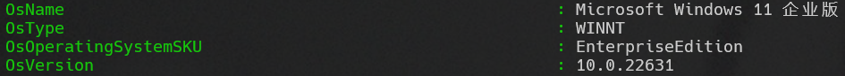

# 实验四 数据查询（连接、集合查询）

## 实验目的

熟悉SQL语句的数据查询语言，能够使用SQL语句对数据库进行连接查询和集合查询。

## 实验环境

- OS: Windows 11



- Database: PostgreSQL 16


- UI: harlequin-postgres


## 实验内容

本节实验的主要内容包括：

    笛卡尔连接和等值连接
    自然连接
    外连接
    复合条件连接
    多表连接
    使用保留字UNION进行集合或运算
    采用逻辑运算符AND或OR来实现集合交和减运算

## 实验步骤

### 课内实验

**QUESTION**：

    以school数据库为例(可在本实验单元的课时材料中下载)，在该数据库中存在4张表格，分别为：

    STUDENTS(sid,sname,email,grade)
    TEACHERS(tid,tname,email,salary)
    COURSES(cid,cname,hour)
    CHOICES(no,sid,tid,cid,score)

    在数据库中，存在这样的关系：学生可以选择课程。一个课程对应一个教师。在表CHOICES中保存学生的选课记录。

    (1) 查询编号800009026的学生所选的全部课程的课程名和成绩
    (2) 查询所有选了database的学生的编号
    (3) 求出选择了同一个课程的学生对
    (4) 求出至少被两名学生选修的课程编号
    (5) 查询选修了编号850955252的学生所选的某个课程的学生编号
    (6) 查询学生的基本信息及选修课程编号和成绩
    (7) 查询学号850955252的学生的姓名和选修的课程名称及成绩
    (8) 利用集合运算，查询选修课程C++或课程Java的学生的编号
    (9) 实现集合交运算，查询既选修课程C++又选修课程Java的学生的编号
    (10) 实现集合减运算，查询选修课程C++而没有选修课程Java的学生的编号

**ANSWER**

1. 查询编号800009026的学生所选的全部课程的课程名和成绩：

```sql
select
  cname, cname
from 
  CHOICES ch, COURSES co
where
  ch.cid = co.cid and ch.sid = '800009026';
```

2. 查询所有选了database的学生的编号：

```sql
select
  sid
from 
  CHOICES ch, COURSES co
where
  ch.cid = co.cid and co.cname = 'database';
```

3. 求出选择了同一个课程的学生对：

```sql
select
  c1.sid, c2.sid
from 
  CHOICES c1, CHOICES c2    
where
  c1.cid = c2.cid and c1.sid < c2.sid;
```

4. 求出至少被两名学生选修的课程编号：

```sql
select
  cid
from
  CHOICES
group by
  cid
having
  count(distinct sid) >= 2;
```

5. 查询选修了编号850955252的学生所选的某个课程的学生编号：

```sql
select
  sid
from 
  CHOICES
where
  cid in (
    select
      cid
    from
      CHOICES
    where 
      sid = '850955252'
  )
  and sid != '850955252';
```

6. 查询学生的基本信息及选修课程编号和成绩：

```sql
select
  STUDENTS.sid,   STUDENTS.sname,
  STUDENTS.email, STUDENTS.grade,
  COURSES.cid,    COURSES.cname,
  COURSES.hour,   CHOICES.score
from 
  STUDENTS, CHOICES, COURSES
where
  CHOICES.sid = STUDENTS.sid and
  CHOICES.cid = COURSES.cid
``` 

7. 查询学号850955252的学生的姓名和选修的课程名称及成绩：

```sql
select
  stu.sname, cou.cname, cho.score
from 
  STUDENTS stu, CHOICES cho, COURSES cou
where
  cho.sid = stu.sid and
  cho.cid = cou.cid and
  stu.sid = '850955252';
```

8. 利用集合运算，查询选修课程C++或课程Java的学生的编号：

```sql
select sid 
from CHOICES cho, COURSES cou
where cho.cid = cou.cid and cou.cname = 'c++'
union
select sid
from CHOICES cho, COURSES cou
where cho.cid = cou.cid and cou.cname = 'java';
```


9. 实现集合交运算，查询既选修课程C++又选修课程Java的学生的编号：

```sql
select sid 
from CHOICES cho, COURSES cou
where cho.cid = cou.cid and cou.cname = 'c++'
intersect
select sid
from CHOICES cho, COURSES cou
where cho.cid = cou.cid and cou.cname = 'java';
```


### 自我实践

**QUESTION**

    (1) 查询选修Java的所有学生的编号及姓名
    (2) 分别使用等值连接和谓词IN两种方式查询姓名为sssht的学生所选的课程的编号和成绩
    (3) 查询其他课时比课程C++多的课程的名称
    (4) 实现集合交运算，查询既选修课程Database又选修课程UML的学生的编号
    (5) 实现集合减运算，查询选修课程Database而没有选修课程UML的学生的编号

**ANSWER**

(1) 查询选修Java的所有学生的编号及姓名：