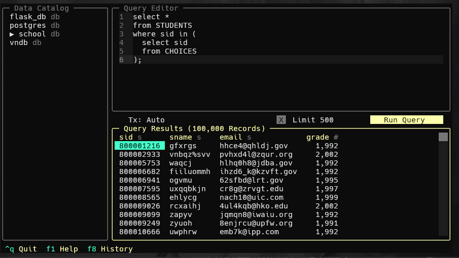

# 数据库系统实验五 -- 数据查询（嵌套查询）

## 实验目的

熟悉SQL语句的数据查询语言，能够使用SQL语句对数据库进行嵌套查询。

## 实验内容

本节实验的主要内容包括：

- 通过实验验证对子查询的两个限制条件。 
- 体会相关子查询和不相关自查询的不同。 
  - 考察4类谓词的用法，包括：    
  - 第1类，IN，NOT IN；    
  - 第2类，带有比较运算符的子查询；    
  - 第3类，SOME，ANY或ALL谓词的子查询；    
  - 第4类，带有EXISTS谓词的子查询。

## 实验步骤

### 课内实验

要求：

以school数据库为例(与前两次实验的数据同)，在该数据库中存在4张表格，分别为：

    STUDENTS(sid,sname,email,grade)

    TEACHERS(tid,tname,email,salary)

    COURSES(cid,cname,hour)

    CHOICES(no,sid,tid,cid,score)

在数据库中，存在这样的关系：学生可以选择课程。一个课程对应一个教师。在表CHOICES中保存学生的选课记录。

    查询与学号850955252的学生同年级的所有学生资料；

    查询所有的有选课的学生的详细信息；

    查询没有学生选的课程的编号；

    查询选修了课程名为C++的学生学号和姓名；

    找出选修课程成绩最差的选课记录。

    找出和课程UML或课程C++的课时一样的课程名称；

    查询所有选修编号10001的课程的学生的姓名；

    查询选修了所有课程的学生姓名。

**ANSWER**

1. 查询与学号850955252的学生同年级的所有学生资料：

```sql
select *
from STUDENTS
where grade = (
  select grade 
  from STUDENTS 
  where sid = '850955252'
);
```


2. 查询所有的有选课的学生的详细信息：

```sql
select *
from STUDENTS
where sid in (
  select sid
  from CHOICES
);
```



3. 查询没有学生选的课程的编号：

```sql
select cid
from COURSES
where cid not in (
  select cid
  from CHOICES
);
```


4. 查询选修了课程名为C++的学生学号和姓名：

```sql
select sid, sname
from STUDENTS
where sid in (
  select sid
  from CHOICES
  where cid = (
    select cid
    from COURSES
    where cname = 'c++'
  )
);
```


5. 找出选修课程成绩最差的选课记录：

```sql
select *
from CHOICES
where score = (
  select min(score)
  from CHOICES
);
```


6. 找出和课程UML或课程C++的课时一样的课程名称：

```sql
select cname
from COURSES
where hour in (
  select hour 
  from COURSES
  where cname in ('uml', 'c++')
);
```


7. 查询所有选修编号10001的课程的学生的姓名：

```sql
select sname
from STUDENTS
where sid in (
  select sid
  from CHOICES
  where cid = '10001'
);
```


8. 查询选修了所有课程的学生姓名：

```sql
```


### 自我实践

    查询选修C++课程的成绩比姓名为znkoo的学生高的所有学生的编号和姓名；

    找出和学生883794999或学生850955252的年级一样的学生的姓名；

    查询没有选修Java的学生名称；

    找出课时最少的课程的详细信息；

    查询工资最高的教师的编号和开设的课程号；

    找出选修课程ERP成绩最高的学生编号；

    查询没有学生选修的课程的名称；

    找出讲授课程UML的教师讲授的所有课程名称；

    查询选修了编号200102901的教师开设的所有课程的学生编号；

    查询选修课程Database的学生集合与选修课程UML的学生集合的并集.


**ANSWER**

1. 查询选修C++课程的成绩比姓名为znkoo的学生高的所有学生的编号和姓名：

```sql
with 
cpp_cid as (
  select cid
  from courses
  where cname = 'c++'
), 
znkoo_cpp_score as (
  select score
  from choices choi, students stu
  where choi.sid = stu.sid
    and stu.sname = 'znkoo'
    and choi.cid = (select cid from cpp_cid)
)
select stu.sid, stu.sname 
from students stu, choices choi
where stu.sid = choi.sid
  and choi.cid = (select cid from cpp_cid)
  and choi.score > (select score from znkoo_cpp_score) 
```


2. 找出和学生883794999或学生850955252的年级一样的学生的姓名：

```sql
select sname
from students
where grade in (
  select grade
  from students
  where sid in ('883794999', '850955252')
)
```


3. 查询没有选修Java的学生名称：

```sql
select stu.sname
from students stu
where sid not in (
  select sid
  from choices choi, courses cour
  where choi.cid = cour.cid
    and cour.cname = 'java'
)
```


4. 找出课时最少的课程的详细信息：

```sql
select *
from courses
where hour = (
  select min(hour)
  from courses
)
```


5. 查询工资最高的教师的编号和开设的课程号：

```sql
select tid, cid
from choices
where tid in (
  select tid
  from teachers
  where salary = (
    select max(salary)
    from teachers
  )
)
group by tid, cid
  

