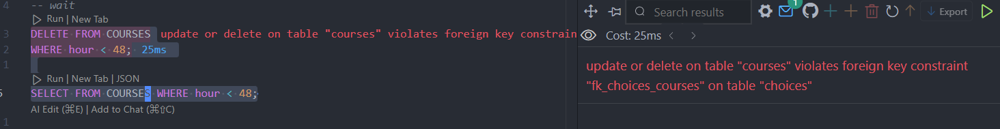
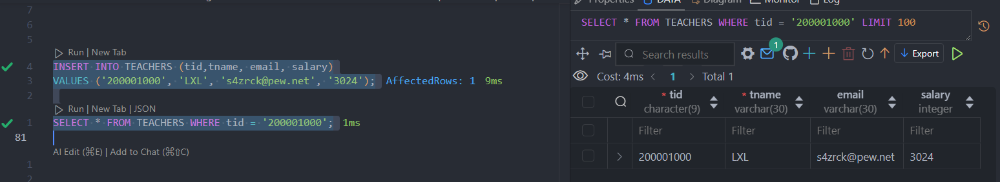
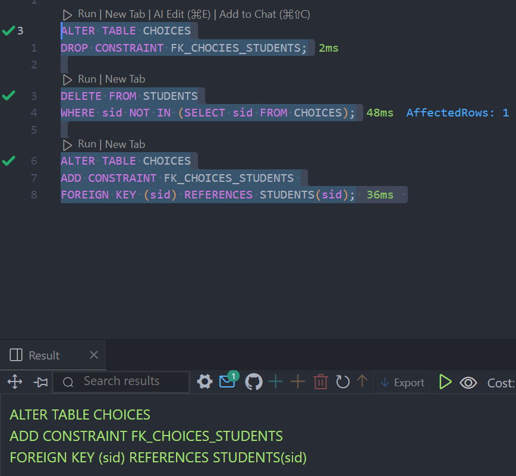

# 数据库系统实验六 -- 数据更新

## 实验目的

熟悉数据库的数据更新操作，能够使用SQL语句对数据库进行数据的插入、更新、删除操作。

## 实验环境

- OS: Windows 11


- Database: PostgreSQL 16


- UI: harlequin-postgres


## 实验内容

在本次实验中，主要的内容是如何使用SQL语句对数据进行更新。

本节实验的主要内容包括：

- 使用INSERT INTO语句插入数据，包括插入一个元组或将子查询的结果插入到数据库中两种方式。
- 使用SELECT INTO语句，产生一个新表并插入数据。
- 使用UPDATE 语句可以修改指定表中满足WHERE子句条件的元组，有三种修改的方式：修改某一个元组的值，修改多个元组的值，带子查询的修改语句。
- 使用DELETE 语句删除数据：删除某一个元组的值，删除多个元组的值，带子查询的删除语句。

注："SELECT INTO"是SQL查询语句的一部分，用于将查询的结果插入到新表中。它的语法如下：

```sql
SELECT column1, column2, ...
INTO new_table
FROM existing_table
WHERE condition;
```

其中：

    column1, column2, ... 是要选择的列。

    new_table 是要将结果插入的新表。

    existing_table 是要从中选择数据的现有表。

    condition 是可选的筛选条件。

这个语句执行时，它会从现有表中选择指定列的数据，并将结果插入到新表中


### 课内实验

要求：

以school数据库为例(与前两次实验的数据同)，在该数据库中存在4张表格，分别为：

    STUDENTS(sid,sname,email,grade)

    TEACHERS(tid,tname,email,salary)

    COURSES(cid,cname,hour)

    CHOICES(no,sid,tid,cid,score)

在数据库school中按下列要求进行数据更新。

1. 使用SQL语句向STUDENTS表中插入元组(编号：700045678；名字：LiMing；EMAIL：LX@cdemg.com；年级：1992);

```sql
INSERT INTO STUDENTS (sid, sname, email, grade)
VALUES (700045678, 'LiMing', 'LX@cdemg.com', 1992);
```


2. 对每个课程，求学生的选课人数和学生的平均成绩，并把结果存入数据库。使用SELECT INTO和 INSERT INTO两种方法实现。（提示：可先创建一个新表再插入数据）;

```sql
SELECT c.cid, COUNT(ch.sid) AS student_count, AVG(ch.score) AS average_score
INTO COURSE_STATS
FROM COURSES c
LEFT JOIN CHOICES ch ON c.cid = ch.cid
GROUP BY C.cid;
```


3. 在STUDENTS表中使用SQL语句将姓名为“LiMing”的学生的年级改为“2002”;

```sql
UPDATE STUDENTS
SET grade = 2002
WHERE sname = 'LiMing';
```


4. 在TEACHERS表中使用SQL语句将所有教师的工资多加500元;

```sql
UPDATE TEACHERS
SET salary = salary + 500;
```


5. 将姓名为zapyv的学生的课程“C”的成绩加上5分;

```sql
UPDATE CHOICES
SET score = score + 5
WHERE sid = (SELECT sid FROM STUDENTS WHERE sname = 'zapyv') 
  AND cid = (SELECT cid FROM COURSES WHERE cname = 'c');
```


6. 在STUDENTS表中使用SQL语句删除姓名为“LiMing”的学生信息;

```sql
DELETE FROM STUDENTS
WHERE sname = 'LiMing';
```


7. 删除所有选修课程“Java”的选课记录;

```sql
DELETE FROM CHOICES
WHERE cid = (SELECT cid FROM COURSES WHERE cname = 'Java');
``` 


8. 对COURSES表做删去时间<48的元组的操作，并讨论该删除操作所受到的约束;

```sql
DELETE FROM COURSES
WHERE hour < 48; 
```



该删除操作所受到的约束：CHOICES表中的外键约束

修改后的sql语句应为：

```sql
ALTER TABLE CHOICES
DROP CONSTRAINT FK_CHOICES_COURSES;

DELETE FROM CHOICES
WHERE cid IN (SELECT cid FROM COURSES WHERE hour < 48);

DELETE FROM COURSES
WHERE hour < 48;

ALTER TABLE CHOICES
ADD CONSTRAINT FK_CHOICES_COURSES
FOREIGN KEY (cid) REFERENCES COURSES(cid);
```


### 自我实践

1. 向STUDENTS表插入编号是“800022222”且姓名是“WangLan”的元组;

```sql
INSERT INTO STUDENTS (sid, sname)
VALUES ('800022222', 'WangLan');
```


2. 向TEACHERS表插入元组(“200001000”,"LXL",“s4zrck@pew.net”,“3024”);

```sql
INSERT INTO TEACHERS (tid,tname, email, salary)
VALUES ('200001000', 'LXL', 's4zrck@pew.net', '3024');
```



3. 将TEACHERS表中编号为“200010493”的老师工资改为4000;

```sql
UPDATE TEACHERS
SET salary = 4000
WHERE tid = '200010493';
```


4. 将TEACHERS表中所有工资小于2500的老师工资改为2500;

```sql
UPDATE TEACHERS
SET salary = 2500
WHERE salary < 2500;
```


5. 将由编号为“200016731”的老师讲授的课程全部改成由姓名为“rnupx”的老师讲授;

```sql
UPDATE CHOICES
SET tid = (SELECT tid FROM TEACHERS WHERE tname = 'rnupx')
WHERE tid = '200016731';
```


6. 更新编号“800071780”的学生年级为“2001”;

```sql
UPDATE STUDENTS
SET grade = 2001
WHERE sid = '800071780';
```


7. 删除没有学生选修的课程;

```sql
DELETE FROM COURSES
WHERE cid NOT IN (SELECT cid FROM CHOICES);
```


8. 删除年级高于1998的学生信息;

```sql
ALTER TABLE CHOICES
DROP CONSTRAINT FK_CHOICES_STUDENTS;

DELETE FROM CHOICES
WHERE sid IN (SELECT sid FROM STUDENTS WHERE grade > 1998);

DELETE FROM STUDENTS
WHERE grade > 1998;

ALTER TABLE CHOICES
ADD CONSTRAINT FK_CHOICES_STUDENTS 
FOREIGN KEY (sid) REFERENCES STUDENTS(sid); 
```


9. 删除没有选修课程的学生信息;

```sql
ALTER TABLE CHOICES
DROP CONSTRAINT FK_CHOICES_STUDENTS;

DELETE FROM STUDENTS
WHERE sid NOT IN (SELECT sid FROM CHOICES);

ALTER TABLE CHOICES
ADD CONSTRAINT FK_CHOICES_STUDENTS 
FOREIGN KEY (sid) REFERENCES STUDENTS(sid); 
```



10. 删除成绩不及格的选课记录;

```sql
DELETE FROM CHOICES
WHERE score < 60;
```

