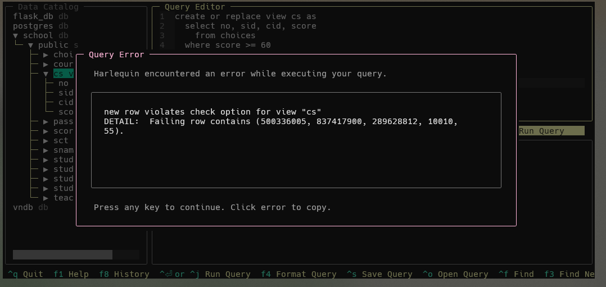

# 实验七 视图

## 实验目的

熟悉SQL语言支持的有关视图的操作，能够熟练使用SQL语句来创建需要的视图，对视图进行查询和取消视图。

## 实验环境

- OS: Windows 11


- Database: PostgreSQL 16


- UI: harlequin-postgres


## 实验内容

1. 定义常见的视图形式，包括：

- 行列子集视图。
- WITH CHECK OPTION的视图。
- 基于多个基表的视图。
- 基于视图的视图。
- 带表达式的视图。
- 分组视图。

2. 通过实验考察WITH CHECK OPTION这一语句在视图定义后产生的影响，包括对修改操作、删除操作、插入操作的影响。
3. 讨论视图的数据更新情况，对子行列视图进行数据更新。
4. 使用DROP语句删除一个视图，由该视图导出的其他视图定义仍在数据字典中，但已不能使用，必须显式删除。同样的原因，删除基表时，由该基表导出的所有视图定义都必须显式删除。

## 课内实验

**要求：**

以school数据库为例(与之前实验的数据同)，在该数据库中存在4张表格，分别为：

STUDENTS(sid,sname,email,grade)

TEACHERS(tid,tname,email,salary)

COURSES(cid,cname,hour)

CHOICES(no,sid,tid,cid,score)

**CS视图的创建**

```sql
CREATE VIEW CS AS 
  SELECT NO, SID, CID, SCORE
    FROM CHOICES
  WHERE SCORE >= 60;
```

**SCT视图的创建**

```sql
CREATE VIEW SCT (SNAME, CNAME, TNAME) AS 
  SELECT STUDENTS.SNAME, COURSES.CNAME, TEACHERS.TNAME
    FROM CHOICES, STUDENTS, COURSES, TEACHERS
  WHERE CHOICES.TID = TEACHERS.TID 
    AND CHOICES.CID = COURSES.CID
    AND CHOICES.SID = STUDENTS.SID;
```

1. 创建一个行列子集视图，给出选课成绩合格的学生的编号，所选课程号和该课程成绩

```sql
create or replace view passing_choice as
  select sid, cid, score
    from choices
  where score >= 60;

select * from passing_choice;
```


2. 创建基于多个基表的视图，这个视图由学生姓名和其所选修的课程名及讲授该课程的教师姓名构成

```sql
create or replace view student_course_teacher as
  select s.sname, c.cname, t.tname
    from students s
    join choices ch on s.sid = ch.sid
    join courses c on ch.cid = c.cid
    join teachers t on ch.tid = t.tid;

select * from student_course_teacher;
```


3. 创建带表达式的视图，由学生姓名、所选课程名和所有课程成绩都比原来多5分这几个属性组成

```sql
create or replace view score_plus_five as
  select s.sname, c.cname, ch.score + 5
    from students s
    join choices ch on s.sid = ch.sid
    join courses c on ch.cid = c.cid;

select * from score_plus_five;
```


4. 创建分组视图，将学生的学号及其平均成绩定义为一个视图

```sql
create or replace view student_avg_score as
  select s.sid, avg(ch.score) as avg_score
    from students s
    join choices ch on s.sid = ch.sid
  group by s.sid;

select * from student_avg_score;
```


5. 创建一个基于视图的视图，基于(1)中建立的视图，定义一个包括学生编号，学生所选课程数目和平均成绩的视图

```sql
create or replace view student_course_stats as
  select  sid,
          count(*) as course_count, 
          avg(score) as avg_score
    from passing_choice
  group by sid;

select * from student_course_stats;
```


6. 查询所有选修课程Software Engineering的学生姓名

```sql
create or replace view sname_se as
  select distinct s.sname
    from students s
    join choices ch on s.sid = ch.sid
    join courses c on ch.cid = c.cid
  where c.cname ilike 'Software Engineering';

select * from sname_se;
```


7. 插入元组(600000000,823069829,10010,59)到视图CS中。若是在视图的定义中存在`WITH CHECK OPTION`子句对插入操作有什么影响?

```sql
insert into cs (no, sid, cid, score)
values (600000000, 823069829, 10010, 59);
```

在讨论是否存在`WITH CHECK OPTION`子句之前，首先这个操作不会正确执行：

- 底层的`CHOICES`表`tid`列有`NOT NULL`约束与外键约束，但视图`CS`中并不存在`tid`列，因此无法插入。


8. 将视图CS (包含定义WITH CHECK OPTION)中，所有课程编号为10010的课程的成绩都减去5分。这个操作数据库是否会正确执行，为什么?如果加上5分(原来95分以上的不变)呢?

- 减5分操作：

```sql
create or replace view cs as 
  select no, sid, cid, score
    from choices
  where score >= 60
with check option;

update cs
set score = score - 5
where cid = '10010';
```

这个操作不会正确执行：

- `WITH CHECK OPTION`确保通过视图进行的所有修改都符合视图的定义条件，也即是`score >= 60`，但如果我们尝试将成绩减去5分，那么原本成绩为60-64分的记录将不再满足条件。此时，数据库会拒绝这个更新操作。



- 加5分（原来95分以上的不变）操作：

```sql
update cs
set score = case
    when score <= 95 then score + 5
    else score
end
where cid = '10010';
```

这个操作将会正确执行：


9. 在视图CS (包含定义WITH CHECK OPTION)删除编号为804529880学生的记录，会产生什么结果?

```sql
delete from cs
where sid = '804529880';
```

这个删除操作将会正常执行：

- `WITH CHECK OPTION`主要用于限制`INSERT`和`UPDATE`操作，确保这些操作不会创建或修改不符合视图定义的行。
- `DELETE`操作不会创建新的行或修改现有行的值，因此不会违反视图的定义条件。


10.  取消视图SCT和视图CS

```sql
drop view sct;
drop view cs;
```


## 自我实践

1. 定义选课信息和课程名称的视图VIEWC

```sql
create or replace view viewc as
  select ch.*, c.cname
    from choices ch
    join courses c on ch.cid = c.cid;
  
select * from viewc;
```


2. 定义学生姓名与选课信息的视图VIEWS

```sql
create or replace view views as
  select ch.*, s.sname
    from choices ch
    join students s on ch.sid = s.sid;
  
  select * from views;
```


3. 定义年级低于1998的学生的视图S1(SID,SNAME,GRADE)

```sql
create or replace view s1 as
  select sid, sname, grade
    from students
  where grade < 1998;

select * from s1;
```


4. 查询学生为“uxjof”的学生的选课信息

```sql
select * from views where sname = 'uxjof';
```


5. 查询选修课程“UML”的学生的编号和成绩

```sql
select sid, score from viewc where cname = 'uml';
```


6. 向视图S1插入记录(“60000001,Lily,2001”)

```sql
insert into s1 (sid, sname, grade) values ('60000001', 'Lily', 2001);

select * from s1 where sid = '60000001';
```

- 由于没有`WITH CHECK OPTION`子句，因此该插入语句能够正确执行。但是插入后的结果不会显示在视图中，因为它不满足视图的定义条件。


7. 定义包括更新和插入约束的视图S1，尝试向视图插入记录(“60000001,Lily,1997")，删除所有年级为1999的学生记录，讨论更新和插入约束带来的影响

- 定义包括更新和插入约束的视图S1：

```sql
create or replace view s1 as
  select sid, sname, grade
    from students
  where grade < 1998
with check option;
```

- 尝试向视图S1插入记录(“60000001,Lily,1997")：

```sql
insert into s1 (sid, sname, grade) values ('60000001', 'Lily', 1997);
```

- 尝试删除所有年级为1999的学生记录：
  
```sql
delete from s1 where grede = 1999;
```

- 讨论更新和插入约束带来的影响：
  - 插入操作应该会成功，因为1997小于1998，符合视图定义条件。
  - 删除操作不会有任何效果，因为视图s1中不包含任何年级为1999的学生记录。


8. 在视图VIEWS中将姓名为“uxjof”的学生的选课成绩都加上5分

```sql
create or replace rule update_views_rule as
  on update to views do instead (
    update choices set score = new.score
    where choices.no = new.no
  );

update views
set score = score + 5
where sname = 'uxjof';

select * from views where sname = 'uxjof';
```

- PostgreSQL中，对涉及多个表的视图进行UPDATE操作时不被允许的：


- 因此，需要主动定义一个更新操作的规则，再通过视图进行更新：


- 更新前：


- 更新后：


9. 取消以上建立的所有视图

```sql
drop view if exists viewc;
drop view if exists views;
drop view if exists s1;

select table_name
from information_schema.views
where table_schema = 'public';
```

- 取消视图前：


- 取消视图后：

