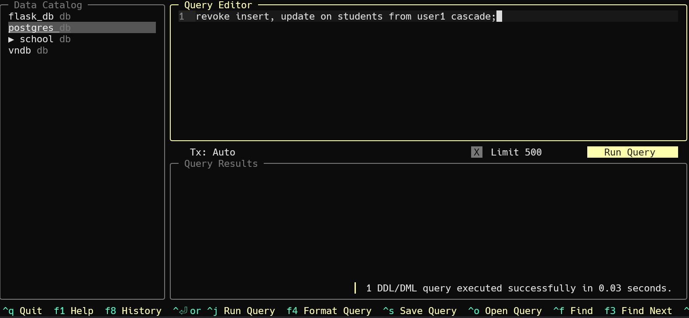
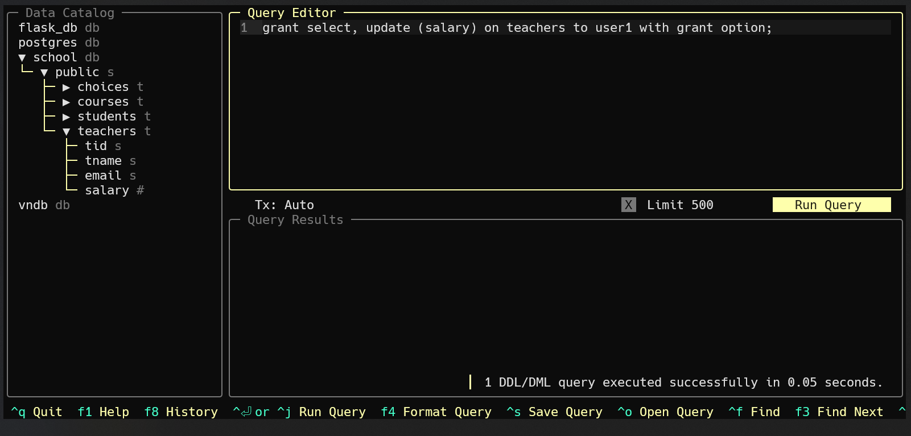
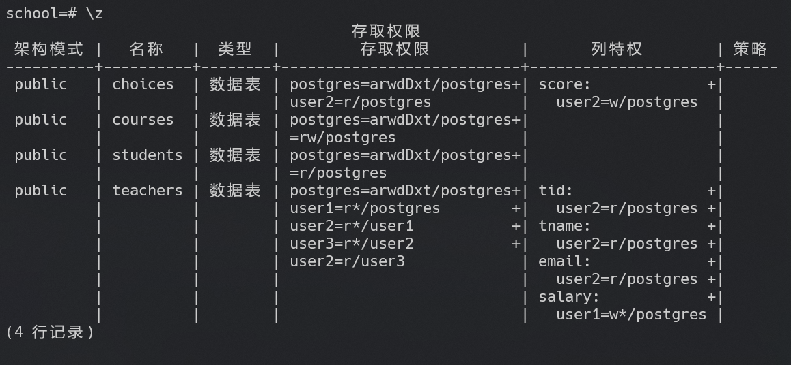

# 实验八 数据库安全性

## 实验目的

熟悉数据库用户管理和权限管理，能够使用SQL语句来向用户授予和收回权限。

## 实验环境

- OS: Windows 11


- Database: PostgreSQL 16


- UI: harlequin-postgres


## 实验内容

1. 使用GRANT语句对用户授权，对单个用户和多个用户授权，或使用保留字PUBLIC对所有用户授权。对不同的操作对象包括数据库、视图、基本表等进行不同权限的授权。
2. 使用WITH GRANT OPTION子句授予用户传播该权限的权利。
3. 在授权时发生循环授权，考察DBS能否发现这个错误。如果不能，结合取消权限操作，查看DBS对循环授权的控制。
4. 使用REVOKE子句收回授权，取消授权的级联反应。

## 课内实验

**要求：**

在数据库school中建立三个用户USER1,USER2和USER3,它们在数据库中的角色是PUBLIC。请按以下要求，分别以管理员身份或这三个用户的身份登录到数据库中，进行操作。

- 建立用户前：


- 建立用户：

```sql
create user user1;
create user user2;
create user user3;
```


- 若最后要删除用户：

```sql
REVOKE ALL PRIVILEGES ON ALL TABLES IN SCHEMA public FROM user1, user2, user3;
REVOKE ALL PRIVILEGES ON ALL SEQUENCES IN SCHEMA public FROM user1, user2, user3;
REVOKE ALL PRIVILEGES ON ALL FUNCTIONS IN SCHEMA public FROM user1, user2, user3;

DROP USER IF EXISTS user1;
DROP USER IF EXISTS user2;
DROP USER IF EXISTS user3;
```

1. 授予所有用户对表COURSES的查询权限。

```sql
grant select on courses to public;
```


2. 授予USER1对表STUDENTS插入和更新的权限，但不授予删除权限，并且授予USER1传播这两个权限的权利。

```sql
grant insert, update on students to user1 with grant option;
```


3. 允许USER2在表CHOICES中插入元组，更新SCORE列，可以选取除了SID以外的所有列。

```sql
grant 
  insert, 
  update (score), 
  select (no, tid, cid, score) 
on choices to user2;
```


4. USER1授予USER2对表STUDENTS插入和更新的权限，并且授予USER2传播插入操作的权利。

```sql
-- login as user1
grant insert on students to user2 with grant option;
grant update on students to user2;
```


5. 收回对USER1对表COURSES查询权限的授权。

```sql
revoke select on courses from user1;
```

然而这里会出现问题，由于user1的查询权限继承于public，实际上这条sql语句并不能够单独取消user1的权限，可以验证如下：


正确的做法是：

```sql
revoke select on courses from public;

grant select on courses to user1;
grant select on courses to user2;
grant select on courses to user3;

revoke select on courses from user1;
```

修改后的执行效果如下：


6. 由上面2.和4.的授权，再由USER2对USER3授予表STUDENTS插入和更新的权限，并且授予USER3传播插入操作的权利。这时候，如果由USER3对USER1授予表STUDENTS的插入和更新权限是否能得到成功？如果能够成功，那么如果由USER2取消USER3的权限，对USER1会有什么影响？如果再由DBA取消USER1的权限，对USER2有什么影响？

- 由USER2对USER3授予表STUDENTS插入和更新的权限，并且授予USER3传播插入操作的权利：

```sql
-- login as user2
grant insert on students to user3 with grant option; 
grant update on students to user3;
```

首先，由于user2并没有对students表的update权限进行传播的权利，实际上能够正确赋予user3的的权限只有对表students的insert权限。


- 由user3对user1授予表students的插入和更新权限：

```sql
-- login as user3
grant insert, update on students to user1;
```

由于user3没有对表students的update权限，自然是不可能将其赋予user1的。但是对students的insert权限是能够赋予的：


- 由user2取消user3的权限，对user1有什么影响？

```sql
-- login as user2
revoke insert, update on students from user3;
```

直接使用上面的语句进行取消是不可行的，因为user1中的存在对students的insert权限依赖于user3对students表的insert权限：


修改如下：

```sql
-- login as user2
revoke insert, update on students from user3 cascade;
```


可见，user3对students表的insert权限被取消，相应的user1也失去了对students表的insert权限。但user1中来自于admin的对表students的insert权限并不会受到影响。

- 由DBA取消user1的权限，对user2有什么影响？

```sql
-- login as DBA
revoke insert, update on students from user1 cascade;
```




可见，user1中来自admin对表students的insert与update权限被取消，user2中由user1赋予的对students的insert与update权限也被取消。


## 自我实践

1. 授予所有用户对表STUDENTS的查询权限。

```sql
grant select on students to public;
```


2. 授予所有用户对表COURSES的查询和更新权限。

```sql
grant select, update on courses to public;
```


3. 授予USER1对表TEACHERS的查询，更新工资的权限，且允许USER1可以传播这些权限。

```sql
grant select, update (salary) on teachers to user1 with grant option;
```




4. 授予USER2对表CHOICES的查询，更新成绩的权限。

```sql
grant select, update (score) on choices to user2;
```


5. 授予USER2对表TEACHERS的除了工资之外的所有信息的查询。

```sql
grant select (tid, tname, email) on teachers to user2;
```


6. 由USER1授予USER2对表TEACHERS的查询权限和传播的此项权限的权利。

```sql
-- login as user1
grant select on teachers to user2 with grant option;
```


7. 由USER2授予USER3对表TEACHERS的查询权限，和传播此项权限的权利。再由USER3授予USER2上述权限，这样的SQL语句能否成功得到执行?

- 由user2授予user3对表teachers的查询权限，和传播此项权限的权利：

```sql
-- login as user2
grant select on teachers to user3 with grant option;
```


- 由user3授予user2上述权限：

```sql
-- login as user3
grant select on teachers to user2;
```


8. 取消USER1对表STUDENTS的查询权限，考虑由USER2的身份对表STUDENTS进行查询，操作能否成功?为什么?

```sql
revoke select on students from user1;
```

操作能够成功。首先，user1与user2对表students的查询权限均继承于public，因此取消user1对表students的查询权限并不会影响user2的查询权限。其次，实际上上述的语句甚至不会影响到user1的查询权限，因为user1的查询权限继承于public，通过revoke并不能够单独取消user1的权限。





9. 取消USER1和USER2的关于表COURSES的权限。

```sql
revoke select, update on courses from public;
grant select, update on courses to user3;
```


