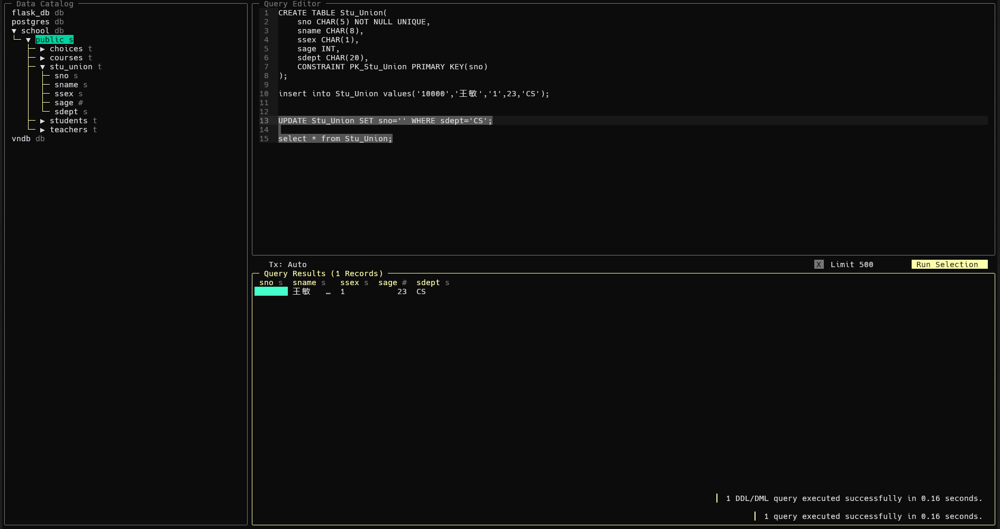

# 数据库实验9 - 数据库完整性

## 实验目的

学习实体完整性的建立，以及实践违反实体完整性的结果；学习建立外键，以及利用`FOREIGN KEY... REFERENCES`子句以及各种约束保证参照完整性。

## 课内实验

1. 在数据库`school`中建立表`Stu_Union`，进行主键约束，在没有违反实体完整性的前提下插入并更新一条记录。(参考代码如下：)

```sql
CREATE TABLE Stu_Union(
    sno CHAR(5) NOT NULL UNIQUE,
    sname CHAR(8),
    ssex CHAR(1),
    sage INT,
    sdept CHAR(20),
    CONSTRAINT PK_Stu_Union PRIMARY KEY(sno)
);

insert into Stu_Union values('10000','王敏','1',23,'CS');

UPDATE Stu_Union SET sno='' WHERE sdept='CS';
UPDATE Stu_Union SET sno='95002' WHERE sname='王敏';

select * from Stu_Union;
```

- **创建并插入一条记录**


- **更新一条记录**




2. 演示违反实体完整性的插入操作。（可截屏输出结果）

```sql
INSERT INTO Stu_Union VALUES(NULL,'李四','0',22,'EE');
```

执行结果如下：


3. 演示违反实体完整性的更新操作。

```sql
UPDATE Stu_Union SET sno = NULL WHERE sname = '王敏';
```

执行结果如下：


4. 为演示参照完整性，建立表`Course`，令`cno`为其主键，并在`Stu_Union`中插入数据。为下面的实验步骤做预先准备。（参考代码如下：）

```sql
insert into Stu_Union values('10001','李明','0',24,'EE');

select * from Stu_Union;

create table Course(
    cno char(4)NOT NULL UNIQUE,
    cname varchar(50)NOT NULL,
    cpoints int,
    constraint PK primary key(cno)
);

insert into Course values('0001','ComputerNetworks',2);
insert into Course values('0002','Database',3);
```

执行结果如下：


5. 建立表`SC`,令`sno`和`cno`分别为参照`Stu_Union`表以及`Course`表的外键，设定为级联删除，并令`(sno,cno)`为主主键，在不违反参照完整性的前提下，插入数据。(参考代码如下：)

```sql
CREATE TABLE SC(
    sno CHAR(5) REFERENCES Stu_Union(sno) on delete cascade,
    cno CHAR(4) REFERENCES Course(cno) on delete cascade,
    grade INT,
    CONSTRAINT PK_SC PRIMARY KEY(sno,cno)
);

insert into sc values('95002','0001',2);
insert into sc values('95002','0002',2);
insert into sc values('10001','0001',2);
insert into sc values('10001','0002',2);

select * from SC;
```

执行结果如下：


6. 演示违反参照完整性的插入操作。

```sql
INSERT INTO SC VALUES('99999','0001',2);
```

执行结果如下：


7. 在`Stu_Union`中删除数据，演示级联删除。

```sql
DELETE FROM Stu_Union WHERE sno = '10001';
SELECT * FROM SC;
```

执行结果如下：


可见，在删除了`Stu_Union`表中的一条记录后，`SC`表中的相应记录也被级联删除了。

8. 在`Course`中删除数据，演示级联删除。

```sql
DELETE FROM Course WHERE cno = '0001';
SELECT * FROM SC;
```

执行结果如下：


可见，在删除了`Course`表中的一条记录后，`SC`表中的相应记录也被级联删除了。


## 自我实践

1. 用`alter table`语句将`SC`表中的`on delete cascade`改为`on delete no action`，重新插入`SC`的数据。重复课内实验中7.和8.，观察结果，分析原因。

- 先查看一下外键约束的名称：


- 更改`SC`表约束：

```sql
ALTER TABLE SC DROP CONSTRAINT sc_sno_fkey;
ALTER TABLE SC DROP CONSTRAINT sc_cno_fkey;

ALTER TABLE SC ADD CONSTRAINT FK_SC_Stu FOREIGN KEY (sno) REFERENCES Stu_Union(sno) ON DELETE NO ACTION;
ALTER TABLE SC ADD CONSTRAINT FK_SC_Course FOREIGN KEY (cno) REFERENCES Course(cno) ON DELETE NO ACTION;
```


- 重新插入数据（当然，其它表格也需要恢复删除的数据，我直接用备份了，这里略过）：

```sql
INSERT INTO SC VALUES('95002','0001',2);
INSERT INTO SC VALUES('95002','0002',2);
INSERT INTO SC VALUES('10001','0001',2);
INSERT INTO SC VALUES('10001','0002',2);

SELECT * FROM SC;
```


- 重复课内实验7：

```sql
DELETE FROM Stu_Union WHERE sno = '10001';
SELECT * FROM SC;
```

执行结果如下：


可见，由于在表格`SC`中设置了`on delete no action`，当尝试删除`Stu_Union`中的一行数据时，约束会阻止从`SC`中删除条目。为了保持数据完整性，防止在`SC`中出现悬挂引用，数据库将会阻止删除操作。

- 重复课内实验8：

执行结果如下：


与上述相同。

2. 使用`alter table`语句将`SC`表中的`on delete cascade`改为`on delete set null`，重新插入`SC`的数据。重复课内实验中7.和8.，观察结果，分析原因。

- 更改约束

```sql
ALTER TABLE SC DROP CONSTRAINT fk_sc_stu;
ALTER TABLE SC DROP CONSTRAINT sk_sc_course;

ALTER TABLE SC 
ADD CONSTRAINT fk_sc_stu 
FOREIGN KEY (sno) REFERENCES Stu_Union(sno) ON DELETE SET NULL;

ALTER TABLE SC 
ADD CONSTRAINT fk_sc_course 
FOREIGN KEY (cno) REFERENCES Course(cno) ON DELETE SET NULL;
```

执行结果如下：


- 重复课内实验中7.和8.

执行结果如下：


当试图从`Stu_Union`中删除一个条目时，由于设置了`on delete set null`，数据库会将`SC`表中与该条目相关的行的`sno`字段设置为`null`，而不会删除该行。然而，此处的`sno`字段为`SC`表主键的一部分，它不能被设置为`null`，因此，数据库会阻止这个操作。