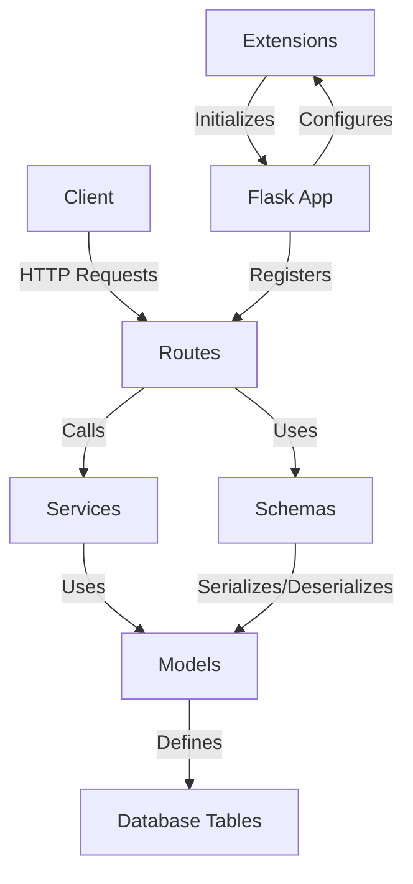
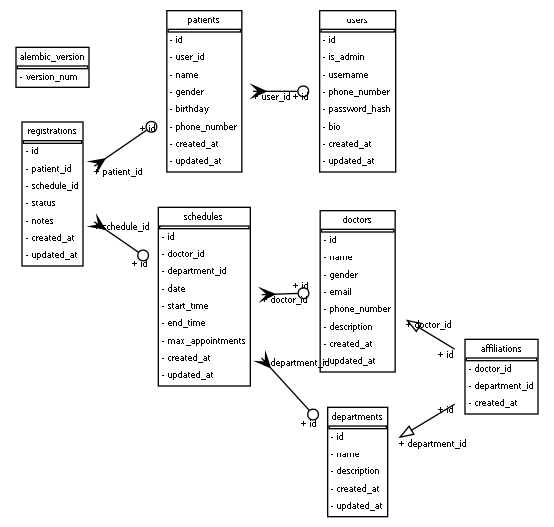

# 医院挂号管理系统的设计与实现

## 选题要求

设计一个医院挂号管理系统，包括挂号管理、科室管理、医生管理等功能。挂号管理负责挂号信息的录入、查询和统计；科室管理负责科室信息的添加、修改和查询；医生管理负责医生信息的添加、修改和查询。

## 引言

### 设计目的

本系统旨在提供一个全面的医院挂号管理解决方案，我将在这个系统中实现包括挂号管理、医生管理、排班管理、科室管理、病人管理、用户管理等功能。

### 设计要求

- 实现用户的注册、登录，以及用户信息的查询、修改、删除
- 实现医生信息的录入、查询、修改、删除
- 实现科室信息的录入、查询、修改、删除
- 实现病人信息的创建、查询、修改、删除
- 实现挂号信息的录入、查询、修改、删除
- 实现排班信息的录入、查询、修改、删除
- 实现管理员用户的创建以及管理员对系统信息的管理功能

### 设计环境

- 操作系统：Windows 10、Windwos 11
- 数据库：PostgreSQL 16.3
- 后端：Python 3.11+，Flask 3.1.0
- 前端：Node.js v22.8.0，Next.js 15.1.2

### 团队分工

- 项目设计与管理：林隽哲
- 数据库设计：林隽哲
- 后端开发：林隽哲
- 前端开发：林隽哲

## 概要设计

### 系统需求分析

1. 用户管理：包括普通用户和管理员的注册、登录和权限控制
2. 患者管理：患者信息的CRUD操作。（设计之初我是打算直接将用户的信息作为患者信息进行处理的。但在我参考了广州一些医院官方公众号的挂号系统的实现后决定将患者信息与用户信息区分开来。在现在的实现中患者的信息将会由用户额外进行创建，并且一个用户能够创建多个患者信息。）
3. 医生管理：医生信息的CRUD操作
4. 科室管理：科室信息的CRUD操作
5. 排班管理：医生排班信息的CRUD操作
6. 挂号管理：挂号信息的CRUD操作
7. 权限控制：区分为普通用户与管理员用户（虽然起初很想实现RBAC模式来区分用户、医生与管理员角色，但由于时间不足最终改为了只有普通用户与管理员用户。现在的实现中医生信息、科室信息等均由管理员用户进行管理。）

### 系统架构设计

本系统采用前后端分离的架构，后端使用Flask框架提供RESTful API，前端使用Next.js构建用户界面。系统整体的架构如下（这里主要给出后端的架构）：



### 功能模块设计

#### 后端功能模块

后端采用Flask框架，主要包含以下组件：

```shell
backend
├── app
│   ├── routes
│   │   ├── __init__.py
│   │   ├── affiliation_routes.py
│   │   ├── department_routes.py
│   │   ├── doctor_routes.py
│   │   ├── pagination.py
│   │   ├── patient_routes.py
│   │   ├── registration_routes.py
│   │   ├── schedule_routes.py
│   │   └── user_routes.py
│   ├── schemas
│   │   ├── __init__.py
│   │   ├── affiliation_schemas.py
│   │   ├── department_schemas.py
│   │   ├── doctor_schemas.py
│   │   ├── pagination.py
│   │   ├── patient_schemas.py
│   │   ├── registration_schemas.py
│   │   ├── schedule_schemas.py
│   │   └── user_schemas.py
│   ├── services
│   │   ├── __init__.py
│   │   ├── affiliation_services.py
│   │   ├── department_services.py
│   │   ├── doctor_services.py
│   │   ├── patient_services.py
│   │   ├── registration_services.py
│   │   ├── schedule_services.py
│   │   └── user_services.py
│   ├── utils
│   │   ├── auth_utils.py
│   │   ├── db_utils.py
│   │   └── route_utils.py
│   ├── __init__.py
│   ├── cli.py
│   ├── config.py
│   ├── extentions.py
│   ├── logger.py
│   └── models.py
├── migrations
├── .gitignore
├── clean.py
├── draw_er.py
├── erd_from_sqlalchemy.png
├── manage.py
├── run.py
└── test.py
```

1. 路由（Routes）：定义API端点，处理HTTP请求
2. 模式（Schemas）：定义数据序列化与反序列化的规则。（主要是用于在路由返回请求结果时，将SQLAlchemy的model转换为json的格式）
3. 服务（Services）：实现业务逻辑与数据库的数据操作
4. 模型（Models）：通过ORM定义数据库表结构
5. 工具（Utils）：提供一些辅助功能


#### 前端功能模块

前端使用Next.js框架，并采用了APP Router结构。由于组件部分我是使用shadcn ui为主，因此这里主要关注路由部分。

前端主要包含以下组件：

```shell
frontend
├── app
│   ├── (auth)
│   │   ├── login
│   │   │   └── page.tsx
│   │   ├── register
│   │   │   └── page.tsx
│   │   └── layout.tsx
│   ├── (main)
│   │   ├── admin
│   │   │   ├── affiliations
│   │   │   │   └── page.tsx
│   │   │   ├── appointments
│   │   │   │   └── page.tsx
│   │   │   ├── departments
│   │   │   │   └── page.tsx
│   │   │   ├── doctors
│   │   │   │   └── page.tsx
│   │   │   ├── patients
│   │   │   │   └── page.tsx
│   │   │   ├── schedules
│   │   │   │   └── page.tsx
│   │   │   ├── users
│   │   │   │   └── page.tsx
│   │   │   ├── layout.tsx
│   │   │   └── page.tsx
│   │   ├── appointments
│   │   │   ├── [id]
│   │   │   └── page.tsx
│   │   ├── book
│   │   │   └── [scheduleId]
│   │   ├── departments
│   │   │   ├── [id]
│   │   │   └── page.tsx
│   │   ├── doctors
│   │   │   ├── [id]
│   │   │   └── page.tsx
│   │   ├── patients
│   │   │   ├── [id]
│   │   │   ├── new
│   │   │   │   └── page.tsx
│   │   │   └── page.tsx
│   │   ├── profile
│   │   │   └── page.tsx
│   │   └── layout.tsx
│   ├── globals.css
│   ├── layout.tsx
│   └── page.tsx
├── lib
│   ├── api.ts
│   ├── types.ts
│   └── utils.ts
```

Next.js使用基于文件系统的路由，这意味这文件结构将会直接映射到URL结构中。其中：

1. 用户认证模块

- 登录（`/(auth)/login`）
- 注册（`/(auth)/register`）

2. 管理员模块（`/(main)/admin`）

- 用户管理（`/users`）
- 医生管理（`/doctors`）
- 患者管理（`/patients`）
- 科室管理（`/departments`）
- 排班管理（`/schedules`）
- 挂号管理（`/appointments`）
- 医生-科室关联管理（`/affiliations`）

3. 医生模块（`/(main)/doctors`）

- 医生列表
- 医生详情（`/[id]`）

4. 科室模块（`/(main)/departments`）

- 科室列表
- 科室详情（`/[id]`）

5. 挂号模块（`/(main)/appointments`）

- 挂号列表
- 挂号详情（`/[id]`）

6. 患者模块（`/(main)/patients`）

- 患者列表
- 患者详情（`/[id]`）
- 新增患者（`/new`）

7. 预约挂号（`/(main)/book/[scheduleId]`）

8. 用户个人中心（`/(main)/profile`）

除此之外还值得一提的是：

- `api.ts`：这个文件封装了与后端API的所有通信逻辑
- `types.ts`：这个文件定义了从后端中接受的数据的类型

## 详细设计

### Flask插件介绍

这里简单的介绍一下我在后端的Flask中使用到的扩展插件：

1. **Flask-SQLAlchemy**
- 提供了SQLAlchemy的支持，用于数据库的ORM开发

2. **Flask-Migrate**
- 提供了数据库迁移支持，方便管理数据库架构的变更

3. **Flask-RESTX**
- 用于构建RESTful API，提供自动生成Swagger文档的功能

4. **Flask-JWT-Extended**
- 提供JWT（JSON Web Token）支持，用于用户认证

5. **Flask-APScheduler**
- 提供任务调度功能，可以用于定时任务

6. **Flask-CORS**
- 处理跨域资源共享（CORS），允许前端应用从不同域名访问API


### 数据库设计

首先给出数据库的ER图：



本系统使用SQLAlchemy ORM（对象关系映射）来定义和管理数据库模型。ORM是一种编程技术，它让我们可以使用面向对象编程语言来操作关系数据库。在我们的系统中，每个Python类代表一个数据库表，类的属性代表一个数据库表，类的属性对应表的列。

本系统中涉及到的模型如下：

1. **User（用户）**
   - 属性：id, is_admin, username, phone_number, password_hash, bio, created_at, updated_at
   - 关系：一对多关系到Patient

实现如下：

```py
class User(db.Model):
    __tablename__ = 'users'
    id = Column(Integer, primary_key=True)
    is_admin = Column(Boolean, default=False, nullable=False)
    username = Column(String(255), unique=True, nullable=False)
    phone_number = Column(String(255), unique=True, nullable=False)
    password_hash = Column(String(255))
    bio = Column(Text)
    created_at = Column(DateTime, default=datetime.now(timezone.utc))
    updated_at = Column(DateTime, default=datetime.now(timezone.utc), onupdate=datetime.now(timezone.utc))

    patients = relationship('Patient', backref='user', lazy='dynamic', cascade='all, delete-orphan')

    def set_password(self, password):
        self.password_hash = generate_password_hash(password)

    def check_password(self, password):
        return check_password_hash(self.password_hash, password)
```

2. **Patient（患者）**
   - 属性：id, user_id, name, gender, birthday, phone_number, created_at, updated_at
   - 关系：多对一关系到User，一对多关系到Registration

实现如下：

```py
class Patient(db.Model):
    __tablename__ = 'patients'
    id = Column(Integer, primary_key=True)
    user_id = Column(Integer, ForeignKey('users.id', ondelete='CASCADE'), nullable=False)
    name = Column(String(255), nullable=False)
    gender = Column(Enum('male', 'female', name='gender_type'), nullable=False)
    birthday = Column(Date, nullable=False)
    phone_number = Column(String(255), unique=True, nullable=False)
    created_at = Column(DateTime, default=datetime.now(timezone.utc))
    updated_at = Column(DateTime, default=datetime.now(timezone.utc), onupdate=datetime.now(timezone.utc))

    registrations = relationship('Registration', backref='patient', lazy='dynamic', cascade='all, delete-orphan')
```

3. **Doctor（医生）**
   - 属性：id, name, gender, email, phone_number, description, created_at, updated_at
   - 关系：多对多关系到Department，一对多关系到Schedule

实现如下：

```py
class Doctor(db.Model):
    __tablename__ = 'doctors'
    id = Column(Integer, primary_key=True)
    name = Column(String(255), nullable=False)
    gender = Column(Enum('male', 'female', name='gender_type'), nullable=False)
    email = Column(String(255), nullable=False)
    phone_number = Column(String(255), unique=True, nullable=False)
    description = Column(Text)
    created_at = Column(DateTime, default=datetime.now(timezone.utc))
    updated_at = Column(DateTime, default=datetime.now(timezone.utc), onupdate=datetime.now(timezone.utc))

    departments = relationship('Department', secondary=affiliations, back_populates='doctors')
    schedules = relationship('Schedule', backref='doctor', lazy='dynamic', cascade='all, delete-orphan')
```

4. **Department（科室）**
   - 属性：id, name, description, created_at, updated_at
   - 关系：多对多关系到Doctor，一对多关系到Schedule

实现如下：

```py
class Department(db.Model):
    __tablename__ = 'departments'
    id = Column(Integer, primary_key=True)
    name = Column(String(255), nullable=False, unique=True)
    description = Column(Text)
    created_at = Column(DateTime, default=datetime.now(timezone.utc))
    updated_at = Column(DateTime, default=datetime.now(timezone.utc), onupdate=datetime.now(timezone.utc))

    doctors = relationship('Doctor', secondary=affiliations, back_populates='departments')
    schedules = relationship('Schedule', backref='department', lazy='dynamic', cascade='all, delete-orphan')
```

5. **Schedue（排班）**
   - 属性：id, doctor_id, department_id, date, start_time, end_time, max_appointments, created_at, updated_at
   - 关系：多对一关系到Doctor和Department，一对多关系到Registration

实现如下：

```py
class Schedule(db.Model):
    __tablename__ = 'schedules'
    id = Column(Integer, primary_key=True)
    doctor_id = Column(Integer, ForeignKey('doctors.id', ondelete='CASCADE'))
    department_id = Column(Integer, ForeignKey('departments.id', ondelete='CASCADE'))
    date = Column(Date, nullable=False)
    start_time = Column(Time, nullable=False)
    end_time = Column(Time, nullable=False)
    max_appointments = Column(Integer, nullable=False)
    created_at = Column(DateTime, default=datetime.now(timezone.utc))
    updated_at = Column(DateTime, default=datetime.now(timezone.utc), onupdate=datetime.now(timezone.utc))

    registrations = relationship('Registration', backref='schedule', lazy='dynamic', cascade='all, delete-orphan')

    @property
    def available_slots(self):
        taken_slots = self.registrations.filter(Registration.status != 'cancelled').count()
        return max(0, self.max_appointments - taken_slots)
```

6. **Registration（挂号）**
   - 属性：id, patient_id, schedule_id, status, notes, created_at, updated_at
   - 关系：多对一关系到Patient和Schedule

实现如下：

```py
class Registration(db.Model):
    __tablename__ = 'registrations'
    id = Column(Integer, primary_key=True)
    patient_id = Column(Integer, ForeignKey('patients.id', ondelete='CASCADE'), nullable=False)
    schedule_id = Column(Integer, ForeignKey('schedules.id', ondelete='CASCADE'), nullable=False)
    status = Column(Enum('scheduled', 'completed', 'cancelled', name='registration_status'), default='scheduled', nullable=False)
    notes = Column(Text)
    created_at = Column(DateTime, default=datetime.now(timezone.utc))
    updated_at = Column(DateTime, default=datetime.now(timezone.utc), onupdate=datetime.now(timezone.utc))
```

7. **Affiliation（医生-科室关联：隶属关系）**
    - 属性：doctor_id, department_id, created_at
    - (严格上来说这并不是模型，是多对多关系表)

实现如下：

```py
affiliations = db.Table('affiliations',
    Column('doctor_id', Integer, ForeignKey('doctors.id', ondelete='CASCADE'), primary_key=True),
    Column('department_id', Integer, ForeignKey('departments.id', ondelete='CASCADE'), primary_key=True),
    Column('created_at', DateTime, default=datetime.now(timezone.utc))
)
```


## 调试与运行结果

## 存在的主要问题

## 课程设计总结

## 参考文献