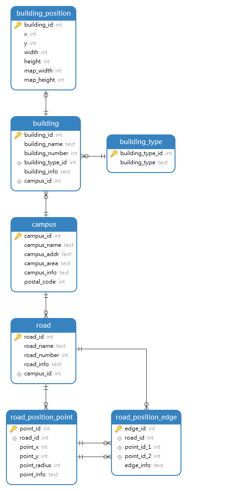
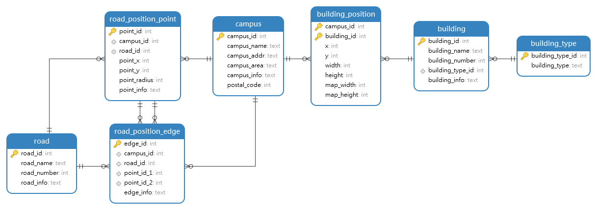

# **项目周报**

+ 【院系】计算机学院
+ 【专业】计算机科学与技术
+ 【学号】21312450
+ 【姓名】林隽哲
+ 【邮箱】linjzh28@mail2.sysu.edu.cn

## 周报时间段

<20231111-20231216>

## 学习总结

本次学习分为两个阶段进行：
- 学习git及使用git
- 学习数据库知识及设计简单数据表：将中大校区地图数字化

### 学习git及使用git

事实上我使用git已经有一段时间了，因此在这里我主要想纪录一下我在使用git过程中遇到的问题及解决方法。

#### .gitignore无法忽略文件

这是一个很常见的问题，当文件被添加到本地Git缓存之后才进行.gitignore的配置，将导致.gitignore无法忽略文件。解决方法如下：

1. 清除当前的本地Git缓存
```bash
git rm -r --cached .
```
2. 应用.gitignore等本地配置文件重新建立Git索引
```bash
git add .
```
3. (可选)提交当前Git版本并备注说明
```bash
git commit -m "update .gitignore"
```

#### 如何从仓库中移除LFS

LFS(Large File Storage)是一个用于管理大文件的工具，往往在将大型文件上传到远程仓库时会使用。但有一句话说得好，学一个工具之前先要学会怎么去卸载它。

```bash
git lfs uninstall
```

将lfs删除后，将commit跟add的退回到之前的版本即可

#### 误传大文件到本地git仓库导致无法push

当你的git仓库中不小心有超过100MB得文件，并且不小心commit后，将会遇到无法push的问题。解决方法如下：

```bash
git filter-branch -f --index-filter 'git rm --cached --ignore-unmatch fixtures/11_user_answer.json'
```

简单的解释一下这条指令的参数：

- `-f`：强制执行
- `--index-filter`：指定一个命令，用于修改索引
- `git rm --cached --ignore-unmatch fixtures/11_user_answer.json`：删除索引中的指定文件

#### 如何将撤销git commit的提交

这也是个非常常见的问题：

- 软撤销:

git commit的记录会被撤销，回到上一次的commit状态，同时保留本地修改，不撤销git add的操作

```bash
git reset --soft HEAD~1
```

- 硬撤销:

本地代码会回到上一次commit的状态，本地修改不会保留，撤销git add的操作

```bash
git reset --hard HEAD~1
```

- 混合撤销:

不删除工作空间改动代码，撤销commit，并且撤销git add

```bash
git reset --mixed HEAD~1 (default)
```

- if you only want to change the commit message, you could use

```bash
git commit --amend
```

#### git clone的一直是自己的远程仓库

挺有趣的一个问题，由于我平时在进行上传时一般都是用wsl进行，所以一直没有发现这个问题。直到我一次在windows上进行clone时，才发现明明命令里面写的是别人的仓库，但是clone下来的却是自己的仓库。

导致这个问题的原因是我在.gitconfig文件中将remote仓库定死为了自己的仓库，只需要将其注释即可。

随后在之前的项目中添加回自己的远程仓库：

```bash
git remote add origin
```

#### 最后


git的命令行接口说实话比较难用，个人推荐将常用的指令以及参数写入脚本或使用命令别名，很经典的例子：`git mlog`，总比`git log --all --graph --decorate --oneline`来的方便。


### 学习数据库知识及设计简单数据表

首先明确本数据库的主要用途：

- 可以查看校园列表
- 可以查看建筑物列表
- 可以查看校园内部道路列表
- 可以用于校内导航

那么很自然的，我们可以将需要创建的表大致的列出：

- campus table
- building table
- road table
- building location table
- road location table (road network is a graph, so we can save it into two parts: node and edge)

这里给出两种设计方案：

#### 方案一



#### 方案二



#### 实现

两个方案的实现方式类似，这里都不给出具体的实现代码，而是给出实现中的一些细节。

我在查看远程数据库的时候主要使用的是Navicat软件，这是一款很优秀的数据库管理软件，能够提供便捷的数据库操作、数据库的多各式导入、多格式导出、反向工程等功能。事实上，本次数据库的实现中所使用的json格式数据就是我通过Navicat软件从远程数据库中导出的。

而在本地进行数据库编写的过程中，我更推荐使用Database Cilent JDBC插件。

本地的数据库实现与数据测试中我选择了python作为开发语言，其中主要使用到了pymysql、sqlite3、json以及pytest等库。

其中，pymysql库用于连接数据库，sqlite3库用于本地数据库的创建，json库用于json格式数据的读取，pytest库用于测试。

#### 总结

两个方案区别只在于location表格的设计，从整体实现来看两者实际无太大差别。

两个方案的结构都不复杂，但是说实话两者若要真正运用到实际中，还是有很多问题需要解决的，比如说：

- 道路网络的复杂导致了road location表格的实现难度以及运用时精度的缺失。
- 建筑物的位置信息的获取，building location表格存储了一张校园地图的尺寸、建筑物相对于地图水平方向一点的坐标以及框选建筑物的长宽。然而不难想象，这种实现方式极度依赖于地图，以及这种实现方式的精度也是很难保证的。


## 之后的计划

实际上，我自己一直在构造一个本地图书管理系统的项目（个人需求），这个项目中处理涉及到数据库方面的知识外，同时也涉及到了前端及一些框架的知识。我打算在之后的学习中将这个项目进行完善，同时也会在这个项目中学习到更多的知识。

## 参考

Pro Git:[https://git-scm.com/book/en/v2]
Oh shit, Git?!:[https://ohshitgit.com/]
《数据库系统教程（第2版）上册》 -- 王能斌 著
