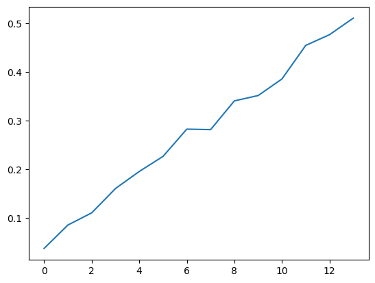
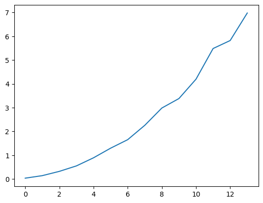
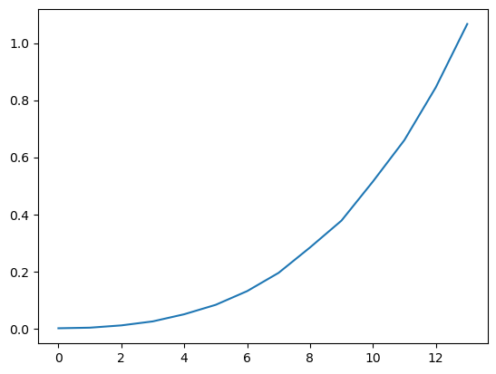
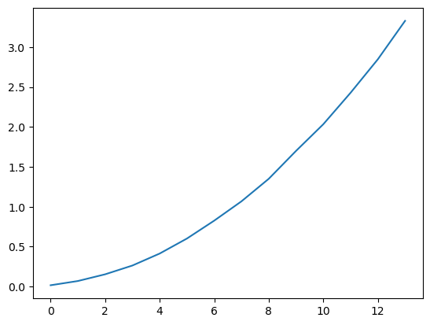
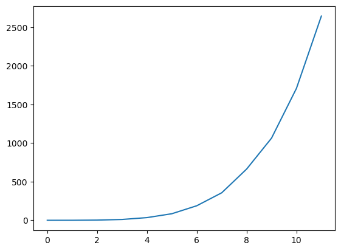
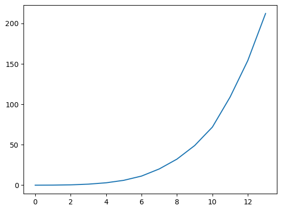

# ch2课后习题

[toc]

## 2.7

### a.

<center>(1) O(n)</center>
<center>(2) O(n<sup>2</sup>)</center>
<center>(3) O(n<sup>3</sup>)</center>
<center>(4) O(n<sup>2</sup>)</center>
<center>(5) O(n<sup>5</sup>)</center>
<center>(6) O(n<sup>4</sup>)</center>


### b.

```cpp
// analysis time complexity
#include <iostream>
#include <ctime>

void test1(size_t n) { // O(n)
    clock_t start = clock();
    size_t sum = 0;
    for (size_t i = 0; i < n; ++i) 
        ++sum;
    clock_t end = clock();
    std::cout << "test1: " << (double)(end - start) / CLOCKS_PER_SEC << "s" << std::endl;
}


void test2(size_t n) { // O(n^2)
    clock_t start = clock();
    size_t sum = 0;
    for (size_t i = 0; i < n; ++i) 
        for (size_t j = 0; j < n; ++j) 
            ++sum;
    clock_t end = clock();
    std::cout << "test2: " << (double)(end - start) / CLOCKS_PER_SEC << "s" << std::endl;
}


void test3(size_t n) { // O(n^3)
    clock_t start = clock();
    size_t sum = 0;
    for (size_t i = 0; i < n; ++i) 
        for (size_t j = 0; j < n*n; ++j) 
            ++sum;
    clock_t end = clock();
    std::cout << "test3: " << (double)(end - start) / CLOCKS_PER_SEC << "s" << std::endl;
}


void test4(size_t n) { // O(n^2)
    clock_t start = clock();
    size_t sum = 0;
    for (size_t i = 0; i < n; ++i) 
        for (size_t j = 0; j < i; ++j) 
            ++sum;
    clock_t end = clock();
    std::cout << "test4: " << (double)(end - start) / CLOCKS_PER_SEC << "s" << std::endl;
}


void test5(size_t n) { // O(n^5)
    clock_t start = clock();
    size_t sum = 0;
    for (size_t i = 0; i < n; ++i) 
        for (size_t j = 0; j < i*i; ++j) 
            for (size_t k = 0; k < j; ++k) 
                ++sum;
    clock_t end = clock();
    std::cout << "test5: " << (double)(end - start) / CLOCKS_PER_SEC << "s" << std::endl;
}


void test6(size_t n) { // O(n^4)
    clock_t start = clock();
    size_t sum = 0;
    for (size_t i = 0; i < n; ++i) 
        for (size_t j = 0; j < i*i; ++j) 
            if (j % i == 0)
                for (size_t k = 0; k < j; ++k) 
                    ++sum;
    clock_t end = clock();
    std::cout << "test6: " << (double)(end - start) / CLOCKS_PER_SEC << "s" << std::endl;
}

void test(void func(size_t), long long int n) {
    for (int i = 0; i < 15; ++i)
        func((size_t)n * (i + 1));
    std::cout << std::endl;
}


int main() {

    test(test1, 1e8);
    test(test2, 1e4);
    test(test3, 1e2);
    test(test4, 1e4);
    test(test5, 50);
    test(test6, 1e2);

    return 0; 
}
```

```powershell
# output
# 1e8 * [1-15]
test1: 0.038s
test1: 0.086s
test1: 0.111s
test1: 0.161s
test1: 0.196s
test1: 0.227s
test1: 0.283s
test1: 0.282s
test1: 0.341s
test1: 0.352s
test1: 0.386s
test1: 0.455s
test1: 0.477s
test1: 0.511s
test1: 0.522s

# 1e4 * [1-15]
test2: 0.036s
test2: 0.142s
test2: 0.322s
test2: 0.552s
test2: 0.892s
test2: 1.296s
test2: 1.654s
test2: 2.257s
test2: 2.984s
test2: 3.382s
test2: 4.197s
test2: 5.485s
test2: 5.821s
test2: 6.977s
test2: 8.368s

# 1e2 * [1-15]
test3: 0.001s
test3: 0.003s
test3: 0.011s
test3: 0.025s
test3: 0.05s
test3: 0.083s
test3: 0.131s
test3: 0.195s
test3: 0.284s
test3: 0.378s
test3: 0.515s
test3: 0.66s
test3: 0.845s
test3: 1.067s
test3: 1.301s

# 1e4 * [1-15]
test4: 0.017s
test4: 0.07s
test4: 0.154s
test4: 0.264s
test4: 0.414s
test4: 0.602s
test4: 0.826s
test4: 1.068s
test4: 1.35s
test4: 1.699s
test4: 2.033s
test4: 2.427s
test4: 2.846s
test4: 3.328s
test4: 3.804s

# 50 * [1-15]
test5: 0.012s
test5: 0.34s
test5: 2.569s
test5: 10.824s
test5: 34.806s
test5: 85.093s
test5: 188.445s
test5: 356.097s
test5: 663.4s
test5: 1064.28s
test5: 1708.95s
test5: 2645.79s
test5: 3991.59s
...(too long, cutted)

# 1e2 * [1-15]
test6: 0.006s
test6: 0.094s
test6: 0.427s
test6: 1.291s
test6: 2.962s
test6: 6.023s
test6: 11.262s
test6: 20.072s
test6: 32.198s
test6: 48.987s
test6: 71.782s
test6: 108.925s
test6: 154.054s
test6: 212.064s
test6: 266.497s
```


### c.

作出图表，分析程序的运行时间与输入规模的关系。

**(1)** 

**(2)** 

**(3)** 

**(4)** 

**(5)** 

**(6)** 

可以看出，各个程序对不同的n值的运行时间的增长趋势与分析中的时间复杂度相符。


## 2.8

### a.

- 三个算法都将生成合法的排列。前两个算法都通过了检查重复的方式保证了每一个新生成的数都与之前的数不同，从而保证了生成的排列是合法的。第三个算法是将一个本没有重复项的数列进行混洗，这样生成的数列也同样是合法的。

</br>

- 对于前两种算法，可以简单的看出每个数生成在各个位置的概率是相同的，故其生成的所有排列都是等可能的。

</br>

- 对于第三种算法，我们尝试使用数学归纳的方法进行证明：

  - 当 i=1 时，此时数列中只有一个数，故只有一种排列，此时排列是等可能的。
  - 当 i=2 时，此时数列中有两个数，randInt所生成的数为0或1且两者出现的概率相同，故此时是否发生交换的概率也相同，此时数列共有两种可能，且两种可能发生的概率相同。
  - 现在不妨假设当 i=n 时，所有排列都是等可能的这一命题为真，并假设其概率为 p1。
  - 让我们来考虑 i=n+1 时的情况。此时的数列中有 n+1 个数，当我们保持第 n+1 个数的位置不变时，此时生成的数列的概率取决与前 n 个数，根据假设，此时数列所有可能的情况的概率都是相等的，为 p1。我们可以将 i=n+1 时生成的新数列等价于将第 n+1 个数与位于第 randInt(n+1) 个位置的元素进行交换所生成的新数列，由于 randInt(n+1) 生成的数的概率都是相同的，设其为p2，故此时生成的数列的概率也是相同的，为 p1*p2。由此可知，当 i=n+1 时，所有排列的概率都是相同的，故此时命题为真，故所有排列都是等可能的。


### b.

1. 对于第一种算法，当已经存在`i`个数在数列中时，要生成第`i+1`个数之前，则需要先对前`i`个数进行一次是否为重复的检测，此处所需要的时间为`O(i)`，而当数列中已经存在`i`个数时，在生成第`i+1`个数时，生成一个不与数列中的数重复的数字的概率为`N-i/N`，故生成1个不重复的数字所期望抽取的次数为`N/(N-i)`，由是可得：

$$\sum_{i=0}^{N-1}\frac{Ni}{N-1} < \sum_{i=0}^{N-1}\frac{N^2}{N-i} < N^2\sum_{i=0}^{N-1}\frac{1}{N-i} = O(N^2logN)$$

</br>

2. 对于算法二，则是将算法1中的检测重复的过程进行了优化，将检测重复的过程从`O(i)`降低到了`O(1)`，故可以简单的从1中的结果中推导出算法2的时间复杂度为

$$O(NlogN)$$

</br>

3. 对于算法3，其填写操作的时间复杂度为`O(N)`，而其重洗数列操作的时间复杂度同样也为`O(N)`，并且两个操作为顺序操作，故可知算法3的时间复杂度为线性的:

$$O(N)$$

</br>


### c.

```cpp
// 由于 <random>库中的 rand()函数生成的随机数最大值为 32767，不满足题目要求，
// 故此处使用 MerenneTwister 随机数生成器
#include <iostream>
#include <ctime>
#include <algorithm>

using ULL = unsigned long long int;

/* Period parameters */
#define N 624
#define M 397
#define MATRIX_A 0x9908b0dfUL   /* constant vector a */
#define UMASK 0x80000000UL /* most significant w-r bits */
#define LMASK 0x7fffffffUL /* least significant r bits */
#define MIXBITS(u,v) ( ((u) & UMASK) | ((v) & LMASK) )
#define TWIST(u,v) ((MIXBITS(u,v) >> 1) ^ ((v)&1UL ? MATRIX_A : 0UL))

static unsigned long state[N]; /* the array for the state vector  */
static int left = 1;
static int initf = 0;
static unsigned long *next;

/* initializes state[N] with a seed */
void init_genrand(unsigned long s)
{
    int j;
    state[0]= s & 0xffffffffUL;
    for (j=1; j<N; j++) {
        state[j] = (1812433253UL * (state[j-1] ^ (state[j-1] >> 30)) + j);
        /* See Knuth TAOCP Vol2. 3rd Ed. P.106 for multiplier. */
        /* In the previous versions, MSBs of the seed affect   */
        /* only MSBs of the array state[].                        */
        /* 2002/01/09 modified by Makoto Matsumoto             */
        state[j] &= 0xffffffffUL;  /* for >32 bit machines */
    }
    left = 1; initf = 1;
}

/* initialize by an array with array-length */
/* init_key is the array for initializing keys */
/* key_length is its length */
/* slight change for C++, 2004/2/26 */
void init_by_array(unsigned long init_key[], int key_length)
{
    int i, j, k;
    init_genrand(19650218UL);
    i=1; j=0;
    k = (N>key_length ? N : key_length);
    for (; k; k--) {
        state[i] = (state[i] ^ ((state[i-1] ^ (state[i-1] >> 30)) * 1664525UL))
          + init_key[j] + j; /* non linear */
        state[i] &= 0xffffffffUL; /* for WORDSIZE > 32 machines */
        i++; j++;
        if (i>=N) { state[0] = state[N-1]; i=1; }
        if (j>=key_length) j=0;
    }
    for (k=N-1; k; k--) {
        state[i] = (state[i] ^ ((state[i-1] ^ (state[i-1] >> 30)) * 1566083941UL))
          - i; /* non linear */
        state[i] &= 0xffffffffUL; /* for WORDSIZE > 32 machines */
        i++;
        if (i>=N) { state[0] = state[N-1]; i=1; }
    }

    state[0] = 0x80000000UL; /* MSB is 1; assuring non-zero initial array */
    left = 1; initf = 1;
}

static void next_state(void)
{
    unsigned long *p=state;
    int j;

    /* if init_genrand() has not been called, */
    /* a default initial seed is used         */
    if (initf==0) init_genrand(5489UL);

    left = N;
    next = state;

    for (j=N-M+1; --j; p++)
        *p = p[M] ^ TWIST(p[0], p[1]);

    for (j=M; --j; p++)
        *p = p[M-N] ^ TWIST(p[0], p[1]);

    *p = p[M-N] ^ TWIST(p[0], state[0]);
}

/* generates a random number on [0,0xffffffff]-interval */
unsigned long genrand_int32(void)
{
    unsigned long y;

    if (--left == 0) next_state();
    y = *next++;

    /* Tempering */
    y ^= (y >> 11);
    y ^= (y << 7) & 0x9d2c5680UL;
    y ^= (y << 15) & 0xefc60000UL;
    y ^= (y >> 18);

    return y;
}

/* generates a random number on [0,0x7fffffff]-interval */
long genrand_int31(void)
{
    unsigned long y;

    if (--left == 0) next_state();
    y = *next++;

    /* Tempering */
    y ^= (y >> 11);
    y ^= (y << 7) & 0x9d2c5680UL;
    y ^= (y << 15) & 0xefc60000UL;
    y ^= (y >> 18);

    return (long)(y>>1);
}

/* generates a random number on [0,1]-real-interval */
double genrand_real1(void)
{
    unsigned long y;

    if (--left == 0) next_state();
    y = *next++;

    /* Tempering */
    y ^= (y >> 11);
    y ^= (y << 7) & 0x9d2c5680UL;
    y ^= (y << 15) & 0xefc60000UL;
    y ^= (y >> 18);

    return (double)y * (1.0/4294967295.0);
    /* divided by 2^32-1 */
}

/* generates a random number on [0,1)-real-interval */
double genrand_real2(void)
{
    unsigned long y;

    if (--left == 0) next_state();
    y = *next++;

    /* Tempering */
    y ^= (y >> 11);
    y ^= (y << 7) & 0x9d2c5680UL;
    y ^= (y << 15) & 0xefc60000UL;
    y ^= (y >> 18);

    return (double)y * (1.0/4294967296.0);
    /* divided by 2^32 */
}

/* generates a random number on (0,1)-real-interval */
double genrand_real3(void)
{
    unsigned long y;

    if (--left == 0) next_state();
    y = *next++;

    /* Tempering */
    y ^= (y >> 11);
    y ^= (y << 7) & 0x9d2c5680UL;
    y ^= (y << 15) & 0xefc60000UL;
    y ^= (y >> 18);

    return ((double)y + 0.5) * (1.0/4294967296.0);
    /* divided by 2^32 */
}

/* generates a random number on [0,1) with 53-bit resolution*/
double genrand_res53(void)
{
    unsigned long a=genrand_int32()>>5, b=genrand_int32()>>6;
    return(a*67108864.0+b)*(1.0/9007199254740992.0);
}

void algorithm1(ULL *arr, ULL n) {
    for (ULL i = 0; i < n; ++i) {
        ULL num = genrand_int32() % n + 1;
        for (ULL j = 0; j < i; ++j) {
            if (arr[j] == num) {
                num = rand() % n + 1;
                j = 0;
            }
        }
        arr[i] = num;
    }
}

void algorithm2(ULL *arr, ULL n) {
    ULL *table = new ULL[n]{0,};
    for (ULL i = 0; i < n; ++i) {
        ULL num = genrand_int32() % n + 1;
        if (table[num - 1] == 0) {
            table[num - 1] = 1;
            arr[i] = num;
        }
        else {
            --i;
        }
    }
}

void algorithm3(ULL *arr, ULL n) {
    for (ULL i = 0; i < n; ++i) {
        arr[i] = i + 1;
    }
    for (ULL i = 0; i < n; ++i) {
        std::swap(arr[i], arr[genrand_int32() % (i+1)]);
    }
}

void test(ULL n, void func(ULL *, ULL)) {
    ULL *arr = new ULL[n]{0,};
    clock_t start = clock();
    func(arr, n);
    clock_t end = clock();
    std::cout << (double)(end - start) / CLOCKS_PER_SEC << "s" << std::endl;
    delete [] arr;
}

int main() {

    for (int i = 0; i < 10; ++i) {
        std::cout << "algorithm1: " << std::endl;
        test(250, algorithm1);
        test(500, algorithm1);
        test(1'000, algorithm1);
        test(2'000, algorithm1);

        std::cout << "algorithm2: " << std::endl;
        test(25'000, algorithm2);
        test(50'000, algorithm2);
        test(100'000, algorithm2);
        test(200'000, algorithm2);
        test(400'000, algorithm2);
        test(800'000, algorithm2);

        std::cout << "algorithm3: " << std::endl;
        test(100'000, algorithm3);
        test(200'000, algorithm3);
        test(400'000, algorithm3);
        test(800'000, algorithm3);
        test(1'600'000, algorithm3);
        test(3'200'000, algorithm3);
        test(6'400'000, algorithm3);
        std::cout << std::endl;
    }

    return 0;
}
```

```powershell
# output
algorithm1: 
0.001s
0s
0.002s
0.008s
algorithm2:
0.003s
0.008s
0.015s
0.036s
0.071s
0.149s
algorithm3:
0.001s
0.004s
0.006s
0.013s
0.03s
0.081s
0.223s

algorithm1:
0s
0.001s
0.002s
0.009s
algorithm2:
0.003s
0.006s
0.011s
0.026s
0.056s
0.188s
algorithm3:
0.001s
0.003s
0.006s
0.013s
0.038s
0.097s
0.205s

algorithm1:
0s
0.001s
0.002s
0.008s
algorithm2:
0.003s
0.007s
0.014s
0.024s
0.058s
0.148s
algorithm3:
0.002s
0.003s
0.008s
0.014s
0.035s
0.098s
0.224s

algorithm1:
0s
0.001s
0.002s
0.008s
algorithm2:
0.003s
0.006s
0.013s
0.03s
0.058s
0.136s
algorithm3:
0.001s
0.003s
0.006s
0.027s
0.061s
0.107s
0.182s

algorithm1:
0s
0s
0.003s
0.007s
algorithm2:
0.004s
0.006s
0.012s
0.029s
0.067s
0.146s
algorithm3:
0.001s
0.002s
0.007s
0.014s
0.032s
0.074s
0.182s

algorithm1:
0.001s
0.001s
0.002s
0.008s
algorithm2:
0.003s
0.006s
0.013s
0.031s
0.056s
0.143s
algorithm3:
0.001s
0.003s
0.006s
0.014s
0.03s
0.078s
0.219s

algorithm1:
0.001s
0.001s
0.002s
0.008s
algorithm2:
0.002s
0.007s
0.014s
0.029s
0.062s
0.128s
algorithm3:
0.001s
0.003s
0.007s
0.014s
0.033s
0.075s
0.191s

algorithm1:
0s
0.001s
0.002s
0.007s
algorithm2:
0.003s
0.008s
0.013s
0.031s
0.076s
0.139s
algorithm3:
0.002s
0.003s
0.006s
0.012s
0.033s
0.072s
0.173s

algorithm1:
0s
0s
0.002s
0.008s
algorithm2:
0.002s
0.005s
0.013s
0.029s
0.056s
0.125s
algorithm3:
0.001s
0.004s
0.006s
0.016s
0.03s
0.071s
0.181s

algorithm1:
0s
0.001s
0.002s
0.008s
algorithm2:
0.003s
0.005s
0.012s
0.028s
0.059s
0.138s
algorithm3:
0.001s
0.003s
0.007s
0.014s
0.03s
0.078s
0.185s
```

```powershell
# average
algorithm1_time_250 : 0.0002
algorithm1_time_500 : 0.0008
algorithm1_time_1000 : 0.0021
algorithm1_time_2000 : 0.0085

algorithm2_time_25000 : 0.0028
algorithm2_time_50000 : 0.0061
algorithm2_time_100000 : 0.0131
algorithm2_time_200000 : 0.0295
algorithm2_time_400000 : 0.0625
algorithm2_time_800000 : 0.1512

algorithm3_time_100000 : 0.0011
algorithm3_time_200000 : 0.0028
algorithm3_time_400000 : 0.0055
algorithm3_time_800000 : 0.0135
algorithm3_time_1600000 : 0.0359
algorithm3_time_3200000 : 0.0796
algorithm3_time_6400000 : 0.1913
```


### d.

从所得的不同数据规模所对应的程序平均执行时间中可看出，算法1与算法2的时间增长率与分析的时间复杂度相符，算法3符合线性增长的时间复杂度。


### e.

1. 算法1在最坏的情形下，当增添第`i+1`个元素，都需要与数列中的`i`个元素进行比较来确定该数是否合法，并且需要最多会重复`i`次，此时将会有：

$$\sum_{i=0}^{n-1}i^2 = O(n^3)$$


2. 算法2在最坏的情形下，当增添第`i+1`个元素，只需要使用一步便可确定该数是否合法，但是需要最多会重复`i`次，此时将会有：

$$\sum_{i=0}^{n-1}i = O(n^2)$$

3. 算法3在最坏的情形下仍保持线性增长的时间复杂度


## 2.27

只需要从矩阵的右上角出发，若目标的元素比当前元素大，则向下移动，若目标的元素比当前元素小，则向左移动，直到找到目标元素或者移动到矩阵的边界。

此算法的在最坏的情况下需要寻找`2N`次，因此时间复杂度为`O(N)`。


```cpp
// sample code
bool find_number(int matrix[][4], int N, int target) {
    int row = 0, col = N -1;
    while (matrix[row][col] != target) {
        if (matrix[row][col] > target) {
            col--;
        } else {
            row++;
        }
        if (row >= N || col < 0) {
            return false;
        }
    }
    return true;
}
```