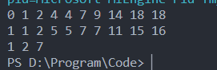
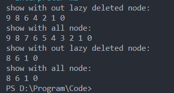
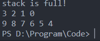

# ch3课后习题

[toc]

<div STYLE="page-break-after: always;"></div>

## 3.4

**示例代码**
```cpp
#include <list>
#include <random>
#include <iostream>

using namespace std;

template <typename Object>
list<Object> intersection(const list<Object> &list1, const list<Object> &list2) {
    list<Object> intersection;
    auto iter1 = list1.begin(), iter2 = list2.begin();
    while (iter1 != list1.end() && iter2 != list2.end()) {
        if (*iter1 == *iter2) {
            intersection.push_back(*iter1);
            ++iter1; ++iter2;
        }
        else if (*iter1 < *iter2) ++iter1;
        else ++iter2;
    }
    return intersection;
}

int main() {
    list<int> list1, list2, list3;

    while (list1.size() < 10) {
        int x = rand() % 20;
        list1.push_back(x);
    }
    list1.sort();
    for (auto iter : list1) cout << iter << " ";
    cout << endl;
    while (list2.size() < 10) {
        int x = rand() % 20;
        list2.push_back(x);
    }

    list2.sort();
    for (auto iter : list2) cout << iter << " ";
    cout << endl;

    list3 = intersection(list1, list2);
    for (auto iter : list3) cout << iter << " ";
    cout << endl;

    return 0;       
}
```

**运行结果**



<div STYLE="page-break-after: always;"></div>

## 3.20

- **a.** 
  - 相比于标准的删除算法，懒惰删除的书写难度更低、更简洁
  - 当被删除的节点接下来会插入到同一位置，显然懒惰删除会使这次的插入更高效
  - 但懒惰删除往往会使链表的实际长度比逻辑长度更长，这将导致多余的空间占用，并且在如遍历等操作中将会执行一些多余的判断

- **b.** 

**示例代码**
```cpp
// lazy deletion
#include <iostream>

using namespace std;

template <typename Object>
class LazyList {
private:
    struct Node {
        Object data;
        Node *next;
        bool deleted_flag;
        Node(Object d, Node *n = nullptr, bool d_flg = false) : data(d), next(n), deleted_flag(d_flg) {}
        Node() : next(nullptr), deleted_flag(false) {}
    };

public:
    LazyList() : head(new Node), theSize(0), deletedNum(0) {}
    ~LazyList() { clear(); delete head; }

    void clear() {
        if (isEmpty()) return;
        Node *p = head->next;
        while (p != nullptr) {
            Node *tmp = p;
            p = p->next;
            delete tmp;
        }
        head->next = nullptr;
        theSize = 0;
    }

    void deleteNode(Node *pre, Node *deleteNode) {
        pre->next = deleteNode->next;
        delete deleteNode;
        --theSize;
    }
    
    void lazyDelete(Object x) {
        Node *p = head->next;
        while (p != nullptr && p->data != x) {
            p = p->next;
        }
        if (p != nullptr) {
            p->deleted_flag = true;
        }
        deletedNum++;
        if (deletedNum > theSize / 2) {
            rebuild();
        }
    }

    void rebuild() {
        Node *p = head;
        while (p->next != nullptr) {
            if (p->next->deleted_flag) {
                deleteNode(p, p->next);
            } else {
                p = p->next;
            }
        }
        deletedNum = 0;
    }

    void push_front(Object x) {
        Node *newNode = new Node(x, head->next);
        head->next = newNode;
        ++theSize;
    }

    bool isEmpty() const { return theSize == 0; }

    class const_iterator {
    public:
        const_iterator() : current(nullptr) {}
        const Object &operator*() const { return retrieve(); }
        const_iterator &operator++() {
            current = current->next;
            while (current != nullptr && current->deleted_flag) {
                current = current->next;
            }
            return *this;
        }
        const_iterator operator++(int) {
            const_iterator old = *this;
            ++(*this);
            return old;
        }
        bool operator==(const const_iterator &rhs) const { return current == rhs.current; }
        bool operator!=(const const_iterator &rhs) const { return !(*this == rhs); }

    protected:
        Node *current;
        Object &retrieve() const { return current->data; }
        const_iterator(Node *p) : current(p) {}
        friend class LazyList<Object>;
    };

    const_iterator begin() const { return const_iterator(head->next); }
    const_iterator end() const { return const_iterator(nullptr); }

    void traverse_all_code() {
        Node *p = head->next;
        while (p != nullptr) {
            cout << p->data << " ";
            p = p->next;
        }
        cout << endl;
    }

private:
    Node *head;
    int theSize;    
    int deletedNum;
};


int main() {

    LazyList<int> list;
    for (int i = 0; i < 10; ++i) {
        list.push_front(i);
    }
    
    list.lazyDelete(3);
    list.lazyDelete(5);
    list.lazyDelete(7);
    list.lazyDelete(9);

    cout << "show with out lazy deleted node: " << endl;
    for (auto &x : list) {
        cout << x << " ";
    }
    cout << endl;


    cout << "show with all node: " << endl;
    list.traverse_all_code();

    list.lazyDelete(2);
    list.lazyDelete(4);

    cout << "show with out lazy deleted node: " << endl;
    for (auto &x : list) {
        cout << x << " ";
    }
    cout << endl;

    cout << "show with all node: " << endl;
    list.traverse_all_code();

    return 0;
}
```

**运行结果**


<div STYLE="page-break-after: always;"></div>

## 3.24

**示例代码**
```cpp
// two stack in one array

#include <iostream>
// #include <stack>

using namespace std;

template <typename Object>
class TwoStack {
public:
    TwoStack(int size) : array(new Object[size]), top1(-1), top2(size), arraySize(size) {}
    ~TwoStack() { delete [] array; }

    bool isEmpty(int stackNum) const {
        if (stackNum == 1) return top1 == -1;
        else if (stackNum == 2) return top2 == arraySize;
        else {
            cout << "stackNum error!" << endl;
            return false;
        }
    }

    void push(int stackNum, const Object &x) {
        if (top1 + 1 == top2) {
            cout << "stack is full!" << endl;
            return;
        }

        if (stackNum == 1) array[++top1] = x;
        else if (stackNum == 2) array[--top2] = x;
        else {
            cout << "stackNum error!" << endl;
            return;
        }
    }

    Object pop(int stackNum) {
        if (isEmpty(stackNum)) {
            cout << "stack is empty!" << endl;
            return 0;
        }

        if (stackNum == 1) return array[top1--];
        else if (stackNum == 2) return array[top2++];
        else {
            cout << "stackNum error!" << endl;
            return 0;
        }
    }

    Object top(int stackNum) const {
        if (isEmpty(stackNum)) {
            cout << "stack is empty!" << endl;
            return 0;
        }

        if (stackNum == 1) return array[top1];
        else if (stackNum == 2) return array[top2];
        else {
            cout << "stackNum error!" << endl;
            return 0;
        }
    }

private:
    Object *array;
    int top1, top2;
    int arraySize;
};


int main() {

    TwoStack<int> s(10);
    s.push(1, 0);
    s.push(1, 1);
    s.push(1, 2);
    s.push(1, 3);

    s.push(2, 4);
    s.push(2, 5);
    s.push(2, 6);
    s.push(2, 7);
    s.push(2, 8);
    s.push(2, 9);
    
    s.push(1, 10);

    while (!s.isEmpty(1)) {
        cout << s.pop(1) << " ";
    }
    cout << endl;

    while (!s.isEmpty(2)) {
        cout << s.pop(2) << " ";
    }
    cout << endl;

    return 0;
}
```     

**运行结果**


<div STYLE="page-break-after: always;"></div>

## 3.35

**answer**

a. 若使迭代器对应链表的第一项，那么在执行循环队列的入队操作时，为了寻找队尾，将需要从队首开始遍历整个队列，无法实现以常数最坏情形时间执行

b. 若使迭代器对应链表的最后一项，那么只需一步便可通过队尾的next指针找到队首，因此对于基本的队列操作，其都能够通过迭代器以常熟最坏情形时间执行

**示例代码**
```cpp
#include <iostream>
#include <utility>

using namespace std;

template <typename Object>
class circularQueue {
private:
    struct node {
        Object data;
        node *next;
        node() : next(nullptr) {}
        node(const Object &&d, node *n = nullptr) : data(std::move(d)), next(n) {}
    };

public:
    circularQueue() : theSize(0), tail(nullptr) {}
    ~circularQueue() { clear(); }

    bool isEmpty() { return theSize == 0; }
    void clear() { while (!isEmpty()) dequeue(); }

    void enqueue(const Object &&x) {
        if (isEmpty()) {
            tail = new node {std::move(x)};
            tail->next = tail;
        } else {
            tail->next = new node {std::move(x), tail->next};
            tail = tail->next;
        }                     
        ++theSize;                                                                                                           
    }

    void dequeue() {
        if (isEmpty()) return;
        node *old = tail->next;
        if (old == tail) tail = nullptr;
        else tail->next = old->next;
        delete old;
        --theSize;
    }

private:
    int theSize;
    node *tail;
};

int main() {
    circularQueue<int> cq;
    return 0;
}
```