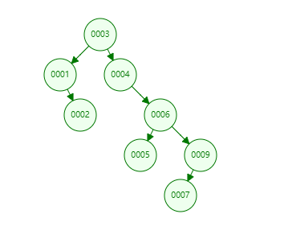
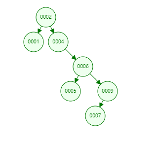
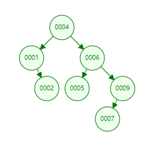
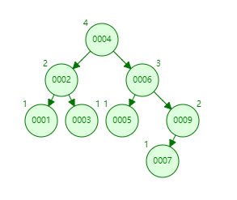

# CH4 课后习题

[toc]

## 4.9

**a. Answer**

**b. Answer**

OR

## 4.10

**a. Answer**

$f(0)$ 与 $f(1)$ 的值均为 0

**b. Answer**

当存在有 $N$ 个节点时 $(N>1)$ :

根节点的左右子树中所含的节点个数共存在 $N$ 种情况，令左子树的节点个数为 $i$，则右子树的节点个数便为 $N-i-1$，其中 $(0 \le i \le N-1)$

其中，唯有当左子树或右子树为空树的两种情况下根节点才不为满节点。于是有：

$$f(N) = \frac{1}{N} [\sum_{i=0}^{N-1}(1+f(i)+f(N-i-1))-2]$$
$$= \frac{\sum_{i=0}^{N-1}1}{N} - \frac{2}{N} + \frac{\sum_{i=0}^{N-1}(f(i)+f(N-i-1))}{N}$$
$$= \frac{N-2}{N} + \frac{1}{N} \sum_{i=0}^{N-1}(f(i)+f(N-i-1))$$

证毕。

**c. Answer**

即证明 $f(N) = \frac{N-2}{3} = \frac{N-2}{N} + \frac{1}{N} \sum_{i=0}^{N-1}(f(i)+f(N-i-1))$ 对于 $N \ge 2$ 成立。

由（a），可知 $f(0)=f(1)=0$，

- 当 $N=2$ 时：

$$\frac{N-2}{3} = \frac{2-2}{3} = 0$$

 

$$\frac{N-2}{N} + \frac{1}{N} \sum_{i=0}^{N-1}(f(i)+f(N-i-1)) \\
 = \frac{2-2}{2} + \frac{1}{2} (f(0)+f(1)+f(1)+f(0)) = 0$$

故 $N=2$ 时，等式成立。

- 当 $N>2$ 时：

假设对于所有 $2 \le k < N$，$f(k) = \frac{k-2}{3}$ 成立。

则有：

$$\sum_{i=0}^{N-1}(f(i)+f(N-i-1))$$
$$= 2(f(0)+f(N-1)+f(1)+f(N-2)) + \sum_{i=2}^{N-3}(\frac{i-2}{3}+\frac{N-i-1-2}{3})$$
$$= 2(f(N-1)+f(N-2)) + \sum_{i=2}^{N-3}(\frac{i-2+N-i-1-2}{3})$$
$$= 2(\frac{N-3}{3}+\frac{N-4}{3}) + \sum_{i=2}^{N-3}(\frac{N-5}{3})$$
$$= \frac{4N-14}{3} + \frac{(N-4)(N-5)}{3}$$
$$= \frac{N^2-5N+6}{3} = \frac{(N-2)(N-3)}{3}$$

故：

$$\frac{N-2}{N} + \frac{1}{N} \sum_{i=0}^{N-1}(f(i)+f(N-i-1))$$
$$= \frac{N-2}{N} + \frac{1}{N} \frac{(N-2)(N-3)}{3}$$
$$= \frac{N^2-5N+6+3N-6}{3N}$$
$$= \frac{N^2-2N}{3N} = \frac{N-2}{3}$$

根据数学归纳，得证。

**d. Answer**

令一棵二叉树的满节点个数为 $N_2$，度数为 1 的节点个数为 $N_1$，叶节点个数为 $N_0$，则有：

$$N_2 + N_1 + N_0 - 1 = 2N_2 + N_1$$

即：

$$N_0 = N_2 + 1$$

由（b）可知：

$$f(N) = \frac{N-2}{3}$$

故树叶的平均数为：

$$f_0(N) = f(N) + 1 = \frac{N-2}{3} + 1 = \frac{N+1}{3}$$

## 4.19

**Answer**

