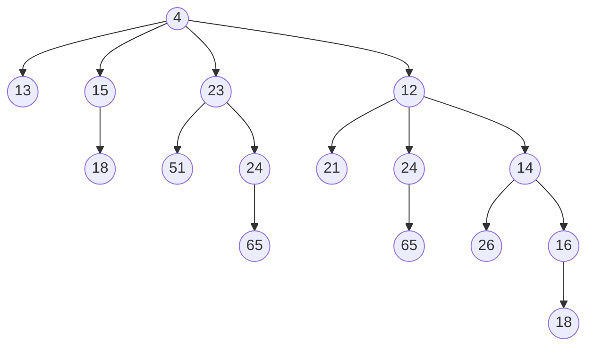

```mermaid
graph TD
n0((4))
n1((13))
n2((15))
n3((23))
n4((12))

n0-->n1
n0-->n2
n0-->n3
n0-->n4

n5((18))
n6((51))
n7((24))
n8((21))
n9((24))
n10((14))

n2-->n5
n3-->n6
n3-->n7
n4-->n8
n4-->n9
n4-->n10

n11((65))
n12((65))
n13((26))
n14((16))

n7-->n11
n9-->n12
n10-->n13
n10-->n14

n15((18))
n14-->n15
```