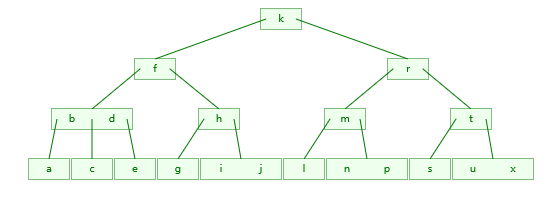

# 数据结构习题（7）

## 1.假设在树中，结点x是结点y的双亲时，用(x, y)来表示树的边。已知一棵树的树边结合为{(e, i), (b, e), (b, d), (a, b), (g, j), (c, g), (c, f), (h, l), (c, h), (a, c)}，用树型表示法表示该树，并回答下列问题：

**树型表示法**


1. 哪个是根结点？A
   哪些是叶子结点？I, D, F, J, L
   哪个是g的双亲？ C
   哪些是g的祖先？ C, A
   哪些是g的孩子？ J
   哪些是e的子孙？ I
   哪些是e的兄弟？ D, F, G, H
   哪些是f的兄弟？ E, D, G, H

2. b和h的层次各是多少？b: 2, h: 3
   树的深度是多少？4
   以结点c为根的子树的深度是多少？3


## 2.一颗深度为h的满k叉树有如下性质：第h层上的结点都是叶子结点，其余各层上的每个结点都有k棵非空子树。如果按层次顺序（同层自左至右）从1开始堆全部结点编号，问：

1. 各层的结点数是多少？ 第m层：$k^{m-1}$
2. 编号为i的结点的双亲结点（若存在）的编号是多少？ $\lfloor \frac{i-2}{k} \rfloor + 1$
3. 编号为i的结点的第j个孩子节点（若存在）的编号是多少？ $(i-1)k + j + 1$ （j从1开始）
4. 编号为i的结点的有右兄弟的条件是什么？其右兄弟的编号是多少？ 条件：i结点不为该层最后一个结点，即$\frac{k^{m}-1}{k-1} < i < \frac{k^{m+1}-1}{k-1}$，右兄弟编号：$i+1$


## 3.设有如图所示的二叉树


1. 分别用顺序存储方法和链接存储方法画出该二叉树的存储结构。

    顺序存储方法：
    
    
    
    链接存储方法：
    
    


2. 写出该二叉树的先序、中序和后序遍历序列。

**先序**

a, b, d, e, h, k, c, f, g, m, n

**中序**

d, b, h, e, k, a, f, c, m, g, n

**后序**

d, h, k, e, b, f, m, n, g, c, a


## 4.已知一棵二叉树的先序遍历序列和中序遍历序列分别为ABDGHCEFI和GDHBAECIF，请画出这棵二叉树，然后给出该树的后序遍历序列。


**后序遍历**

GHDBEIFCA


## 5.设一颗二叉树的中序遍历序列和后序遍历序列分别为BDCEAFHG和DECEBHGFA，请画出这棵二叉树，然后给出该树的先序遍历序列。


**先序遍历**

ABCDEFGH


## 6.已知一颗二叉树的中序遍历序列和后序遍历序列分别为dgbaekchif和gdbkeihfca，请画出这棵二叉树对应的中序线索树和后序线索树。

**原二叉树**


**中序线索树**


**后序线索树**


## 7.设有一棵树，如图所示：


1. 请分别用双亲表示法、孩子表示法、孩子兄弟表示法给出该树的存储结构。

**双亲表示法**

index | info | parent
--- | --- | ---
0 | A | -1
1 | B | 0
2 | C | 0
3 | D | 1
4 | E | 1
5 | F | 9
6 | G | 2
7 | H | 2
8 | K | 2
9 | M | 0
10 | N | 9


**孩子表示法**

index | info | child
--- | --- | ---
0 | A | 1 --> 2 --> 9 ^
1 | B | 3 --> 4 ^
2 | C | 7 --> 8 --> 6 ^
3 | D | ^
4 | E | ^
5 | F | ^
6 | G | ^
7 | H | ^
8 | K | ^
9 | M | 5 --> 10 ^
10 | N | ^


**孩子兄弟表示法**


2. 请给出该树的先序遍历序列和后序遍历序列。

**先序遍历序列**

A, B, D, E, C, H, K, G, M, F, N

**后序遍历序列**

D, E, B, H, K, G, C, F, N, M, A

3. 请将这棵树转换成二叉树。


## 8.设二叉树t的存储结构如图所示。其中t为数根结点的指针，Left和Right分别为结点的左、右孩子指针域，data为结点的数据域，请完成下列各题：


1. 画出二叉树t的逻辑结构。


2. 写出按前序、中序和后序遍历二叉树t所得到的结点序列。

**前序遍历**

A, B, C, E, D, F, H, G, I, J

**中序遍历**

E, C, B, H, F, D, J, I, G, A

**后序遍历**

E, C, H, F, J, I, G, D, B, A


## 9.表中m,n分别是一棵二叉树中两个结点，行号i=1,2,3,4分别表示四种m,n的相对关系，列号j=1,2,3分别表示在前序、中序和后序遍历中m,n之间的先后次序关系，要求在i,j所表示的关系能够同时发生的方格内打“√”


## 10.假设二叉树采用二叉链表存储，编写一个后序遍历二叉树的非递归算法。

**CODE**

```cpp
    void postOrder(Node *node, void (*visit)(Node *node)) {
        stack<Wrapper> s;
        Wrapper w(node, false);
        s.push(w);

        while (!s.empty()) {
            Wrapper w = s.top();
            s.pop();
            if (w.visFlg) {
                visit(w.node);
            } else {
                w.visFlg = true;
                s.push(w);
                if (w.node->rchild)
                    s.push(Wrapper(w.node->rchild, false));
                if (w.node->lchild)
                    s.push(Wrapper(w.node->lchild, false));
            }
        } 
    } 
```

## 11.在二叉树中查找值为X的结点，设计打印值为X的结点的双亲的算法。

**CODE**

```cpp
    void printXpar(Node * node, int x, void (*visit)(Node *node)) {
        if (!node)
            return;
        if ((node->lchild && node->lchild->data == x) || (node->rchild && node->rchild->data == x)) {
            if (node == root)
                return;
            visit(node);
        } else {
            if (node->lchild)
                printXpar(node->lchild, x, visit);
            if (node->rchild)
                printXpar(node->rchild, x, visit);
        }
    }
```

## 12.设给定权值集合w={3, 5, 7, 8, 11, 12}，请构造关于w的一棵huffman树，并求其加权路径长度WPL。


$$WPL = (11+12) \times 2 + (3+5+7+8) \times 3 = 115$$


## 13.假设用于通信的电文是由字符集{a, b, c, d, e, f, g, h}中的字符构成，这8个字符在电文中出现的概率分别为{0.07, 0.19, 0.02, 0.06, 0.32, 0.03, 0.21, 0.10}。

1. 请画出对应的huffman树（按左子树根结点的权小于等于右子树根节点的权的次序构造）。


2. 求出每个字符的Huffman编码。

a: 1010
b: 00
c: 10000
d: 1001
e: 11
f: 10001
g: 01
h: 1011


## 14.以下列顺序插入数据元素，并用边建立边平衡的方式建立AVL二叉排序树。

1. A, V, L, T, R, E, I, S, O, K


2. A, Z, B, Y, C, X, D, W, E, V, F


## 15.以A-N为关键字，建立AVL树，并对建立好的树，图示依次删除G, D, N结点。

**建立AVL树**


**删除G结点**


**删除D结点**


**删除N结点**


## 16.将下列元素以给定的顺序插入到初始为空的阶为3，7的B-树中，

a g f b k d h m j e s i r x c l n t u p

**3阶B-树**



**7阶B-树**


## 17.当以适当的次序插入元素时，产生的高度为3（即为3层）的5阶B-树的最少元素数目是多少？

最少元素数目为：

$$1 + 2*(\lceil5/2\rceil-1) + 2*\lceil5/2\rceil*(\lceil5/2\rceil-1) = 17$$