# 数据结构习题（8）

[toc]

## 1. 分析并回答下列问题：

1. 图中顶点的度之和与边数之和的关系？

- 无向图：顶点的度之和等于边数之和的两倍。
- 有向图：顶点的入度之和等于出度之和，等于边数之和。

2. 有向图中顶点的入度之和与出度之和的关系？

- 有向图中的顶点的入度之和等于出度之和，等于边数之和。

3. 具有n个顶点的无向图，至少应有多少条边才能确保是一个连通图？若采用邻接矩阵表示，则该矩阵的大小是多少？

- 具有n个顶点的无向图至少应有n-1条边才能确保是一个连通图。
- 若采用邻接矩阵表示，则该矩阵的大小为n*n。J

4. 具有n个顶点的有向图，至少应有多少条弧才能确保是强连通图？为什么？

- 具有n个顶点的有向图至少应有n条弧才能确保是强连通图。
  - n条弧可以将n个顶点连成一个环，从而保证任意两个顶点之间都有路径。
  - 根据强连通图的定义，任意两个顶点之间都有路径，则意味着每个顶点的出度和入度都不为0，即至少有一条弧。对于n个顶点的有向图，至少有n条弧。
  - 由此可知，具有n个顶点的有向图，至少应有n条弧才能确保是强连通图。

## 2. 设一有向图G=(V,E)，其中V={a,b,c,d,e}，E={<a,b>,<a,d>,<b,a>,<c,b>,<c,d>,<d,e>,<e,a>,<e,b>,<e,c>}

1. 请画出该有向图，并求各顶点的入度和出度。

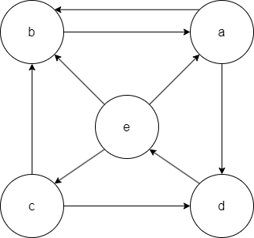

| 顶点 | 入度 | 出度 |
| :--: | :--: | :--: |
|  a   |  2   |  2   |
|  b   |  3   |  1   |
|  c   |  1   |  2   |
|  d   |  2   |  1   |
|  e   |  1   |  3   |


2. 分别画出有向图的正邻接链表和逆邻接链表。

- 正邻接链表
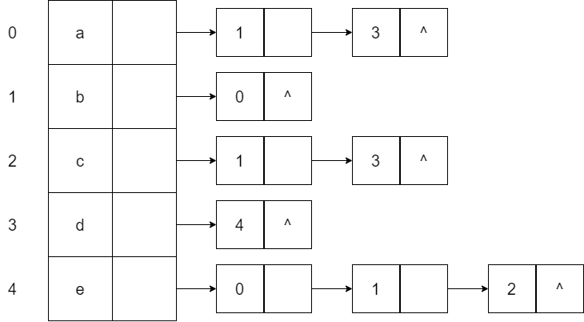

- 逆邻接链表
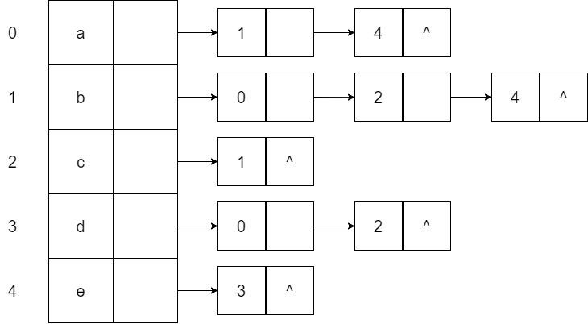


## 3. 对图1所示的带权无向图：

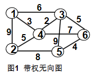

1. 写出相应的邻接矩阵表示。

$$
\begin{bmatrix}
0 & 9 & 6 & 3 & . & . \\
9 & 0 & . & 5 & 8 & . \\
6 & . & 0 & 2 & 9 & 5 \\
3 & 5 & 2 & 0 & . & 7 \\
. & 8 & 9 & . & 0 & 4 \\
. & . & 5 & 7 & 4 & 0 \\
\end{bmatrix}
$$

2. 写出相应的边表表示。

| 顶点1 | 顶点2 | 权值 |
| :---: | :---: | :--: |
| 1     | 2     | 9    |
| 1     | 3     | 6    |
| 1     | 4     | 3    |
| 2     | 4     | 5    |
| 2     | 5     | 8    |
| 3     | 4     | 2    |
| 3     | 5     | 9    |
| 3     | 6     | 5    |
| 4     | 6     | 7    |
| 5     | 6     | 4    |


3. 求出各顶点的度。

| 顶点 | 度数 |
| :--: | :--: |
|  1   |  3   |
|  2   |  3   |
|  3   |  4   |
|  4   |  4   |
|  5   |  3   |
|  6   |  3   |


## 4. 已知有向图的逆邻接链表如图2所示：

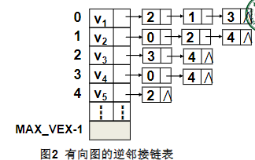

1. 画出该有向图。

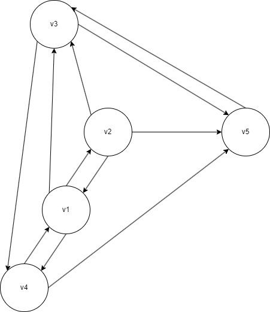

2. 写出相应的邻接矩阵表示。

- 邻接矩阵 

$
\begin{bmatrix}
0 & 1 & 1 & 1 & 0 \\
1 & 0 & 1 & 0 & 1 \\
0 & 0 & 0 & 1 & 1 \\
1 & 0 & 0 & 0 & 1 \\
0 & 0 & 1 & 0 & 0 \\
\end{bmatrix}
$


3. 写出从顶点v1开始的深度优先和广度优先遍历序列。

- 深度优先遍历序列：v1, v3, v4, v5, v2

- 广度优先遍历序列：v1, v3, v2, v4, v5

4. 画出从顶点v1开始的深度优先和广度优先生成树。

- 深度优先生成树

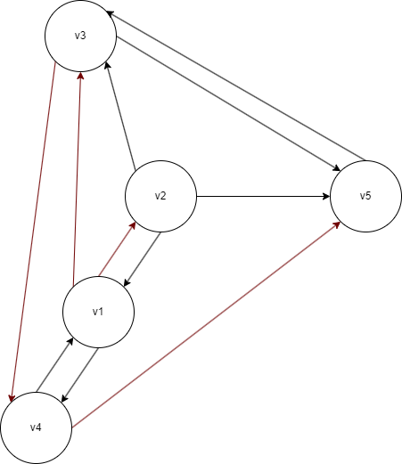

- 广度优先生成树

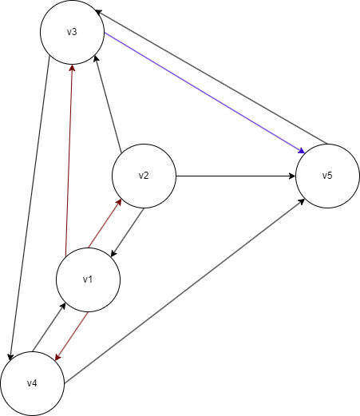

## 5. 一个带权连通图的最小生成树是否唯一？在什么情况下可能不唯一？

- 不一定唯一。
- 当图中存在权值相同的边时，可能不唯一。

## 6. 对于图1所示的带权无向图：


1. 按照Prim算法给出从顶点2开始构造最小生成树的过程。

过程如下：
- 选边：(2, 4)
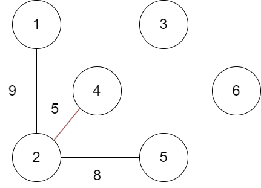
- 选边：(4, 3)
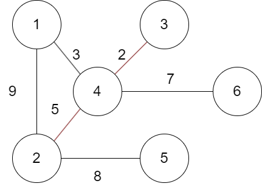
- 选边：(4, 1)
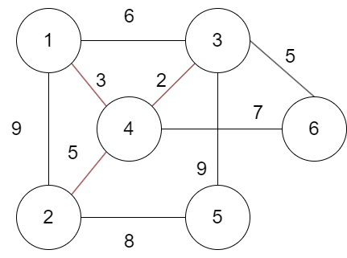
- 选边：(3, 6)
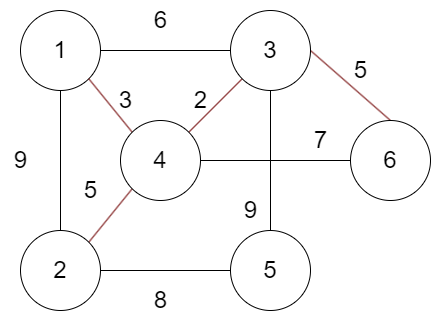
- 选边：(6, 5)
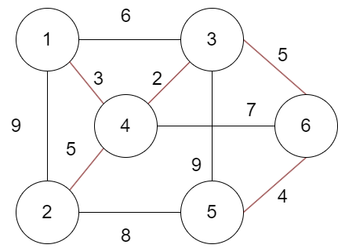


2. 按照Kruskal算法给出构造最小生成树的过程。

过程如下：
- 选边：(3, 4)
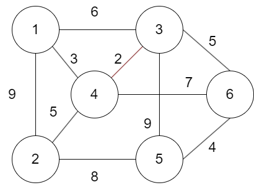
- 选边：(1, 4)
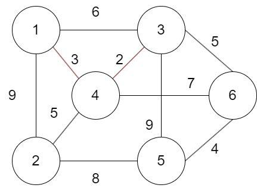
- 选边：(5, 6)
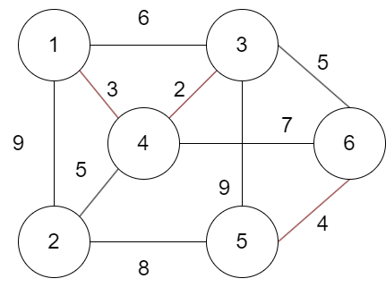
- 选边：(2, 4)
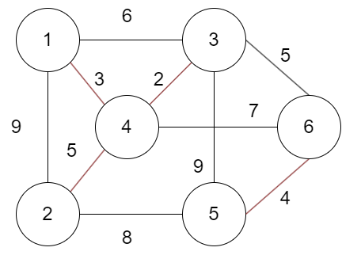
- 选边：(3, 6)
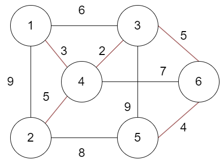

## 7. 已知带权有向图如图3所示，请利用Dijkstra算法求从顶点V4出发到其余顶点的最短路径及长度，给出相应的求解步骤。

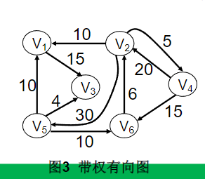

求解步骤如下：

- init

| v    | known |   dist   | path |
| :--: | :---: | :------: | :--: |
| v1   | F     | $\infty$ | 0    |
| v2   | F     | $\infty$ | 0    |
| v3   | F     | $\infty$ | 0    |
| v4   | F     | $\infty$ | 0    |
| v5   | F     | $\infty$ | 0    |
| v6   | F     | $\infty$ | 0    |

- chose v4

| v    | known |   dist   | path |
| :--: | :---: | :------: | :--: |
| v1   | F     | $\infty$ | 0    |
| v2   | F     | 20       | v4   |
| v3   | F     | $\infty$ | 0    |
| v4   | T     | 0        | 0    |
| v5   | F     | $\infty$ | 0    |
| v6   | F     | 15       | v4   |

- chose v6

| v    | known |   dist   | path |
| :--: | :---: | :------: | :--: |
| v1   | F     | $\infty$ | 0    |
| v2   | F     | 20       | v4   |
| v3   | F     | $\infty$ | 0    |
| v4   | T     | 0        | 0    |
| v5   | F     | $\infty$ | 0    |
| v6   | T     | 15       | v4   |

- chose v2

| v    | known |   dist   | path |
| :--: | :---: | :--:     | :--: |
| v1   | F     | 30       | v2   |
| v2   | T     | 20       | v4   |
| v3   | F     | $\infty$ | 0    |
| v4   | T     | 0        | 0    |
| v5   | F     | 50       | v2   |
| v6   | T     | 15       | v4   |

- chose v6

| v    | known | dist | path |
| :--: | :---: | :--: | :--: |
| v1   | T     | 30   | v2   |
| v2   | T     | 20   | v4   |
| v3   | F     | 45   | v1   |
| v4   | T     | 0    | 0    |
| v5   | F     | 50   | v2   |
| v6   | T     | 15   | v4   |

- chose v3

| v    | known | dist | path |
| :--: | :---: | :--: | :--: |
| v1   | T     | 30   | v2   |
| v2   | T     | 20   | v4   |
| v3   | T     | 45   | v1   |
| v4   | T     | 0    | 0    |
| v5   | F     | 50   | v2   |
| v6   | T     | 15   | v4   |

- chose v5 (done)

| v    | known | dist | path |
| :--: | :---: | :--: | :--: |
| v1   | T     | 30   | v2   |
| v2   | T     | 20   | v4   |
| v3   | T     | 45   | v1   |
| v4   | T     | 0    | 0    |
| v5   | T     | 50   | v2   |
| v6   | T     | 15   | v4   |


## 8. 已知带权有向路径如图4所示，请利用Floyd算法求出每对顶点之间的最短路径及路径长度。

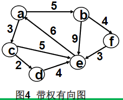

- 求解程序如下：

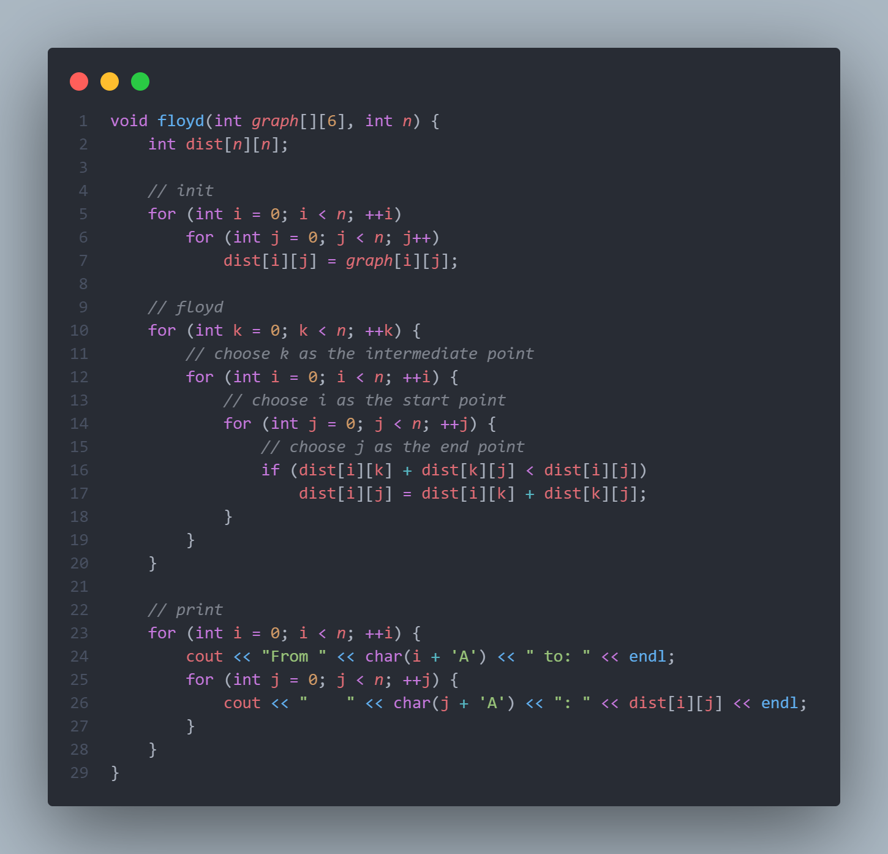

- 输出结果如下：

```powershell
From A to: 
    A: 0
    B: 5
    C: 3
    D: 5
    E: 8
    F: 9
From B to:
    A: 13
    B: 0
    C: 16
    D: 18
    E: 7
    F: 4
From C to:
    A: 11
    B: 16
    C: 0
    D: 2
    E: 5
    F: 20
From D to:
    A: 10
    B: 15
    C: 13
    D: 0
    E: 4
    F: 19
From E to:
    A: 6
    B: 11
    C: 9
    D: 11
    E: 0
    F: 15
From F to:
    A: 9
    B: 14
    C: 12
    D: 14
    E: 3
    F: 0
```


## 9. 一个AOV网用邻接矩阵表示，如图5。用拓扑排序求该AOV网的一个拓扑序列，给出相应的步骤。

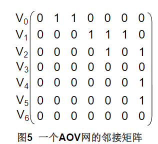

步骤如下：
- 初始
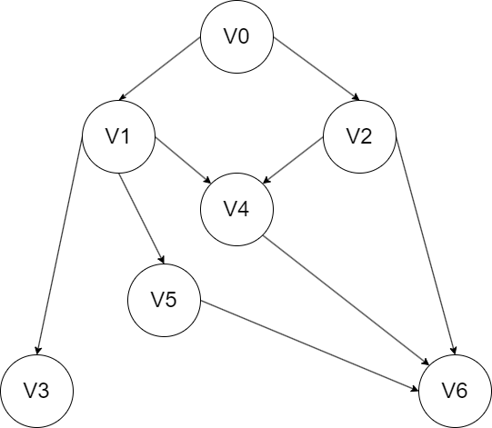
- 选V0
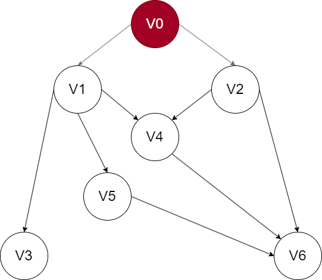
- 选V1
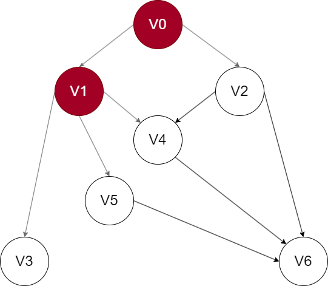
- 选V2
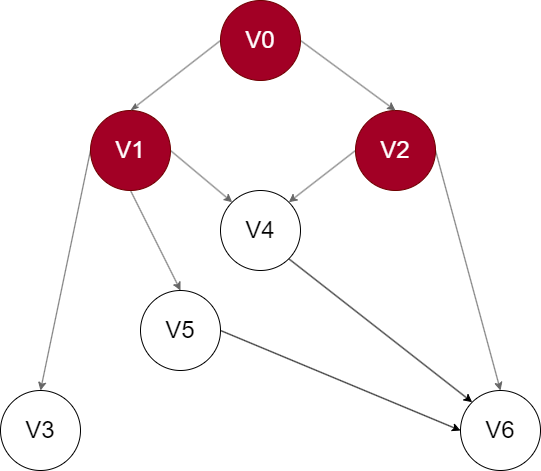
- 选V3
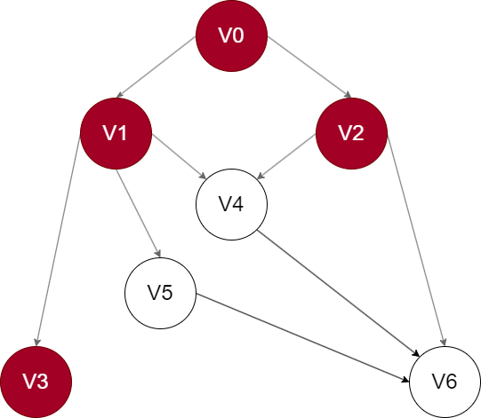
- 选V4
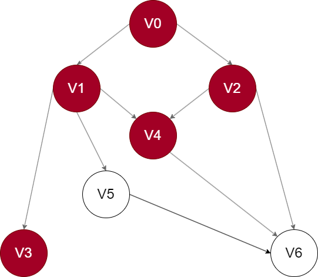
- 选V5
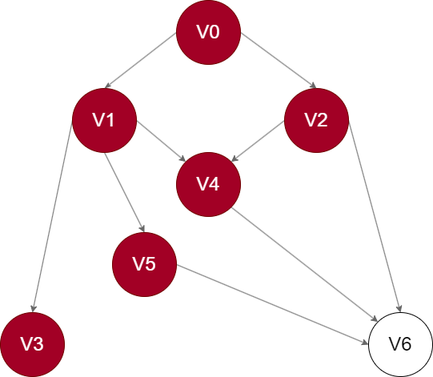
- 选V6 (done)
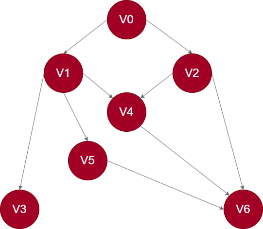

## 10. 拓扑排序的结果不是唯一的，请给出如图6所示的有向图的所有可能的拓扑序列。

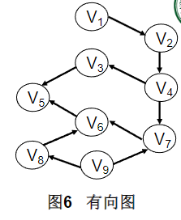

- 递归代码实现如下：

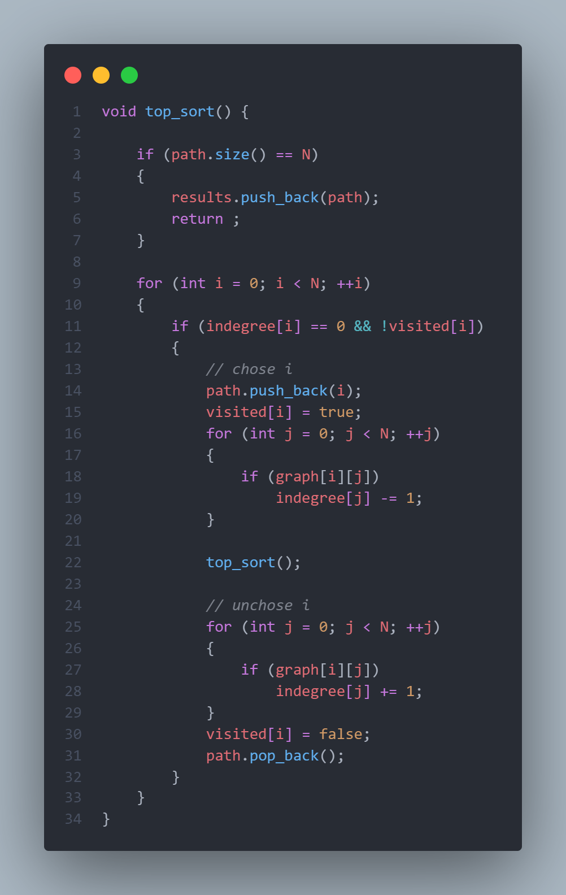

- 输出结果如下：

```powershell
1 2 4 3 9 7 8 6 5 
1 2 4 3 9 8 7 6 5 
1 2 4 9 3 7 8 6 5 
1 2 4 9 3 8 7 6 5 
1 2 4 9 7 3 8 6 5 
1 2 4 9 7 8 3 6 5 
1 2 4 9 7 8 6 3 5 
1 2 4 9 8 3 7 6 5 
1 2 4 9 8 7 3 6 5 
1 2 4 9 8 7 6 3 5 
1 2 9 4 3 7 8 6 5 
1 2 9 4 3 8 7 6 5 
1 2 9 4 7 3 8 6 5 
1 2 9 4 7 8 3 6 5 
1 2 9 4 7 8 6 3 5 
1 2 9 4 8 3 7 6 5 
1 2 9 4 8 7 3 6 5 
1 2 9 4 8 7 6 3 5 
1 2 9 8 4 3 7 6 5 
1 2 9 8 4 7 3 6 5 
1 2 9 8 4 7 6 3 5 
1 9 2 4 3 7 8 6 5 
1 9 2 4 3 8 7 6 5 
1 9 2 4 7 3 8 6 5 
1 9 2 4 7 8 3 6 5
1 9 2 4 7 8 6 3 5
1 9 2 4 8 3 7 6 5
1 9 2 4 8 7 3 6 5
1 9 2 4 8 7 6 3 5
1 9 2 8 4 3 7 6 5
1 9 2 8 4 7 3 6 5
1 9 2 8 4 7 6 3 5
1 9 8 2 4 3 7 6 5
1 9 8 2 4 7 3 6 5
1 9 8 2 4 7 6 3 5
9 1 2 4 3 7 8 6 5
9 1 2 4 3 8 7 6 5
9 1 2 4 7 3 8 6 5
9 1 2 4 7 8 3 6 5
9 1 2 4 7 8 6 3 5
9 1 2 4 8 3 7 6 5
9 1 2 4 8 7 3 6 5
9 1 2 4 8 7 6 3 5
9 1 2 8 4 3 7 6 5
9 1 2 8 4 7 3 6 5 
9 1 2 8 4 7 6 3 5
9 1 8 2 4 3 7 6 5
9 1 8 2 4 7 3 6 5
9 1 8 2 4 7 6 3 5
9 8 1 2 4 3 7 6 5
9 8 1 2 4 7 3 6 5
9 8 1 2 4 7 6 3 5
```

## 11. 请在深度优先搜索算法的基础上设计一个对有向无环图进行拓扑排序的算法。

- 若只需找到其中的一个结果：

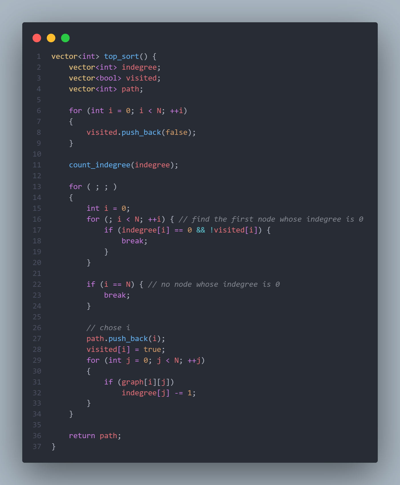

- 若需找到所有结果：见第10题。

## 12. 设计一个算法利用图的遍历方法输出一个无向图G中从顶点Vi到Vj的长度为S的简单路径，设图采用邻接链表作为存储结构。

- 代码实现如下：

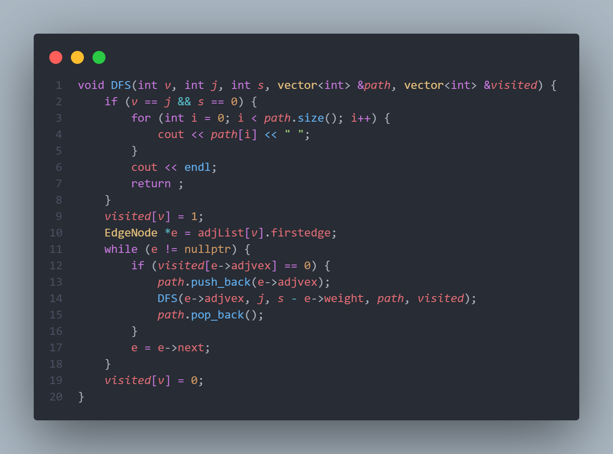

## 13. 假设一个工程的进度计划用AOE网表示，如图7所示。

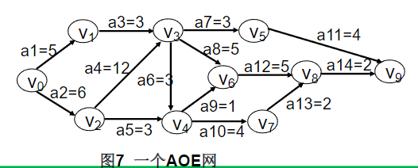

1. 求出每个事件的最早发生时间和最晚发生时间。

| 事件 | 最早发生时间 | 最晚发生时间 |
| :--: | :----------: | :----------: |
| V0   | 0            | 0            |
| V1   | 5            | 15           |
| V2   | 6            | 6            |
| V3   | 18           | 18           |
| V4   | 21           | 22           |
| V5   | 21           | 26           |
| V6   | 23           | 23           |
| V7   | 25           | 26           |
| V8   | 28           | 28           |
| V9   | 30           | 30           |

2. 该工程完工至少需要多少时间？

- 该工程完工至少需要30个单位时间。

3. 求出所有关键路径和关键活动。

- 关键路径：V0-V2-V3-V6-V8-V9
- 关键活动：a2, a4, a8, a12, a14
