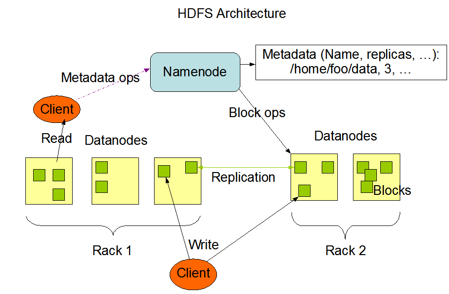
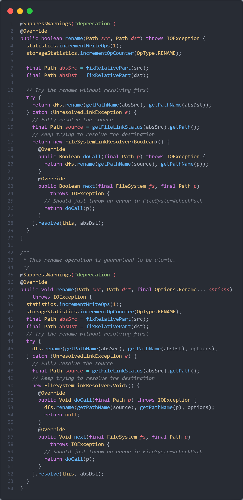
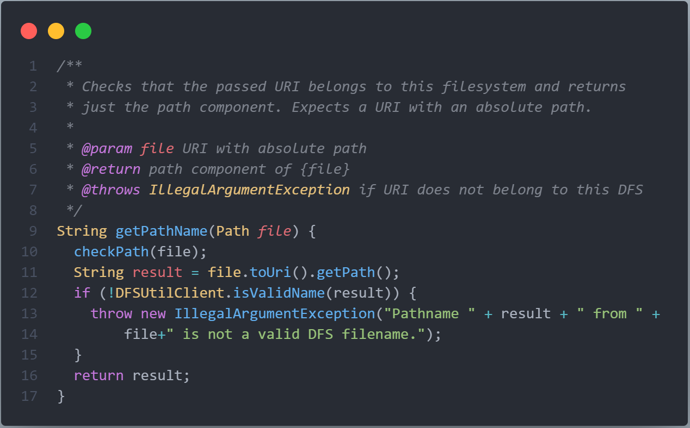
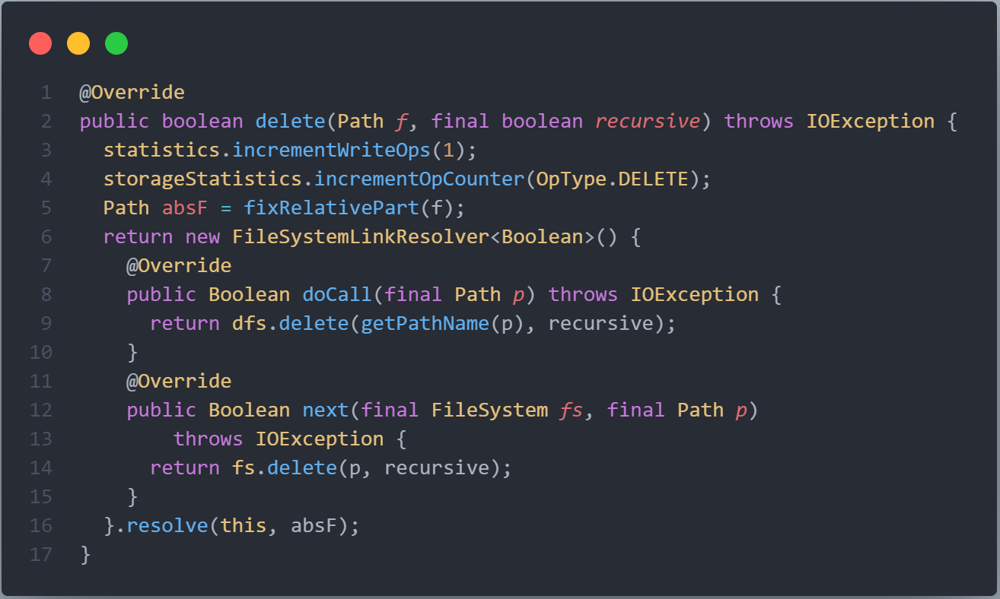

# 分布式系统作业-1

1. 为什么有时候最大程度地实现透明性并不总是好的？

2. 可以通过应用多种技术来取得扩展性，都有哪些技术？

3. 分布式系统的软件体系结构有哪几种类型，各自有什么优缺点？

4. 点对点网络中，并不是每个节点都能成为超级对等节点，满足超级对等节点的合理要求是什么？

5. 代码迁移有哪些场景？为什么要进行代码迁移？

6. 请从一些开源分布式软件如Hadoop、Ceph分布式文件系统、Apache Httpd、Spark等找出至少2处能够体现透明性的样例代码，并解释是何种类型的透明性。

**分析Hadoop**

首先需要知道，Hadoop的HDFC采用master/slave架构。一个Hadoop分布式文件系统（HDFS）集群是由一个Namenode和一定数目的Datanodes组成。Namenode是一个中心服务器，负责管理文件系统的名字空间（namespace）以及客户端对文件的访问。集群中的Datanode一般是一个节点一个，负责管理它所在节点上的存储。HDFS暴露了文件系统的名字空间，用户能够以文件的形式在上面存储数据。从内部看，一个文件其实被分成一个或多个数据块，这些块存储在一组Datanode上。Namenode执行文件系统的名字空间操作，比如打开、关闭、重命名文件或目录。它也负责确定数据块到具体Datanode节点的映射。Datanode负责处理文件系统客户端的读写请求。在Namenode的统一调度下进行数据块的创建、删除和复制。

从上述介绍中得知，一个文件被分成一个或多个数据块，且这些块存储在一组Datanode上。而我们用户在进行操作时，我们仿佛是在对单个系统进行操作，并没有感受到我们的文件可能分布在不同的节点上，其中便蕴含着HDFS的透明性。

在这里，我尝试从文件的重命名方法入手，来探索Hadoop的透明性实现：

很快，我们可以在HDFS中的`DistributedFileSystem`类中找到`rename`的两个重载：

两个方法之间主要区别在于`options`的传递，其余差别不大。这里直接分析简洁的`rename`方法。可以看到，用户输入的`src`与`dst`首先会被`fixRelativePart`方法解析为绝对地址，诸如`/usr/hadoop/file.txt`。随后`absSrc`与`absDst`会被传入一个`getPathName`方法内，我们来看一下这个方法：

阅读上面的代码，我们发现，在`getPathName`内，我们输入的路径将会在我们不知情的时候解析为一个URL路径！我们以为自己在对同一个文件系统进行操作，但是实际上我们的操作将会通过URL路径被重定向到不同的节点上的文件上，这便体现了Hadoop的位置透明性。

再次阅读代码，我们会发现对于`delete`方法，Hadoop也有类似的处理：

