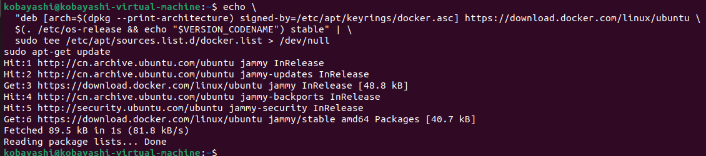

# 问题描述

CRIU是一种在用户空间实现的进程或者容器`checkpoint`和`restore`的方法，从而实现进程或者容器的保存和恢复。
请利用CRIU实现进程和容器的迁移（迁移种类不限），并测试迁移过程中的性能损耗（如进程停止时间、网络传输时间等）

# 解决方案

1. 首先，在VMware中创建一台Ubuntu 22.04的虚拟机


2. 设置Docker的官方apt仓库，安装Docker，并测试Docker

```shell
# Add Docker's official GPG key:
$ sudo apt-get update
$ sudo apt-get install ca-certificates curl
$ sudo install -m 0755 -d /etc/apt/keyrings
$ sudo curl -fsSL https://download.docker.com/linux/ubuntu/gpg -o /etc/apt/keyrings/docker.asc
$ sudo chmod a+r /etc/apt/keyrings/docker.asc

# Add the repository to Apt sources:
$ echo \
  "deb [arch=$(dpkg --print-architecture) signed-by=/etc/apt/keyrings/docker.asc] https://download.docker.com/linux/ubuntu \
  $(. /etc/os-release && echo "$VERSION_CODENAME") stable" | \
  sudo tee /etc/apt/sources.list.d/docker.list > /dev/null
sudo apt-get update
```




```shell
$ sudo apt-get install docker-ce docker-ce-cli containerd.io docker-buildx-plugin docker-compose-plugin
```


```shell
$ docker --version 
$ sudo docker pull hello-world
```


3. 开启Docker的实验模式

```shell
sudo vi /etc/docker/daemon.json
```

- 将下面内容添加到daemon.json文件中

```json
{
  "experimental": true
}
```

- 重启Docker服务

```shell
sudo systemctl daemon-reload
sudo systemctl restart docker
```

4. 添加criu的apt仓，安装criu，并检查criu

```shell
$ sudo add-apt-repository ppa:criu/ppa
$ sudo apt install criu
$ criu --version
$ sudo criu check 
$ sudo criu check --all
```


5. 测试checkpoint 

- 这里方便起见，我直接使用一个busybox容器，并在其上运行一个简单的计数脚本

```shell
$ sudo docker run --security-opt=seccomp:unconfined --name cr -d busybox /bin/sh -c 'i=0; while true; do echo $i; i=$(expr $i + 1); sleep 1; done'
$ sudo docker ps
```


- 创建checkpoint，并记录此时的容器输出状态

```shell
$ sudo docker checkpoint create cr checkpoint1
$ sudo docker ps -a
$ sudo docker logs cr
```


-  通过checkpoint恢复容器状态

```shell
$ sudo docker start --checkpoint checkpoint1 cr
$ sudo docker ps
$ sudo docker stop cr
$ sudo docker logs cr
```


可见容器成功恢复checkpoint1中的状态，从checkpoint1中的位置开始计数

6. 实现跨容器迁移

- 重建一个相同的容器cr-clone，并记录创建该容器所使用的时间

```shell
$ time sudo docker create --security-opt=seccomp:unconfined --name cr-clone busybox /bin/sh -c 'i=0; while true; do echo $i; i=$(expr $i + 1); sleep 1; done'
```


- 将cr容器的checkpoint1文件复制到cr-clone容器中


- 通过checkpoint1中启动cr-clone容器


可以看见，cr-clone容器成功恢复了cr容器的checkpoint1状态，从checkpoint1的位置，也就是从5开始计数

# 实验结果

- 迁移过程中的性能损耗

由于我在本次实验中测试的是本地的容器迁移，因此，迁移过程中的性能损耗主要取决于新容器的创建时间以及checkpoints的复制等。
而由于我在本次实验中，使用的是一个较为轻量的容器，且运行的脚本本身消耗不大，所以可以从上面的实验中看出，实际迁移所损耗的时间相当小。

# 遇到的问题及解决方法

本次实验中我遇到的问题主要如下：

- criu check 报错：这个问题主要在wsl中出现，我在更换到VMware中后，问题解决。
- checkpoint恢复失败：这个问题是我在使用criu 3.18时遇到的，我在将criu版本更换到3.19后，问题解决。