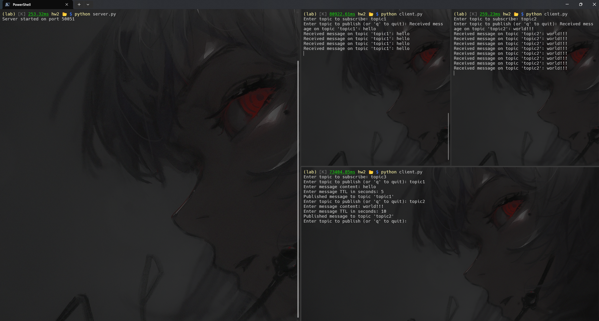

# 问题描述

使用protobuf和gRPC或者其他RPC框架实现消息订阅（publish-subscribe）系统，该订阅系统能够实现简单的消息传输，还可以控制消息在服务器端存储的时间。编程语言不限，但是推荐使用python和C。


# 解决方案

## 消息与服务

首先，我们需要定义消息与服务，如下：

```protobuf
message Message {
  string topic = 1;
  string content = 2;
  int64 timestamp = 3;
  int32 ttl = 4;  // Time-to-live in seconds
}
```

- `Message`：定义了消息的结构，包括主题、内容、时间戳和生存时间（TTL）。

1. `topic`：消息的主题，用于标识消息的类型。
2. `content`：消息的内容，可以是任意的字符串。
3. `timestamp`：消息的发送时间，单位为秒。
4. `ttl`：消息的生存时间，单位为秒。


```protobuf
message SubscribeRequest {
  string topic = 1;
}

message PublishRequest {
  Message message = 1;
}

message Empty {}
```

- `SubscribeRequest`：定义了订阅请求的结构，包括主题。
- `PublishRequest`：定义了发布请求的结构，包含一个完整的`Message`结构。
- `Empty`：定义了空消息。


```protobuf
service PubSubService {
  rpc Subscribe(SubscribeRequest) returns (stream Message);
  rpc Publish(PublishRequest) returns (Empty);
}
```

- `PubSubService`：定义了服务接口，包括`Subscribe`和`Publish`两个RPC方法。
- 从定义中可以看出，`Subscribe`方法是一个应答流式RPC（Server-side Streaming RPC）。一个应答流式RPC，客户端发送请求到服务器，拿到一个流去读取返回的消息序列。客户端读取返回的流，直到里面没有任何消息。
- 而`Publish`方法是一个简单RPC。一个简单RPC，客户端使用存根发送请求到服务器并等待响应返回，就像平常的函数调用一样。


随后，生成客户端和服务端代码：

```shell
PS> pip install grpcio grpcio-tools protobuf
PS> python -m grpc_tools.protoc -I. --python_out=. --grpc_python_out=. pubsub.proto
```

上述指令将会生成两个文件：

1. `pubsub_pb2.py`

这个文件包含了从`.proto`文件中定义的消息类型生成的Python类。其中：

- 定义了消息的数据结构
- 提供了序列化和反序列化方法
- 包含了Protocol Buffers消息类型的元数据

这使我们可以在后续的Python代码中这样使用我们定义的消息类型：

```python
import pubsub_pb2

message = pubsub_pb2.Message()
message.topic = "example_topic"
message.content = "Hello, world!"
```

2. `pubsub_pb2_grpc.py`

这个文件包含了gRPC服务的客户端和服务端代码。其中：

- 定义了服务器端的抽象基类（在这个例子中为`PubSubServiceServicer`）
- 提供了客户端存根（stub）类，用于调用调用服务器端的方法
- 包含了将服务器类添加到gRPC服务器的函数

例如，在服务器端的代码中，我们可以这样实现：

```python
import pubsub_pb2_grpc

class PubSubServicer(pubsub_pb2_grpc.PubSubServiceServicer):
    def Subscribe(self, request, context):
        # Implementation here
        pass

    def Publish(self, request, context):
        # Implementation here
        pass

def serve():
    server = grpc.server(futures.ThreadPoolExecutor(max_workers=10))
    pubsub_pb2_grpc.add_PubSubServiceServicer_to_server(PubSubServicer(), server)
    # More server setup...
```

在客户端代码中，我们可以这样调用：

```python
import pubsub_pb2_grpc

channel = grpc.insecure_channel('localhost:50051')
stub = pubsub_pb2_grpc.PubSubServiceStub(channel)
# Now you can call methods on the stub
```

## 服务端

### PubSubServicer类

定义一个`PubSubServicer`类，封装`Subscribe`和`Publish`方法：

```python
class PubSubServicer(pubsub_pb2_grpc.PubSubServiceServicer):
    def __init__(self):
        # Initialize a dictionary to store topics and their messages
        self.topics = {} 
    
    def Subscribe(self, request, context):
        ...
    
    def Publish(self, request, context): 
        ...
```

`PubSubServicer`类维护了一个字典`topics`，用于存储主题和及其消息。

### Subscribe方法

接下来，我们来实现`Subscribe`方法：

```python
def Subscribe(self, request, context):
    topic = request.topic
    if topic not in self.topics:
        self.topics[topic] = []
    
    while True:
        current_time = int(time.time())
        # Remove expired messages
        self.topics[topic] = [msg for msg in self.topics[topic] 
            if msg.timestamp + msg.ttl > current_time]
        
        # Yield all messages for the subscribed topic
        for message in self.topics[topic]:
            yield message
        time.sleep(1)  # Check for new messages every second
```

该函数的运作方式如下：

1. 首先，它从请求中获取主题。
2. 如果这个主题不存在于`self.topics`字典中，则创建一个空列表来存储这个主题的消息。
3. 然后，它进入一个无限循环。它首先会获取当前时间，并通过将当前时间比较消息的创建时间和生存时间（TTL）来清理过期的消息。值得一提的是，该RPC函数实现了一个应答流式RPC，`yield`将会返回一个生成器，允许服务器流式发送消息给客户端。我认为这种模式是较为合适实现消息订阅系统的，因为它允许服务器在客户端订阅后持续发送新消息，而不需要客户端重复发送请求。

### Publish方法

接下来，我们来实现`Publish`方法：

```python
def Publish(self, request, context):
    message = request.message
    # Set the current timestamp for the message
    message.timestamp = int(time.time())
        
    if message.topic not in self.topics:
        self.topics[message.topic] = []
        
    # Add the new message to the topic
    self.topics[message.topic].append(message)
    return pubsub_pb2.Empty()
```

该函数的运作方式如下：

1. 它从请求中获取消息对象。
2. 为消息设置当前时间戳。这是为了后续判断消息是否过期。
3. 如果消息的主题不存在于 self.topics 字典中，它会创建一个空列表来存储这个主题的消息。
4. 将新消息添加到相应主题的消息列表中。
5. 返回一个空对象，表示发布操作成功完成。

### 启动服务器

```python
def serve():
    # Create a gRPC server
    server = grpc.server(futures.ThreadPoolExecutor(max_workers=10))
    pubsub_pb2_grpc.add_PubSubServiceServicer_to_server(PubSubServicer(), server)
    server.add_insecure_port('[::]:50051')
    print("Server started on port 50051")
    server.start()
    server.wait_for_termination()
```

在该函数中：

1. 创建gRPC服务器：`grpc.server()`将会创建一个gRPC服务器实例。这里使用了`concurrent.futures.ThreadPoolExecutor`来作为服务器的线程池。
2. 添加服务：`pubsub_pb2_grpc.add_PubSubServiceServicer_to_server()`将`PubSubServicer`类添加到gRPC服务器中。
3. 通过`add_insecure_port()`方法设置服务器监听的端口。
4. 通过`server.start()`方法启动服务器。
5. 因为`server.start()`不会阻塞，因此我们通过`server.wait_for_termination()`方法保持服务器运行，直到被终止。


## 客户端

客户端的代码相对简单明了，这里只提一些要点。

### Publish

```python
def publish(stub):
    while True:
        topic = input("Enter topic to publish (or 'q' to quit): ")
        if topic.lower() == 'q':
            break
        content = input("Enter message content: ")
        ttl = int(input("Enter message TTL in seconds: "))
        
        # Create and send a publish request
        message = pubsub_pb2.Message(topic=topic, content=content, ttl=ttl)
        request = pubsub_pb2.PublishRequest(message=message)
        stub.Publish(request)
        print(f"Published message to topic '{topic}'")
```

- 这个函数负责发布消息到对应的主题。
- 函数将会根据用户的输入创建一个`Message`对象，并将该对象封装到`PublishRequest`中。
- 函数通过`stub.Publish()`方法调用服务端的`Publish`方法，向服务器发送发布请求。

### subscribe

```python
def subscribe(stub):
    topic = input("Enter topic to subscribe: ")
    request = pubsub_pb2.SubscribeRequest(topic=topic)
    # Stream messages from the subscribed topic
    for message in stub.Subscribe(request):
        print(f"Received message on topic '{message.topic}': {message.content}")
```

- 这个函数负责指定主题并接收消息。
- 函数将会根据用户的输入创建一个`SubscribeRequest`对象，并将该对象封装到`stub.Subscribe()`方法中。
- 函数随后会进入一个for循环，持续接收来自服务器的消息流。

### run

```python
def run():
    # Create a gRPC channel and stub
    with grpc.insecure_channel('localhost:50051') as channel:
        stub = pubsub_pb2_grpc.PubSubServiceStub(channel)
        
        # Start a separate thread for subscribing
        subscribe_thread = Thread(target=subscribe, args=(stub,))
        subscribe_thread.start()
        
        # Run the publish function in the main thread
        publish(stub)
        
        # Wait for the subscribe thread to finish
        subscribe_thread.join()
```

- 这个函数负责启动客户端。
- 函数首先创建一个gRPC通道，并创建一个`PubSubServiceStub`存根，用于与服务器通信。
- 创建一个新线程来运行`subscribe()`函数，允许持续接收消息。
- 在主线程中运行`publish()`函数，允许用户发布消息。


# 实验结果

以上便为消息订阅系统的基本实现。接下来我们来看最终的运行效果：

我们启动服务器，随后启动三个服务端，其中两个用来订阅接收消息，一个用来发布消息，如下：



可见，系统运行效果符合预期。


# 遇到的问题及解决方法

本实验我遇到的问题都通过参考官方的文档得到了解决。参考如下：

[REF:Pub/Sub服务概览](https://cloud.google.com/pubsub/docs/pubsub-basics?hl=zh-cn)

[REF:gRPC 官方文档中文版](https://doc.oschina.net/grpc?t=60138)

[REF:gRPC Python Basics tutorial](https://grpc.io/docs/languages/python/basics/)