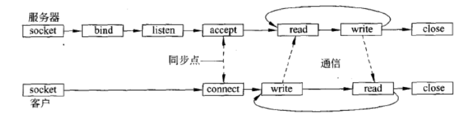

# 分布式系统作业-2

## 1. 请根据具体的例子说明RPC的主要过程。

1. 客户端调用客户端存根；
2. 客户端存根构造请求消息并调用本地操作系统；
3. 客户端操作系统将请求消息发送到远程操作系统；

4. 远程操作系统接受请求消息，并将消息转发给服务端存根；
5. 服务端存根解包请求消息，并调用服务端操作；
6. 服务端操作执行本地操作，并将结果返回给服务端存根；
7. 服务端存根构造响应消息，并调用本地操作系统；
8. 服务端操作系统将响应消息发送到客户端的操作系统；

9. 客户端的操作系统接受响应消息，并将结果返回给客户端存根；
10. 客户端存根解包响应消息，并返回给客户端。

下面举一个简单的例子：

**rpc_test_clnt.c**

```c
/*
 * Please do not edit this file.
 * It was generated using rpcgen.
 */

#include <memory.h> /* for memset */
#include "rpc_test.h"

/* Default timeout can be changed using clnt_control() */
static struct timeval TIMEOUT = { 25, 0 };

char **
test_1(char **argp, CLIENT *clnt)
{
	static char *clnt_res;

	memset((char *)&clnt_res, 0, sizeof(clnt_res));
	if (clnt_call (clnt, TEST,
		(xdrproc_t) xdr_wrapstring, (caddr_t) argp,
		(xdrproc_t) xdr_wrapstring, (caddr_t) &clnt_res,
		TIMEOUT) != RPC_SUCCESS) {
		return (NULL);
	}
	return (&clnt_res);
}
```

**rpc_client.c**

```cpp
/*
 * This is sample code generated by rpcgen.
 * These are only templates and you can use them
 * as a guideline for developing your own functions.
 */

#include "rpc_test.h"


void
testprog_1(char *host)
{
	CLIENT *clnt;
	char * *result_1;
	char * test_1_arg;

#ifndef	DEBUG
	clnt = clnt_create (host, TESTPROG, VERSION, "udp");
	if (clnt == NULL) {
		clnt_pcreateerror (host);
		exit (1);
	}
#endif	/* DEBUG */

	result_1 = test_1(&test_1_arg, clnt);
	if (result_1 == (char **) NULL) {
		clnt_perror (clnt, "call failed");
	}
#ifndef	DEBUG
	clnt_destroy (clnt);
#endif	 /* DEBUG */
}


int
main (int argc, char *argv[])
{
	char *host;

	if (argc < 2) {
		printf ("usage: %s server_host\n", argv[0]);
		exit (1);
	}
	host = argv[1];
	testprog_1 (host);
exit (0);
}
```

上述代码为客户端的存根。
1. 客户端将请求参数传入存根后，存根将会调用`test_1`函数。`test_1`接收一个指向参数的指针`argp`和一个指向客户端句柄的指针`clnt`。
2. 函数将会调用函数`clnt_call`，将参数打包成请求消息，并通过RPC调用将请求消息发送到服务端。
3. 如果服务器成功处理了请求，当服务端返回响应信息后，客户端的存根将会解包响应消息，将结果存入`clnt_res`变量中，并返回给客户端。


**rpc_test_svc.c**

```c
/*
 * Please do not edit this file.
 * It was generated using rpcgen.
 */

#include "rpc_test.h"
#include <stdio.h>
#include <stdlib.h>
#include <rpc/pmap_clnt.h>
#include <string.h>
#include <memory.h>
#include <sys/socket.h>
#include <netinet/in.h>

#ifndef SIG_PF
#define SIG_PF void(*)(int)
#endif

static void
testprog_1(struct svc_req *rqstp, register SVCXPRT *transp)
{
	union {
		char *test_1_arg;
	} argument;
	char *result;
	xdrproc_t _xdr_argument, _xdr_result;
	char *(*local)(char *, struct svc_req *);

	switch (rqstp->rq_proc) {
	case NULLPROC:
		(void) svc_sendreply (transp, (xdrproc_t) xdr_void, (char *)NULL);
		return;

	case TEST:
		_xdr_argument = (xdrproc_t) xdr_wrapstring;
		_xdr_result = (xdrproc_t) xdr_wrapstring;
		local = (char *(*)(char *, struct svc_req *)) test_1_svc;
		break;

	default:
		svcerr_noproc (transp);
		return;
	}
	memset ((char *)&argument, 0, sizeof (argument));
	if (!svc_getargs (transp, (xdrproc_t) _xdr_argument, (caddr_t) &argument)) {
		svcerr_decode (transp);
		return;
	}
	result = (*local)((char *)&argument, rqstp);
	if (result != NULL && !svc_sendreply(transp, (xdrproc_t) _xdr_result, result)) {
		svcerr_systemerr (transp);
	}
	if (!svc_freeargs (transp, (xdrproc_t) _xdr_argument, (caddr_t) &argument)) {
		fprintf (stderr, "%s", "unable to free arguments");
		exit (1);
	}
	return;
}

int
main (int argc, char **argv)
{
	register SVCXPRT *transp;

	pmap_unset (TESTPROG, VERSION);

	transp = svcudp_create(RPC_ANYSOCK);
	if (transp == NULL) {
		fprintf (stderr, "%s", "cannot create udp service.");
		exit(1);
	}
	if (!svc_register(transp, TESTPROG, VERSION, testprog_1, IPPROTO_UDP)) {
		fprintf (stderr, "%s", "unable to register (TESTPROG, VERSION, udp).");
		exit(1);
	}

	transp = svctcp_create(RPC_ANYSOCK, 0, 0);
	if (transp == NULL) {
		fprintf (stderr, "%s", "cannot create tcp service.");
		exit(1);
	}
	if (!svc_register(transp, TESTPROG, VERSION, testprog_1, IPPROTO_TCP)) {
		fprintf (stderr, "%s", "unable to register (TESTPROG, VERSION, tcp).");
		exit(1);
	}

	svc_run ();
	fprintf (stderr, "%s", "svc_run returned");
	exit (1);
	/* NOTREACHED */
}
```

```c
/*
 * This is sample code generated by rpcgen.
 * These are only templates and you can use them
 * as a guideline for developing your own functions.
 */

#include "rpc_test.h"
#include <time.h>

char **
test_1_svc(char **argp, struct svc_req *rqstp)
{
	static char * result;
	static char tmp_char[128];
	time_t rawtime;

	/*
	 * insert server code here
	 */
	if( time(&rawtime) == ((time_t)-1) ) {
		strcpy(tmp_char, "Error");
		result = tmp_char;
		return &result;
	}
	sprintf(tmp_char, "CURRENT TIME :%s", ctime(&rawtime));
	result = tmp_char;

	return &result;
}
```

上述代码为服务端的存根。
1. 服务端的存根将会接收客户端的请求消息，对消息解包获得参数后并调用`test_1_svc`函数。
2. `test_1_svc`函数将会执行本地操作，并将结果返回给服务端存根。在这里，服务端将会返回服务端的本地时间。
3. 服务端的存根将会通过调用`svc_sendreply`函数，将结果打包成响应消息，并通过RPC发送给客户端。

## 2. 描述一下客户端和服务端之间使用套接字的有连接通信是如何进行的？



**服务器**：

1. 创建套接字（socket），绑定（bind）到本地地址，监听（listen）客户端的连接请求；
2. 收到客户端的连接请求后，接受（accept）连接，并为该客户端创建一个新的套接字；
3. 接收（read / recv）客户端发来的请求信息；
4. 处理请求信息，并发送（write / send）响应信息；
5. 直到传输结束，关闭（close）套接字。

**客户端**

1. 创建套接字（socket），连接（connect）到服务器的地址；
2. 向服务器发送（write / send）请求信息；
3. 接收（read / recv）服务器的响应信息；
4. 直到传输结束，关闭（close）套接字。


## 3. 当在基于DHT的系统中解析一个键值时，递归查询的主要缺点是什么？

1. **负载集中**
    - 初始请求节点会将整个查询过程委托给其他节点。
    - 这可能导致查询路径上的某些节点承担过多的查询负载，特别是那些位于网络拓扑关键位置的节点。
2. **可靠性问题**
    - 如果查询路径中的任何一个节点失败或者响应缓慢，整个查询过程都将会受到影响。
    - 这增加了查询失败的风险，降低了系统整体的可靠性。
3. **延迟增加**
    - 每个中间节点都需要等待下一个节点响应，然后才能将结果返回。
    - 这种串行处理可能会导致较长的查询延迟，特别是在网络条件不佳或节点负载高的情况下。
4. **隐私和安全风险**
    - 递归查询可能暴露更多的网络拓扑信息。
5. **资源消耗**
    - 中间节点需要维护每个传递查询的状态，这增加了内存和处理的开销。
    - 在大规模的系统中，这可能导致资源利用效率降低。
6. **调试和故障排除的复杂性**
    - 当查询失败时，很难定位出问题的节点，增加了系统维护和故障排除的难度。

## 4. 维护到客户的TCP/IP连接的服务器是状态相关的还是状态无关的？说明理由。

此处讨论的状态相关与状态无关是从服务器的应用程序角度出发。如果服务器不在应用层（也就是服务器程序所在的层）中维护客户端信息，可以认为服务器是无状态的。这与服务器是否使用状态相关的TCP/IP协议无关。