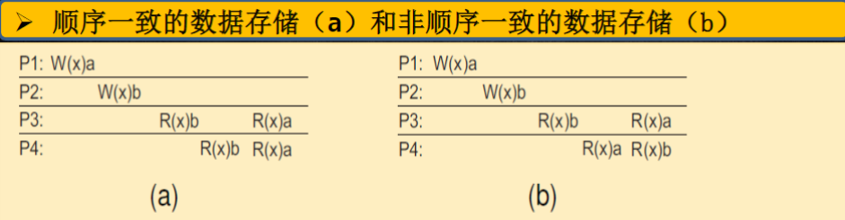
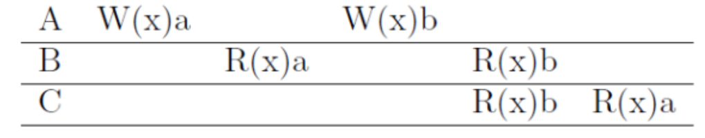

# 分布式系统作业3

## QUESTION 1

**QUESTION**

在时刻 10:27:440（小时、分钟、1/100秒），服务器B从时间服务器A请求返回时间戳。在时刻 10:27:710，服务器B收到来自服务器A发回的时间戳 10:27:375。请解答以下几个问题：

**ANSWER**

a. 找出服务器B的始终相对于时间服务器A的时钟之间的偏移量（假定在时间服务器上没有处理时间）。

1. B发送请求的时间：10:27:440
2. B接收响应的时间：10:27:710
3. A发送响应的时间：10:27:375

假设网络延时是对称的，那么，往返时间：

$$RTT = 710 - 440 = 270 (1/100秒)$$

B接收到响应时A的实际时间应该是：$10:27:375 + 135 = 10:27:510$

而此时B的时间为：$10:27:440 + 270 = 10:27:710$

因此服务器B相对于时间服务器A的时钟之间的偏移量为：$710 - 510 = 200 (1/100秒) = 2S$

b. B的时钟走的太快还是太慢了？快或慢了几秒钟？

服务器B的时钟相对于服务器A快了2秒。

c. 如果没有时间服务器A，服务器B如何调整时间（假定服务器B在一个集群环境中）？

- 直接通过原子钟或GPS时钟授时；
- 没有时间服务器就选举一个。可以使用Raft算法从集群中选举一个时间服务器，然后再使用NTP或Berkeley算法等对所有服务器进行时钟同步。

## QUESTION 2

**QUESTION**

分布式系统可能有多个互相独立的资源。假设进程0要访问资源A而进程1要访问资源B。Ricart & Agrawala的算法会导致死锁吗？请解释原因。

**ANSWER**

我认为是否会导致死锁还要取决于系统对于这部分功能的实现，而不仅取决于这个算法本身。

首先我们知道死锁的发生需要满足以下的四个必要条件：

- 互斥条件（Mutual Exclusion）：
  - 至少有一个资源必须处于非共享模式，即一次只能被一个进程调用。
- 占有并等待条件（Hold and Wait）：
  - 一个进程必须占有至少一个资源，并同时等待获取其它进程所占有的额外资源。
- 非抢占条件（No Preemption）：
  - 资源不能被强制从一个进程中抢占，只能由占有资源的进程自愿释放。
- 循环等待条件（Circular Wait）：
  - 必须存在一个进程等待链，其中每个进程都在等待下一个进程所占有的资源，形成一个闭环。

如果系统让进程严格地按照顺序进入到临界区内，并且进程不会在一个临界区中时尝试进入另一个临界区，那么就不会发生死锁，因为这显然不满足死锁地占有并等待条件。

而如果系统实现允许进程0可以进入临界区A后再尝试进入B，而进程1可以以相反顺序获取它们，就可能发生死锁。

算法的机制本身不会直接导致死锁的发生，具体还需要看系统的具体实现。

## QUESTION 3

**QUESTION**

假设两个进程同时检测到协作者崩溃，并且它们都是用Bully算法主持一个选举。这时将发生什么？

**ANSWER**

假设我们由进程P1和P2，它们同时检测到了协作者的崩溃。P1和P2的进程ID不相同，这是Bully算法的前提条件。P1和P2同时开始选举，并向所有比自己ID大的进程发送选举消息。不失一般性，我们假设P1的ID小于P2，那么便会有P1向P2发送选举消息，而P2不会向P1发送选举消息。P2接收到P1后，回复一个“OK”消息给P1。P1受到“OK”消息后，便知道P2有选举正在进行，并且P2的ID比自己的大，之后P1会停止自己的选举过程，等待最终结果。之后P2继续选举过程，直到选择新的协作者。

## QUESTION 4

**QUESTION**

请标出下图中各个时间的逻辑时钟和向量时钟。

P1进程上的事件：

a: 1
b: 2
c: 3
d: 4
e: 6
f: 10
g: 11

P2进程上的事件：

h: 1
i: 3
j: 4
k: 5

P3进程上的事件：

m: 1
n: 4
o: 8
p: 9
q: 12

P4进程上的事件：

r: 2
s: 3
t: 5
u: 7

P1进程上的向量时钟：

a: {1, 0, 0, 0}
b: {2, 1, 0, 0}
c: {3, 1, 0, 0}
d: {4, 1, 0, 0}
e: {5, 5, 1, 2}
f: {6, 5, 5, 4}
g: {7, 5, 5, 4}

P2进程上的向量时钟：

h: {0, 1, 0, 0}
i: {0, 3, 1, 0}
j: {1, 4, 1, 2}
k: {1, 5, 1, 2}
l: {4, 6, 1, 5}

P3进程上的向量时钟：

m: {0, 0, 1, 0}
n: {0, 3, 2, 0}
o: {4, 3, 4, 4}
p: {4, 3, 5, 4}
q: {7, 5, 6, 4}

P4进程上的向量时钟：

r: {1, 0, 0, 1}
s: {1, 0, 0, 2}
t: {4, 1, 0, 3}
u: {4, 1, 0, 5}

## QUESTION 5

**QUESTION**

互斥的解决方案包括集中式算法、非集中式算法、分布式算法及令牌算法，请给出不同算法每次进/出需要的消息数，并解释原因。

此处我们讨论的进程再请求资源时不需要给自己发送请求消息：

**集中式算法**

进入临界区：

- 消息数：2
- 原因：进程需要发送一个请求消息给中央协调者，中央协调者回复一个许可信息

退出临界区：

- 消息数：1
- 原因：进程只需要发送一个释放消息给中央协调者

**非集中式算法**

进入临界区：

- 消息数：$\frac{3N}{2} - 1 \le count \le 2(N-1)$，其中N是系统中的进程总数
- 原因：请求进程需要向其它所有N-1个进程发送请求消息，并等待它们的回复。当获得超过半数的进程的回复后，请求进程才会进入临界区。

退出临界区：

- 消息数：N-1
- 原因：进程需要向其它所有N-1个进程发送释放消息。

**分布式算法**

以Ricart & Agrawala 为例：

进入临界区：

- 消息数：2(N-1)，其中N是系统中的进程总数
- 原因：请求进程需要向其他所有N-1个进程发送请求消息，并等待它们的回复。

退出临界区：

- 消息数：0或1
- 需要向请求队列中最先的发送释放消息。若队列为空则不需要发送。

**令牌算法**

进入临界区：

- 消息数：0到N-1
- 原因：若持有令牌，则不需要消息，最坏的情况下，需要N-1个消息来传递令牌。

退出临界区：

- 消息数：1
- 进程需要将令牌传给下一个进程

## QUESTION 6

**QUESTION**

什么是分布式系统一致性？主要有哪几种一致性模型？分别用在哪些场景中？

**ANSWER**

分布式系统一致性是指在分布式系统中，确保多个节点上的数据副本保持一致的程度。主要的一致性模型如下：

- 以数据为中心的一致性模型：
  - 线性一致性（Linearizability）：
    - 定义：所有操作都按照它们实际发生时间顺序被所有进程观察到。
  - 顺序一致性（Sequential Consistency）：
    - 定义：任何执行结果都是相同的，就好像所有进程对数据存储的读写操作是按照某种序列顺序执行的，并且每个进程的操作按照程序所定制的顺序出现在这个序列中。进程可以看到所有进程的写操作，但是只能看到自己的读操作。
  - 因果一致性（Causal Consistency）：
    - 定义：一种弱化的顺序一致性模型。所有的进程必须以相同的顺序看到具有潜在因果关系的写操作。不同机器上可以以不同的顺序考到并发写操作。
  - 入口一致性（Entry Consistency）（分组）：
    - 将同步变量与共享数据相关联，只有在获取同步变量时才保证数据一致性。

- 以客户为中心的一致性模型
  - 单调读一致性（Monotonic Read Consistency）：
    - 定义：如果一个进程读取数据项x的值，那么该进程对x执行的任何后续操作将总是得到第一次读取的那个值或更新的值；
  - 单调写一致性（Monotonic Write Consistency）：
    - 定义：一个进程对数据项x执行的写操作必须在该进程对x执行任何后续写操作之前完成。
  - 读写一致性（Read Your Writes Consistency）：
    - 一个进程对数据项x执行一次写操作的结果总是会被该进程对x执行的后续读操作看到。也就是说，一个写操作总是在同一进程执行的后续读操作之前完成，而不管这个后续读操作发生在什么位置。
  - 写读一致性（Writes Follow Reads Consistency）：
    - 同一个进程对数据项x执行的读操作之后的写操作，保证发生在与x读取值相同或比之更新的值上。即更新是作为前一个读操作的结果传播的。进程对数据项x所执行的任何后续写操作都会在x的副本上执行，而该副本是用该进程最近读取的值更新的。

- 最终一致性模型（Eventual Consistency）：
  - 定义：模型不在乎中间过程。在经过一段时间后，所有副本最终会达成一致状态。

一致性模型的应用场景：

- 以数据为中心的一致性模型应用场景：
  - 需要强一致性的场景：
    - 金融交易系统
    - 分布式锁服务等
  - 弱一些的一致性的场景：
    - 分布式数据库管理系统等
- 以客户为中心的一致性模型应用场景：
  - 在线协作工具
  - 社交媒体平台等
- 最终一致性模型应用场景：
  - 内容分发网路（CDN）
  - 域名服务器（DNS）

## QUESTION 7

**QUESTION**

请描述一个用于显示刚被更新的Web页面的读后写一致性的简单实现。

**ANSEWR**

最简单的实现是让浏览器检查它所显示的是不是最新版本的页面，这需要发送一个请求到Web服务器。由于许多系统都已经实现了该方案，所以它非常简单。

## QUESTION 8

**QUESTION**

根据以数据为中心的一致性模型，请回答以下几个问题：

**ANSWER**

a. 什么是严格一致性？为什么在分布式系统中难以实现？

定义：所有操作都按照它们实际发生时间顺序被所有进程观察到。

在分布式系统中难以实现的原因：

- 物理时钟同步问题：对不同节点的进程的物理时钟进行完全的同步是困难的
- 网络延迟：消息传递存在不确定的延迟
- 性能开销：每次操作的同步操作将会带来巨大的开销

b. 举例说明顺序一致性。

对于顺序一致性，任何执行结果都是相同的，就好像所有进程对数据存储的读写操作时按照某种序列顺序执行的，并且每个进程的操作按照程序所指定的顺序出现在这个序列中。

从例子中可以看出，对于（b）中的P3与P4，它们读出的结果时不相同的，P3先读出b再读出a，而P4先读出a再读出b。因此（b）并不满足顺序一致性。而（a）满足顺序一致性的要求。

c. 以下数据存储是否是顺序一致性？给出解释并修改。

此数据存储不满足顺序一致性，其理由与b中说明的一致。若要将其改为顺序一致性的存储，可以将C中的R(x)b与R(x)a的顺序调换。

d. 根据下图给出一个满足因果一致性的例子。

因果一致性需要满足所有的进程以相同的顺序看到具有潜在因果关系的写操作。不同机器上可以以不同的顺序看到并发写操作。

此例中，因果为A中的W(x)a后W(x)b。所以只需要调换C中的R(x)a与R(x)b即可。