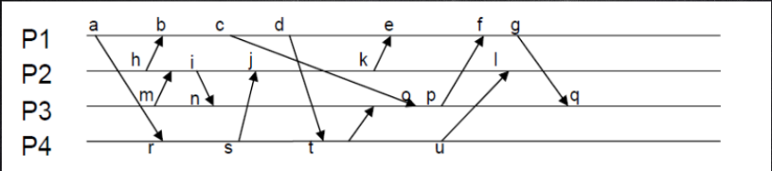

# 分布式系统作业3

## QUESTION 1

**QUESTION**

在时刻 10:27:440（小时、分钟、1/100秒），服务器B从时间服务器A请求返回时间戳。在时刻 10:27:710，服务器B收到来自服务器A发回的时间戳 10:27:375。请解答以下几个问题：

a. 找出服务B的始终相对于时间服务器A的时钟之间的偏移量（假定在时间服务器上没有处理时间）。
b. B的时钟走的太快还是太慢了？快或慢了几秒钟？
c. 如果没有时间服务器A，服务器B如何调整时间（假定服务器B在一个集群环境中）？

## QUESTION 2

**QUESTION**

分布式系统可能有多个互相独立的资源。假设进程0要访问资源A而进程1要访问资源B。Ricart和Agrawala的算法会导致死锁吗？请解释原因。

## QUESTION 3

**QUESTION**

假设两个进程同时检测到协作者崩溃，并且它们都是用Bully算法主持一个选举。这时将发生什么？

## QUESTION 4

**QUESTION**

请标出下图中各个时间的逻辑时钟和向量时钟。

## QUESTION 5

**QUESTION**

互斥的解决方案包括集中式算法、非集中式算法、分布式算法及令牌算法，请给出不同算法每次进/出需要的消息数，并解释原因。

## QUESTION 6

**QUESTION**

什么是分布式系统一致性？主要有哪几种一致性模型？分别用在哪些场景中？

## QUESTION 7

**QUESTION**

请描述一个用于显示刚被更新的Web页面的读写一致性的简单实现。